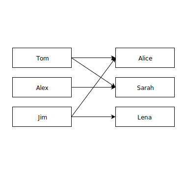
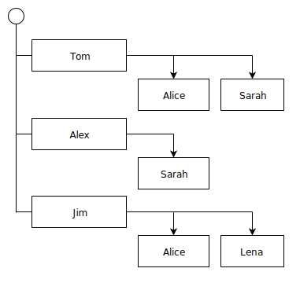

# Лекарство от сломанной обратной совместимости

Фронтендеры любят жаловаться, что бекендеры часто ломают обратную совместимость. Вот, мол, описывают структуры данных, API, мы по нему привязываем интерфейс, а через месяц структура меняется, и ничего не работает. Сегодня расскажу, как немного облегчить себе жизнь в таких ситуациях.

## Шаблоны спешат на помощь

Есть такой шаблон проектирования — адаптер. Он помогает подружить сущности, которые должны взаимодействовать друг с другом, но не могут напрямую этого делать. Как переходник для английской вилки на европейскую розетку.

Чаще всего такие сущности — это классы или объекты. Но никто не мешает использовать ту же логику для работы со структурами данных или сетевыми запросами. Смысл в том, чтобы вынести работу со структурой подальше и от запроса, и от интерфейса. Так вносить изменения потом будет проще и быстрее.

## Пример

Возьмём абстрактное приложение. У него есть состояние _state_, где в поле _user_ хранится информация о пользователе.

```js
class State {
	constructor(initialState) {
		this.state = { ...initialState };
	}

	update(key, value) {
		this.state = {
			...this.state,
			[key]: value
		};
	}

	get(key) {
		return this.state[key];
	}
}

const state = new State({ user: {} });
```

Чтобы получить свежую информацию и показать её, клиент обращается к серверу за данными. Если получает, то обновляет состояние:

```js
fetch('/fetch/user.json')
	.then((response) => response.json())
	.then((user) => state.update('user', user))
	.catch(handleError);
```

Допустим пользователь в приложении описывается таким объектом:

```js
{
  name: 'John',
  lastName: 'Doe',
  birthYear: 1981,
  city: 'Berlin'
}
```

Пока с сервера приходит подобная структура, наше приложение работает без сбоев. Но вдруг сервер начинает отдавать данные с такой структурой:

```js
{
  fullName: {
    name: 'John',
    lastName: 'Doe'
  },
  birthDate: {
    year: 1981
  },
  address: {
    city: 'Berlin',
    street: '1 Hasselhoff Lane'
  }
}
```

Если приложение живёт давно, то к полям `user.name`, `user.birthYear`, `user.city` уже привязаны какие-то его части. Их может быть несколько, и править каждое — не вариант.

Как-то подгонять структуру ответа в обработчике запроса тоже плохо. Информация о пользователе может запрашиваться не только здесь. Да и код обработчика запроса распухнет.

Поэтому лучше работать со структурой ответа где-то в другом месте. Напишем адаптер:

```js
class UserToStateAdapter {
	constructor(state) {
		this.state = state;
	}

	update(serviceUser) {
		const { fullName, birthDate, address } = serviceUser;
		const { name, lastName } = fullName;
		const { year } = birthDate;
		const { city } = address;

		const clientUser = {
			name,
			lastName,
			birthYear: year,
			city,
			address
		};

		this.state.update('user', clientUser);
	}
}

const userToStateAdapter = new UserToStateAdapter(state);
```

Используем:

```js
fetch('/fetch/user.json')
	.then((response) => response.json())
	.then((user) => userToStateAdapter.update(user))
	.catch(handleError);
```

Теперь всю логику обработки структуры мы вынесли в отдельную часть приложения. Если структура поменяется ещё раз, то нам нужно будет поправить только адаптер, чтобы всё работало.

## В жизни

Адаптер может пригодиться не только, когда поломали обратную совместимость, но и когда из плоской структуры надо сделать сложную.

На одном из проектов нам нужно было из двух списков построить два разных дерева. В одном списке — отправители, в другом — получатели. Нужно было сгруппировать данные по отправителям или получателям в зависимости от выбора пользователя:





После того, как мы вынесли всю обработку структур в отдельное место, код стал чище. Кроме этого, мы не гоняем по сети лишние биты, так как не дублируем информацию и запросы.

## Но есть пара минусов

Например:

- добавляется ещё одна абстракция в копилку проекта, из-за этого увеличивается сложность;
- при создании нового адаптера нужно найти все места, где требуется его вызвать.

Второй пункт проблематичен, если приложение большое. Хотя такие моменты лучше продумывать ещё на этапе проектирования архитектуры.

## Чем хорош и когда использовать

Адаптер помогает избежать дублирования кода и множественных исправлений. Позволяет не переписывать существующую логику на клиенте, если на сервере вдруг что-то поменялось (по крайней мере не сразу). Даёт возможность чаще использовать плоские структуры данных, а сложные создавать только по мере необходимости.

Да, если новая структура в корне отличается от старой, то одним адаптером, скорее всего, уже не обойтись. Но для задач типа «опять они все поля переназвали» — самое то.

## Почитать на тему:

- [Википедия](<https://ru.wikipedia.org/wiki/Адаптер_(шаблон_проектирования)>)
- [Статья на _dofactory.com_](http://www.dofactory.com/javascript/adapter-design-pattern)
- [Шаблоны проектирования для людей](https://github.com/kamranahmedse/design-patterns-for-humans#-adapter)
- [Статья на _refactoring.guru_](https://refactoring.guru/ru/design-patterns/adapter)
