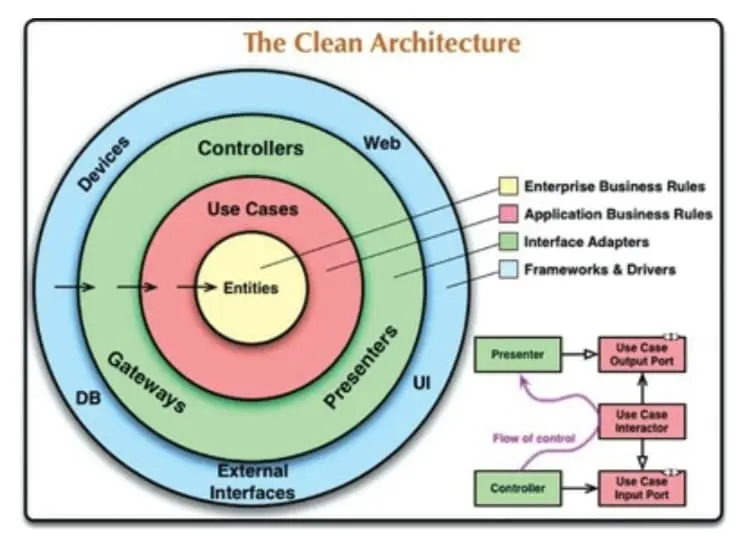

# Dirty Architecture

It so happens that on the frontend people don't think about architecture as often as they should. Not that I'm an exception, but it has caused me problems on the project, which I'm now cleaning up. I want as few developers as possible to step on my rake, hence this post.

## The Problem

Today's frontend is complex. A lot of business logic has migrated from the server to the browser. Single page applications, large hybrid apps with complex structure, logic, etc.—no one is surprised by this stuff these days.

But apart from complicated logic front end has a bunch of other problems like DOM manipulations, CSS styles, all hated and misunderstood by nobody styles cascades and other web development nifty stuff.

And deadlines, yes. They're always short. Developers have become [that “this is fine” meme dog](https://www.inverse.com/article/19181-kc-green-this-is-fine-dog-meme-this-is-not-fine-kickstarter):

Tools for solving problems with routine appeared. DOM manipulation, server queries, state handling, data storage—libraries and frameworks started to help us with all this.

Tools are good because they take the burden off of developers and allow them to focus on the business logic of the application. Isn't that a good thing? Yeah, it's good, but it just doesn't work the way it's supposed to.

We're still not paying enough attention to the business logic, and we're falling all over fancy libraries (hello, React!) and frameworks (hello, Angular!). And argue about what's better, what's worse, what applications are fancier on.

It seems to us that tools offer solutions for project structure. But a framework or library shouldn't dictate the structure of a project, or the rules of how system components communicate with each other, or anything else.

<mark>Tools shouldn't dictate anything to you at all</mark>

A tool should do the job for which it was invented. A hammer doesn't tell a carpenter how to hammer parts together because the carpenter is using the hammer as a tool of choice.

There shouldn't be any “React applications” or “Redux applications,” because those libraries are tools. React should draw pixels on the screen. Redux should work with the app state. That's it.

## How Do You Do It Then, Smart Guy?

In [The Clean Architecture](/blog/clean-architecture/), Martin writes that the core of any software system should be business rules, because any software system is about solving business problems.

<mark>Business rules are the skeleton around which everything else is wrapped</mark>

“Everything else” is the framework, the libraries, the web-native-hybrid, the whatever. And business rules, in a good way, mustn't depend on that in any way.

Martin writes that the right architecture for a project is one where the choice of framework becomes so unimportant that the decision can be postponed until the very last moment.

A good architecture according to Martin is an onion of several layers. The core is the entities, the objects that contain the business-critical rules and data for their operation. The second layer is the use cases, the models of communication between the user and the entities. The frameworks' adapters are on the outermost layer.

With a well-designed application architecture, you can throw out React and rewrite everything to View. And the application won't break because the UI depends on business rules, not the other way around.

## Well, How Do You Start Project Then?

That's a pretty logical question. What structure to choose, where to put the files, how to name them, that sort of thing. If before the framework brought with it a ready-made solution, now you have to come up with it yourself.

But this question was already answered for me by Dan Abramov on Twitter:

- [About project structure](https://twitter.com/dan_abramov/status/1027237981269180417)
- [About the “best” project structure](https://twitter.com/dan_abramov/status/701767939633057793)
- [About development process](https://twitter.com/dan_abramov/status/1027239211261485057)

<mark>It all depends on business rules. Design you architecture based on them</mark>

Learn as much as you can about the task and domain: requirements, constraints, what can go wrong, what and how it should work. With this information, start describing entities, their properties and communication rules on a piece of paper.

And when you start writing code, try to postpone the decision to choose tools until the very last moment. Write in such a way that anything can be attached to the core. Everything should depend on business rules, not the other way around. That's when the application will really be scalable and testable.

## Resources

The Clean Architecture summary in my blog:

- [Part 1](/blog/clean-architecture/)
- [Part 2](/blog/clean-architecture-2/)
- [Part 3](/blog/clean-architecture-3/)

Tweets by Dan Abramov:

- [About project structure](https://twitter.com/dan_abramov/status/1027237981269180417)
- [About the “best” project structure](https://twitter.com/dan_abramov/status/701767939633057793)
- [About development process](https://twitter.com/dan_abramov/status/1027239211261485057)
