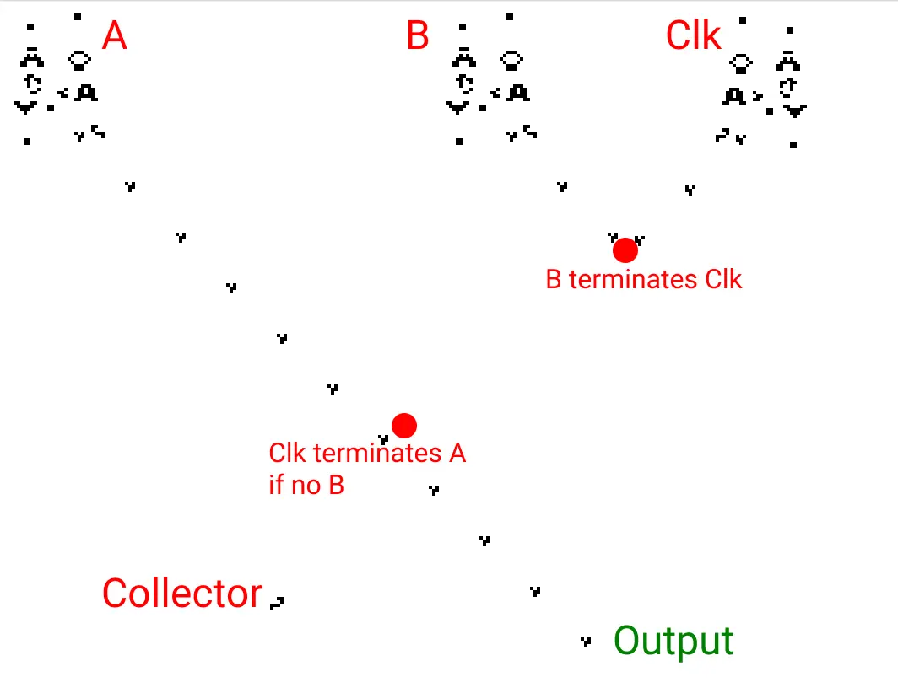
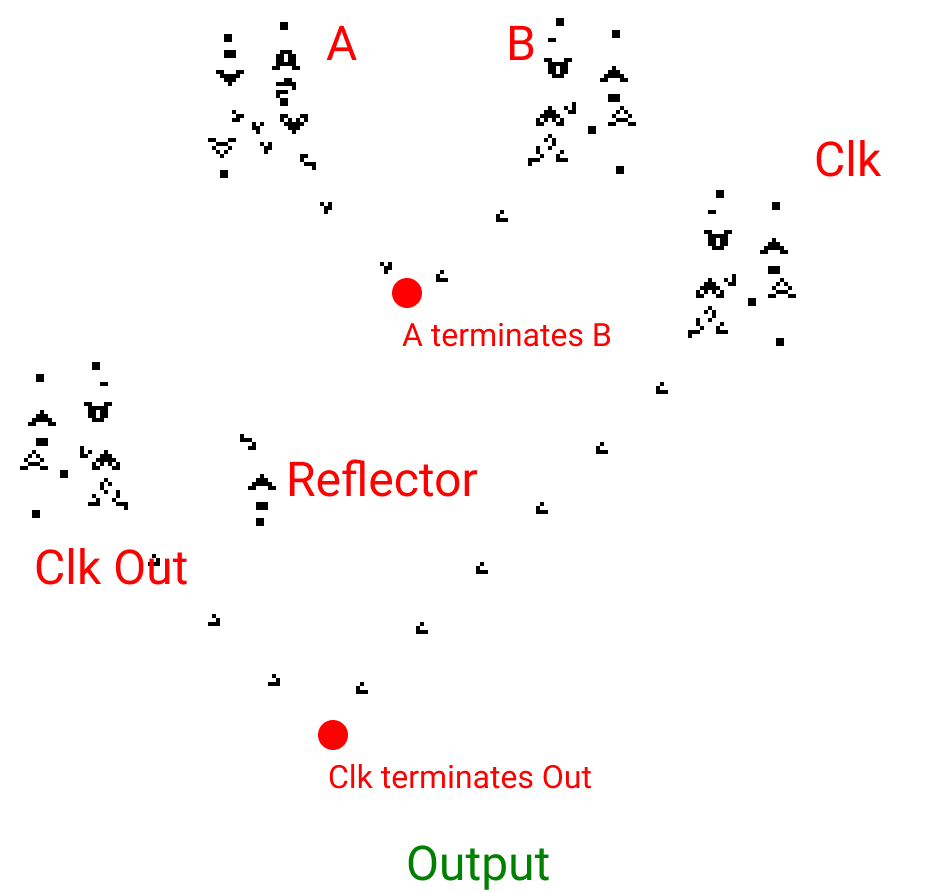
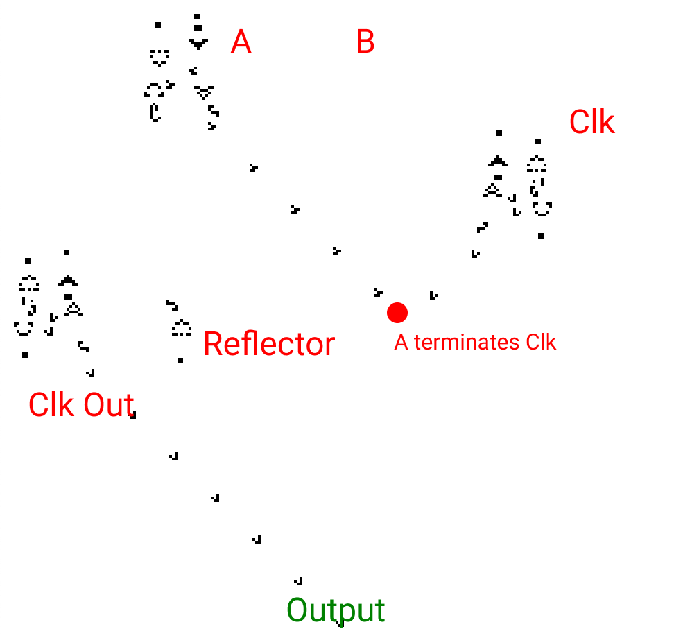

# Реализуем логические гейты в игре «Жизнь»

Продолжаем писать [двоичный калькулятор](https://bespoyasov.ru/showcase/game-of-life/), который складывает два двубитовых числа. [В прошлом посте](/blog/binary-adder-in-the-game-of-life) мы остановились на том, что написали саму игру «Жизнь» и модуль для отрисовки эволюции клеток на экране.

В этом посте познакомимся с распространёнными фигурами из игры, научимся генерировать «сигналы» и создадим логические схемы NOT, AND, OR и XOR. Эти схемы мы используем в следующем посте, чтобы создать схему полусумматора и полного сумматора.

## Фигуры в игре и работа с ними

Вообще, идея создать комплюктер в игре «Жизнь» — не нова. Об этом есть и [видео на Ютубе](https://www.youtube.com/watch?v=Kk2MH9O4pXY), и [научные статьи](http://web.mit.edu/sp.268/www/2010/lifeSlides.pdf). Дело в том, что правила «Жизни» делают игру [Тьюринг-полной](https://www.conwaylife.com/wiki/Turing_machine) — то есть такой, что внутри неё можно реализовать любую вычислимую функцию. ~~Ну а раз так, то почему бы не написать компьютер в компьютере, да?~~

Как и в случае с настоящими вычислителями, работа логических схем будет зависеть от сигналов. В «Жизни» в качестве сигналов мы можем использовать особые фигуры, которые умеют перемещаться по полю — [космические корабли](https://www.conwaylife.com/wiki/Spaceship).

### Глайдер

Самый маленький по размеру космический корабль — это [глайдер](https://www.conwaylife.com/wiki/Glider) или планёр (англ. glider). Он перемещается по полю по диагонали со скоростью в одну клетку за 4 хода. То есть каждые 4 шага эволюции глайдер смещается на одну клетку по диагонали по своему направлению.


Мы можем использовать поток таких глайдеров как «напряжение на входе схемы». Есть поток — есть сигнал, нет потока — нет сигнала.

Попробуем создать первый глайдер в нашей реализации. Добавим популяцию из клеток глайдера в главном модуле:

```js
// main.js

// .O.
// ..O
// OOO

const population = {
	'0:1': createAgent(0, 1),
	'1:2': createAgent(1, 2),
	'2:0': createAgent(2, 0),
	'2:1': createAgent(2, 1),
	'2:2': createAgent(2, 2)
};

const drawer = new Drawer(10);
const world = new World(30, 40, population);
```

И посмотрим, сработает ли:

<YouTube caption="Созданный глайдер перемещается по полю" src="https://www.youtube.com/embed/yV5CZwHY5rg">https://youtu.be/yV5CZwHY5rg</YouTube>

Отлично! Глайдер работает. Но мы снова сталкиваемся с неудобным видом начальной популяции. Пришлось даже добавить сверху комментарий, в котором нарисовать псевдографикой глайдер, чтобы было понятно, что это за фигура.

Вместо этого лучше напишем функцию, которая будет принимать такую псевдографику и возвращать — популяцию, которая там описана. Это нам пригодится и в будущем, когда мы будем работать с большими фигурами.

### Фигуры из псевдографики

Псевдографика, которую я использовал в комментариях — это часть принятой нотации паттернов игры. В ней живые клетки записываются через прописную O, а мёртвые клетки — через точки. Например, библиотека фигур [Life Lexicon](https://www.conwaylife.com/ref/lexicon/lex_home.htm) использует такой именно способ записи. Глайдер она [описывает так](https://www.conwaylife.com/ref/lexicon/lex_g.htm#glider):

```
OOO
O..
.O.
```

Кроме простого текста ещё иногда используют формат [RLE](https://www.conwaylife.com/wiki/Run_Length_Encoded) (Run Length Encoded), но он не такой наглядный, поэтому мы будем использовать не его, а простой текст.

```
# В формате RLE глайдер будет записан так:
x = 3, y = 3, rule = B3/S23
bob$2bo$3o!

# Не так наглядно, как с записью через точки и O.
```

Для того, чтобы из псевдографики получить популяцию клеток, мы напишем функцию `fromPseudoGraphics`.

Как аргумент будем передавать ей строку псевдографики, которую разобьём на строки, а каждую строку — на символы. На месте каждого символа `O` создадим живую слетку и наполним объект популяции, который затем вернём из функции как результат:

```js
// composition/from-pseudo-graphics.js
export const LINE_BREAK = '\n';
export const LIVE_AGENT = 'O';
export const EMPTY_STRING = '';

export function fromPseudoGraphics(source) {
	const population = {};

	// Разбиваем на строки:
	const rows = source.split(LINE_BREAK).filter(exists);

	rows.forEach((row, j) => {
		// Каждую строку — на символы:
		const characters = row.split(EMPTY_STRING);

		characters.forEach((character, i) => {
			if (character !== LIVE_AGENT) return;

			// Если символ отвечает за живую клетку, создаём её
			// и добавляем в популяцию на указанное место:
			population[`${i}:${j}`] = createAgent(i, j);
		});
	});

	return population;
}
```

Теперь мы можем сохранить исходник паттерна в константе, передать его как аргумент в функцию `fromPseudoGraphics` и получить начальную популяцию:

```js
// main.js

const glider = `
.O.
..O
OOO`;

const population = fromPseudoGraphics(glider);
const drawer = new Drawer(10);
const world = new World(30, 40, population);
```

Всё продолжает работать, можем двигаться к следующим фигурам.

### Глайдерная пушка Госпера

Глайдеры мы создавать научились, но этого пока недостаточно, чтобы создать устойчивый и постоянный сигнал на входе будущих схем. Сейчас мы можем отправить лишь столько глайдеров, сколько создадим заранее. Нам нужен какой-то «генератор» сигналов, который будет создавать устойчивые потоки глайдеров без нашего участия.

Такие фигуры тоже есть, и они называются [ружьями или пушками](https://www.conwaylife.com/wiki/Gun). Пушки «стреляют» глайдерами в указанном направлении с некоторой периодичностью.

Самая простая пушка — это [глайдерная пушка Госпера](https://www.conwaylife.com/wiki/Gosper_glider_gun). Она стреляет глайдерами с периодом 30, то есть каждые 30 ходов эволюции из пушки вылетает один глайдер.


Мы можем подсмотреть паттерн пушки в [библиотеке паттернов](https://www.conwaylife.com/patterns/gosperglidergun.cells) и использовать его у себя:

```js
// main.js

export const gliderGun = `
........................O...........
......................O.O...........
............OO......OO............OO
...........O...O....OO............OO
OO........O.....O...OO..............
OO........O...O.OO....O.O...........
..........O.....O.......O...........
...........O...O....................
............OO......................`;

const population = fromPseudoGraphics(gliderGun);
const drawer = new Drawer(10);
const world = new World(30, 40, population);
```

Проверим, работает ли пушка:

<YouTube caption="Каждые 30 ходов пушка стреляет глайдером" src="https://www.youtube.com/embed/xP0gLsIngWQ">https://youtu.be/xP0gLsIngWQ</YouTube>

### Пушка с периодом в 60

Обычная глайдерная пушка стреляет каждые 30 ходов. С этим уже можно работать, но нам лучше немного проредить потоки глайдеров.

Чем чаще стреляет пушка, тем больше глайдеров у нас будет на экране, и тем больше клеток нам придётся пересчитывать на каждый ход. На больших схемах (а сумматор будет большим) это может сильно ударить по производительности.

Мы можем решить проблему с плотностью глайдеров, если используем [пушку с периодом в 60](https://www.conwaylife.com/ref/lexicon/lex_p.htm#p60gun). То есть пушку, которая будет стрелять глайдером каждые 60 ходов. Добавим паттерн для пушки с периодом 60 и немного уменьшим масштаб клеток, чтобы всё вместилось:

```js
// main.js

export const gliderGunP60 = `
............................O..........
............................O.O........
...........OO..................OO......
.........O...O.................OO....OO
...OO...O.....O................OO....OO
...OO..OO.O...O.............O.O........
........O.....O.............O..........
.........O...O.........................
...........OO..........................
.......................................
.......................................
.......................................
.......................................
.......................................
.......................................
.......................................
..........O.O..........................
.........O..O...OO.....................
OO......OO.....OOO.OO..OO..............
OO....OO...O...O...O...O.O.............
........OO.....O.O........O............
.........O..O..OO......O..O............
..........O.O.............O............
.......................O.O.......OO....
.......................OO........O.O...
...................................O...
...................................OO..`;

const population = fromPseudoGraphics(gliderGunP60);
const drawer = new Drawer(10);
const world = new World(60, 80, population);
```

Проверим, как пушка работает:

<YouTube caption="Каждые 60 ходов пушка стреляет глайдером" src="https://www.youtube.com/embed/VIy8ogV9l-A">https://youtu.be/VIy8ogV9l-A</YouTube>

### Отражатель и склеивание паттернов

Иногда нам будет нужно перенаправлять сигналы из глайдеров, поэтому ещё одна фигура, которая нам понадобится, — это рефлектор или отражатель.

[Отражатель](https://www.conwaylife.com/ref/lexicon/lex_r.htm#reflector) — это осциллятор, при столкновении с которым глайдер меняет своё направление. Добавим его на поле:

```js
// main.js

export const reflector = `
........O
......OOO
.....O...
.....OO..
.........
.........
.........
.........
.........
.........
.........
OO.O.OO..
.........
O.....O..
.........
.OO.OO...
...O.....
.........
.........
.........
.........
...OO....
...OO....
`;
```

Теперь на поле хочется добавить также и глайдерную пушку, чтобы проверить, отражаются ли появляющиеся из пушки глайдеры. Проблема только в том, что функция `fromPseudoGraphics` сейчас принимает лишь один паттерн.

Чтобы решить задачу композиции паттернов, я написал отдельный модуль. Приводить полностью его код здесь не буду, исходники всегда можно найти [на Гитхабе](https://github.com/bespoyasov/binary-full-adder-in-the-game-of-life/tree/main/composition).

Суть этого модуля в том, что он проводит [аффинные преобразования](https://ru.wikipedia.org/wiki/Аффинное_преобразование) над фигурами с помощью функции `withSettings`. Эти преобразования помогают настроить расположение фигур на поле и направление сигналов пушек. Например, функция `withSettings`:

- перемещает фигуры по вертикали и горизонтали;
- вращает их относительно собственного центра;
- отражает относительно вертикальной оси.

А после применения преобразований этот модуль склеивает паттерны друг с другом с помощью функции `composePatterns`. Именно эту функцию мы и используем, чтобы совместить на поле отражатель и пушку:

```js
// main.js

// Импортируем нужные фигуры:
import { gliderGunP60 } from './life/population/patterns/glider-gun-p60.js';
import { reflector } from './life/population/patterns/reflector.js';

// Импортируем композер и преобразователь:
import { composePatterns } from './composition/composer.js';
import { withSettings } from './composition/with-settings.js';

// Вращаем пушку на 270 градусов,
// зеркально отражаем рефлектор и «проматываем» его до 13-го хода.
const gun = withSettings(gliderGunP60, { rotate: 270 });
const reflect = withSettings(reflector, {
	reflect: true,
	phase: 13
});

// Составляем паттерны с некоторыми отступами от левого верхнего угла:
const population = composePatterns([
	{ pattern: gun, offset: { x: 38, y: 1 } },
	{ pattern: reflect, offset: { x: 9, y: 62 } }
]);

// Слегка уменьшаем масштаб:
const drawer = new Drawer(2);
const world = new World(200, 600, population);
```

Параметр `phase` функции `withSettings` указывает, с какого шага надо запустить фигуру. Чтобы глайдер влетел в отражатель и сменил направление, а не вызвал «взрыв», он должен влететь в нужное время и нужное место:

<YouTube caption="Когда взаимное расположение и фазы настроены точно, отражатель меняет направление глайдеров" src="https://www.youtube.com/embed/X-aJ-afEQWk">https://youtu.be/X-aJ-afEQWk</YouTube>

Если мы ошибёмся хотя бы на одну клетку или один ход эволюции:

```js
// main.js

// Пусть отражатель работает не с 13-го хода, а с начала:
const reflect = withSettings(reflector, {
	reflect: true
	// phase: 13,
});
```

...Всё взорвётся:

<YouTube caption="Ошибка в фазе или положении приводит ко взрывам" src="https://www.youtube.com/embed/I7Hyukghbcw">https://youtu.be/I7Hyukghbcw</YouTube>

Синхронизация по фазе и положению — вот что отняло у меня больше всего времени при подготовке в этому посту. Сперва приходилось вычислять значения перебором, потом — пытаться найти хоть какие-нибудь закономерности 😃

Я до сих пор не уверен, что точно понял, как именно надо располагать фигуры относительно друг друга в пространстве и времени, но часть объяснений оставил в [исходниках на Гитхабе](https://github.com/bespoyasov/binary-full-adder-in-the-game-of-life). Там же на Гитхабе можно посмотреть и [другие паттерны](https://github.com/bespoyasov/binary-full-adder-in-the-game-of-life/tree/main/life/population/patterns) и поиграться с ними.

Ну а теперь — к логическим гейтам!

## Логические гейты

Логический гейт — это устройство, которое реализует [логическую функцию](/blog/code-the-hidden-language-of-computer-hardware-and-software/#глава-10-логика-и-переключатели). Такие функции принимают один или более входных сигналов и выдают в результате 0 (ложь) или 1 (истину).

Логические гейты будут основой более сложных схем типа полусумматора и сумматора. Мы создадим 4 базовые схемы: NOT, AND, OR и XOR.

### Схема NOT

Самая простая схема — это схема функции отрицания [NOT](<https://en.wikipedia.org/wiki/Inverter_(logic_gate)>). Она преобразует входной 0 в выходную 1 и наоборот.

У любой логической функции есть [таблица истинности](https://ru.wikipedia.org/wiki/Таблица_истинности). Такие таблицы содержат все возможные сочетания входных сигналов и соответствующие им результаты. Например, для функции NOT таблица истинности будет такой:

| A   | NOT A |
| --- | ----- |
| 0   | 1     |
| 1   | 0     |

Мы будем использовать таблицы истинности, чтобы проверять правильность работы гейтов, которые напишем.

Гейт NOT — это инвертер. Если на входе есть сигнал, NOT его «нейтрализует», а если нет — то «сгенерирует». Мы можем для имитации этого поведения использовать пушку, которая будет стрелять глайдерами во входной сигнал.

Столкновение глайдеров может приводить к [разным результатам](https://conwaylife.com/wiki/2-glider_collision), но нас интересуют те, которые уничтожают два столкнувшихся глайдера. Настроим «пушку-тактовый-генератор» так, чтобы она уничтожала входной сигнал, если он есть. Сигнал будет проходить слева, а пушка будет стоять справа:

```js
// gates/not.js

const clockGun = withSettings(gliderGunP60, {
	rotate: 270
});

const signalGun = withSettings(gliderGunP60, {
	rotate: 270,
	reflect: true
});

const signal = { pattern: signalGun };
const clock = { pattern: clockGun, offset: { x: 38, y: 1 } };
export const not = composePatterns([clock, signal]);
```

Проверим, будут ли глайдеры сталкиваясь пропадать:

<YouTube caption="«Тактовый генератор» уничтожает входной сигнал" src="https://www.youtube.com/embed/Ro5PJOH58ow">https://youtu.be/Ro5PJOH58ow</YouTube>

Если входного сигнала нет, то отразим поток из пушки. Отражённый поток и будет выходным сигналом:

```js
// gates/not.js

const clockGun = withSettings(gliderGunP60, {
	rotate: 270
});

const redirection = withSettings(reflector, {
	reflect: true,
	phase: 13
});

const clock = { pattern: clockGun, offset: { x: 38, y: 1 } };
const router = { pattern: redirection, offset: { x: 9, y: 62 } };
export const not = composePatterns([clock, signal, router]);
```

Проверим, отражает ли рефлектор поток глайдеров:

<YouTube caption="Отражённый сигнал поступает на выход" src="https://www.youtube.com/embed/KmodS2mWScg">https://youtu.be/KmodS2mWScg</YouTube>

Теперь если на входе 0, глайдеры из пушки не сталкиваются с входным сигналом, отражаются рефлектором и выходят как результат. А если на входе 1, глайдеры сталкиваются с входным сигналом и до выхода не доходят.


Нам осталось лишь сделать схему функцией, чтобы она могла принимать входной сигнал как аргумент:

```js
// gates/not.js

export function not(input = 0) {
	// Если на входе 1, слева появится пушка входного сигнала,
	// если на входе 0, слева будет пусто:
	const signal = input ? { pattern: signalGun } : null;

	// Пушка «тактового генератора»:
	const clock = { pattern: clockGun, offset: { x: 38, y: 1 } };

	// Отражатель, который превратит
	// глайдеры из пушки справа в выходной сигнал:
	const router = { pattern: redirection, offset: { x: 9, y: 62 } };

	// Собираем всё вместе в начальную популяцию:
	return composePatterns([clock, signal, router]);
}
```

[Полный код гейта NOT](https://github.com/bespoyasov/binary-full-adder-in-the-game-of-life/blob/main/gates/not.js) вы сможете найти на Гитхабе.

### Схема AND

Следующий гейт — это логическое умножение [AND](https://en.wikipedia.org/wiki/AND_gate). Эта функция принимает 2 входных сигнала и выдаёт на выходе 1, только если оба сигнала равны 1.

Таблица истинности функции AND будет такой:

| A   | B   | A AND B |
| --- | --- | ------- |
| 0   | 0   | 0       |
| 0   | 1   | 0       |
| 1   | 0   | 0       |
| 1   | 1   | 1       |

Раз у нас два входа, то функция будет принимать два аргумента:

```js
// gates/and.js

export function and(a = 0, b = 0) {
	const signalA = null;
	const signalB = null;
}
```

Для этой схемы нам нужно придумать такое расположение пушек, чтобы глайдеры доходили до выхода, только если два входных сигнала активны.

Я покумекал и придумал вот такую схему. Сигнал A стоит слева, сигнал B — правее, «тактовый генератор» самый правый на схеме. Они все настроены так, что столкновение глайдеров между ними приводит к уничтожению.



Если есть сигнал B, он уничтожает поток глайдеров из Clk, и на выходе будет то же, что и в сигнале A. Если сигнала B нет, то A уничтожится потоком из Clk. Таким образом выходной сигнал активен, только если оба входных сигнала активны.

Расположим элементы, чтобы собрать гейт:

```js
// gates/and.js

const gunA = withSettings(gliderGunP60, {
	rotate: 270,
	reflect: true
});

const gunB = withSettings(gliderGunP60, {
	rotate: 270,
	reflect: true
});

const clockGun = withSettings(gliderGunP60, { rotate: 270 });
const collectorEater = withSettings(eater, { rotate: 270 });

export function and(a = 0, b = 0) {
	const signalA = a ? { pattern: gunA } : null;
	const signalB = b ? { pattern: gunB, offset: { x: 128 } } : null;

	const clock = { pattern: clockGun, offset: { x: 208, y: 1 } };
	const collector = { pattern: collectorEater, offset: { x: 76, y: 173 } };
	return composePatterns([clock, collector, signalA, signalB]);
}
```

[Полный код гейта AND](https://github.com/bespoyasov/binary-full-adder-in-the-game-of-life/blob/main/gates/and.js) вы сможете найти на Гитхабе.

Графически схема AND обозначается как половинка скруглённого прямоугольника, в который входят два сигнала 😅


Мы будем пользоваться такими обозначениями при построении более сложных схем в будущем. Пока запомним, что это AND.

### Схема OR

Следующий гейт — это логическое сложение [OR](https://en.wikipedia.org/wiki/OR_gate). Эта функция также принимает два аргумента, но возвращает 1, если хотя бы один из аргументов равен 1.

Таблица истинности функции OR будет такой:

| A   | B   | A OR B |
| --- | --- | ------ |
| 0   | 0   | 0      |
| 0   | 1   | 1      |
| 1   | 0   | 1      |
| 1   | 1   | 1      |

Расположение элементов для схемы OR я предлагаю сделать таким: за основу берём схему AND, но добавляем ещё один генератор — он будет создавать выходной сигнал. Его будет перебивать сигнал Clk, но только если ни A, ни B не активны.


Collector будет встречать глайдеры сигнала A и поглощать их, так как они сами по себе будут не нужны.

```js
// gates/or.js

export function or(a = 0, b = 0) {
	const signalA = a ? { pattern: gunA } : null;
	const signalB = b ? { pattern: gunB, offset: { x: 128 } } : null;

	const clock = { pattern: clockGun, offset: { x: 208, y: 1 } };
	const output = { pattern: outputGun, offset: { x: 1, y: 45 } };

	const signalCollector = { pattern: collectorEater, offset: { x: 145, y: 161 } };
	const outputCollector = { pattern: collectorEater, offset: { x: 146, y: 206 } };
	return composePatterns([clock, output, signalA, signalB, signalCollector, outputCollector]);
}
```

[Полный код гейта OR](https://github.com/bespoyasov/binary-full-adder-in-the-game-of-life/blob/main/gates/or.js) вы сможете найти на Гитхабе.

Графически OR обозначается как... ну... рыцарский шлем на боку?.. В общем, вот так выглядит:


### Схема XOR

Последняя схема, которая нам понадобится — это исключительное (exclusive) сложение [XOR](https://en.wikipedia.org/wiki/XOR_gate). Эта функция работает, как OR, но возвращает 0, если оба сигнала равны 1.

Таблица истинности функции XOR будет такой:

| A   | B   | A XOR B |
| --- | --- | ------- |
| 0   | 0   | 0       |
| 0   | 1   | 1       |
| 1   | 0   | 1       |
| 1   | 1   | 0       |

Схема функции будет немного посложнее. Распишем разные сочетания сигналов, чтобы понять, как она работает. Когда на вход поданы 1 и 1, нам нужно уничтожить выходной сигнал. Расставим входные сигналы так, чтобы они друг друга уничтожали, а тактовый генератор — чтобы он уничтожал выход:



Когда на вход подан только первый сигнал, он уничтожает поток из тактового генератора, и выходной сигнал беспрепятственно проходит:



Когда на вход подан только второй сигнал, он отражается от рефлектора и уничтожает поток из тактового генератора. Выходной сигнал также беспрепятственно проходит к выходу:


Ну и если на входах 0 и 0, то тактовый генератор уничтожит выходной сигнал.

Реализуем схему:

```js
// gates/xor.js

export function xor(a = 0, b = 0) {
	const signalA = a ? { pattern: gunA, offset: { x: 48, y: 2 } } : null;
	const signalB = b ? { pattern: gunB, offset: { x: 128, y: 1 } } : null;

	const clock = { pattern: clockGun, offset: { x: 168, y: 44 } };
	const router = { pattern: redirection, offset: { x: 56, y: 105 } };
	const output = { pattern: outputGun, offset: { x: 1, y: 87 } };
	return composePatterns([clock, router, signalA, signalB, output]);
}
```

[Полный код гейта XOR](https://github.com/bespoyasov/binary-full-adder-in-the-game-of-life/blob/main/gates/xor.js) вы сможете найти на Гитхабе.

Графически XOR обозначается как OR только с чертой перед входами:


И готово! Все логические гейты собраны. Я подготовил отдельные страницы на каждый гейт, чтобы можно было удобно посмотреть работу каждого в отдельности. Введите в поля входные сигналы, чтобы построить схему и посмотреть, как она работает:

- [NOT](https://bespoyasov.ru/showcase/game-of-life/steps/step-6.html)
- [AND](https://bespoyasov.ru/showcase/game-of-life/steps/step-7.html)
- [OR](https://bespoyasov.ru/showcase/game-of-life/steps/step-8.html)
- [XOR](https://bespoyasov.ru/showcase/game-of-life/steps/step-9.html)

## В следующем посте

В этот раз мы реализовали 4 логические функции: NOT, AND, OR, XOR — которые будут строительными блоками для сложных схем.

[В следующий раз](/blog/binary-adder-in-the-game-of-life-3) из этих схем мы составим сперва двоичный полусумматор, полный сумматор, а потом и калькулятор, который будет складывать два двубитовых числа.

## Ссылки и ресурсы

- [Исходники](https://github.com/bespoyasov/binary-full-adder-in-the-game-of-life)
- [«Калькулятор» двух бит](https://bespoyasov.ru/showcase/game-of-life/)
- [Создание схемы по шагам](https://bespoyasov.ru/showcase/game-of-life/steps/)

### Другие посты из серии

- [Первая часть: пишем основы игры «Жизнь»](/blog/binary-adder-in-the-game-of-life)
- [Третья часть: реализуем схемы сумматоров](/blog/binary-adder-in-the-game-of-life-3)

### Бинарная логика, CS

- [Let’s BUILD a COMPUTER in CONWAY's GAME of LIFE](https://www.youtube.com/watch?v=Kk2MH9O4pXY)
- [The 10,000 Domino Computer](https://www.youtube.com/watch?v=OpLU__bhu2w)
- [Код. Тайный язык информатики. Чарльз Петцольд](/blog/code-the-hidden-language-of-computer-hardware-and-software/)
- [Аффинные преобразования](https://ru.wikipedia.org/wiki/Аффинное_преобразование)

### Бинарная логика в игре «Жизнь»

- [Conway's Game of Life, PDF](http://web.mit.edu/sp.268/www/2010/lifeSlides.pdf)
- [Turing machine in the Game of Life](https://www.conwaylife.com/wiki/Turing_machine)
- [Digital Logic Gates on Conway's Game of Life](https://nicholas.carlini.com/writing/2020/digital-logic-game-of-life.html)

### Библиотеки паттернов

- [RLE, Run Length Encoded](https://www.conwaylife.com/wiki/Run_Length_Encoded)
- [Life Lexicon](https://www.conwaylife.com/ref/lexicon/lex_home.htm)

### Глайдеры, столкновения

- [Глайдер](https://www.conwaylife.com/wiki/Glider)
- [Глайдер на Life Lexicon](https://www.conwaylife.com/ref/lexicon/lex_g.htm#glider)
- [Глайдер на Conwaylife.com](https://www.conwaylife.com/patterns/glider.cells)
- [Глайдер в формате RLE](https://www.conwaylife.com/patterns/glider.rle)
- [Столкновение глайдеров](https://conwaylife.com/wiki/2-glider_collision)

### Другие фигуры

- [Космические корабли](https://www.conwaylife.com/wiki/Spaceship)
- [Пушки](https://www.conwaylife.com/wiki/Gun)
- [Глайдерная пушка Госпера](https://www.conwaylife.com/wiki/Gosper_glider_gun)
- [Пушка Госпера на Conwaylife.com](https://www.conwaylife.com/patterns/gosperglidergun.cells)
- [Пушка с периодом 60 на Life Lexicon](https://www.conwaylife.com/ref/lexicon/lex_p.htm#p60gun)
- [Отражатель на Life Lexicon](https://www.conwaylife.com/ref/lexicon/lex_r.htm#reflector)

### Логические гейты в Википедии

- [Таблица истинности](https://ru.wikipedia.org/wiki/Таблица_истинности)
- [NOT](<https://en.wikipedia.org/wiki/Inverter_(logic_gate)>)
- [AND](https://en.wikipedia.org/wiki/AND_gate)
- [OR](https://en.wikipedia.org/wiki/OR_gate)
- [XOR](https://en.wikipedia.org/wiki/XOR_gate)
