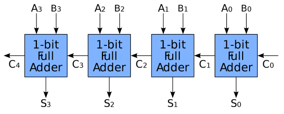
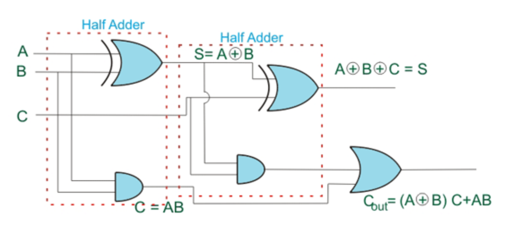
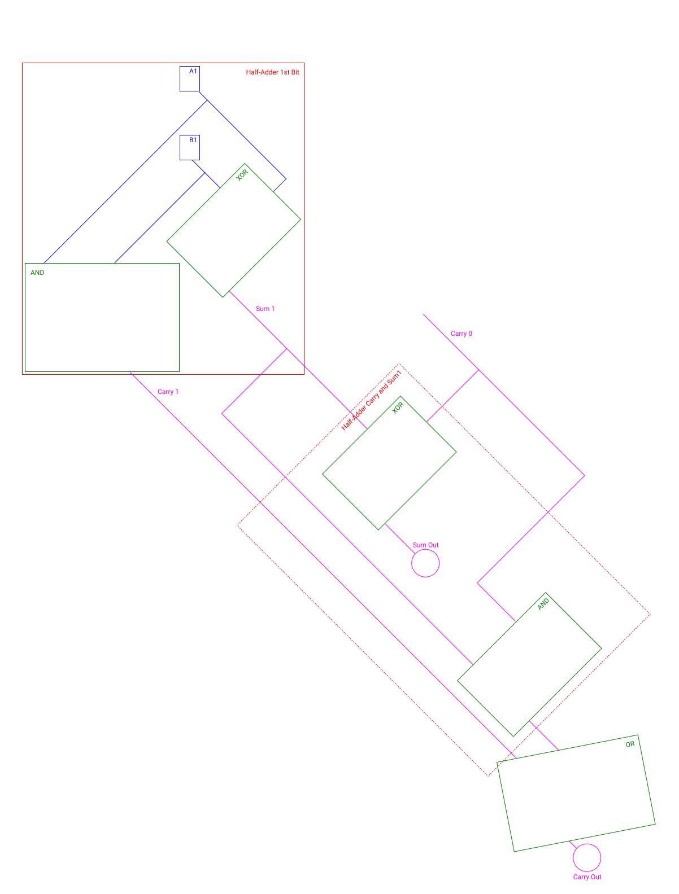

# Finishing Up the Binary Adder in the Game of Life

Let's finish our [binary calculator](https://bespoyasov.me/showcase/game-of-life/) that adds two 2-bit numbers together. In the [first post](/blog/binary-adder-in-the-game-of-life) we created the Game of Life basics and a drawer module. In the [previous posts](/blog/binary-adder-in-the-game-of-life-2), we implemented the Game of Life using JavaScript and created logic gates using glider streams as signals.

This time, we're going to use created logic gates to build half adder and full adder circuits. In the end, we'll create a binary calculator that will take two 2-bit numbers and add them together.

## Binary Half Adder

The [binary half adder](<https://en.wikipedia.org/wiki/Adder_(electronics)#Half_adder>) is a logic circuit that can add two bits together. It takes 2 arguments and returns 2 bits: sum bit and carry.

| A   | B   | Carry | Sum |
| --- | --- | ----- | --- |
| 0   | 0   | 0     | 0   |
| 1   | 0   | 0     | 1   |
| 0   | 1   | 0     | 1   |
| 1   | 1   | 1     | 0   |

The carry bit is the value that goes to the next digit. When adding 1 and 1 the current digit is overflown (since the sum is 10) and we need to transfer the 1 to the next digit.

It is _half_ adder because it performs only a half of the addition. What it doesn't do is it doesn't take the carry from the previous bit and doesn't consider it when adding numbers.

For the full addition, we would need 2 half adders, but that's for later. Right now let's get back to the half adder.

(You can find much more details about the binary logic gates and circuits in [Code by Charles Petzold](/blog/code-the-hidden-language-of-computer-hardware-and-software/). I highly recommend reading this book.)

### Hald Adder Circuit

We won't invent the circuit but will find it in [Wiki](<https://en.wikipedia.org/wiki/Adder_(electronics)#Half_adder>) instead.

The circuit contains 2 logic gates: XOR and AND. XOR represents the sum bit, and AND represents the carry bit.


And, indeed, when we add 1 and 1, XOR gives us 0 (since the digit is overflown) and AND gives us 1 (since we transferred it to the next digit).

### Signal Splitter

We can't build the circuit right now because we still need an additional element that can split a signal into 2. We will use a [fanout](https://www.conwaylife.com/wiki/Fanout) for this.

The full source code for the [fanout pattern](https://github.com/bespoyasov/binary-full-adder-in-the-game-of-life/blob/main/life/population/patterns/fanout.js) you can find on GitHub. Here, I'll show how we're going to use it to create a splitter:

```js
// gates/split.js

const signalGun = withSettings(gliderGunP60, { rotate: 270, reflect: true });
const split = withSettings(fanout, { phase: 11 });

export function divide(input = 0) {
	const signal = input ? { pattern: signalGun } : null;
	const splitter = { pattern: split, offset: { x: 28, y: 39 } };
	return composePatterns([signal, splitter]);
}
```

The splitter will divide an input signal into 2 and rotate one of the resulting signals by 90 degrees to the left.


Finally, we can start building the circuit.

### Building the Circuit

First of all, let's try and recreate the half-adder circuit with the patterns from the game. I have something like this:


(I'm pretty sure the circuit could be composed much more compact and efficient but I didn't have enough patience to do it. There are links to nicer solutions at the end of this post. Also you can send an idea or a PR to the repo, all the [source code is on GitHub](https://github.com/bespoyasov/binary-full-adder-in-the-game-of-life/pulls).)

Let's examine the circuit scheme. On the top, there is signal A. Its glider stream splits into 2. Right below there is signal B, its stream also splits into 2.

Divided signals go to left and right in pairs. Right signals go into the XOR gate and result in the sum bit. Left signals go into the AND gate and result in the carry bit.

To build this thing we're going to need:

- 2 glider guns, one for each input signal;
- 2 splitters, one for each input;
- 3 reflectors to redirect some of the signals;
- XOR and AND gates.

Let's add all of them on the field:

```js
// circuit/half-adder.js

// Input signals guns:
const gunA = withSettings(gliderGunP60, { rotate: 270, reflect: true });
const gunB = withSettings(gliderGunP60, { rotate: 270, reflect: true });

// Splitter, the same and be used in both cases:
const splitter = divide();

// Reflectors:
const redirectRight = withSettings(reflector, { phase: 4 });
const redirectA = withSettings(reflector, { phase: 1, reflect: true });
const redirectB = withSettings(reflector, { phase: 29, reflect: true });
```

Now, let's create the `halfAdder` function:

```js
// circuit/half-adder.js

export function halfAdder(a = 0, b = 0) {
	// Create the gun if there is an input:
	const signalA = a ? { pattern: gunA, offset: { x: 328, y: 2 } } : null;
	const signalB = b ? { pattern: gunB, offset: { x: 329, y: 124 } } : null;

	// Split each signal into 2:
	const splitA = a ? { pattern: splitter, offset: { x: 328, y: 2 } } : null;
	const splitB = b ? { pattern: splitter, offset: { x: 329, y: 124 } } : null;

	// XOR right pair to get the sum:
	const rerouteRight = { pattern: redirectRight, offset: { x: 496, y: 189 } };
	const sumBit = { pattern: xor(), offset: { x: 318, y: 201 } };

	// AND left pair to get the carry:
	const divertA = a ? { pattern: redirectA, offset: { x: 54, y: 370 } } : null;
	const divertB = b ? { pattern: redirectB, offset: { x: 182, y: 365 } } : null;

	const carryBit = { pattern: and(), offset: { x: 83, y: 353 } };

	// Compose all the elements into a population:
	return composePatterns([
		signalA,
		splitA,
		signalB,
		splitB,

		rerouteRight,
		divertA,
		divertB,

		sumBit,
		carryBit
	]);
}
```

The [full source code](https://github.com/bespoyasov/binary-full-adder-in-the-game-of-life/blob/main/circuit/half-adder.js) you can find on GitHub.

Let's check if the circuit works:

<YouTube caption="When adding 1 and 1 we get the sum bit 0 and carry bit 1" src="https://www.youtube.com/embed/zQ4bBqRBpD0">https://youtu.be/zQ4bBqRBpD0</YouTube>

I added a [page with this circuit](https://bespoyasov.me/showcase/game-of-life/steps/step-10.html) where you can try different values and see how the addition is performed. Also, there is a [list with all the steps](https://bespoyasov.me/showcase/game-of-life/steps/) for building the circuit.

## Binary Full Adder

The full adder takes not only 2 numbers to add but also a carry from the previous addition. This, in fact, makes it a _real adder_.


It is easier to show the addition like this:

```
  1 0 1  Number A
  0 1 1  Number B
_______
1 0 0 0  Sum of each bit
0 1 1 1  Carry out of each bit
1 1 1 0  Carry in for each bit
```

The addition starts from the least significant digit (on the right, zeroth). It doesn't have CarryIn since there wasn't any addition before.

The CarryOut of this bit becomes the CarryIn of the next (first) bit. Here, we add A, B, and CarryIn_1 to get the sum and carry.

This makes it possible to compose full adders in a chain. Notice that in the chain the least significant bit is also on the right:



### Full Adder Circuit

The [circuit consists](https://theorycircuit.com/full-adder-circuit-diagram/) of 2 half adders and an OR gate:



The truth table for this circuit looks like this:

| A   | B   | Carry In | Carry Out | Sum |
| --- | --- | -------- | --------- | --- |
| 0   | 0   | 0        | 0         | 0   |
| 0   | 0   | 1        | 0         | 1   |
| 0   | 1   | 0        | 0         | 1   |
| 0   | 1   | 1        | 1         | 0   |
| 1   | 0   | 0        | 0         | 1   |
| 1   | 0   | 1        | 1         | 0   |
| 1   | 1   | 0        | 1         | 0   |
| 1   | 1   | 1        | 1         | 1   |

Everything seems to be in order but there's a problem. On the circuit scheme, some signals cross but don't interact.

To recreate this behavior in the circuit we would need another kind of reflector that can change phases of glider streams. It can be done but it makes the interaction too complicated. Instead, I preferred to rebuild the circuit in such a way so that signals don't cross 😃



Basically, the circuit is the same, there are just no crossings. Now, we can finally build the circuit.

### Building the Circuit

So, the adder is a function of 3 arguments: A, B and Carry.

```js
// circuit/full-adder.js

export function fullAdder(a = 0, b = 0, carry = 0) {
	// Use the half adder made previously
	// to get the sum and intermediate carry:
	const inputSum = { pattern: halfSum(a, b), offset: { x: -4, y: 118 } };

	// Create the Carry In gun if there is `carry` argument:
	const carry0 = carry ? { pattern: gunCarry0, offset: { x: 801, y: 600 } } : null;

	// Split each carry in 2:
	const splitCarry0 = { pattern: divide(), offset: { x: 801, y: 600 } };
	const splitCarry1 = { pattern: divide(), offset: { x: 464, y: 555 } };

	// XOR 1st bit sum and 0th bit carry to get the final sum:
	const sumOut = { pattern: xor(), offset: { x: 596, y: 738 } };
	const collector1 = { pattern: collector, offset: { x: 753, y: 997 } };

	// Redirect some of the signals:
	const divertLeft = { pattern: redirectLeft, offset: { x: 385, y: 728 } };
	const divertBack = { pattern: redirectBack, offset: { x: 1027, y: 845 } };
	const divertForward = {
		pattern: redirectForward,
		offset: { x: 838, y: 1029 }
	};

	// AND sum of the 1st bit and carry,
	// OR the result with carry,
	// to get the final Carry Out:
	const sumAndCarry = { pattern: and(), offset: { x: 778, y: 1101 } };
	const carryOut = { pattern: or(), offset: { x: 892, y: 1312 } };

	// Compose all the elements into a population:
	return composePatterns([
		carry0,
		inputSum,

		splitCarry0,
		splitCarry1,

		sumOut,
		collector1,

		divertLeft,
		divertBack,
		divertForward,

		sumAndCarry,
		carryOut
	]);
}
```

The [whole source code](https://github.com/bespoyasov/binary-full-adder-in-the-game-of-life/blob/main/circuit/full-adder.js) you can find on GitHub.

Now, if we run this circuit with `A = 1`, `B = 1`, and `Carry In = 1` we'll get `Sum == 1` and `Carry Out == 1`:


I made a [page with this circuit](https://bespoyasov.me/showcase/game-of-life/steps/step-11.html) so that you can try different values to see how it works.

## 2-Bit Calculator

A full adder adds two 1-bit numbers. To add two 2-bit numbers we need a half adder and a full adder.

The half adder will add the least significant (0th) bits and the full adder will add 1st bits.


We will use circuits created earlier so the code's going to be short:

```js
// circuit/two-bits-adder.js

const halfSum0 = (a, b) => jumpToPhase(halfAdder(a, b, { collectCarry: false }), 27);

export function adder(a = '00', b = '00') {
	const [a0, a1] = toBits(a);
	const [b0, b1] = toBits(b);

	const bit0 = { pattern: halfSum0(a0, b0), offset: { x: 514, y: 16 } };
	const bit1 = { pattern: fullAdder(a1, b1) };
	return composePatterns([bit0, bit1]);
}
```

The `toBits` function takes a string and splits it into characters that we can use later to create input signals:

```js
// utils.js

export function toBits(str) {
	return str.split('').map(Number).reverse();
}
```

And, finally, let's try and add “11” and “11” to get “110”!

<YouTube caption="When adding 11 and 11 we get 110" src="https://www.youtube.com/embed/91d1Kuwpuoc">https://youtu.be/91d1Kuwpuoc</YouTube>

Excellent! Everything's working! You can try this [app](https://bespoyasov.me/showcase/game-of-life/) yourself and enter different values to see how the circuit works. There is also a speed control so you can speed up the evolution a bit since it is kinda slow by default.

## Side Notes

You might notice that the circuit architecture is neither beautiful nor efficient 😅

As we said before, it is possible to compose elements closer and more efficiently with crossings. Also, this circuit doesn't consider the signal delays. It gives the right answer only after some time when all of the signals have reached their final destinations. In real circuits, it must be avoided.

On top of that this circuit is hardly composable with itself. So it is hard to chain multiple full adders together. There is, however, a [post by Nicholas Carlini](https://nicholas.carlini.com/writing/2020/digital-logic-game-of-life.html) where the whole process is visualized in Golly. The circuits in the post are much more efficient and real-like. Totally recommend reading it!

Finally, there are many cellular automata except for the Game of Life and some of them are better at simulating signals. For example, there is [Wireworld](https://www.conwaylife.com/wiki/OCA:Wireworld) which was designed for this (unlike the Game of Life 😃).

## Sources

- [Source Code](https://github.com/bespoyasov/binary-full-adder-in-the-game-of-life)
- [2-Bit Calculator](https://bespoyasov.me/showcase/game-of-life/)
- [Circuit Building Step by Step](https://bespoyasov.me/showcase/game-of-life/steps/)

### Other Posts in Series

- [Part 1: Game of Life Basics](/blog/binary-adder-in-the-game-of-life)
- [Part 2: Implementing Logic Gates](/blog/binary-adder-in-the-game-of-life-2)

### Patterns, Circuits, and Theory

- [Code by Charles Petzold](/blog/code-the-hidden-language-of-computer-hardware-and-software/)
- [Fanout](https://www.conwaylife.com/wiki/Fanout)
- [Binary Adder](<https://en.wikipedia.org/wiki/Adder_(electronics)>)
- [Full Adder on theorycircuit.com](https://theorycircuit.com/full-adder-circuit-diagram/)
- [Binary Half and Full Adder](https://www.electrical4u.com/binary-adder-half-and-full-adder/)

### Other Implementations and Cellular Automata

- [Digital Logic Gates on Conway's Game of Life - Part 1](https://nicholas.carlini.com/writing/2020/digital-logic-game-of-life.html)
- [Wireworld](https://www.conwaylife.com/wiki/OCA:Wireworld)
- [Life-like Automata](https://www.conwaylife.com/wiki/List_of_Life-like_cellular_automata)
