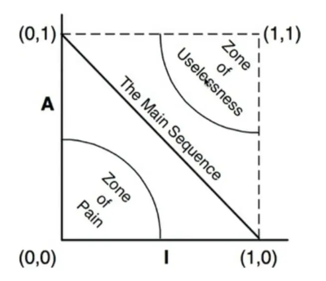
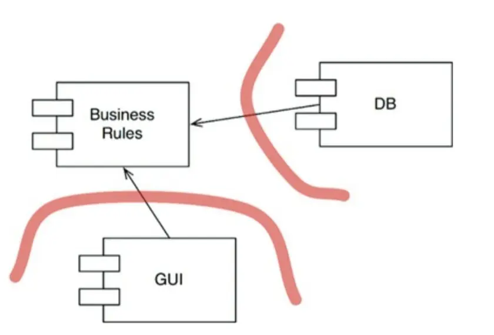

# The Clean Architecture. Part 2

[In the first part](/blog/clean-architecture/) we discussed the concept of architecture, programming paradigms, and SOLID principles. Today we will talk about coupling and cohesion of system components, and discuss in more detail the goals of a good architecture.

<aside>

I read [this book](https://www.goodreads.com/book/show/18043011-clean-architecture) in
translation, not in English. Quotes I show and wordings I use in this summary might be imprecise
and slightly different from the original text.

</aside>

## Chapter 12. Components

TL;DR:

- A component is a smallest entity that can be deployed as part of the system.
- Components, DLLs are plug-ins to business rules.

## Chapter 13. Component Cohesion

TL;DR: to determine which component a class belongs to, 3 principles should be used:

- The Reuse/Relase Equivalence Principle;
- The Common Closure Principle;
- The Common Reuse Principle.

### The Reuse/Relase Equivalence Principle

A component cannot just include a set of classes and modules, there must be a common goal for those classes and modules. All classes and modules of the same component must be released together.

### The Common Closure Principle

One component should include classes that change for the same reasons and at the same time. For many applications, maintainability is more important than reuse. If the code must change, it's more convenient to have the change in just one component rather than spread throughout the application.

### The Common Reuse Principle

The component should contain those classes and modules that are used together. Don't make users depend on something they won't use.

## Chapter 14. Component Coupling

TL;DR: to determine the relationship between the components, 3 principles should be used:

- Acyclic Dependencies Principle;
- Stable Dependencies Principle;
- Stable Abstractions Principle.

### Acyclic Dependencies Principle

Avoid loops in the dependency graph of a component. If there is a loop in the dependencies, it can be broken in one of 2 ways:

- Apply the dependency inversion principle;
- Create a new component on which the components that cause cycling dependencies will depend.

### Stable Dependencies Principle

Dependencies must be directed toward sustainability. Some components must be more changeable to meet changes in business requirements. And such less stable components must depend on more stable components.

To find out how unstable a component is, you can count the number of input and output dependencies.

> _Instability = # of Output / (# of Input + # of Output)_

### Stable Abstractions Principle

The component must be as abstract as it is stable.

> _Abstractness = (# of Abstract Classes and Interfaces in Component) / (Total # of Classes in Component)_

The X-axis is unstable, the Y-axis is abstract. You should stick to the _main sequence_ line and avoid zones in the corners:

## Chapter 15. What's Architecture?

TL;DR:

- The goal of a good architecture is to make system development, deployment, and maintenance easier.
- A good architecture emphasizes business logic and considers it the most important element of the system.
- A good architecture tries to build the system as if the number of unadopted decisions about the parts is maximum.

Architecture is the face of the system that dictates the rules for how components communicate with each other. Its goal is to make the system easier to develop, deploy, and maintain. The way to achieve the goal is to leave as many openings for change as possible for as long as possible.

Every system can be broken down into two parts: business logic and implementation details. The details tell how users, components, etc. communicate with the business logic. A good architecture highlights the business logic and considers it the most important element of the system, making it independent of the implementation details.

The business logic doesn't care what database we use, whether we deliver data via the web or otherwise, it's independent of the device the system runs on, etc.

This allows us to abstract away implementation details and defer decisions about them. A good architecture tries to build the system as if the number of decisions not made about the details is maximum.

## Chapter 16. Independence

TL;DR: the architecture must support:

- use cases;
- maintainability;
- development;
- easy deployment of the system.

We don't know in advance all of the use cases, development team organization, deployment requirements, etc. And even if we did, they would change over the lifetime of the system. A good architecture makes it cheaper to make changes.

You should divide the system into layers. For example:

- independent business rules;
- business rules for that particular application;
- user interface;
- database, etc.

If the system is designed correctly, each layer can be changed and deployed independently of the others.

If duplication is detected, determine if it is a true duplication or an accidental duplication. If the “duplicates” evolved in completely different ways, it's most likely an accidental duplication.

You can split the system in different ways:

- at the source level;
- the deployment level;
- and the service level.

Which way is appropriate depends on the project itself, the stage it is at, and other parameters.

## Chapter 17. Boundaries

TL;DR:

- the knowledge of one component of the system about others must be limited;
- boundaries should separate entities that matter (for business logic) from those that do not;
- the core is the business logic.

Premature decisions should be avoided. A decision is premature if it does not relate to business requirements. Choosing a database, a framework, even a programming language are premature decisions.

Boundaries should separate entities that matter (to business logic) from those that don't. For example, business logic should not depend on either the database schema or the query language.

In a good architecture, the business logic is the foundation, and everything else: I/O devices, database, etc.—are plugins to it:

## What's Next?

[In Part 3](/blog/clean-architecture-3/) we'll discuss business rules, architecture levels, and talk a little bit about templates and tests.
