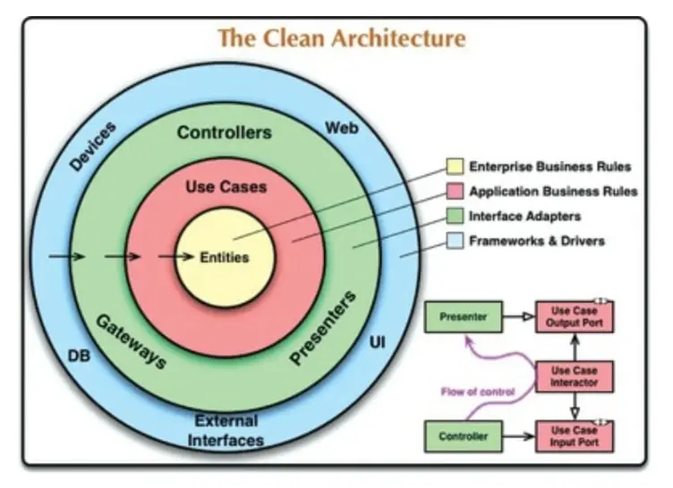

# The Clean Architecture. Part 3

[Last time](/blog/clean-architecture-2/) we talked about coupling and cohesion of system components, and discussed in detail the goals of a good architecture. Today we'll take a closer look at business rules, architecture levels, and talk a bit about templates and tests.

## Chapter 20. Business Rules

TL;DR:

- Business rules are rules or procedures that make or keep money for a business.
- Application-specific rules are in addition to business rules.

Business rules are rules or procedures that make or keep the business money, whether these procedures are done on a computer or manually. Such rules are called critical rules, and the data those rules work with is called critical data.

An entity is a container that contains a set of critical rules and data for their operation.

Application-specific rules are called use cases. They describe the communication patterns between the user and the entities. Entities do not need to know anything about the use cases that control them (use cases are complements to entities).

Use cases depend on input data and produce output data, but they do not depend on the form in which the data is transmitted.

## Chapter 21. Screaming Architecture

TL;DR:

- Architecture is not about frameworks.
- A good architecture tells you what kind of system it describes, not what it is built on.

Frameworks are tools, not material. Architecture should be based on business rules and use cases, not frameworks. A good architecture allows you to defer framework decisions and change them if you have to.

The Web is an input-output mechanism.

A good architecture tells you what kind of system it describes, not what it's built on.

## Chapter 22. The Clean Architecture

The clean architecture:

- is independent from frameworks;
- is easy to test;
- does not depend on user interface;
- does not depend on a database;
- does not depend on any external agents.

External layers may depend on internal layers, but not vice versa:

Entities encapsulate critical business rules. Use cases encapsulate application-specific rules. Interface adapters convert data from a use case-friendly format to an external layer-friendly format.

## Chapters 23–25

TL;DR:

- The [humble object template](https://stackoverflow.com/questions/5324049/what-is-the-humble-object-pattern-and-when-is-it-useful) helps to make the system testable.
- You can hide complex logic behind [facades](https://github.com/kamranahmedse/design-patterns-for-humans#-facade).
- It's worth asking yourself more often “will I need this?”

## Chapter 26. The Main Component

TL;DR:

- The main component is the one that creates, manages and controls all the others.
- The main component must be outside the system architecture.

The entry point into the application is the main component, the one that creates, manages, and controls all the others. It should be thought of as a plug-in to the application as a whole. This plugin sets up the initial conditions, settings, pulls in the necessary external resources, and then passes it all on to the application. It should be sort of outside of the system architecture.

## Chapter 27. Services

TL;DR:

- Services should be loosely coupled, but this is not always the case.
- Services help to achieve independent deployment, but this is not always the case either ¯\\\_(ツ)\_/¯
- The architecture is not determined by the services per se, but by the boundaries between the significant components of the system.

## Chapter 28. Tests

TL;DR:

- Tests are part of the system.
- If the tests are strongly related to the components, a small change can drop hundreds of tests.

## What's Next?

Part 6 of the book describes implementation details: database, web, frameworks; and a few examples. I recommend that you read it carefully yourself.

Along with this book I suggest reading a couple of others:

- [Clean Code by Robert C. Martin](/blog/clean-code/)
- [The Art of Readable Code by D. Bowsell, T. Foucher](/blog/the-art-of-readable-code/)

### Book and Previous Parts of This Summary

- [The Clean Architecture by Robert C. Martin](https://www.goodreads.com/book/show/18043011-clean-architecture)
- [First Part](/blog/clean-architecture/)
- [Second Part](/blog/clean-architecture-2/)

### Other Resources

- [SOLID Principles](https://en.wikipedia.org/wiki/SOLID)
- [Humble Object](https://stackoverflow.com/questions/5324049/what-is-the-humble-object-pattern-and-when-is-it-useful)
- [Facade Pattern](https://github.com/kamranahmedse/design-patterns-for-humans#-facade)
