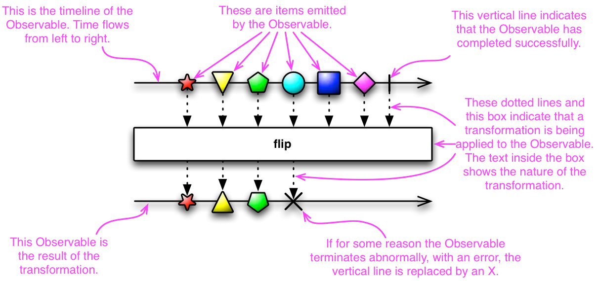
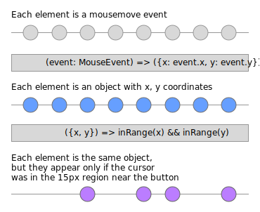

# Кликни меня! на RxJS

На прошлых выходных мне надо было поковырять RxJS, и я попробовал написать игру с кнопкой, которая убегает из-под курсора. В этом посте расскажу, что и как именно я использовал при написании и разберу по шагам процесс.

Если вы уже работали с этой технологией, скорее всего, ничего нового не узнаете. Пост ориентирован на таких как я — которым из RxJS знаком только JS.

Игру будем писать на [Тайпскрипте](https://www.typescriptlang.org). Отличий от обычного JS будет немного, но всё же стоит глянуть документацию по нему, чтобы знать, как объявляются типы переменных и возвращаемых из функции значений.

## Почему Тайпскрипт

Мне давно хотелось его распробовать, а RxJS написан как раз на нём. Я подумал, почему бы не добавить себе ограничений и головной боли, ну и вот ¯\\\_(ツ)\_/¯

## Что такое RxJS

[RxJS](https://rxjs-dev.firebaseapp.com) — это имплементация ReactiveX для JS. ReactiveX в свою очередь, если верить [главной их сайта](http://reactivex.io/), — это API для асинхронной работы с наблюдаемыми потоками. Я тож не сразу въехал, будем разбираться по порядку.

Если выражаться примитивно, _поток_ — это последовательность чего-то: событий, данных, преобразований и т.д. Представьте себе чатик, в котором вы с кем-то переписываетесь. Последовательность сообщений в нём — это и есть поток.

_Поток наблюдаемый_, если мы можем на него подписаться — объявить функцию, которая будет обрабатывать каждый новый элемент. Чатик — это наблюдаемый поток, если мы сидим и читаем каждое новое сообщение.

Польза потоков в том, что они дают возможность не обрабатывать, например, события по одному, а объединить их и работать сразу с набором событий.

## Наблюдатель и наблюдаемый

ReactiveX в основе использует [шаблон «Наблюдатель»](https://en.wikipedia.org/wiki/Observer_pattern). Два основных понятия, которые нам понадобятся — это _observer_ (наблюдатель) и _observable_ (наблюдаемый).

_Наблюдаемым_ будет поток: он отправляет элементы из какого-то источника по одному за раз. Это можно представить как ручей, по которому плывут кораблики-элементы.

_Наблюдатель_ — это объект, который знает, что с элементами из потока надо делать и как их обработать. Это можно представить как ребёнка, который хочет кораблики собрать и унести домой.

Наблюдатель связан с наблюдаемым через подписку _(subscribe)_ — функцию, которая передаёт элементы от наблюдаемого наблюдателю. Это похоже на сетку, которая ловит проплывающие кораблики. Когда новый кораблик попадает в сетку, ребёнок его замечает и может забрать себе.

Наблюдаемый поток знает, как сообщить:

- что появился новый элемент;
- произошла ошибка;
- элементы закончились.

На всё это наблюдатель может как-то реагировать.

## Диаграммы

Чтобы понять концепцию потоков лучше, документация к RxJS [предлагает](http://reactivex.io/documentation/observable.html) так называемые _marble diagrams_. На них изображены шарики, которые как бы нанизаны на нитку.



Эти шарики — это элементы в потоке. Нитка — это линия времени, направленная слева направо. Если элемент стоит левее, значит он появился раньше.

(Было бы конечно круче это всё показывать анимацией: ну типа элементы один за другим падают вниз, проходят преобразование, падают дальше.)

## Применимо к игре

Чтобы написать игру, надо определить, какие события мы собираемся обрабатывать и что мы с ними хотим делать.

Мы будем отслеживать движение мыши и проверять, где находится курсор. Если он находится в пределах 15 пикселей от кнопки, то будем перерисовывать кнопку.


Если чуть ближе к коду, то у нас будет поток из событий перемещения мыши. Мы их будем чистить и оставлять только координаты `{x, y}`. Затем будем фильтровать координаты, проверяя находится ли курсор достаточно близко от кнопки:



## Начинаем пилить

В RxJS поток можно сделать из чего угодно: из массива, промиса, событий в браузере. Например, из массива его можно сделать с помощью оператора [`from`](https://www.learnrxjs.io/learn-rxjs/operators/creation/from):

```ts
import { from } from 'rxjs';

// выталкивает по одному элементу из массива, пока они не закончатся
const arraySource = from([1, 2, 3, 4, 5]);
```

Источником для нашего потока будет событие движения мыши по экрану. Чтобы создать источник из браузерного события, мы будем использовать [`fromEvent`](https://www.learnrxjs.io/learn-rxjs/operators/creation/fromevent):

```ts
import { fromEvent } from 'rxjs/observable/fromEvent';

const source = fromEvent(document, 'mousemove');
```

Теперь браузерное событие `mousemove` будет отслеживаться в пределах `document`, и на каждое перемещение будет появляться новый элемент в `source`.

Эти элементы мы будем преобразовывать и фильтровать. После каждого преобразования мы будем получать новый `observable` с элементами, с которыми опять сможем как-то взаимодействовать.

## Операторы

Операторы — это функции, которыми можно преобразовывать элементы после того, как `observable` их отправил.

Чтобы применить несколько преобразований по очереди, нам потребуется `pipe`. Это метод, который занимается композицией операторов, то есть применяет их по порядку.

```ts
import {map, filter} from 'rxjs/operators'

// ...

const observable = source.pipe(
  map(...),
  filter(...)
)
```

[Оператор `map`](https://www.learnrxjs.io/learn-rxjs/operators/transformation/map) нам нужен, чтобы применить к каждому элементу какую-то функцию.

Мы хотим извлечь из данных о каждом событии координаты мыши на экране. Поэтому в `map` мы передадим функцию, которая будет доставать эти данные и возвращать объект.

```ts
map((event: MouseEvent): MouseCoords => ({ x: event.x, y: event.y }));
```

`MouseCoords` — это тип данных, который мы создадим для работы с координатами. Он будет представлять из себя объект с полями `{x, y}`. Создавать новый тип необязательно, но так понятнее, с чем мы работаем.

```ts
type MouseCoords = {
	x: number;
	y: number;
};

// ...

map((event: MouseEvent): MouseCoords => ({ x: event.x, y: event.y }));
```

[Оператор `filter`](https://www.learnrxjs.io/learn-rxjs/operators/filtering/filter) будет выбирать события, которые нам подходят.

Событие нам подходит, если курсор находится в пределах 15 пикселей от кнопки по обеим осям.

```ts
const shouldUpdateApp = ({ x, y }: MouseCoords): boolean => {
	const { top, left, widthRange, heightRange } = state.get();
	const padding = 15;

	return (
		inRange(x, left - padding, widthRange + padding) &&
		inRange(y, top - padding, heightRange + padding)
	);
};

// ...

filter(shouldUpdateApp);
```

И тогда код `observable` будет выглядеть так:

```ts
const source = fromEvent(document, 'mousemove');

const observable = source.pipe(
	map((event: MouseEvent): MouseCoords => ({ x: event.x, y: event.y })),
	filter(shouldUpdateApp)
);
```

## Подписка на события

Каждый элемент в потоке стремится попасть в [`subscribe`](http://reactivex.io/documentation/operators/subscribe.html), где он будет как-то обработан.

Метод `subscribe` принимает три функции-аргумента. Первая функция обрабатывает новые элементы, вторая — ошибку, если она возникнет, третья — окончание потока:

```ts
observable.subscribe(
	// onNext, вызывается при появлении новых элементов, el — новый элемент
	(el) => {},

	// onError, вызывается, если произошла ошибка, er — объект ошибки
	(er) => {},

	// onCompleted, вызывается, когда поток завершён
	() => {}
);
```

При появлении нового элемента мы будем вызывать функцию `updateApp`, которая будет генерировать случайные координаты для кнопки, обновлять состояние приложения и перерисовывать кнопку:

```ts
observable.subscribe(() => updateApp());

const updateApp = () => {
	const { left, top } = getNewPosition();
	state.update({ left, top });

	applyStyle(button, {
		left: `${left}px`,
		top: `${top}px`
	});
};
```

## Результаты

Я не буду подробно останавливаться на классе, который управляет состоянием приложения, и функциях-хелперах. Исходный код всего-всего можно [посмотреть на Гитхабе](https://github.com/bespoyasov/clickme).

[Сама игрушка](https://bespoyasov.ru/clickme/) получилась очень простой, хотя для знакомства с RxJS вполне ок.

Конечно, там ещё куча всякого, о чём я не рассказал: создание потоков из промисов, `Subject`, `Scheduler`, куча операторов, работу которых иногда без [специального сервиса](http://rxmarbles.com) не разберёшь. Но для начала — сойдёт.

## Ссылки

Сделяль

- [сама игрушка](https://bespoyasov.ru/clickme/)
- [исходники](https://github.com/bespoyasov/clickme)

Шаблон «Наблюдатель» и FRP

- [в Википедии](https://en.wikipedia.org/wiki/Observer_pattern)
- [на Гитхабе](https://github.com/kamranahmedse/design-patterns-for-humans#-observer)
- [The introduction to Reactive Programming you've been missing](https://gist.github.com/staltz/868e7e9bc2a7b8c1f754)
- [RxJS in 5 minutes!](https://medium.com/@mohandere/rxjs-5-in-5-minutes-1c3b4ed0d8cc)

Документация RxJS

- [`Observable`](http://reactivex.io/intro.html)
- [`fromEvent`](https://www.learnrxjs.io/learn-rxjs/operators/creation/fromevent)

Операторы

- [введение](http://reactivex.io/documentation/operators.html)
- [`map`](https://www.learnrxjs.io/learn-rxjs/operators/transformation/map)
- [`filter`](https://www.learnrxjs.io/learn-rxjs/operators/filtering/filter)

Книги и сервисы

- [Angular и TypeScript. Сайтостроение для профессионалов](https://books.google.it/books?id=d9VMDwAAQBAJ)
- [RxMarbles](http://rxmarbles.com)
