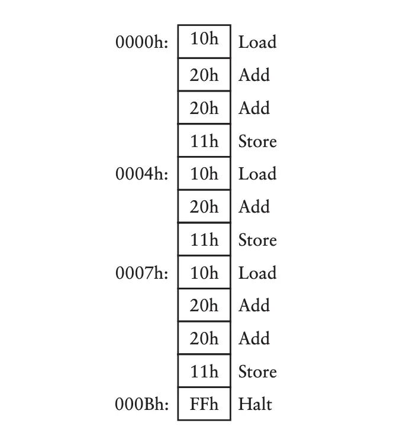
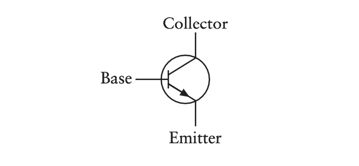
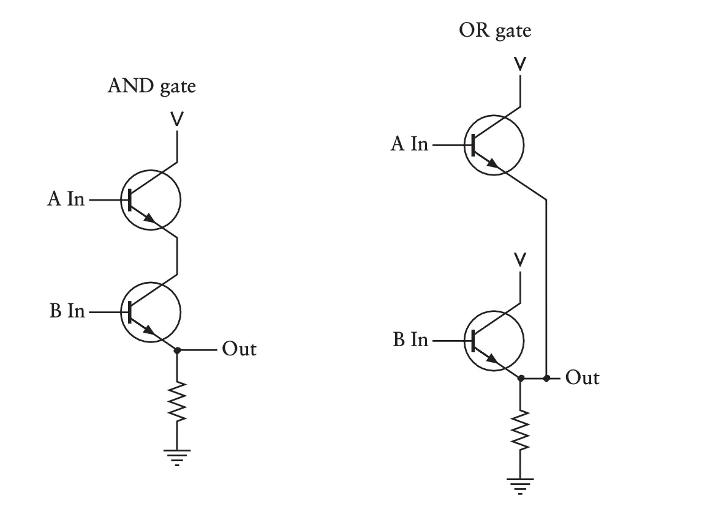
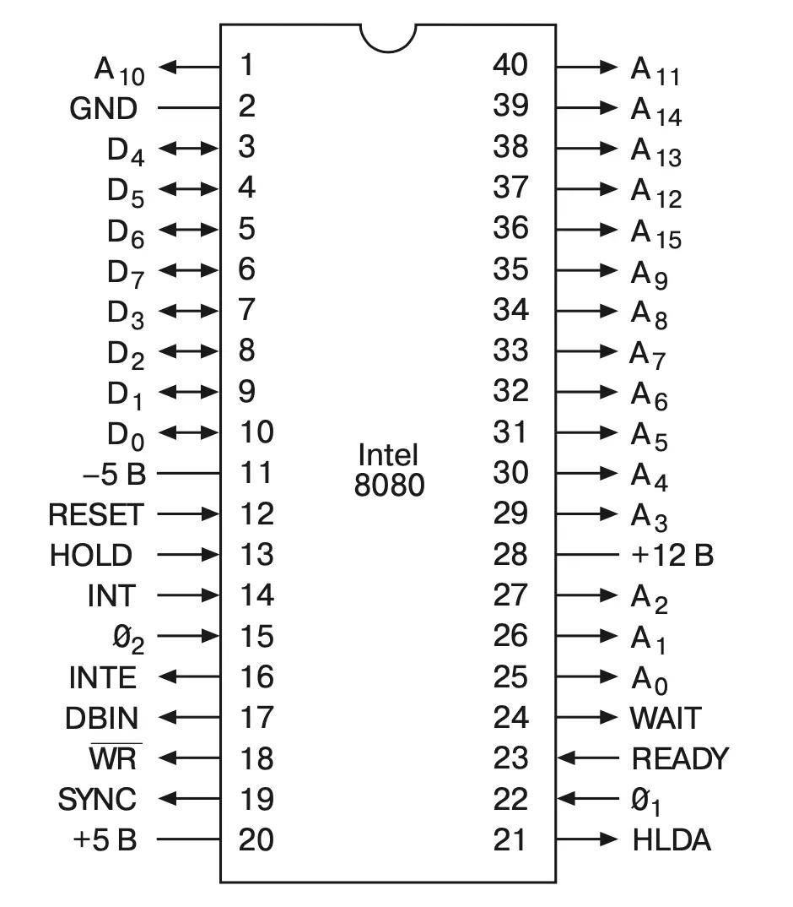

# Code. Part 2

In the [first part](/blog/code-the-hidden-language-of-computer-hardware-and-software/) we've read chapters 1–14. We learned how to build electrical and logic circuits with light bulbs. At the end of the first part, we built a circuit based on them that counted from 0 to 256.

This time we will read the remaining chapters 15-25. By the end we will assemble the first memory that can store information and then connect it to an adder. We will build the first processor, from which we will make a primitive computer with input and output.

## Chapter 15. Bytes and Hex

A byte is 8 bit. It values range from 00000000 to 11111111, 256 (2<sup>8</sup>) options. Values are long, so instead of binary we can use hexadecimal to write them:

> 0, 1, 2, 3, 4, 5, 6, 7, 8, 9, A, B, C, D, E, F, 10, 11, 12, …

So then 10110110<sub>2</sub> = B6<sub>16</sub>.

## Chapter 16. An Assemblage of Memory

Paper is a basic external memory for people:

> We _write_ and we later _read_. We _save_ and we later _retrieve_. We _store_ and we later _access_

D-trigger from the previous chapters, the latch is a 1-bit memory. We can rename the output _Q_ “data output” and the input _Clk_ “write”. From 8 such latches, plus a 3-to-8 decoder and an 8-to-1 selector, we get _random access memory (RAM)_:


_Random access_ means that you can read value from any of the eight latches or write to them simply by changing the Address inputs.

When connecting two _RAM_ 8×1 in parallel we get a _RAM_ 8×2. When connected with a 2-to-1 selector and a 1-to-2 decoder (as two separate “latches” inside) you get a _RAM_ 16×1.

> Number of values in _RAM_ array = 2<sup>Number of Address inputs</sup>

Random access memory is called volatile memory because...

> It re- quires a constant supply of electricity to retain its contents

## Chapter 17. Automation

Let's finally build the computer™. Let's assume that by latches we always mean edge-triggering latches (when _Clk_ goes from 0 to 1).

Let's connect the memory _RAM_ to an adder with accumulation.


Suppose we need to find three sums. Let's represent in memory the values and the addresses of the values:


For addition the adder must now:

> ...Transfer [load] a byte from memory into the accumulator....Add a byte in memory to the contents of the accumulator....Take a sum in the accumulator and Store it in memory. ...Halt the automated adder

For the array in the figure above:

> - Load the value at address 0000h into the accumulator.
> - Add the value at address 0001h to the accumulator.
> - Add the value at address 0002h to the accumulator.
> - Store the contents of the accumulator at address 0003h.
> - Load the value at address 0004h into the accumulator.
> - Add the value at address 0005h to the accumulator.
> - Store the contents of the accumulator at address 0006h.
> - Load the value at address 0007h into the accumulator.
> - Add the value at address 0008h to the accumulator.
> - Add the value at address 0009h to the accumulator.
> - Store the contents of the accumulator at address 000Ah.
> - Halt the workings of the automated adder

To achieve this, we will accompany each number in memory with a code of the desired action. This will be done by a separate array _RAM_ (“codes”), in which we will write the necessary actions:



“Data” and “codes” can be combined into one array, but to make it easier to work with command addresses, it is worth adding the “Jump” command, which will point to the address of the next command to run.

Also we add _zero flag_. Its output is 1 only if all its inputs are 0. With it, we can add other 4 operations:

| Operation            | Code | Mnemonic |
| -------------------- | ---- | -------- |
| Load                 | 10h  | LOD      |
| Store                | 11h  | STO      |
| Add                  | 20h  | ADD      |
| Subtract             | 21h  | SUB      |
| Add with Carry       | 22h  | ADC      |
| Subtract with Borrow | 23h  | SBB      |
| Jump                 | 30h  | JMP      |
| Jump if Zero         | 31h  | JZ       |
| Jump if Carry        | 32h  | JC       |
| Jump if Not Zero     | 33h  | JNZ      |
| Jump if Not Carry    | 34h  | JNC      |
| Halt                 | FFh  | HLT      |

These commands are enough to multiply two numbers by each other:


To carry out these operations, you will need a circuit:


> ...Controllable _cyclic_ procedures distinguish a computer from a calculator

In the circuit above, the memory is a 64 KB _RAM_ array. The input and output are switches and lights on the memory control panel. Everything else is an 8-bit _processor (central processing unit, CPU)_.

We can write commands using mnemonics, like this:

```
LOD A, [1003h]
(1) Load;
(2) Where to A: to accumulator;
(3) Where from [1003h]: from address 1003h.

STO [1003h], A
(1) Store;
(2) Where to: by address 1003h;
(3) Where from: from accumulator.

JNZ 0000h
(1) Jump, if not Zero;
(2) Where to: to operation by address 0000h.

1000h: 00h, A7h
(!) Data: first and second bytes.
```

So then...

> It’s better not to use actual numeric addresses when writing code because they can change. It’s better to use labels to refer to locations in memory

If we add labels, we get “assembler”. Here is a program for multiplying numbers:

```
BEGIN:  LOD A, [RESULT + 1]
        ADD A, [NUM1 + 1]
        STO [RESULT + 1], A

        LOD A, [RESULT]
        ADC A, [NUM1]
        STO [RESULT], A

        LOD A, [NUM2 + 1]
        ADD A, [NEG1]
        STO [NUM2 + 1], A

        JNZ BEGIN

NEG1:   HLT

NUM1:   00h, A7h
NUM2:   00h, 1Ch
RESULT: 00h, 00h
```

## Chapter 18. From Abaci to Chips

Relays were not suitable for building computers. As mechanical devices whose action was based on bending a metal plate, after prolonged operation they broke down. In the twentieth century they were replaced by radio tubes.

The computer we built earlier is a typical example of a von Neumann architecture. Its disadvantage is the long loading from memory.

In 1947, the semiconductor transistor appeared. Semiconductors are elements whose conductivity can be controlled (for example, silicon). If a semiconductor has excess electrons, it is an n-type semiconductor; in the opposite case, it is a p-type one.

A transistor consists of semiconductor elements: collector, base and emitter.



The transistors are suitable for building logic gates:



> [Voltage in] between 0 and 0.8 volt [stands] for a logical 0 and between 2 and 5 volts for a logical 1. This is how TTL is insulated against noise

Propagation time is the time it takes for a change in the inputs to be reflected in the output, measures in nanoseconds.

A quartz crystal is used for the oscillator, the frequency of their oscillation is more than a million per second, this affects the speed.

## Chapter 19. Two Classic Microprocessors

In this chapter the author describes in detail how the _Intel 8080_ and _Motorolla 6800_ processors work. I will give here only an abbreviated description of the 8080.

Let's start with the circuit:



-5V, 5V and +12V is the power supply with voltage of -5, 5 and +12 volts, _GND_ is the ground. The direction of the arrows on the other pins indicates the direction of the signal, some pins work in both directions.

Slashed zeros are syncing signals. A<sub>0</sub> to A<sub>15</sub> is the memory addresses. D<sub>0</sub> to D<sub>7</sub> data slots. Everything else is controlling signals.

The 8080 processor has 244 commands.

```
32 STA (Store to accumulator)
3A LDA (Load from accumulator)
```

Except for the accumulator, there are 6 registers B, C, D, E, H, L. (H and L stand for _High_ and _Low_.) 8-bit values in _HL_ registers are considered as a 16-bit pair, where second byte is stored in H, and the first on is in L. Registers allow to avoid constant memory access which makes the process faster.

63 codes for moving operations _MOV_ from one register to another.

```
40 MOV B, B
41 MOV B, C (From C to B)
…
5E MOV E, [HL] (From HL to E)
5F MOV E, A
60  MOV H, B
…
68  MOV L, B
…
70  MOV [HL], B
…
76  HLT
…
7F  MOV A, A
```

_MVI_ moves the data byte directly to the register or memory cell whose address is written in _HL_.

For arithmetic operations there are 32 commands. Addition _(ADD)_, addition with carry _(ADC)_, subtraction _(SUB)_, subtraction with borrowing _(SBB)_.

```
80  ADD A, B
…
88  ADC A, B
…
90 SUB A, B
…
98 SBB A, B
…
9F SBB A, A
```

There are also commands for logic operations. _AND_, _OR_, and _XOR_ are executed bitwise. _CMP_ is compare operation:

```
A0 AND A, B
…
A8 XOR A, B
…
B0 OR A, B
…
B8 CMP A, B
…
BF CMP A, A
```

_CMA_ adds the contents of the accumulator to 1. _DAA_ is for arithmetic operations with decimal numbers in _BCD (Binary-coded decimal)_. When a number is in _BCD_ this means it should be read “literally”. For example _27h_ in _BCD_ is 27 and not 39.

Commands to increase and decrease the value of registers, accumulator or memory cell by 1: _INR_, _DCR_. 4 commands for cyclic shift: _RLC_, _RRC_, _RAL_, _RAR_. Commands for working with the stack: _PUSH_, _POP_.

_CALL_ and _RET_ are the commands for creating subprogramms. _CALL_ writes to the stack the address of the command next to _CALL_, and the jump to the start of the subprogramm with _Multiply_ label. When it's done, the _RET_ command is executed. As a result the execution goes to the beginning of the stack.

Commands _IN_ and _OUT_ are for communication with the peripherals.

## Chapter 20. ASCII and a Cast of Characters

[American Standard Code for Information Interchange, ASCII](https://en.wikipedia.org/wiki/ASCII) is a 7-bit text encoding. Its code values are in range from _00h_ to _7Fh_. For storing each character, it uses 8 bits.

The _ASCII_ contains punctuation marks, numbers, uppercase and lowercase letters and control characters. Codes of lowercase letters differ from corresponding uppercase letters by _20h_, which makes it relatively easy to convert lowercase to uppercase and vice versa.

In order to encode something other than Latin, _Unicode_ appeared. In it the characters take 2 bytes each, the first 128 characters are the same as _ASCII_.

## Chapter 21. Get on the Bus

The integral circuits that make up a computer are mounted on boards. The boards communicate with each other via a bus. The signals on this bus are divided into 4 categories:

- _Addressable_, for addressing RAM or referring to other devices.
- _Data output_, for transferring data into memory and to other devices.
- _Data input_, generated by various computer devices and fed to the microprocessor.
- _Controls_, generated by both the microprocessor and other devices that need to communicate something to the processor.

> A bus in general use can become a standard

> Busses need to be upgraded or replaced when microprocessors outgrow them, either in data width or in the number of address signals they output

There's also a story in this chapter about floppy disks and the cathode ray tube! 😃

> The beam begins in the upper left corner and moves across the screen to the right, whereupon it zips back to the left to begin the second line

> When the beam finishes the bottom line, it zips from the lower right corner of the screen to the upper left corner and the process begins again

To display text on the screen, the _ASCII_ characters must be displayed as black and white pixels on the screen. The character generator translates the 7-bit _ASCII_ code into a 64-bit code that determines the appearance of the character:


To color a pixel, you have to increase the number of bits allocated to it:

> Number of Colors = 2<sup>Number of bits per pixel</sup>

## Chapter 22. The Operating System

Our computer now is missing two things:

- Software;
- And a keyboard.

For the keyboard we need a special program—a keyboard handler, as well as a command processor.

In addition, we need a ROM—a permanent memory device, so that the entered information is not lost after power failure. A hard disk can be used as a ROM.

> ...You’ll have to keep track of what you’re storing where. ...You can’t just store some code located at one address and then later load it back into memory at another address and expect it to work

> ...The manual clerical work involved in keeping track of where everything is stored on the disk is just too much. At this point, you’re ready for a file system

_File system_ is the information organization when it is divided into files. A _file_ is a set of data with a common meaning, written in one or more sectors.

Fun fact about file names in and extension size of 3 characters:

> Under CP/M, each file is identified with a two-part name. The first part is known as the filename and can have up to eight characters... the second part is known as the file type nd can have up to three characters stored in bytes 9 through 11

To start the operating system, it must be overwritten from disk into memory—boot. At the end of the boot, the OS is completely placed in memory, occupying its high addresses.

Application programs (applications) don't need to worry about tracks and sectors on disk when the OS is _application programming interface, API_.

_API_ is hardware independent. That is, when writing programs for _CP/M_ we don't need to know how the keyboard, monitor and disk work on a particular computer.

## Chapter 23. Fixed Point, Floating Point

We are used to thinking of a continuous series of numbers, but computers work with discrete quantities.

To write a fraction, we can use a fixed point - assign a specific number of bits to decimal numbers. In this case, the decimal separator is always in a certain place in the number.

> Fixed-point format works well only if you know that numbers aren’t going to get too large for the memory location that you’ve mapped out and that you won’t need more decimal places

Otherwise, for such numbers would have to reserve too much space in memory. To write numbers that can be both very large and very small a floating point is used.

Floating point numbers use scientific notation of numbers with significant part and order. But since we are working with binary numbers, the order will also indicate the degree of 2, not 10.

In normalized form, there is always one to the left of the separator:

> 1.01 × 2<sup>2</sup><br />
> 1.101 × 2<sup>2</sup>

Most computers use the [_IEEE Standard for Binary Floating-Point Arithmetic_](https://en.wikipedia.org/wiki/IEEE_754-1985). There are two formats: simple precision (_single precision_, 4 bytes per number) and double precision (_double precision_, 8 bytes per number).

Fixed-point numbers are easy to determine by their appearance: the number of digits after the decimal point is the same accuracy. In the case of a floating-point...

> Depending on the value of the exponent, sometimes a floating-point number can be accurate to a tiny fraction of a penny, and sometimes it’s not even accurate to the nearest dollar

> If you were writing a program for a bank, and you were using single-precision floating-point arithmetic to store dollars and cents, you probably would be deeply disturbed to discover that $262,144.00 is the same as $262,144.01. Both these numbers are 1.00000000000000000000000 × 2<sup>18</sup>

## Chapter 24. Languages High and Low

So...

> Programming in machine code is like eating with a toothpick

The first thing to do is to automate the translation from mnemonic commands (_MOV_, _MVI_, etc.) into real command codes. This is done by assemblers.

> A new assembler has to be developed each time a new processor is introduced

Assembler programs have two disadvantages:

- They are painstaking to write;
- They are not portable: you cannot write an assembler for one processor and use it with another.

An assembler language is considered a low-level language because it communicates directly with the computer hardware. High-level languages don't do this.

A high-level language needs a syntax and a compiler or interpreter to work. The former is a set of rules for constructing expressions; the latter is a program that converts code into machine codes.

Later in this chapter there are some examples of Algol and BASIC programming, I won't give them here, but it's interesting to read them for fun.

## Chapter 25. The Graphical Revolution

To get a color on the CRT screen, you have to use not one, but three electron guns, one for each of the primary colors—red, green, blue.

The color coding table for the display adapter can be as follows:

| Bits | Color   |
| ---- | ------- |
| 000  | Black   |
| 001  | Blue    |
| 010  | Green   |
| 011  | Cyan    |
| 100  | Red     |
| 101  | Magenta |
| 110  | Yellow  |
| 111  | White   |

The number of available colors is expressed like this:

> Number of Colors = 2<sup>Number of bits per pixel</sup>

To work with sound, you need converters:

- _DAC, digital-to-analog_, to convert an electrical signal into sound;
- _ADC, analog-to-digital_, to convert sound to an electrical signal.

> The voltage of the sound wave is converted to numbers at a constant rate, known as the sampling rate

## Conclusion

“It all makes sense now”—that's what I would call the feeling I got after reading this book for the first time 😃

Everything written here I went through in school and university. This knowledge was there, but it wasn't... interconnected in my head. There was no strong confidence in how things actually worked, it was hard to move from one level of abstraction to another. Now everything is finally <nobr>different :-)</nobr>

## Resources

- [Code by Charles Petzold](https://www.goodreads.com/book/show/44882.Code)
- [First Part of the Summary](/blog/code-the-hidden-language-of-computer-hardware-and-software/)
- [American Standard Code for Information Interchange](https://en.wikipedia.org/wiki/ASCII)
- [Standard 754 Floating Point Numbers](https://en.wikipedia.org/wiki/IEEE_754-1985)
