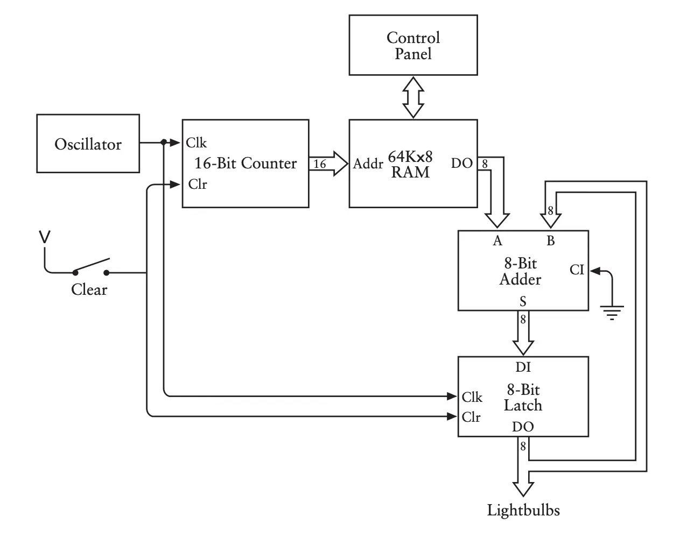
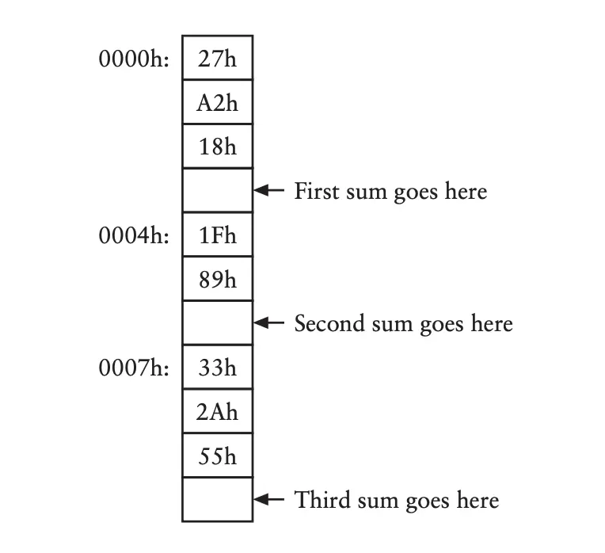
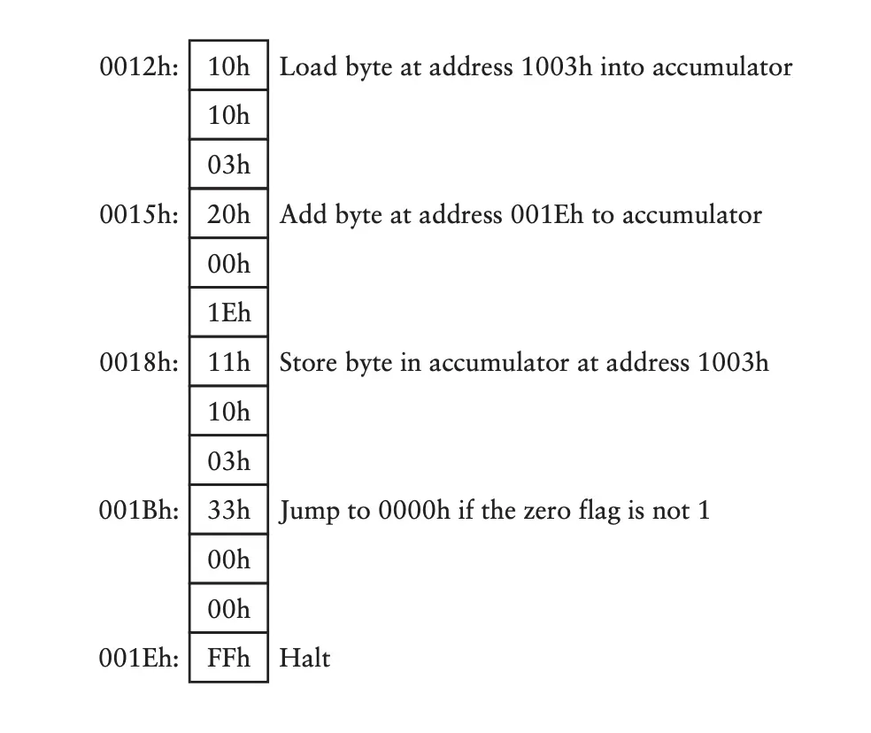
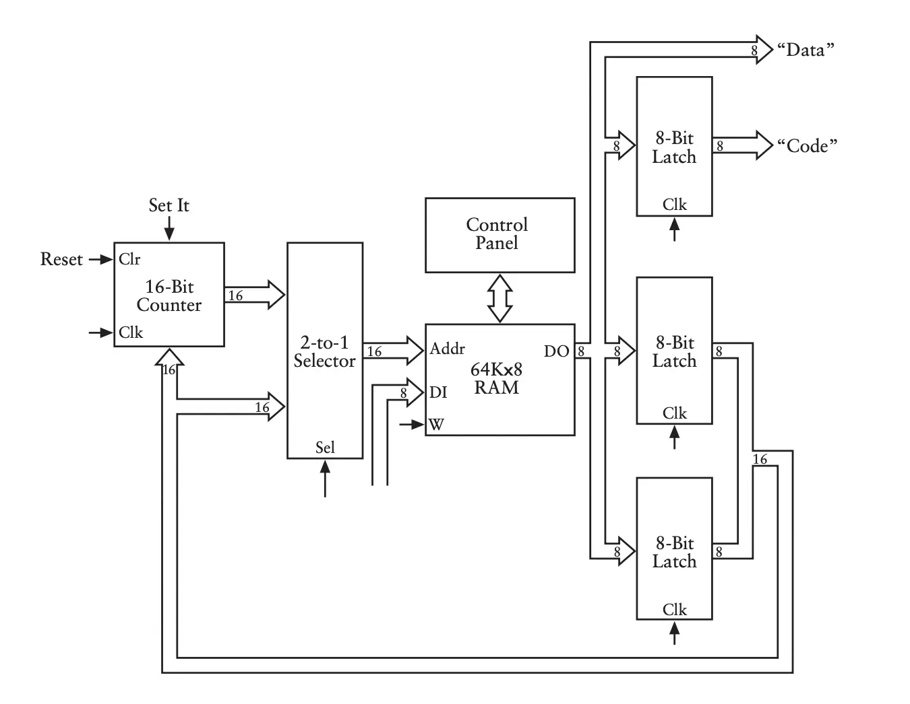
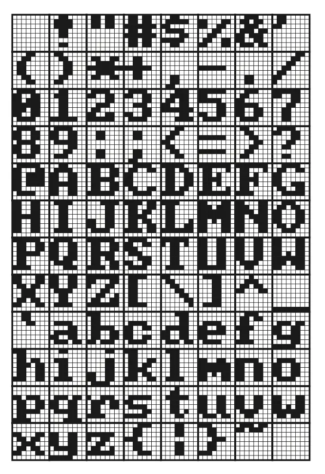

# Код. Тайный язык информатики. Часть 2

В [первой части конспекта](/blog/code-the-hidden-language-of-computer-hardware-and-software/) мы прочли главы 1–14. Научились строить электрические и логические цепи с лампочками. В конце первой части на их основе мы собрали цепь, которая считала от 0 до 256.

В этот раз мы прочитаем оставшиеся главы 15–25. В них мы соберём первую память, которая сможет хранить информацию, а потом подключим её к сумматору. Создадим первый процессор, на основе которого сделаем примитивный компьютер с вводом и выводом.

## Глава 15. Байты и шестнадцатеричные числа

Байт — это (не открою Америки) 8 бит. Значения: от 00000000 до 11111111, 256 (2<sup>8</sup>) вариантов, значения длинные, поэтому вместо двоичной записи можно использовать шестнадцатиричную.

> 0, 1, 2, 3, 4, 5, 6, 7, 8, 9, A, B, C, D, E, F, 10, 11, 12, …

Тогда, например, 10110110<sub>2</sub> = B6<sub>16</sub>.

## Глава 16. Сборка памяти

Бумага для людей — это основная внешняя память:

> Мы _пишем_, чтобы позже _прочитать_… Мы _сохраняем_ информацию, чтобы позже _использовать_ ее

D-триггер из прошлых глав, защёлка — это память размером в 1 бит. Мы можем переназвать выход _Q_ «выводом данных», а вход _Clk_ «записью». Из 8 таких защёлок, а также дешифратора 3 на 8 и селектора 8 на 1 мы получим _память с произвольным доступом (random access memory, RAM)_:


Произвольный доступ означает, что читать и записывать значения можно в любой защёлке с помощью комбинации входов «Адрес».

При параллельном соединении двух _RAM_ 8×1 получим _RAM_ 8×2. При соединении с помощью селектора 2 на 1 и дешифратора 1 на 2 (как две отдельных «защёлки» внутри) — _RAM_ 16×1.

> Число значений в массиве _RAM_ = 2<sup>Количество входов «Адрес»</sup>

Память с произвольным доступом называют энергозависимой, потому что

> Для хранения информации ей требуется непрерывное энергоснабжение

## Глава 17. Автоматизация

Построим наконец компьютер™. Будем предполагать, что под защёлками всегда имеются в виду защёлки со срабатыванием по фронту (когда _Clk_ переходит из 0 в 1).

Подключим память _RAM_ к сумматору с накоплением суммы.



Допустим, нужно найти три суммы. Представим в памяти слагаемые и адреса значений:



Для сложения сумматор теперь должен:

> …Переписать [загрузить] содержимое ячейки памяти в аккумулятор. …Сложить байт из памяти с содержимым аккумулятора. …Сохранить в памяти сумму из аккумулятора. …Остановить работу сумматора

Для массива из рисунка выше:

> - загрузить значение из ячейки 0000h в аккумулятор;
> - сложить значение из ячейки 0001h с аккумулятором;
> - сложить значение из ячейки 0002h с аккумулятором;
> - сохранить значение из аккумулятора в ячейке 0003h;
> - загрузить значение из ячейки 0004h в аккумулятор;
> - сложить значение из ячейки 0005h с аккумулятором;
> - сохранить значение из аккумулятора в ячейке 0006h;
> - загрузить значение из ячейки 0000h в аккумулятор;
> - сложить значение из ячейки 0001h с аккумулятором;
> - сложить значение из ячейки 0002h с аккумулятором;
> - сохранить значение из аккумулятора в ячейке 0003h;
> - остановить работу

Чтобы этого добиться, каждое число в памяти сопроводим кодом нужного действия. Этим будет заниматься отдельный массив _RAM_ («коды»), в который мы запишем нужные действия:


«Данные» и «коды» можно объединить в один массив, но чтобы было удобнее работать с адресами команд, стоит добавить команду «Перейти», которая укажет на адрес следующей команды для выполнения.

Также добавим _флаг нуля (zero flag)_, выход которого равен 1, лишь если всего его входы равны нулям. С ним мы можем добавить ещё 4 команды. Итого сейчас есть коды команд:

| Операция                 | Код | Мнемоника |
| ------------------------ | --- | --------- |
| Загрузить                | 10h | LOD       |
| Сохранить                | 11h | STO       |
| Сложить                  | 20h | ADD       |
| Вычесть                  | 21h | SUB       |
| Сложить с переносом      | 22h | ADC       |
| Вычесть с заимствованием | 23h | SBB       |
| Перейти                  | 30h | JMP       |
| Перейти, если 0          | 31h | JZ        |
| Перейти, если перенос    | 32h | JC        |
| Перейти, если не 0       | 33h | JNZ       |
| Перейти, если не перенос | 34h | JNC       |
| Остановить               | FFh | HLT       |

Этих команд хватит, чтобы перемножить два числа друг на друга:



Чтобы провести эти операции, потребуется схема:



> возможность управляемых _циклических_ процедур отличает компьютер от калькулятора

В схеме выше память — это 64-килобайтовый массив _RAM_. Ввод и вывод — переключатели и лампочки на пульте управления памятью. Всё остальное — 8-разрядный _процессор (central processing unit, CPU)_.

С помощью мнемоник, команды можно записывать в виде:

```
LOD A, [1003h]
(1) Загрузить;
(2) Куда A — в аккумулятор;
(3) Откуда [1003h] — из ячейки 1003h.

STO [1003h], A
(1) Сохранить;
(2) Куда — по адресу 1003h;
(3) Откуда — из аккумулятора.

JNZ 0000h
(1) Перейти, если флажок нуля не равен 1;
(2) Куда — к команде по адресу 0000h.

1000h: 00h, A7h
(!) Данные: младший и старший байты.
```

Далее, так как:

> При написании кодов численные значения адресов лучше не использовать, так как они могут измениться… Для обозначения ячеек памяти предпочтительнее пользоваться метками (labels)

Добавим метки, получим «ассемблер». Вот программа для умножения чисел:

```
BEGIN:  LOD A, [RESULT + 1]
        ADD A, [NUM1 + 1]
        STO [RESULT + 1], A

        LOD A, [RESULT]
        ADC A, [NUM1]
        STO [RESULT], A

        LOD A, [NUM2 + 1]
        ADD A, [NEG1]
        STO [NUM2 + 1], A

        JNZ BEGIN

NEG1:   HLT

NUM1:   00h, A7h
NUM2:   00h, 1Ch
RESULT: 00h, 00h
```

## Глава 18. От счетов к микросхемам

Реле для создания компьютеров не подходят, и в XX веке их заменили радиолампы:

> Будучи механическими устройствами, действие которых основывалось на изгибании металлической пластины, после продолжительной работы они в самом прямом смысле слова ломались

Компьютер, который мы собрали ранее, — типичный пример архитектуры фон Неймана. Её недостаток в долгой загрузке из памяти.

В 1947 году появился полупроводниковый транзистор. Полупроводники — это элементы, проводимостью которых можно управлять (например, кремний). Если в полупроводнике есть избыточные электроны, это полупроводник n-типа, в обратном случае — p-типа.

Транзистор состоит из полупроводниковых элементов: коллектора, базы и эмиттера.


Транзисторы подходят для сборки логических вентилей:


В интегральных микросхемах умещаются сразу логические схемы. Например, в «счетверенной двухвходовой положительной схеме _NAND»_ было 4 вентиля _NAND_:


> Напряжения в диапазоне 0–0,8 В считаются логическим нулем, а напряжения от 2 до 5 В — логической единицей. …Так микросхемы защищаются от шума

Время установки — между изменением сигнала на входе и на выходе — измеряется в наносекундах.

Для осциллятора используется кварцевый кристалл, частота их колебаний более миллиона в секунду, это влияет на быстродействие.

## Глава 19. Два классических микропроцессора

В этой главе автор в подробностях описывает принцип работы процессоров _Intel 8080_ и _Motorolla 6800_. Я приведу здесь лишь сокращённое описание 8080, там самая мякотка.

Начнём со схемы:


-5В, 5В и +12В — это питание с напряжением соответственно -5, 5 и +12 вольт, _GND_ — земля. Направление стрелок на других выводах указывает направление сигнала, некоторые выводы работают в обе стороны.

Зачёркнутые нули — это синхронизирующие сигналы. От A<sub>0</sub> до A<sub>15</sub> — адресация памяти. С D<sub>0</sub> до D<sub>7</sub> — для данных. Остальное — управляющие сигналы.

У 8080 процессора 244 команды <del>«как же я люблю их, вот они»</del>.

```
32 STA (сохранить из аккумулятора)
3A LDA (загрузить в аккумулятор)
```

Кроме аккумулятора есть 6 регистров B, C, D, E, H, L. H и L — это _High_ и _Low_. 8-битовый значения в регистрах _HL_ рассматриваются как 16-битовая пара, где старший байт хранится в H, а младший в L. Регистры позволяют не обращаться постоянно к памяти, что ускоряет работу.

63 кода отведено под команд _MOV_ — для перемещения содержимого из одного регистра в другой.

```
40 MOV B, B
41 MOV B, C (Из регистра C в B)
…
5E MOV E, [HL] (Из HL в E)
5F MOV E, A
60  MOV H, B
…
68  MOV L, B
…
70  MOV [HL], B
…
76  HLT
…
7F  MOV A, A
```

_MVI_ — перемещает непосредственно байт данных в регистр или ячейку памяти, адрес которой записан в _HL_.

Для арифметических действий есть 32 команды. Сложение _(ADD)_, сложение с переносом _(ADC)_, вычитание _(SUB)_, вычитание с заимствованием _(SBB)_.

```
80  ADD A, B
…
88  ADC A, B
…
90 SUB A, B
…
98 SBB A, B
…
9F SBB A, A
```

Есть также команды для логических операций. _AND_, _OR_ и _XOR_ выполняются побитово. _CMP_ — сравнение:

```
A0 AND A, B
…
A8 XOR A, B
…
B0 OR A, B
…
B8 CMP A, B
…
BF CMP A, A
```

_CMA_ — дополняет содержимое аккумулятора до 1. _DAA_ — для арифметических операций с десятичными числами в _BCD (Binary-coded decimal)_. _BCD_ — это когда _27h_ значит 27 в десятичной, а не 39.

Команды для увеличения и уменьшения значения регистров, аккумулятора или ячейки памяти на 1: _INR_, _DCR_. 4 команды для циклического сдвига: _RLC_, _RRC_, _RAL_, _RAR_. Команды для работы со стеком: _PUSH_, POP\_.

_CALL_ и _RET_ — команды для создания подпрограмм. Команда _CALL_ записывает в стек адрес команды, стоящей следом за командой _CALL_, а потом происходит переход в начало подпрограммы с меткой _Multiply_. По завершении выполняется команда _RET_, в результате чего в программный счетчик возвращается значение из стека.

(Кстати, именно в этой книге я-таки наконец полностью понял, что такое «стек вызова» и почему именно _return_ стоит в конце функции.)

Команды _IN_ и _OUT_ — для общения с периферией.

## Глава 20. ASCII — символы нашего времени

[Американский стандартный код для обмена информацией](https://ru.wikipedia.org/wiki/ASCII) _(American Standard Code for Information Interchange, ASCII)_ — 7-битовая (технически) текстовая кодировка. Её коды принимают значения от _00h_ до _7Fh_. Для хранения отдельных символов отводится 8 битов.

В _ASCII_ содержатся знаки препинания, цифры, прописные и строчные буквы и управляющие символы. я отдельных символов отводится 8 битов. Коды строчных букв отличаются от соответствующих прописных на _20h_, это позволяет относительно просто переводить строчные в прописные и обратно.

Для того, чтобы закодировать что-то кроме латиницы, появился _Unicode_. В ней символы занимают по 2 байта, первые 128 символов совпадают с _ASCII_.

## Глава 21. Под шорох шин

Интегральные схемы, из которых состоит компьютер, монтируются на платах. Платы обмениваются информацией через шину. Сигналы на ней делятся на 4 категории:

- Адресные — для адресации оперативной памяти или обращения к другим устройствам.
- Вывода данных — для передачи данных в память и на другие устройства.
- Ввода данных — генерируются различными устройствами компьютера и поступают в микропроцессор.
- Управляющие — генерируются как микропроцессором, так и другими устройствами, которым нужно что-то сообщить процессору.

> Шина во всеобщем пользовании может стать стандартом

> Шины приходится модернизировать или заменять, когда микропроцессоры перерастают их либо по разрядности данных, либо по объему адресуемой памяти, либо по быстродействию

Ещё в этой главе есть рассказ о дискетах и катодно-лучевой трубке! 😃

> Луч начинает свое путешествие в верхнем левом углу. Пройдя вправо до конца экрана, он возвращается назад и начинает рисовать следующую строку развертки

> Закончив последнюю строку, луч возвращается из нижнего правого в верхний левый угол экрана

Чтобы вывести текст на экране, надо символы _ASCII_ отобразить в виде чёрных и белых пикселей на экране. Генератор символов переводит 7-битовый код _ASCII_ в 64-битовый код, определяющий внешний вид символа:



Чтобы раскрасить пиксель, надо увеличить количество битов, на него отведённое:

> Количество цветов = 2<sup>Количество битов на пиксель</sup>

## Глава 22. Операционная система

Нашему компьютеру не достаёт двух вещей:

- программного обеспечения (ПО);
- избавиться от пульта управления, которым мы вводили команды в виде двоичных кодов, и добавить клавиатуру.

Для работы клавиатуры нам нужна специальная программа — обработчик клавиатуры, а также командный процессор.

Кроме этого нам потребуется ПЗУ — постоянное запоминающее устройство, чтобы введённая информация не терялась после отключения питания. В качестве ПЗУ можно использовать жёсткий диск.

> Вам придется помнить, что и куда вы сохранили… часть места на диске, вероятно, занята другими данными, сектора с одной и той же программой не обязательно будут следовать друг за другом

> Сидеть перед компьютером и продолжать записывать на бумажке адреса секторов и отмечать, что в них сохранено, — слишком трудоемко. …[Настало время] разработки файловой системы

Файловая система — организация информации, когда она делится на файлы. Файл — набор данных с общим смыслом, записанный в одном или нескольких секторах.

Забавный факт о названиях файлов в и размере расширения в 3 символа:

> Имя файла в CP/M состоит из двух частей. Первая часть — собственно имя файла (filename) длиной до 8 символов… Длина второй — типа файла (file type) — ограничена тремя символами…

Чтобы запустить операционную систему, её нужно переписать с диска в память — загрузить. В конце загрузки ОС полностью размещается в памяти, занимая её старшие адреса.

Прикладным программам (приложениям) не нужно заботиться о дорожках и секторах на диске при наличии ОС — _интерфейса прикладного программирования, API_.

_API_ аппаратно независим. То есть при написании программ для _CP/M_ нам не надо знать, как работают клавиатура, монитор и диск на конкретном компьютере.

## Глава 23. Фиксированная точка, плавающая точка

Мы привыкли думать о непрерывном ряде чисел, но компьютеры работают с дискретными величинами.

Чтобы записать дробь, мы можем использовать фиксированную точку — отвести конкретное количество бит под десятичные числа. В таком случае десятичный разделитель всегда находится в определённом месте числа.

> Формат с фиксированной точкой хорош, если вы знаете, что числа не «перерастут» ту область памяти, которую вы для них отвели

В обратном случае, под такие числа придётся резервировать слишком много места в памяти. Чтобы записывать числа, которые могут быть и очень большими, и очень маленькими используется плавающая точка.

В числах плавающей точкой используется научная нотация чисел со значащей частью и порядком. Но так как мы работаем с двоичными числами, то и порядок будет указывать на степень 2, а не 10.

В нормализованном виде слева от разделителя всегда стоит единица:

> 1.01 × 2<sup>2</sup><br />
> 1.101 × 2<sup>2</sup>

В большей части компьютеров для чисел с плавающей точкой используется стандарт _IEEE_, [Standard 754 Floating Point Numbers](https://en.wikipedia.org/wiki/IEEE_754-1985). В нём есть 2 формата: с простой точностью (_single precision_, 4 байта на число) и двойной точностью (_double precision_, 8 байтов на число).

Точность числа с фиксированной точкой легко определить по внешнему виду: сколько чисел после запятой, такая и точность. С плавающей — ¯\\\_(ツ)\_/¯

> В зависимости от порядка число с плавающей точкой может быть точным до долей пенса или до нескольких тысяч долларов

> …С точки зрения программы 262 144,00 долларов не отличаются от 262 144,01 долларов… Действительно, оба числа представляются в компьютере так: 1.00000000000000000000000 × 2<sup>18</sup>

## Глава 24. Языки высокие и низкие

Кхе-кхм 😃

> Программировать в машинных кодах — все равно что есть зубочисткой

Первым делом стоит автоматизировать перевод из команд мнемокодов (_MOV_, _MVI_ и прочие) в настоящие коды команд. Этим занимаются ассемблеры.

> Новый ассемблер приходится разрабатывать каждый раз при появлении нового процессора

У программ-ассемблеров два недостатка:

- писать их — кропотливо;
- они не переносимые: нельзя написать ассемблер для одного процессора и использовать его с другим.

Язык ассемблера считается языком низкого уровня, потому что он напрямую взаимодействует с оборудованием компьютера. Языки высокого уровня этим не занимаются.

Для работы языку высокого уровня нужен синтаксис и компилятор или интерпретатор. Первый — набор правил для построения выражений; второй — программа, которая преобразует код в машинные коды.

Далее в этой главе есть несколько примеров программирования на Алголе и Бейсике, здесь я их приводить не буду, но по фану почитать интересно.

## Глава 25. Графическая революция

Чтобы получить на экране электронно-лучевой трубки цвет, приходится использовать уже не одну, а три электронные пушки, по одной для каждого из основных цветов — красного, зеленого, синего.

Таблица кодирования цветов для адаптера дисплея может быть такой:

| Биты | Цвет      |
| ---- | --------- |
| 000  | Черный    |
| 001  | Синий     |
| 010  | Зеленый   |
| 011  | Голубой   |
| 100  | Красный   |
| 101  | Малиновый |
| 110  | Желтый    |
| 111  | Белый     |

Количество достпуных цветов выражается:

> Число цветов = 2<sup>Число битов на пиксель</sup>

Чтобы работать со звуком, нужны преобразователи:

- ЦАП, цифро-аналогоавый — для преобразования электрического сигнала в звук;
- АЦП, аналогово-цифровой — для преобразования звука в электрический сигнал.

> Частота, с которой аналоговый звуковой сигнал преобразуется в цифровой, называется частотой дискретизации

## Заключение

“It all makes sense now” — вот так бы я назвал чувство, которое появилось после первого прочтения этой книги 😃

Всё, что здесь написано, я проходил в школе и университете. Эти знания были, но они не были... объединены что ли. Не было прочной уверенности в том, как всё на самом деле работает, было трудно переходить от одного уровня абстракций к другому. Сейчас всё наконец-то <nobr>по-другому :–)</nobr>

## Ссылки по теме

- [Первая часть конспекта](/blog/code-the-hidden-language-of-computer-hardware-and-software/)
- [Код. Тайный язык информатики](https://www.labirint.ru/books/716519/)
- [American Standard Code for Information Interchange](https://ru.wikipedia.org/wiki/ASCII)
- [Standard 754 Floating Point Numbers](https://en.wikipedia.org/wiki/IEEE_754-1985)
