# Code by Charles Petzold

As the author says in the introduction, this is a [book](https://www.goodreads.com/book/show/44882.Code) about how computers work. Petzold tries to avoid “elaborate metaphors and comparisons”. He writes bluntly that “the computer is a hierarchy with transistors at the base and information displayed on the monitor at the top”—and this is what the book is about.

In Part I of this summary, we will look at Chapters 1-14. We will learn what exactly Petzold means by a code and why binary codes are special. Starting from chapter 4 we will start building electrical circuits with light bulbs, and starting from chapter 10 we will start building logical circuits. At the end of the first part of the outline we will build a circuit that will be able to count from 0 to 256 🤯

## Chapter 1. Best Friends

A code is a system for exchanging information between humans and machines, that is, a means of communication. A code is useful if it performs a task that other codes fail to do.

> The sounds we make with our mouths to form words are a code intelligible to anyone who can hear our voices and understands the language that we speak. We call this code “the spoken word,” or “speech.” We have other code for words on paper. This code appears as handwritten characters or printed... We call it “the written word,” or “text”

> We use a variety of different codes for communicating among ourselves because some codes are more convenient than others. For example, the code of the spoken word can’t be stored on paper, so the code of the written word is used instead

Readers are introduced to coding information through Morse code. In it, the most frequent letters are encoded with the simplest and shortest symbols:

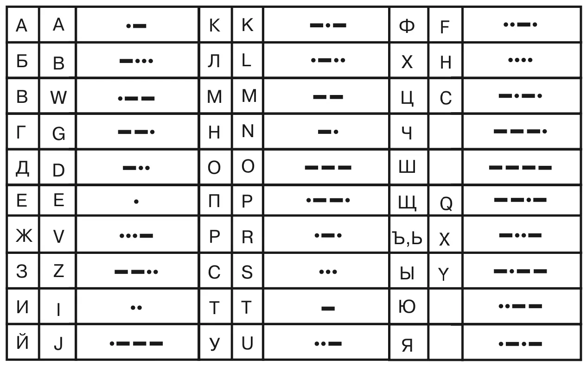

In writing, Morse code comes down to two characters.

> Two different anything, really, can with suitable combinations convey all types of information

## Chapter 2. Codes and Combinations

To perceive a message written in morse code, it is easier to use not the table above, but a chart in the opposite direction “dots and dashes of Morse code → letter of the alphabet.”

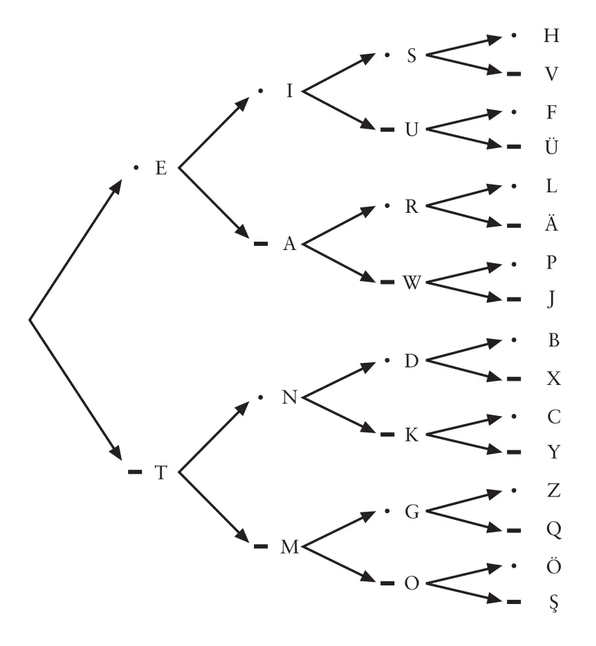

From it you can see that the number of letters that can be encoded is equal to two to the degree equal to the number of dots or dashes:

> Number of codes = 2<sup>Number of dots and dashes</sup>

So Morse code is a binary code. For binary codes, powers of 2 are used when counting the number of codes.

## Chapter 3. Braille and Binary Codes

In [Braille](https://en.wikipedia.org/wiki/Braille), characters are encoded by combinations of one to six convex dots arranged in a 2x3 cell. Braille is also a binary code.

> The dots are _binary_. A particular dot is either flat or raised

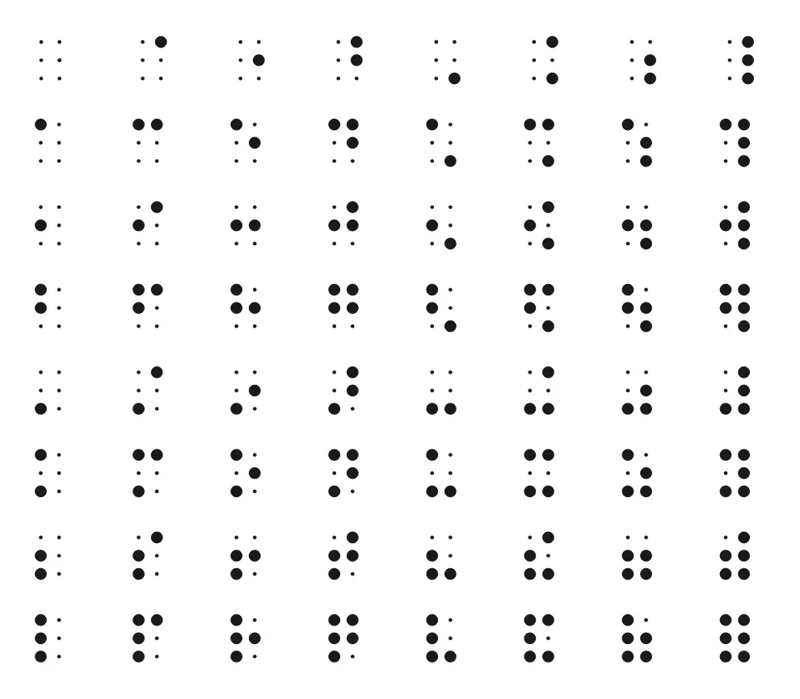

Many of the codes are double-loaded, depending on the context: code intervals, special _shift codes,_ and _escape_ codes.

> [Shift codes] alter the meaning of all subsequent codes until the shift is undone

> The capital indicator means that [only] the following letter should be uppercase rather than lowercase. A code such as this is known as an _escape_ code

Such codes are often used in binary coding of printed characters.

## Chapter 4. Anatomy of a Flashlight

Using a flashlight as an example, consider how electricity works. The simplest diagram of a flashlight might be as follows:

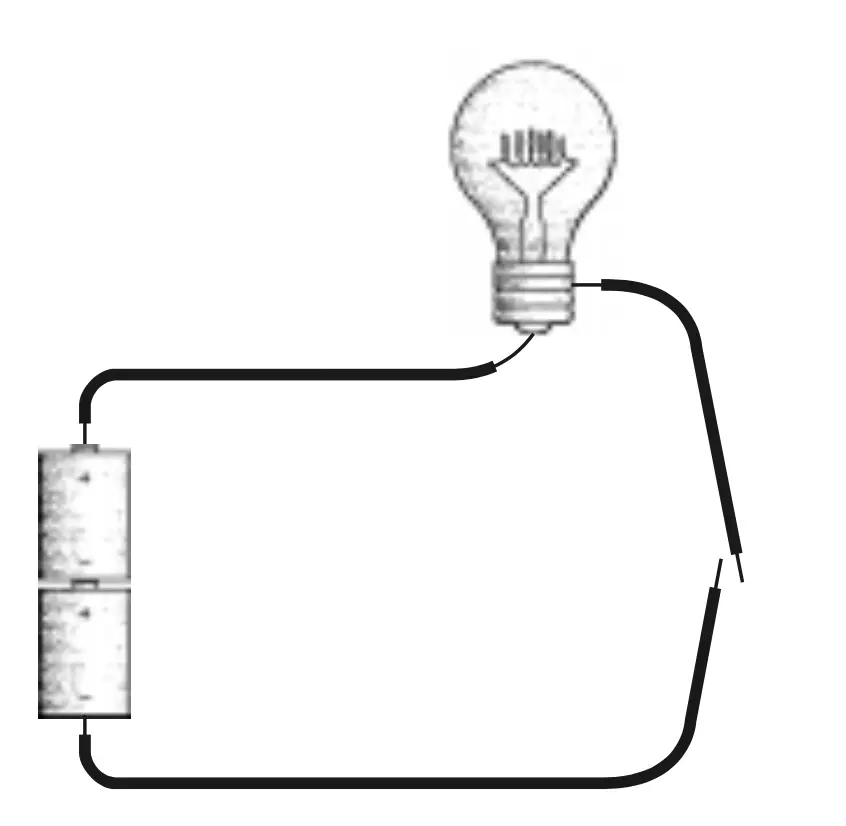

The circuit must be _closed_ for the light bulb to turn on. The switch controls the closing and opening of the circuit. In a closed circuit, “flows” a stream of charged particles, electrons, from one atom to another.

Batteries “make” electricity “flow” through the circuit if the circuit is closed.

> The chemicals in batteries are chosen so that the reactions between them generate spare electrons on the side of the battery marked with a minus sign... and demand extra electrons on the other side of the battery. In this way, chemical energy is converted to electrical energy

> The reactions take place only if an electrical circuit is present to take electrons away from the negative side and supply electrons to the positive side

Electricity flows through a wire that is made of a special material that conducts electricity: a conductor. Materials that do not conduct electricity well are called insulators.

Conductors “resist” the current—they have a resistance _(R)_. The higher the resistance, the fewer electrons flow through the circuit _(I)_. Batteries have the potential to do work—voltage _(U)_. The quantities are related by Ohm's law:

> I = U / R

The light bulb is on because...

> If a wire has a low resistance, it can get hot and start to glow

The switch is responsible for closing the circuit: whether the flashlight is off or not, it also looks like a binary code.

## Chapter 5. Seeing Around Corners

Let's try to build a circuit for a telegraph-like device:


Or using a grounded circuit:

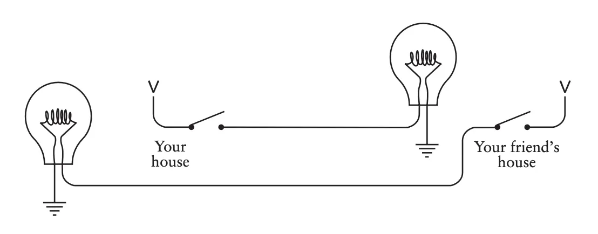

The longer the wires, the more resistance, the less current, and the dimmer the lamp shines. This problem also applies to the real telegraph.

## Chapter 6. Telegraphs and Relays

Instant communication is relatively recent and began with the telegraph.

> …The idea behind an electrical telegraph was simple: You do something at one end of a wire that causes something to happen at the other end of the wire

The basis of the telegraph is an electromagnet. Closing the switch at one end “turns on” the electromagnet at the other end.

> When the telegraph key was pressed, the electromagnet in the sounder pulled the movable bar down and it made a “click” noise. When the key was released, the bar sprang back to its normal position, making a “clack” noise. A fast “click-clack” was a dot; a slower “click...clack” was a dash


The wires cannot be stretched indefinitely, so we have to organize retransmission—the repetition of the message to transmit further. For this purpose, a relay is used.

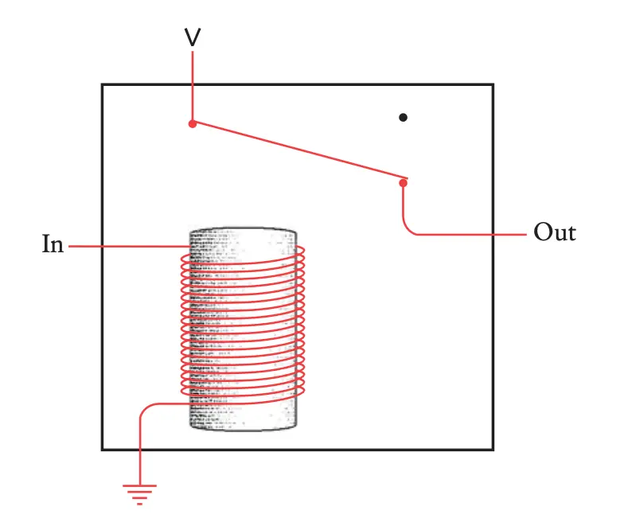

## Chapter 7. Our Ten Digits

The choice of the decimal number system was arbitrary. But the decimal system (unlike, say, Roman system) had a zero, which allowed the use of positional notation and facilitated multiplication and division.

Since the decimal system is positional, each digit in the number record is the number of corresponding powers of ten:

> 4825,8 = 4 \* 10<sup>3</sup> + 8 \* 10<sup>2</sup> + 2 \* 10<sup>1</sup> + 5 \* 10<sup>0</sup> + 8 \* 10<sup>-1</sup>

And also...

> What’s best about the positional system of notation isn’t how well it works, but how well it works for counting systems not based on ten

## Chapter 8. Alternatives to Ten

In the decimal number system we consider round numbers to be those that end in 0: 10, 100, 1000... Such numbers are the product of 10 over itself.

In other number systems round numbers are obtained by the same principle. In binary, for example:

- 10<sub>2</sub> = 2 &times; 1
- 100<sub>2</sub> = 2 &times; 2
- 1000<sub>2</sub> = 2 &times; 2 &times; 2

> In a multidigit binary number, the positions of the digits correspond to powers of two

The wire, lamp, and switch from the previous chapters can also be represented in binary form:

> If current is flowing through the wire, the binary digit is 1. If not, the binary digit is 0

> If the switch is on, or closed, the binary digit is 1. If the switch is off, or open, the binary digit is 0

> If the lightbulb is lit, the binary digit is 1. If the lightbulb is not lit, the binary digit is 0

A binary digit is a bit.

## Chapter 9. Bit by Bit by Bit

The binary number system is the simplest system. A bit, a single binary digit, is also the minimum possible amount of information.

A single bit is a choice of two possibilities: yes or no. Anything that can be reduced to such a choice can be represented by a set of bits.

The more bits used, the more choices (codes) available. In a binary system, the number of codes _(N)_ is:

> N = 2<sup>b</sup>

...Where _b_ is the number of bits.

The most common way to see a binary code in life is on barcodes. In bitwise representation, a slice of a barcode looks like this:


Bits also play a role in logic, where under 1 and 0 represent true and false.

## Chapter 10. Logic and Switches

Traditional algebra works with numbers, Boolean algebra works with sets.

In Boolean algebra the sign “+” (or _OR_) means union of sets, the symbol “×” (or _AND_) means intersection of sets. Commutativity, associativity, and distributivity work in it, too.

An empty set means zero, 0. A 1 is a complete set. For intersection, it's true that:

```
0 x 0 = 0
0 x 1 = 0
1 x 0 = 0
1 x 1 = 1
```

And for union:

```
0 + 0 = 0
0 + 1 = 1
1 + 0 = 1
1 + 1 = 1
```

The intersection operation can be represented as an electrical circuit where two switches are connected in series:

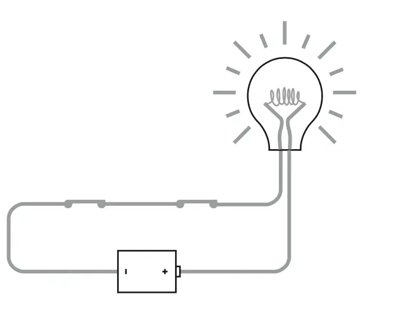

A circuit with two parallel switches would work for union:


## Chapter 11. Gates (Not Bill)

The connection of several relays is the basis for the construction of logic gates. For example to build the _AND_ gate:

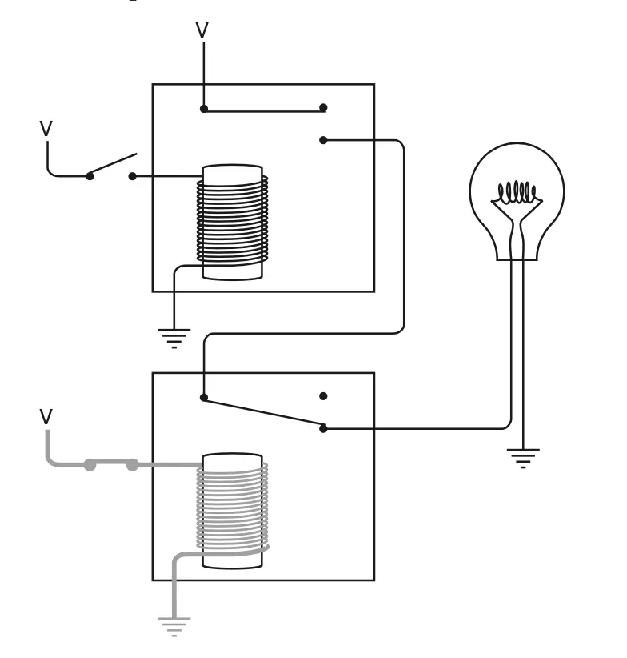

Symbolically, the _AND_ gate is denoted as follows:


If you connect relays in parallel instead of in series, you get the _OR_ gate, which is denoted like this:


If the bulb lights up when the switch is open and goes out when the switch is closed, you get an inverter:


The _NOR_ gate works like the _AND_ gate with two inverters on the inputs:

```
!A × !B = !(A + B)
```

The _OR_ gate with inverted inputs is the _NAND_ gate:

```
!A + !B = !(A × B)
```

Last two expressions are [De Morgan's laws](https://en.wikipedia.org/wiki/De_Morgan%27s_laws). The help simplifying the circuits.

## Chapter 12. A Binary Adding Machine

Addition is a basic arithmetic action.

> Addition is just about the only thing that computers do

We can divide the binary addition table into two: the sum digit table and the carry digit table:

| Sum | 0   | 1   |
| --- | --- | --- |
| 0   | 0   | 1   |
| 1   | 1   | 0   |

| Carry | 0   | 1   |
| ----- | --- | --- |
| 0     | 0   | 0   |
| 1     | 0   | 1   |

The carry table is the result of the _AND_ gate, and the _XOR_ gate gives us the sum:

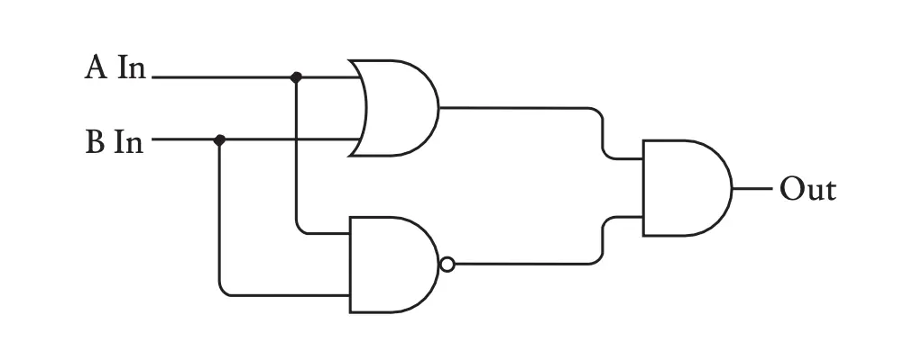

The way this circuit is designated is:


And then the addition scheme:


It's a _half-adder_. It's called that because it does not add a possible carry digit from a previous summation to the summation. To add 3 binary digits, you need 2 half-adders and an OR gate:


## Chapter 13. But What About Subtraction?

First, let's learn how to subtract without borrowing from an older digit:

> 253 – 176 ⇔<br />
> 253 – 176 + 1000 – 1000 ⇔<br />
> 253 – 176 + 999 + 1 – 1000 ⇔<br />
> 253 + (999 – 176) + 1 – 1000 ⇔<br />
> 253 + 823 + 1 – 1000 ⇔<br />
> 76 + 1 = 77

When subtracting binary numbers, the same method is used, only instead of the nine's complement, the one's complement is used.

The scheme for subtraction is as follows:

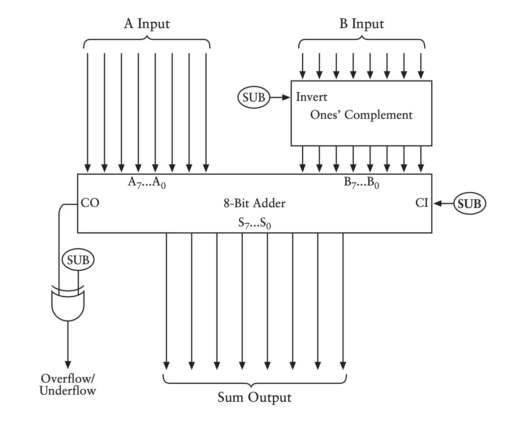

To record negative numbers, the two's complement is used, where negative numbers come after the last possible positive number:

```
0 00000000
1 00000001
…
126 01111110
127 01111111
-128 10000000
-127 10000001
…
-2 11111110
-1 11111111
```

The number range is -128 to +127, the most significant bit is the sign digit.

> To calculate the two’s complement, first calculate the ones’ complement and then add 1

> This system gives us a way to express positive and negative numbers without using negative signs. It also lets us freely add positive and negative numbers using only the rules of addition

## Chapter 14. Feedback and Flip-Flops

A circuit with _feedback_ is a circuit in which the output is also one of its inputs. A _trigger (flip-flop)_ is a circuit that stores information.

> A flip-flop circuit retains information. It “remembers.” In particular, the flip-flop shown previously remembers which switch was most recently closed

A simple trigger, _(RS-trigger)_, has two inputs _S (set)_ and _R (reset)_. It remembers which of the two inputs was last activated.

The trigger that remembers the value at a particular point in time is a _level-triggered D-type flip-flop_. It remembers one bit of information and stores it for later use:

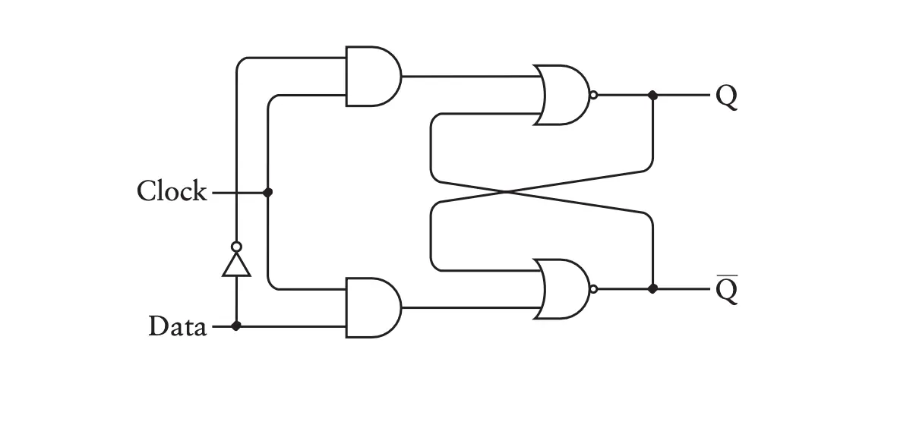

In such a trigger, if the Data signal changes while the _Clk_ signal is 1, the changes will be reflected on the outputs _Q_ and _!Q_. If we want the output to change only when the _Clk_ signal goes from 0 to 1, we need an _edge-trigger_:

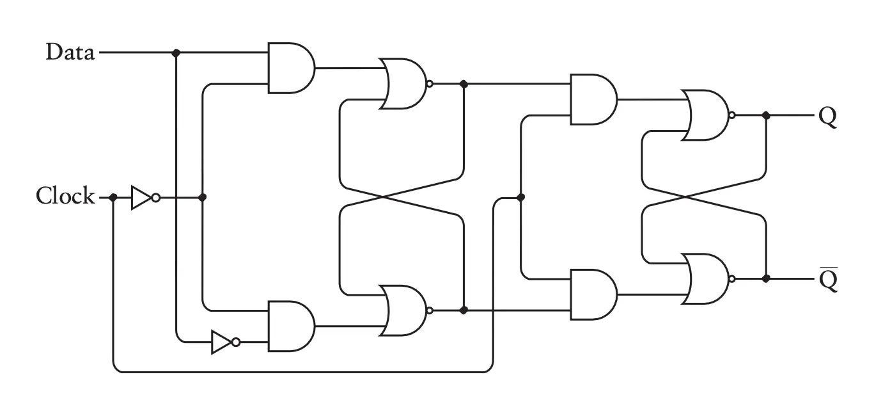

When the _!Q_ output is connected to _D_ input and the _Clk_ connected with an oscillator, we get a frequency divider. It divides the frequency by two. Its output cab be connected to the _Clk_ input of the next divider, then the frequency will be divided by 2<sup>Number of dividers</sup>.

If we combine 3 dividers in a row...

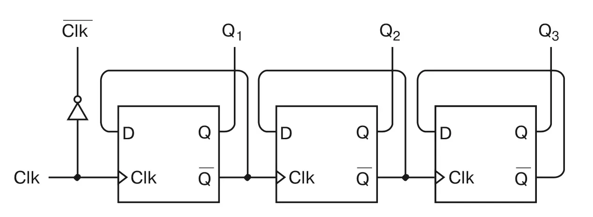

…And read their outputs...

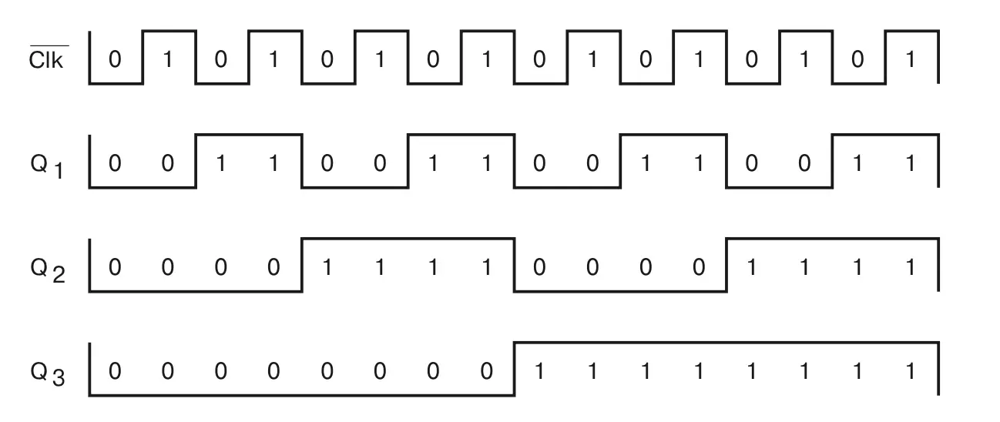

…The we get a circuit that is…

> ...Counting in binary numbers, and the more flip-flops we add to the circuit, the higher it will count

## What Next

In [the next part of the summary](/blog/code-the-hidden-language-of-computer-hardware-and-software-2/) we will discuss the remaining chapters 15-25. We will assemble the first memory that can store information and then connect it to the adder. We will create the first processor on the basis of which we will make a primitive computer with input and output.

## Resources

- [Code by Charles Petzold](https://www.goodreads.com/book/show/44882.Code)
- [Next Part of the Summary](/blog/code-the-hidden-language-of-computer-hardware-and-software-2/)
- [De Morgan's Laws](https://en.wikipedia.org/wiki/De_Morgan%27s_laws)
- [Braille](https://en.wikipedia.org/wiki/Braille)
