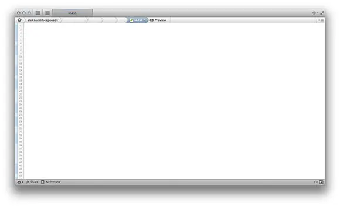
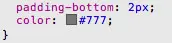

# Color Must Be Seen

I use Coda to write code. The editor is handy, a lot is implemented via drag-n-drop, and most importantly, nothing distracts from actually writing the code. The window looks like a blank sheet of paper.

The editor even provides a color picker, but I don't use it. ~~Because the interface is evil.~~ Because it's much easier and faster for me to type in a hex color code.

However, there is one detail that would make life easier: I often have to look for a piece of styles that describes a part of the layout with text of a certain color or with a background, a bordering of a certain color. Now, if I don't remember the color code, it might take a long time.

It would be much easier if Coda had a feature like Safari's web inspector has:

Of course, if the code has a lot of colors that are very similar to each other, it doesn't help. It's also unlikely to help if you have the same color in the code many times (although if it does, you should think about optimizing styles).
