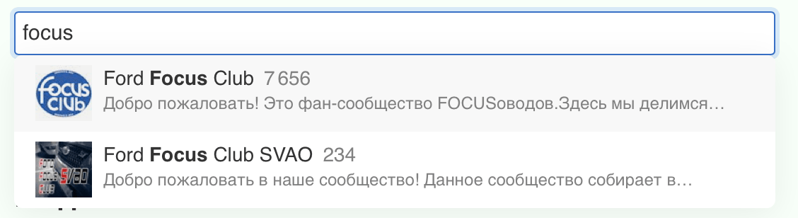

# Компоненты — это организмы

Я достаточно долго пытался сформулировать для себя, что такое «Компонент», и вот, кажется, наконец смог.

Я понимал термин достаточно хорошо, чтобы применять его в работе, но чувствовал, что не хватало осознания на интуитивном уровне. Мне хотелось понять, что это понятие в себя включает, как оно соотносится с другими понятиями и проектированием систем в целом.

Недавно, кажется, придумал хорошую аналогию, которая звучит так: _компоненты — это организмы_. Работает она на разных уровнях. Сейчас расскажу, как именно.

## Компонент, как изолированная сущность

_Компонент_ — самостоятельная изолированная сущность. Это значит, что у него есть чёткие границы, которые отделяют его от внешней среды и других компонентов.

Это важно, потому что проектировать что-либо без чётко-выделенных сущностей — [больно и неэффективно](https://ru.wikipedia.org/wiki/UML).

Такое выделение не только помогает определять, какой компонент чем должен заниматься, но также помогает строить иерархии и отношения между компонентами — вам **приходится** создавать способ коммуникации между компонентами. Иначе просто не получится построить систему.

Как правило, придуманный в таких условиях способ коммуникации помогает снизить [зацепление](<https://en.wikipedia.org/wiki/Coupling_(computer_programming)>) между компонентами, сделать систему более гибкой и подвижной.

## ДНК компонентов

Организм развивается под действием ДНК и внешней среды. Компоненты — так же.

Для компонентов ДНК — это внутренние правила, которые определяют его цель, то есть чего компонент старается достичь, чтобы выжить. Эти же правила могут определять полезность и способ максимально-эффективного достижения цели.

Давайте на примерах.

Чтобы _Текстовое поле_ могло выжить, оно должно уметь показывать, что в него можно ввести текст и отображать этот введённый текст.

_Кнопка_ должна уметь показывать, что на неё можно нажать, и по нажатию что-то произойдёт.

Если компонент не умеет делать то, что «должен», он не нужен — то есть он _не выживает_.

Внутренние правила также определяют, чем компонент **не должен** заниматься. Текстовое поле не должно выполнять работу Кнопки, потому что:

- это создаст лишнюю конкуренцию, в которой Текстовое поле заведомо проиграет, не выживет;
- у Текстового поля не хватит ресурсов на то, чтобы нормально выполнять свою работу, выживать.

Если присмотреться повнимательнее, то видно, что одно из таких «внутренних правил» — это [принцип единственной ответственности](https://ota-solid.now.sh/srp). Этот принцип (SRP) — часть ДНК компонента, которая составляет часть исходных данных, которые определяют жизненный путь компонента.

## Компонент во внешней среде

Компоненты, как организмы, не существуют изолированно от внешнего мира, они общаются со внешней средой и другими компонентами, образуя ниши, общности и экосистемы. _Внешняя среда_ также определяет, что компонент будет, должен и не должен делать.

Снова на примерах. _Форма поиска_ — это совокупность компонентов — _сообщество_:

У каждого организма в этой совокупности есть собственная роль — _специализация_:

- текстовое поле должно принимать и отображать вводимый текст;
- иконка должна объяснять, что текст будет воспринят, как текстовый запрос;
- кнопка должна нажиматься и объяснять, что по нажатию будет отправлен поисковый запрос.

Внешняя среда может и будет меняться. Если среда меняется так, что наличия просто Текстового поля внутри Формы поиска недостаточно, поле может приспособиться и превратиться в Автокомплит, поле с Тегами, что-то ещё, что позволит ему делать свою работу — выживать — лучше.

Более того, среда может поменяться так, что сообщества или компоненты перестанут быть нужными. Если на сайте убрали поиск, то понятие Формы поиска больше не состоятельно — сообщество развалится на отдельные компоненты, которые, возможно, образуют другие сообщества.

Если же на сайте не осталось форм в принципе, то Текстовое поле как компонент перестаёт быть нужным и вымирает. Это называется _эволюция_.

## Эволюция компонентов

Внешняя среда — по умолчанию враждебна для организмов, они стремятся в ней выжить.

В то же время компоненту важно делать лишь **необходимый минимум работы**, чтобы достигать своей цели. Этот минимум может меняться вместе со средой. Чем жёстче условия, то есть чем чаще меняется среда и чем серьёзнее, фундаментальнее изменения, тем более специфичными становятся компоненты.

Например, если на сайте слишком много разных способов искать товар, простая Форма поиска с Текстовым полем может не подойти. Тогда появляются поля с Тегами, Автокомплиты, Поля с предзаполнением и прочее.

Однако, им всё ещё не выгодно делать слишком много работы, потому что тогда появляются эдж-кейсы, под которые их способности не подходят.

Если коротко — **компоненты стремятся делать как можно меньше работы, но как можно лучше**.

## Эволюция среды

Внешняя среда тоже развивается. Сообщества растут или отмирают, условия развития компонентов и сообществ становятся жёстче или ослабевают. Всё это отражается на развитии компонентов.

Могут появляться _противоречия_ между внутренними правилами и правилами внешней среды. Когда такое происходит, **компонент должен или приспособиться, или умереть**, чтобы на его месте появился другой, который сумеет разрешить это противоречие.

Кнопка — отличный пример. Когда на сайте нет никаких форм кнопка мимикрирует под ссылки — она выглядит как кнопка, нажимается как кнопка, по нажатию что-то происходит — но это не кнопка.

И это я ещё даже не говорю о компонентах-паразитах; это, пожалуй, на какой-нибудь другой раз.

## ~~Дизайн-системы~~ Экосистемы

Компоненты собираются в сообщества; сообщества — в группы; группы сообществ — в экосистемы. _Экосистема_ — набор внешних и внутренних правил, по которым живёт проект.

Например, SRP — часть экосистемы, потому что диктует, как компоненты определяют свою специализацию. Наличие функции поиска на сайте — тоже часть экосистемы, потому что определяет, будет ли существовать, например, Форма поиска. Любое отношение между компонентами (симбиоз, паразитарные отношения) — всё это части экосистемы.

_Экосистема (дизайн-система)_ — это не «плакат со всеми сущностями в нашем проекте», нет. Это **набор принципов и правил**, которые определяют ценность проекта в целом и набор правил, по которым живут и развиваются сущности в этом проекте.

## Капец ты двинутый

Как ни странно, всё это помогает проектировать системы с учётом таких старых друзей, как например [SOLID](https://solidbook.vercel.app).

Если рассматривать компоненты, как организмы, а проект как экосистему, становится проще выбирать между иерархией и наследованием; понятнее, как определять специализацию компонентов; легче думать о том, как построить коммуникацию между сущностями.

Ну и в конце концов это просто весело — это же как играть в Цивилизацию, только на работе и по правилам, которые изначально даже неизвестны.

## Ссылки

- [SOLID](https://solidbook.vercel.app)
- [Зацепление сущностей](<https://en.wikipedia.org/wiki/Coupling_(computer_programming)>)
