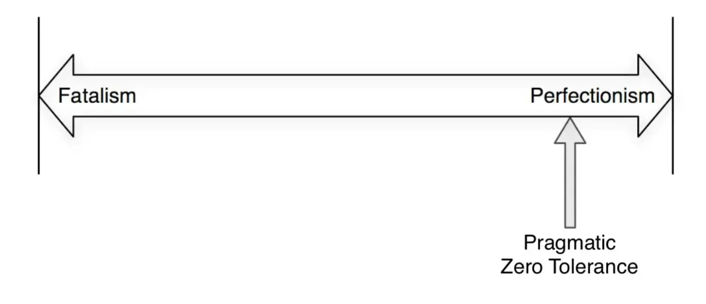

# Debug It! Part 2

Last time we covered [the first part of the book](/blog/debug-it/). Today we'll talk about defining problems, debugging techniques you can use, and anti-patterns.

## Chapter 6. Determine that There's a Problem

Sometimes we don't know that there is a bug in a program and we need to track it down. To do this, they use bug trackers.

- They give users a standard form for a bug report, which increases the probability of successful debugging;
- Keep track of what bugs have already been fixed;
- Remind developers of bugs;
- Help prioritize bugs;
- Keep track of reasons why we might have refused to fix a bug.

A good bug report is detailed and unambiguous, but not too big. There should be one bug report per bug. A good bug tracking system automatically collects information about the environment and settings.

Users won't write you about bugs if it's too hard for them to compile a bug report. Simplify the process:

- Make a button to submit a bug report visible.
- Automate the collection of any information you can gather yourself.
- Do not ask the user to do too much.
- In the template form, add a free-form field to describe the bug, because the standard fields may not be enough.
- Do not forget about protecting personal data, be careful about sharing any information with anyone.

Communicate with users in their language and in their world. In the most extreme cases, contact the user directly. Respond to bug reports after bugs are fixed, feedback from developers is nice for users.

Try to work on the support team. This will help understand the real state of the product and give you a chance to get into the problem without playing dumb with support.

## Chapter 7. Pragmatic Zero Tolerance

Bugs should be fixed first, it reduces uncertainty and technical debt. The more bugs will be accumulated, the less attention they will get—this should not be allowed.

Between “oh yeah devil may care, let it go as it goes” and “everything in the project must be perfect”, choose something in the middle, a little closer to the right edge:

There are no quick fixes—you'll have to figure out the problem every time. To make it easier:

- Set up a versioning system, project build, autotests, CI, CD.
- Separate the good code: clean, tested, debugged code from the bad.
- Identify the important parts of the system, find and fix bugs in it.
- Find and fix bugs in the rest of the system.
- Have cleanup weeks, when everyone is just looking for bugs and debugging.

## Chapter 8. Special Cases

**When patch a release**, focus on the root of the problem. When you patch an already-released product, you want to do it quickly, but _always_ focus on the problem. Also, be sure to fix that bug in the version currently in development.

Sometimes bugfixes break **reverse compatibility**. Add compatibility checkpoints to the fix checklist. If a bugfix breaks compatibility, make it as painless a path to upgrading as possible. Rely on creating a compatibility mode as a last resort—this method is very expensive and can introduce even more bugs.

If you are only getting ready to break compatibility, warn users: describe what will be changed, tell them how to prepare for the transition. In extreme cases, don't edit the bug at all. For example, if the correct operation of the rest of the program directly depends on this bug.

**Heisenbugs** are bugs that disappear when you try to detect them. The best method of fighting them is to create as few side effects as possible in the program from the beginning. If you're already out of luck, set up a logger, clear your mind and have patience—you'll have to do a lot of thinking.

To beat **low performance**, find out where it falls. Set up a profiler and use it while you work. Make sure that:

- You're profiling a version of the product that's as close to production as possible.
- The environment is as close to the production version as possible.
- The program works with real or nearly real data.

Sometimes bugs appear in **third-party code**, don't rush to blame it—check yours thoroughly first, the error is most likely there. If you do find a bug that isn't in yours, inform the author and think about how to work around it until it is fixed. Think twice before using a forked version of someone else's code in your own code.

## Chapter 9. Perfect Debugging Environment

You should have autotests. The criteria for good tests:

- _You must trust your tests_. If they fall, there must be a reason for it. If the test sometimes crashes, sometimes not, it will not be trusted.
- _Test should not require manual configuration of the environment_. It either does not need it or the environment is set automatically.
- _Test should not depend on other tests_. It is completely independent of how many and what tests are in the set, and of the progress and results of other tests.
- _Tests should cover at least the whole important part of the logic and components of the program_. Covering the code completely is not always achievable or cost-effective for business, but the most important part of the logic should all be covered.

Set up a version control system.

- It helps to roll back to the current version of the project after research.
- It can contain branches just for debugging and code cleanup.
- It automates builds and deployments.
- It helps create changelogs and describe releases.

## Chapter 10. Self-Debugging Programs

Set up asserts within the code (e.g., when validating values) to detect cases that are not covered by tests. They should be easy to turn off. But remember that asserts are not an error-handling mechanism, exceptions still need to be handled.

## Chapter 11. Antipatterns

- _Superstars in teams_. Such developers work fast, but often dirty, and the result becomes unsupportable.
- _Separate support team_. Debugging code is harder than writing it, so the support team has to have stronger programmers, it's inefficient. Also, the support team has less knowledge of the code base.
- _Rewrite from scratch_. Consider the costs and the possible effect of the solution, most of the time it's expensive to rewrite from scratch.
- _Code without a host_. In order for the team to care about the code, they must feel responsible for it and be involved in what is written.
- _Magic in the program_. Anything you don't understand is potentially a bug.

## Resources

- [Debug It! by Paul Butcher](https://www.goodreads.com/book/show/6770868-debug-it)
- [Part 1](/blog/debug-it/)
