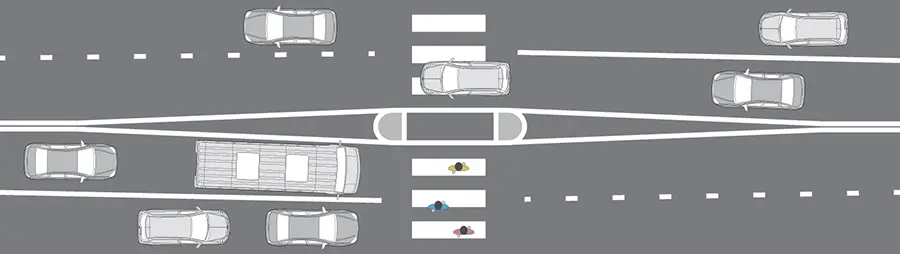

# Don't Push: Automate Instead

This post is a logical continuation of my [old post](/blog/do-not-push/) about constraints and developing good habits. To recap briefly his idea: if you can't force yourself to do something, you shouldn't force yourself to do it - you should put yourself in such conditions that it would be impossible or inexpedient not to make a deal with yourself.

This post is about the fact that this works not only in self-treatment, but also in general.

## Order, Rules, and Instructions

I very often make mistakes. I make mistakes, confuse branches, get off at the wrong subway station, write my phone number instead of my mail and vice versa, order a cab to the wrong address... In short, making mistakes is about me.

[Checklists](/blog/jedi-techniques/), of course are a good tool, but they are not enough. Sometimes they do not completely solve the problem.

The point is that “create a rule” ≠ “follow this rule”. Simply because “following the rules” is boring and quickly gets boring, and I'm lazy.

For me the solution is to change the _context around me_ so that _doing wrong is inconvenient_. Or, more precisely, so that doing wrong is _less convenient than doing right_.

## Example

We don't need to go far for examples, let's look at the experience of urbanists. Speed limits in cities are a sore subject and have long been studied.

The traffic rules don't work very well, because they are easy to break. When nothing is in the way of going fast, the desire to go fast is logical. However, as soon as going fast becomes inconvenient, people slow down on their own. Narrowing the driveway, raising the crosswalk, making staggered parking works as artificial restraints that make dangerous driving _uncomfortable_.

It's the same story with manual testing in projects. People are lazy to test projects. We get tired of doing the same actions over and over again, especially if they require a significant amount of resources: concentration, attention, [thought fuel](/blog/jedi-techniques/). We end up neglecting instructions and checklists.

“Fear of punishment” doesn't work. Yes, a person will be anxious and worried about being punished, but laziness won't overcome that. We have to automate the process or change the context.

<mark>Instructions don't work, human laziness is what really works</mark>

...So when I notice I'm “writing instructions” for someone, I start thinking:

- Can I automate the process?
- Can I change the context so that doing “wrong” becomes less convenient than doing it right?

## In Real Life

I tried to bring this philosophy to the development of [Tzlvt](https://www.fuckgrechka.ru/tzlvt/).

We're moving to [conventional commits](https://conventionalcommits.org) now, but changing my habit of writing commits the way I used to was hard for me. So we're developing in a branch with [linter](https://github.com/conventional-changelog/commitlint) that won't skip commits that aren't standard. And to motivate us to write normal commit messages, we will move each commit to an automatically generated changelog.

Another example: we work on a project in branches. When there are many developers on the team, maintaining consistent naming of branches becomes more difficult.

“Write an instruction on how to name branches” is a bad solution, nobody cares about instructions, and I myself probably wouldn't care. So, when creating CI for the test environments, I set up a rule that only branches with the prefixes we agreed on are automatically deployed to the test. That is, you can still call branches as you want, but with the “wrong” name you will have to bother with manually uploading to the test—and this is very lazy, it's easier to call the branch as agreed.

## Isn't That a Manipulation?

This is a delicate question.

I consider such a strategy manipulative when two factors coincide:

- It does not serve safety and “best practices.”
- It cannot be discussed or changed.

The first is clear—narrowing the road before crossing saves lives, it doesn't matter if drivers are mad or not. But “how to call the branches” is a grayer area. On the one hand there is _best practice_, on the other hand it feels like directive control.

But directive management is different in that directive decisions cannot be challenged or rules changed. If the “manipulation” can be discussed and the pattern of behavior changed, it is no longer manipulation. If decisions can be negotiated in advance, it is simply a contract. And a contract is the best management tool in principle.

## Resources

- [Don't Push Yourself](/blog/do-not-push/)
- [Jedi Techniques by Maxim Dorofeev](/blog/jedi-techniques/)
- [Tzlvt](https://www.fuckgrechka.ru/tzlvt/)

### Developer Stuff

- [Conventional commits](https://conventionalcommits.org)
- [Commitlint](https://github.com/conventional-changelog/commitlint)
