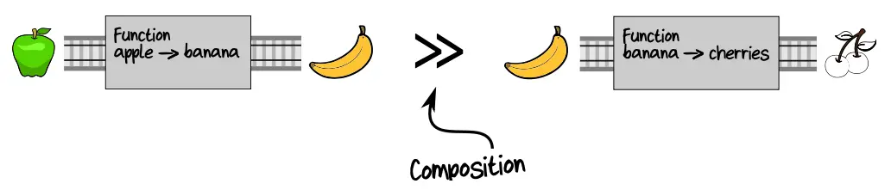
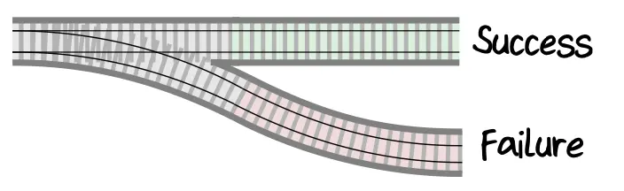
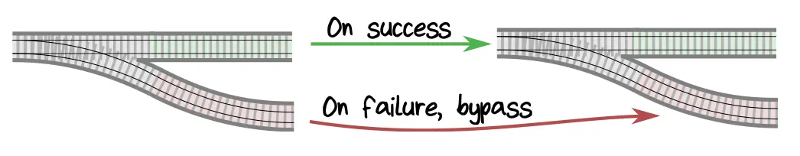
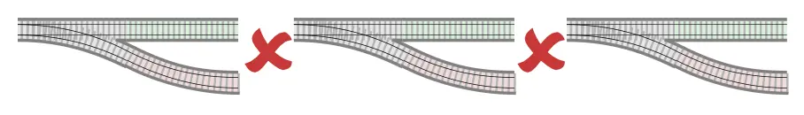
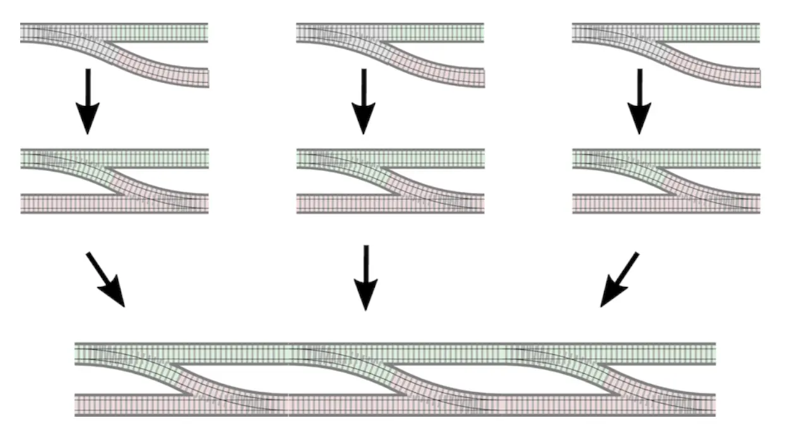
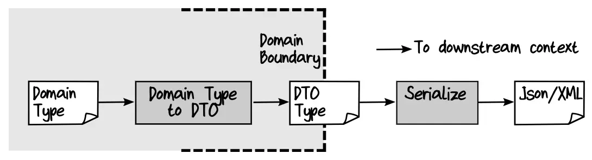
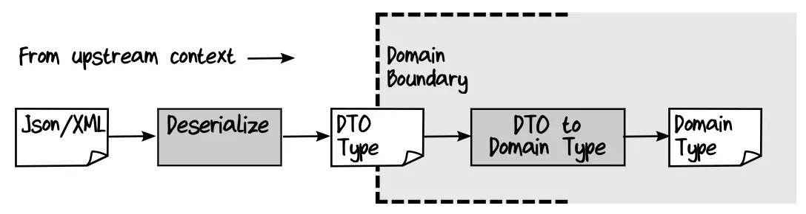
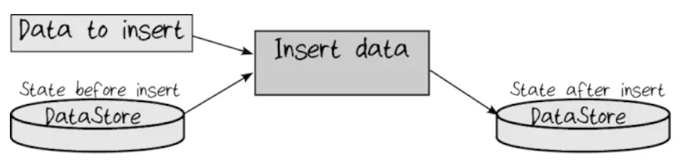

# Доменное моделирование в функциональном стиле. Часть 3

[В прошлый раз](/blog/domain-modelling-made-functional-2) мы поговорили о второй части книги. Обсудили функциональную декомпозицию доменной модели и узнали, как использовать типы, чтобы отразить бизнес-требования. В конце главы написали код, который одновременно был документацией и компилируемой основой для реализации системы.

В этот раз мы познакомимся с функциональной композицией, частичным применением и монадами.

## Глава 8. Понятие функций

В этой главе автор рассказывает об ФП в целом и его ключевых концепциях. В частности — что такое функции и [функциональная композиция](https://ru.wikipedia.org/wiki/Композиция_функций).

### Функции — это штуки

Штуками мы будем называть то, что можно передать как вход или параметр и отдать как результат. Мы можем это делать с функциями в F# (и TS/JS).

«Функцию-вход» можно использовать в другой функции, чтобы уменьшить дублирование и вытащить общие действия. «Функция-параметр» может «настроить» работу другой функции. «Функция-выход» сама может быть «настроена» разными параметрами.

<aside>

Функция, которая принимает на вход или возвращает другую функцию, называется [функцией высшего
порядка](https://ru.wikipedia.org/wiki/Функция_высшего_порядка).

</aside>

Если мы к этому добавим [каррирование](https://ru.wikipedia.org/wiki/Каррирование) и [частичное применение](https://ru.wikipedia.org/wiki/Частичное_применение), то получим гибкий механизм для «настройки» поведения программ.

### Композиция

Композиция функций — это совмещение нескольких функций в функцию сложнее, где выход первой становится входом следующей и т. д. Такое соединение функций называется пайпингом (piping). Оно работает, если тип результата первой функции совпадает с типом аргумента следующей.



Пример выше — то же, что и:


...Потому что результат тот же. Нам становится неважно, что именно было по середине процесса, важны вход и результат.

Собственно именно благодаря композиции мы можем из маленьких функций строить большие приложения:

```
Функции собираем в сервисы:
[low-level operation] >> [low-level operation] >> [low-level operation] => [service]

Сервисы — в процессы:
[service] >> [service] >> [service] => [workflow]

Параллельно компонуем процессы — получаем приложение:
[workflow]
[workflow] => [application]
[workflow]
```

Основная проблема в композиции — это несовпадение типов аргументов и результатов. В следующих главах автор рассказывает, как эту проблему решать.

## Глава 9. Композиция пайплайна

В этой и следующей главе мы реализуем процесс приёмки заказа в коде. Мы хотим получить нечто типа:

<Switch options="fsharp,ts">

```fsharp
let placeOrder unvalidatedOrder =
  unvalidatedOrder
  |> validateOrder
  |> priceOrder
  |> acknowledgeOrder
  |> createEvents
```

```ts
const placeOrder = (unvalidatedOrder) =>
	createEvents(acknowledgeOrder(priceOrder(validateOrder(unvalidatedOrder))));
```

</Switch>

<aside>

В примере на TypeScript я пока что использую последовательно вложенные функции вместо пайплайна, как в F#. Но есть пропозал [“Pipe Operator for JavaScript”](https://github.com/tc39/proposal-pipeline-operator), который возможно в будущем немного приблизит синтаксис к труъшному ФП. Он слегка отличается от пайпа в F#, и в пропозале даже есть [обоснование](https://github.com/tc39/proposal-pipeline-operator#why-the-hack-pipe-operator), почему они решили выбрать именно такой синтаксис.

Я в конспекте не использую этот оператор, потому что на момент написания пропозал находится в stage 2. Что-то может поменяться в синтаксисе или принципах работы в будущем.

</aside>

Сперва мы реализуем каждую функцию отдельно, а потом попробуем скомпоновать их в одну большую. По пути научимся манипулировать типами данных так, чтобы выход одной функции подходил ко входу следующей.

В этой главе мы решим проблему с тем, что некоторые функции требуют больше параметров, чем предыдущие им предоставляют. А в следующей — решим проблему с разными обёртками типа `Result`, которые мешают напрямую соединить функции в пайплайн.

### Используем типы как путеводитель

Чтобы компилятор сделал за нас всю работу по проверке типов, мы можем указать тип для функции явно. Тогда, если мы сделаем ошибку в параметрах или возвращаемом результате, то узнаем об этом сразу же. На примере функции валидации это могло бы выглядеть так:

<Switch options="fsharp,ts">

```fsharp
let validateOrder : ValidateOrder =
  fun checkProductCodeExists checkAddressExists unvalidatedOrder ->
    // ^dependency           ^dependency        ^input
      ...
```

```ts
const validateOrder: ValidateOrder =
  (checkProductCodeExists, checkAddressExists, unvalidatedOrder) => // ...
// ^dependency             ^dependency         ^input
```

</Switch>

### Реализуем валидацию

Для простоты в этой главе мы отбросим эффекты, поэтому тип проверки адреса пока упростим:

<Switch options="fsharp,ts">

```fsharp
type CheckAddressExists = UnvalidatedAddress -> CheckedAddress
// AsyncResult временно ушёл.
```

```ts
type CheckAddressExists = (address: UnvalidatedAddress) => CheckedAddress;
// AsyncResult временно ушёл.
```

</Switch>

Тогда тип валидатора будет следующим:

<Switch options="fsharp,ts">

```fsharp
type ValidateOrder =
  CheckProductCodeExists    // dependency
    -> CheckAddressExists   // dependency
    -> UnvalidatedOrder     // input
    -> ValidatedOrder       // output
```

```ts
type ValidateOrder = (
	codeChecker: CheckProductCodeExists // dependency
) => (
	addressChecker: CheckAddressExists // dependency
) => (
	order: UnvalidatedOrder // input
) => ValidatedOrder; // output
```

</Switch>

Чтобы создать валидированный заказ из невалидированного, нам потребуется:

- создать доменный тип `OrderId` из строки невалидированного заказа;
- создать доменный тип `CustomerInfo`;
- создать тип `Address` из `ShippingAddress` и второй такой же из `BillingAddress`;
- скомпоновать составные части заказа вместе.

<Switch options="fsharp,ts">

```fsharp
let validateOrder : ValidateOrder =
  fun checkProductCodeExists checkAddressExists unvalidatedOrder ->

    let orderId =
      unvalidatedOrder.OrderId
      |> OrderId.create

    let customerInfo =
      unvalidatedOrder.CustomerInfo
      |> toCustomerInfo

    let shippingAddress =
      unvalidatedOrder.ShippingAddress
      |> toAddress checkAddressExists   // Хелпер с «запомненным» аргументом-зависимостью.

    // ...И так для каждого поля невалидированного заказа.
    // Когда всё готово и проверено, возвращаем валидированный заказ:
    {
      OrderId = orderId
      CustomerInfo = customerInfo
      ShippingAddress = shippingAddress
      BillingAddress = ...
      Lines = ...
    }
```

```ts
const validateOrder: ValidateOrder = (
	checkProductCodeExists,
	checkAddressExists,
	unvalidatedOrder
) => {
	const orderId = OrderId.create(unvalidatedOrder.orderId);
	const customerInfo = toCustomerInfo(unvalidatedOrder.customerInfo);

	// Зависимость передаём первым аргументом:
	const shippingAddress = toAddress(checkAddressExists, unvalidatedOrder.ShippingAddress);

	// ...И так для каждого поля невалидированного заказа.
	// Когда всё готово и проверено, возвращаем валидированный заказ:
	return {
		orderId,
		customerInfo,
		shippingAddress
		// ...
	};
};
```

</Switch>

Функции `toCustomerInfo` и `toAddress` — это хелперы, которые будут создавать доменные типы из неваладированных данных или выбрасывать ошибки, если данные не подходят. Внутри них мы будем пользоваться той же логикой — преобразовать невалидированные данные в домен, а если не получится — выбросить ошибку.

<Switch options="fsharp,ts">

```fsharp
let toCustomerInfo (customer:UnvalidatedCustomerInfo) : CustomerInfo =
  // Создаём свойства для CustomerInfo,
  // выбрасываем исключения, если данные невалидные.
  let firstName = customer.FirstName |> String50.create
  let lastName = customer.LastName |> String50.create
  let emailAddress = customer.EmailAddress |> EmailAddress.create

  let name : PersonalName = {
    FirstName = firstName
    LastName = lastName
  }

  let customerInfo : CustomerInfo = {
    Name = name
    EmailAddress = emailAddress
  }

  // Возвращаем результат:
  customerInfo
```

```ts
const toCustomerInfo = (customer: UnvalidatedCustomerInfo): CustomerInfo => {
	const firstName = String50.create(customer.firstName);
	const lastName = String50.create(customer.lastName);
	const emailAddress = EmailAddress.create(customer.emailAddress);

	const name: PersonalName = { firstName, lastName };
	const customerInfo: CustomerInfo = { name, emailAddress };
	return customerInfo;
};
```

</Switch>

В случае с проверкой адреса нам также потребуется вызвать сторонний сервис (зависимость):

<Switch options="fsharp,ts">

```fsharp
let toAddress (checkAddressExists:CheckAddressExists) unvalidatedAddress =
  // Вызываем сервис-зависимость:
  let checkedAddress = checkAddressExists unvalidatedAddress

  // Паттерн-матчим, чтобы получить значение:
  let (CheckedAddress checkedAddress) = checkedAddress

  let addressLine1 = checkedAddress.AddressLine1 |> String50.create
  let addressLine2 = checkedAddress.AddressLine2 |> String50.createOption
  let city = checkedAddress.City |> String50.create
  let zipCode = checkedAddress.ZipCode |> ZipCode.create

  // Создаём адрес:
  let address : Address = {
    AddressLine1 = addressLine1
    AddressLine2 = addressLine2
    City = city
    ZipCode = zipCode
  }

  // Возвращаем
  address
```

```ts
const toAddress = (checkAddressExists: CheckAddressExists, unvalidatedAddress): Address => {
	const checkedAddress = checkAddressExists(unvalidatedAddress);

	const addressLine1 = String50.create(checkedAddress.addressLine1);
	const addressLine2 = String50.createOption(checkedAddress.addressLine2);
	const city = String50.create(checkedAddress.city);
	const zipCode = ZipCode.create(checkedAddress.zipCode);

	return {
		addressLine1,
		addressLine2,
		city,
		zipCode
	};
};
```

</Switch>

Для создания пунктов заказа мы пройдёмся по каждому невалидированному пункту с `List.map` и проделаем то же самое. Но код создания пунктов заказа, а также реализацию остальных шагов и создание событий я предлагаю посмотреть в оригинале :—)

### Внедряем зависимости

В функциональном программировании мы не используем DI-контейнеры, а наоборот держим все зависимости явными. Книжка вводная, говорит автор, поэтому мы не будем затрагивать такие вещи, как Reader Monad и Free Monad. Будем просто «внедрять зависимости» через верхнеуровневую функцию.

Посмотрим на пример хелперов, которые мы писали ранее:

<Switch options="fsharp,ts">

```fsharp
let toAddress checkAddressExists unvalidatedAddress =  ...
let toProductCode checkProductCodeExists productCode = ...
```

```ts
const toAddress = (checkAddressExists, unvalidatedAddress) => // ...
const toProductCode = (checkProductCodeExists, productCode) => // ...
```

</Switch>

Функции `checkAddressExists` и `checkProductCodeExists` — это зависимости. Когда мы используем их в других функциях, мы должны указать зависимости и там:

<Switch options="fsharp,ts">

```fsharp
let toValidatedOrderLine checkProductExists unvalidatedOrderLine =
//                       ^ Нужно для toProductCode ниже.

  let orderLineId = ...
  let productCode =
    unvalidatedOrderLine.ProductCode
    |> toProductCode checkProductExists // Используем зависимость.

  ...
```

```ts
const toValidatedOrderLine = (checkProductExists, unvalidatedOrderLine) => {
                          //  ^ Нужно для toProductCode ниже.
  const orderLineId = // ...

  // Мы можем частично применять функции, которые требуют таких зависимостей.
  // Здесь этот пример надуман и бесполезен, но показывает технику в целом:
  const productCode = toProductCode(checkProductExists)(unvalidatedOrderLine.ProductCode)

  // ...
}
```

</Switch>

И так до тех пор, пока мы не доберёмся до «корня композиции» — верхнеуровневой функции, которая будет настраивать все эти зависимости. Такие функции удобнее тестировать, потому что все зависимости легко подменить, а сами функции не содержат состояния.

Если зависимостей у функции слишком много, то стоит подумать, можно ли упростить функцию, чтобы избавиться от каких-то из них. Если нет, то можно собрать зависимости в рекорд и передавать их как один аргумент.

Если какие-то штуки нужны только для одной конкретной функции, то такие зависимости можно не поднимать до самого верха. Когда мы передаём одну функцию в другую, стоит держать тип этой функции как можно проще.

## Глава 10. Работа с ошибками

Мы хотим создать согласованную и прозрачную схему работы с ошибками. В этой главе мы рассмотрим функциональный подход к обработке ошибок и узнаем, как отделять доменные ошибки (domain errors) от остальных.

### Используем `Result`, чтобы сделать ошибки явными

Сигнатура функций должна сообщать обо _всех возможных_ результатах её работы явно. Поэтому такая сигнатура будет обманчивой:

<Switch options="fsharp,ts">

```fsharp
type CheckAddressExists = UnvalidatedAddress -> CheckedAddress
```

```ts
type CheckAddressExists = (address: UnvalidatedAddress) => CheckedAddress;
```

</Switch>

У нас могут возникнуть ошибки, и мы хотим это отобразить прямо в типе:

<Switch options="fsharp,ts">

```fsharp
type CheckAddressExists =
  UnvalidatedAddress -> Result<CheckedAddress,AddressValidationError>

and AddressValidationError =
  | InvalidFormat of string
  | AddressNotFound of string
```

```ts
type AddressValidationError = InvalidFormat | AddressNotFound;

type CheckAddressExists = (
	address: UnvalidatedAddress
) => Result<CheckedAddress, AddressValidationError>;
```

</Switch>

### Работаем с доменными ошибками

Потенциальные ошибки мы можем поделить на 3 группы:

- _доменные ошибки_ — ожидаемые в самих бизнес-процессах, типа как непринятый заказ или нехватка товаров на складе;
- _исключения (panics)_ — приводят систему в невосстановимое состояние, как выход за пределы массива или недостаток памяти;
- _инфраструктурные_ — ожидаемые с технической точки зрения, но не бизнесом, типа как неудачная аутентификация или проблемы с сетью.

Доменные ошибки стоит включить в доменную модель и покрыть типами. Исключения должны завершить процесс и обработаться на верхнем уровне. Инфраструктурные можно обработать и так, и так, будет зависеть от архитектуры и требований. В этой книге мы уделяем внимание только доменным ошибкам.

Мы можем типизировать каждую ошибку, а затем для каждого процесса собрать юнион возможных ошибок для этого процесса:

<Switch options="fsharp,ts">

```fsharp
type PlaceOrderError =
  | ValidationError of string
  | ProductOutOfStock of ProductCode
  | RemoteServiceError of RemoteServiceError
  ...
```

```ts
type ValidationError = string;
type ProductOutOfStock = ProductCode;
type RemoteServiceError = RemoteServiceError;

type PlaceOrderError = ValidationError | ProductOutOfStock | RemoteServiceError;
```

</Switch>

Это будет не только документацией, но и сделает модель ошибок расширяемой. Мы не можем сразу определить _все_ ошибки, которые могут возникнуть, поэтому нам надо подумать о добавлении новых в будущем. Юнион отлично для этого подходит.

<aside>
  Кроме этого при добавлении новых ошибок все паттерн-матчинги по этому юниону сами напомнят о том,
  что их надо обновить.
</aside>

### Пишем цепочки из функций, возвращающих `Result`

Проблема с функциями, которые возвращают `Result` в том, что их сложно составлять в пайплайн. Они как будто добавляют развилки на путях:



Хочется сделать так, чтобы если «поезд свернул» на путь с ошибкой, то дальше он только и шёл по этому пути:



Но сопоставить две Result-функции просто так мы не сможем, потому что у них отличаются формы входов и выходов:



Нам хочется получить такие адаптеры, которые бы корректировали «форму входов» Result-функций, чтобы их можно было соединять в цепочки:



Один из таких адаптеров — это `bind`:

<Switch options="fsharp,ts">

```fsharp
let bind switchFn twoTrackInput =
  match twoTrackInput with
  | Ok success -> switchFn success
  | Error failure -> Error failure
```

```ts
const bind = (switchFn, twoTrackInput) => {
	// Реализация в TS будет сильно зависеть от системы типов, которые мы построим.
	// Мы можем проверять специальное поле или всю структуру,
	// можем по-разному возвращать результат в случае ошибки.
	// Пусть для примера всё будет как можно проще:
	return twoTrackInput.ok ? switchFn(twoTrackInput.value) : Result.Error(twoTrackInput.error);

	// Без нормального паттерн-матчинга их типов
	// получается многовато бойлерплейта и всё равно ненадёжно :–(
};
```

</Switch>

Далее для работы с результатом мы можем использовать `map`. Он будет принимать функцию, которую выполнит на результате, если ошибки не было. В случае ошибки просто вернёт саму ошибку, не применяя функцию:

<Switch options="fsharp,ts">

```fsharp
let map f aResult =
  match aResult with
  | Ok success -> Ok (f success)
  | Error failure -> Error failure
```

```ts
const map = (f, result) => {
	// Здесь тоже оставим реализацию как можно проще,
	// но опять же, конкретика будет зависеть от каждого случая.
	return result.ok ? Ok(f(result.value)) : Error(result.error);
};
```

</Switch>

Я оставил за скобками пару разделов, которые показывают на примерах, как использовать `bind`, `map` и `mapError`, а также конструкции из F# типа `let!`, `result {…}`, чтобы писать более читабельный код. Думаю, их лучше прочесть самостоятельно, поглядывая в репозиторий с кодом, который идёт вместе с книжкой.

### Монады и всякое такое прочее

_Монада_ — это паттерн, который позволяет соединять монадические функции в цепочки. А _монадическая функция_ — это функция, которая возвращает некое «усовершенствованное» значение.

Технически «монада» — это термин для сущности, у которой есть:

- структура данных;
- некоторые связанные с ней функции;
- правила работы этих функций.

В наших примерах такой структурой был `Result`. Чтобы стать монадой, ему нужны функции `bind` и `return`. Первую мы уже видели, а вторая — превращает обычное значение в `Result` — это по сути конструктор `Ok`.

## Глава 11. Сериализация

Домен — это хорошо, но ему надо как-то общаться с инфраструктурой, которая может не понимать наших типов и вообще быть написана на других языках. В этой главе мы поговорим о том, как сериализовывать и десериализовывать данные.

### Хранение и сериализация

_Хранение (persistence)_ — это способность состояния переживать по времени процесс, который его породил. _Сериализация (serialization)_ — это процесс превращения специфических домену структур в формат, который легко хранить (JSON, XML и т. д.).

### Проектирование под сериализацию

Чтобы сериализация была безболезненной, нам надо конвертировать доменные объекты в DTO, а уже их — сериализовать. При десериализации — делать наоборот.





### Пример сериализации

Допустим, мы хотим научиться сериализовывать тип `Person`:

<Switch options="fsharp,ts">

```fsharp
module Domain =
  // Допустим, ограничение на 50 символов:
  type String50 = String50 of string

  // Допустим, ограничение снизу на 1/1/1900 и сверху на сегодняшнюю дату:
  type Birthdate = Birthdate of DateTime

  // Описание доменного типа:
  type Person = {
    First: String50
    Last: String50
    Birthdate : Birthdate
  }
```

```ts
// Допустим, у нас есть фабрика,
// которая также занимается валидацей для этого типа,
// как мы обсуждали в предыдущей части конспекта:
type BirthDate = DateTime;

type Person = {
	first: FirstName;
	last: LastName;
	Birthdate: BirthDate;
};
```

</Switch>

Далее объявим тип для DTO и функции, которые будут конвертировать домен в DTO и обратно:

<Switch options="fsharp,ts">

```fsharp
// Тип DTO с примитивами, без ограничений:
module Dto =
  type Person = {
    First: string
    Last: string
    Birthdate : DateTime
  }

// Модуль для конвертации между DTO и доменным объектом:
module Person =
  let fromDomain (person:Domain.Person) :Dto.Person =
	  // Получаем примитивы из доменного типа:
    let first = person.First |> String50.value
    let last = person.Last |> String50.value
    let birthdate = person.Birthdate |> Birthdate.value

    // Составляем DTO:
    {First = first; Last = last; Birthdate = birthdate}

  let toDomain (dto:Dto.Person) :Result<Domain.Person,string> =
    result {
      // Валидируем и получаем типизированные значения:
      let! first = dto.First |> String50.create "First"
      let! last = dto.Last |> String50.create "Last"
      let! birthdate = dto.Birthdate |> Birthdate.create

      // Создаём доменный объект:
      return {
        First = first
        Last = last
        Birthdate = birthdate
      }
    }
```

```ts
// DTO.ts

// Тип DTO с примитивами, без ограничений:
type PersonDTO = {
	First: string;
	Last: string;
	Birthdate: DateTime;
};

// Person.ts
// Модуль для конвертации между DTO и доменным объектом:

function fromDomain(person: Person): PersonDTO {
	const first = person.first;
	const last = person.last;

	// При необходимости «вытаскиваем» примитивы,
	// если при создании фабрика возвращает объект.
	const birthdate = person.birthdate;

	return { first, last, birthdate };
}
```

</Switch>

Далее нужно будет дописать сериалайзер, который будет превращать DTO в нужный формат. Я оставлю это снаружи конспекта, там довольно много кода, но он простой, поэтому рекомендую глянуть самим.

### Как правильно переводить типы в DTO

Есть несколько рекомендаций по «переводу» типов в DTO:

- Простые типы и алиасы можно сохранять в виде примитивов, которые они представляют;
- Необязательные значения можно заменять на `null`, если их нет;
- Коллекции — как массивы, мапы и другие сложные структуры — как ключ-значение;
- Рекорды — как объекты, рекурсивно применяя эти правила к каждому полю;
- Юнионы, которые использованы как enum — в виде чисел-значений этих enum;
- Кортежей в домене лучше избегать, но если они есть, то лучше сделать для них специальный рекорд.

## Глава 12. Хранение

Мы спроектировали приложение таким, чтобы ему было неважно, как его данные будут хранить (persistence ignorance). Но хранить их всё-таки придётся, поэтому поговорим и об этом.

### Двигаем хранение к краям процесса

Мы хотим, чтобы доменная логика была чистой, поэтому помещаем её в центре процесса, а всё, что имеет побочные эффекты — по краям. Допустим, мы хотим реализовать логику для оплаты инвойса, где нам надо:

- загрузить инвойс из базы данных;
- провести оплату;
- если оплата прошла, пометить инвойс как оплаченный в БД;
- если нет, то отметить это.

Функцию оплаты лучше сделать чистой, а всё, что связано с чтением и записью в БД — отделить.

```
--- I/O---
Load invoice from DB

--- Pure ---
Do payment logic

--- I/O ---
Pattern match on output choice type:
  if "FullyPaid" -> Mark invoice as paid in DB
  if "PartiallyPaid" -> Save updated invoice to DB

--- I/O ---
Load all amounts from unpaid invoices in DB

--- Pure ---
Add the amounts up and decide if amount is too large

--- I/O ---
Pattern match on output choice type:
  If "OverdueWarningNeeded" -> Send message to customer
  If "NoActionNeeded" -> do nothing
```

<aside>

По сути это [почипо-бутерброд](https://blog.ploeh.dk/2020/03/02/impureim-sandwich/), о котором
писал в своё время Марк Зиманн.

</aside>

### Разделение на команды и запросы

В ФП все объекты считаются неизменяемыми, то же будем думать и о хранилище. Каждый раз, когда мы что-то обновляем в нём, оно превращается в «копию с изменениями».



С типах мы бы могли выразить это так:

<Switch options="fsharp,ts">

```fsharp
type InsertData = DataStoreState -> Data -> NewDataStoreState
type ReadData = DataStoreState -> Query -> Data
type UpdateData = DataStoreState -> Data -> NewDataStoreState
type DeleteData = DataStoreState -> Key -> NewDataStoreState
```

```ts
type InsertData = (state: DataStoreState) => (data: Data) => NewDataStoreState;
type ReadData = (state: DataStoreState) => (query: Query) => Data;
type UpdateData = (state: DataStoreState) => (data: Data) => NewDataStoreState;
type DeleteData = (state: DataStoreState) => (key: Key) => NewDataStoreState;
```

</Switch>

Здесь видно, что одна из сигнатур отличается: `ReadData` возвращает данные, а все остальные — новое состояние хранилища. То есть `ReadData` состояние не изменяет.

На этом строится принцип разделения на команды и запросы — [_CQS, Command-Query Separation_](https://en.wikipedia.org/wiki/Command–query_separation):

- функции, которые возвращают данные не должны иметь побочных эффектов;
- а функции с побочными эффектами не должны возвращать данных.

Этот принцип приводит к следующему — [_CQRS, Command-Query Responsibility Segregation_](https://ru.wikipedia.org/wiki/CQRS), который говорит, что модели для записи и чтения данных лучше хранить отдельно. Дело в том, что объект, например, пользователя, который требуется для записи может (и скорее всего будет) отличаться от объекта, который возвращается при чтении. Поэтому лучше разделить эти модели в разные модули, чтобы они могли эволюционировать независимо.

<aside>

CQS и CQRS — это не совсем одно и то же. Подробнее о разнице на [Википедии](https://ru.wikipedia.org/wiki/CQRS) и [вот тут](https://stackoverflow.com/questions/34255490/difference-between-cqrs-and-cqs).

</aside>

### Делаем хранилища для разных контекстов независимыми

Есть ещё пара рекомендаций, как облегчить хранение:

- контексты должны иметь возможность менять свои схемы данных, не затрагивая других контекстов;
- никто снаружи не должен иметь возможности прочесть данные из хранилища какого-либо контекста.

Это делает разные контексты расцепленными, что позволяет развивать их независимо друг от друга.

Конкретные примеры работы с разными типами хранилищ, записью, чтением и транзакциями я предлагаю посмотреть прямо в книжке.

## Остальные главы

В 13-й главе автор рассказывает и приводит примеры того, как держать код чистым при развитии приложения. Что делать, если появляются новые требования, как быть, когда старый дизайн надо поменять и т. д.

Я не стал конспектировать её, потому что пришлось бы скопировать всю книгу 😃<br />
Рекомендую прочитать эту главу (да и книгу полностью) самим.

## Заключение

Мне было забавно, что часть принципов из этой книги я когда-то придумал для себя сам. Частичным применением для «управления зависимостями» и проектированием в типах с отдельными типами для разных этапов жизненного цикла данных я пользовался, когда [переписывал Тяжеловато](/blog/tzlvt-architecture-upgrade).

Функциональный пайплайн и разделение по фичам я использовал на прошлой работе даже несмотря на то, что проект был построен в парадигме ООП. Непредставимость невалидных данных, конечно, спроектировать в TS сложнее, потому что JS-рантайм дышит в спину, но всё же, идея как-то сидела в голове. Какими-то идеями я даже пользовался, когда последний раз [блог переписывал](/blog/new-site-stack/).

Идеи сами по себе доказали свою работоспособность, но теперь у меня есть ещё и авторитетный источник, на который я могу ссылаться при случае 😃

Новое в книге для меня было в основном связано с DDD и начальными этапами проектирования. Было неочевидно, что слишком абстрактные типы могут навредить в начале работы. Ну и читать код на F# тоже было интересно.

В общем, [книжка](https://pragprog.com/titles/swdddf/domain-modeling-made-functional/) отличная — рекомендую.

## Ссылочки-ссылочки-ссылочки

- [Domain Modelling Made Functional. Scott Wlaschin](https://pragprog.com/titles/swdddf/domain-modeling-made-functional/)
- [Часть 1, понятие домена](/blog/domain-modelling-made-functional)
- [Часть 2, моделирование на типах](/blog/domain-modelling-made-functional-2)

### Понятия из ФП и CS

- [Композиция функций](https://ru.wikipedia.org/wiki/Композиция_функций)
- [Функция высшего порядка](https://ru.wikipedia.org/wiki/Функция_высшего_порядка)
- [Каррирование](https://ru.wikipedia.org/wiki/Каррирование)
- [Частичное применение](https://ru.wikipedia.org/wiki/Частичное_применение)
- [Сериализация](https://ru.wikipedia.org/wiki/Сериализация)

### Языки программирования

- [F# Language Guide](https://docs.microsoft.com/en-us/dotnet/fsharp/language-reference/)
- [TypeScript Definitive Guide](https://typescript-definitive-guide.ru/book/chapters/)
- [Pipe Operator for JavaScript](https://github.com/tc39/proposal-pipeline-operator)

### CQS, CQRS и разница между ними

- [Command–Query Separation, CQS](https://en.wikipedia.org/wiki/Command–query_separation)
- [Command and Query Responsibility Segregation, CQRS](https://ru.wikipedia.org/wiki/CQRS)
- [Difference Between CQS and CQRS](https://stackoverflow.com/questions/34255490/difference-between-cqrs-and-cqs)
- [Разделение функций на команды и запросы](/blog/commands-and-queries/)

### Другие понятия из CS

- [Иммутабельность](https://ru.wikipedia.org/wiki/Неизменяемый_объект)
- [Data Transfer Object, DTO](https://ru.wikipedia.org/wiki/DTO)
- [Algebraic Data Type](https://en.wikipedia.org/wiki/Algebraic_data_type)

### Из блогов классных разработчиков

- [Impureim Sandwich](https://blog.ploeh.dk/2020/03/02/impureim-sandwich/)
- [Dependency Rejection](https://blog.ploeh.dk/2017/02/02/dependency-rejection/)

### Из моего блога

- [Чистая архитектура во фронтенде](/blog/clean-architecture-on-frontend/)
- [Управление состоянием приложения с помощью конечного автомата](/blog/fsm-to-the-rescue/)
- [Обработка ошибок в асинхронных функциях](/blog/error-handling-async-await/)
- [Как и зачем мы переписали Тяжеловато на TypeScript](/blog/tzlvt-architecture-upgrade)
- [Переписал свой сайт на Next и TypeScript](/blog/new-site-stack/)
