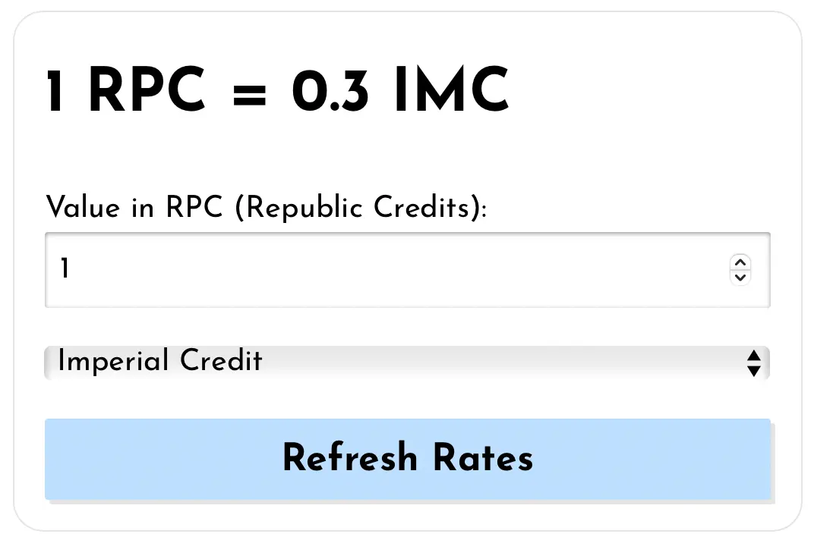
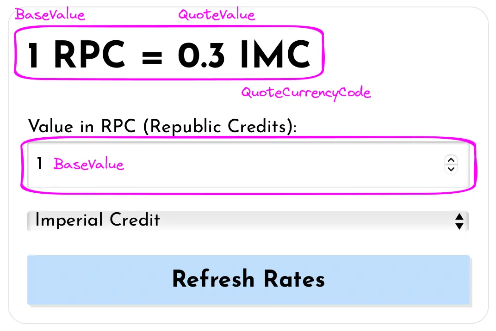
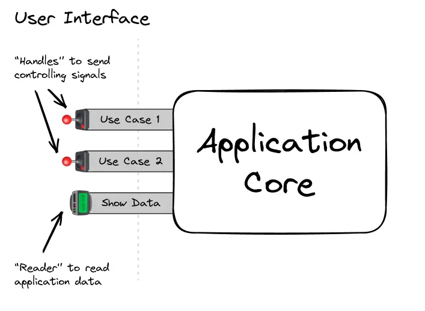
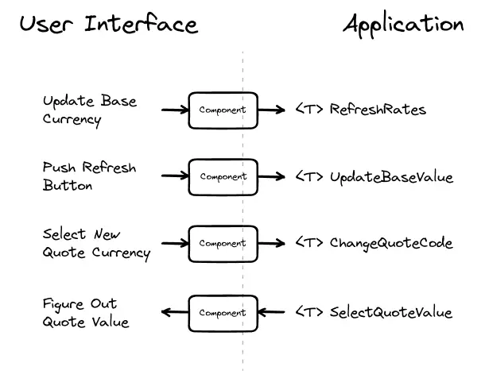
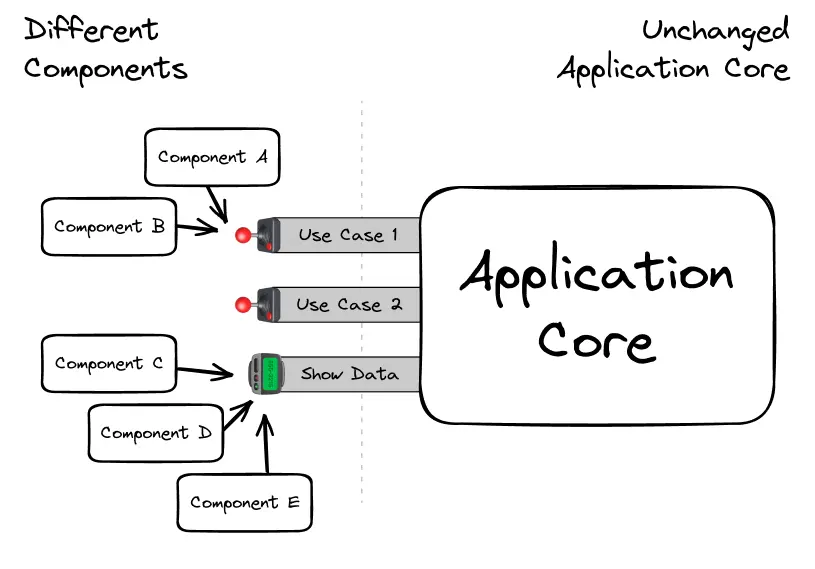
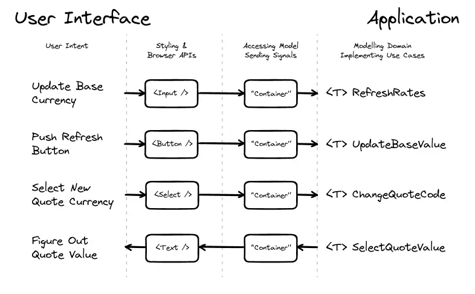

# Part 3. Ports, Adapters, and UI

Let's continue the series of posts and experiments about explicit software design.

[Last time](/blog/explicit-design-2) we finished designing the application core and created use case functions. In this post, we will write components for the user interface, discuss its interaction with the domain model, and look at the difference between different types of data that are displayed in the UI.

<aside>

By the way, all the [source code for this series](https://github.com/bespoyasov/explicit-design)
and the [blog's source code](https://github.com/bespoyasov/www) are available on GitHub. Give
these repositories a star if you liked the post!

</aside>

## Analyzing UI

The very first thing we will do when developing the UI is to look at what it will consist of and what features it should provide to users. Our application (a currency converter) will consist of one screen, on which the converter component itself will be located:



The converter will store some _state_—data that will affect the components' render. To understand how to work with this data, let's look at what components will be displayed on the screen, how information will “flow” through the application while working with it.

### UI as Function of State

The first thing we will pay attention to is the component header and the text field below it. The field contains the current value of the base currency, and the header contains the value of the quote currency calculated at the current rate:



We can think of these two components as a “transformation” of data from the domain model into a set of components on the screen:

```
[Domain Model]:   =>   [UI Components]:
_________________________________________

BaseValue         =>   <BaseValueInput />
BaseValue
  & QuoteValue    =>   <CurrencyPair />
  & ExchangeRate
```

The idea of describing UI as a function of data is not new and lies at the core of various frameworks, [libraries](https://legacy.reactjs.org/docs/components-and-props.html), and [patterns](https://en.wikipedia.org/wiki/Model%E2%80%93view%E2%80%93viewmodel). This approach helps to separate the data transformations from various side effects related to rendering components and reacting to user input.

One of the reasons for such separation is that data and its representation on the screen change for different reasons and at _different pace and frequency_. If the code is not separated, then changes in one part [seep into another and vice versa](https://blog.ploeh.dk/2023/03/27/more-functional-pits-of-success/#18060ca17da341148f9027a290f06652). In that case, stopping and limiting the spread of such changes becomes difficult, which makes updating the code unreasonably expensive.

When data and presentation are separated, effects are somewhat “isolated” somewhere on the edge of the application. This [makes the code more convenient](https://blog.ploeh.dk/2015/05/07/functional-design-is-intrinsically-testable/) for understanding, debugging, and testing.

However, not all data that affects UI rendering is exclusively the domain model, and we should also consider (and separate in the code) other types of state.

### Types of State

In addition to the model, which describes the domain and is represented in our code by a set of types and functions, we can also identify other types of data that affect the render of components on the screen.

For example, if you click on the “Refresh Rates” button in a currency converter, the application will load data from the API server. The data loaded from there is part of the _server state_. We have almost no control over it, and the UI task is to synchronize with it in order to show up-to-date information from there.

<aside>

Actually, instead of “server state,” I would use the term “remote state” because the source of the
data can be not only a server, but also local storage, file system, or anything else.

</aside>

In addition to that, after the button is pressed, while the data is not yet loaded from the server, the button will be disabled, and the converter will show a loading indicator to provide feedback to the user. The flag responsible for the loading indicator can be considered as part of the _UI state_.

As a rule, UI state is data that describes the UI directly. For example, it includes things like “Is the button disabled?”, “How is the currency list sorted?”, “Which screen is currently open?” and responds to user actions even if the model does not change.

<aside>

By the way, sometimes non-permanent states (such as “Loading,” “HasError,” “Retrying,” etc.) are
placed in a separate category called [“meta
state”](https://khalilstemmler.com/articles/client-side-architecture/layers/), and everything
related to routing is placed in the “URL state.” This can be useful if the application is complex
and different data is involved in different processes. In our application, there is no special
need for this, so we will not describe everything in such detail.

</aside>

### Data Flow

In complex interfaces, components may depend on several types of state at once. For example, if the quote currency selector needs to be sorted, this component will be a function of both the _model and UI state simultaneously_:

```
[Domain Model]:   =>  [UI State]:    =>  [UI Component]:
___________________________________________________________

CurrentQuoteCode  =>  SortDirection  =>  <CurrencySelector
& CurrencyList                            selected={QuoteCurrencyCode}
                                          options={CurrencyList}
                                          sort={SortDirection} />
```

In code, we will strive to emphasize these dependencies and separate different types of state. We won't always physically separate them (on the file level), but at least we'll try to do it conceptually—in the types and values of variables passed to components.

Different types of state change for different reasons and at different frequencies. We will often put volatile code closer to the “edges of the application” than more stable code. This way, we will try to eliminate the influence of frequent changes on the core of the application, limit the spread of changes across the codebase, show that the data in the model is primary, and indicate the direction in which data “flows” through the app.

## Ports and Adapters

Earlier, we represented the application as a “box with levers and slots” through which it communicates with the outside world. User input and the information rendered on the screen can be considered such “communication”:



When a user clicks a button or changes the value in a text field, the UI sends a signal (a.k.a [command](https://www.patterns.dev/posts/command-pattern) or [action](https://redux.js.org/tutorials/fundamentals/part-2-concepts-data-flow#actions)) to the application core to initiate some use case. In our application, this signal will be a function that implements an input port.

```tsx
// Input port to the app:
type RefreshRates = () => Promise<void>;

// Function that implements the `RefreshRates` type:
const refresh: RefreshRates = async () => {};

// When the button is clicked,
// the UI will invoke the `refresh` function,
// which implements the `RefreshRates` input port.
```

To handle a click event in React, we can write a component like this:

```tsx
function RefreshRates() {
	return (
		<button type="button" onClick={refresh}>
			Refresh Rates
		</button>
	);
}
```

This component transforms a signal from the external world (click on a button) into a signal understandable by the application core (a function that implements the input port). In other words, we can call this component an _adapter_ between the application and the UI.

### Driving Adapters an UI

Components handle user input and display information on the screen. They “translate” signals from the application language to a language that is understandable to the user and browser API:



To make this a little more obvious, let's modify the component slightly so that it prevents default behavior when the button is clicked:

```tsx
function RefreshRates() {
	const clickHandler = useCallback((e) => {
		// Interface of browser APIs:
		e.preventDefault();

		// Application core interface:
		// - function `refresh` implements the input port,
		// - the component relies on its type
		//   and expects the promised behavior.
		refresh();
	}, []);

	// User interface:
	// - the element looks like a button, so it can be clicked,
	// - it has a label that explains what will happen after clicking it.
	return (
		<button type="button" onClick={clickHandler}>
			Refresh Rates
		</button>
	);
}
```

The `RefreshRates` component effectively translates the user's intent into the language of the domain model:

```
UserIntent => ButtonClickEvent => RefreshRates
```

This conversion makes the component similar to an [adapter](https://refactoring.guru/design-patterns/adapter) because it becomes a function that makes two interfaces compatible with each other.

<aside>

By the way, such adapters are usually called [primary or driving
adapters](https://herbertograca.com/2017/11/16/explicit-architecture-01-ddd-hexagonal-onion-clean-cqrs-how-i-put-it-all-together/#primary-or-driving-adapters)
because they send signals _to the application_, indicating what needs to be done. In addition to
them, there are also driven adapters, but we will talk more about them later.

</aside>

“Adapters” can be not only components but also any function that can handle UI events:

```ts
window.addEventListener('focus', () => refresh());
window.onresize = debounce(refresh, 250);
setTimeout(() => refresh(), 15000);

// FocusEvent => RefreshRates
// ResizeEvent => Debounced => RefreshRates
// TimerFiredEvent => RefreshRates
```

The main value of these “adapters” is that they scope the responsibility of the UI code. It cannot directly interfere with the core functionality of the application because the only way to interact with it is by sending a signal through the input port.

Such separation helps to limit the spread of changes. Since all input ports are clearly defined, it doesn't matter to the core what will happen “on the other side.” The presentation on the screen can be changed however we want, but we will always be sure that communication with the core will follow predetermined rules:



## Component Implementation

Let's now try to write UI components based on the application ports. We'll start with something simple and write a text field responsible for updating the value of the base currency.

### `BaseValueInput`

First, let's create a component markup:

```tsx
// ui/BaseValueInput

export function BaseValueInput() {
	return (
		<label>
			<span>Value in RPC (Republic Credits):</span>
			<input type="number" min={0} step={1} value={0} />
		</label>
	);
}
```

Now let's handle the user input and call the function that implements the `UpdateBaseValue` input port:

```tsx
// ui/BaseValueInput

// For now, just a stub that implements
// the input port type:
const updateBaseValue: UpdateBaseValue = () => {};

export function BaseValueInput() {
	// “Adapter” component that translates
	// the signal from the field (the change event)
	// into a signal understandable by the application core
	// (call to the `updateBaseValue` port with the necessary parameters).

	const onChange = useCallback(
		(e: ChangeEvent<HTMLInputElement>) => updateBaseValue(e.currentTarget.valueAsNumber),
		[]
	);

	return (
		<label>
			<span>Value in RPC (Republic Credits):</span>
			<input type="number" min={0} step={1} value={0} onChange={onChange} />
		</label>
	);
}
```

Since the component depends on the _type_ of the port rather than the specific function, we can replace the stub with a function from the props. This will help simplify unit tests for the component:

```tsx
type BaseValueInputProps = {
	updateBaseValue: UpdateBaseValue;
};

export function BaseValueInput({ updateBaseValue }: BaseValueInputProps) {
	return; /*...*/
}
```

<aside>

By the way, it is not necessary to pass `updateBaseValue` as a prop. It is acceptable to simply
reference the specific function, and in many cases, this will even be preferable to abstracting
through props. But since we are trying to follow all the possible guidelines from various books,
we will make the components completely “decoupled” from the application core. Yet, again, it's not
necessary.

</aside>

In the component tests, we can pass a mock in the props that will check that when entering text into the input field, we are indeed calling this function with the correct parameters:

```tsx
describe('when entered a value in the field', () => {
	it('triggers the base value update handler', () => {
		const updateBaseValue = vi.fn();
		render(<BaseValueInput updateBaseValue={updateBaseValue} />);

		// Find the field, input the string "42" in it:
		const field = screen.getByLabelText(/Value in RPC/);
		act(() => fireEvent.change(field, { target: { value: '42' } }));
		//        ↑ Better to use `userEvent` though.

		// Check that the input port was called with the number 42:
		expect(updateBaseValue).toHaveBeenCalledWith(42);

		// (The task of the component is to extract the required data from the field
		//  in the form of a number and pass it to the input port function.)
	});
});
```

Note that in the test we are only checking the code that is _before the port_. Everything that happens after calling `updateBaseValue` is already [_not the responsibility of the component_](https://en.wikipedia.org/wiki/SOLID). Its job is to call a certain function with the right parameters, and then the application takes responsibility for executing it.

In an integration test, this would be wrong: we would need to test the whole use case and ensure that the user sees the correct updated result on the screen. We will also write integration tests later when we start working on application composition. For now, let's focus on unit tests.

<aside>

Whether to write unit tests for components is a controversial topic. Some argue that components
[should be tested mainly with integration tests](https://kentcdodds.com/blog/write-tests) and we
shouldn't to write unit tests for them at all. I won't give any recommendations or advice on this
topic because I don't know if there is a “right” way that would work in all cases. I can only
advise you to weigh the costs and benefits of both options.

</aside>

### Trivial Tests

Sometimes we may find that a component is doing a trivial task, such as just calling a function in response to a user action, without any additional actions. For example:

```tsx
const SampleComponent = ({ someInputPort }) => {
	return (
		<button type="button" onClick={someInputPort}>
			Click!
		</button>
	);
};
```

The test of such a component will come down to checking that the passed function was called on click:

```tsx
describe('when clicked', () => {
	it('triggers the input port function', () => {
		// ...
	});
});
```

Whether to write tests for such components depends on preferences and project policy. Here I agree with Mark Seemann, who writes in the book [“Code that Fits in Your Head”](https://www.goodreads.com/book/show/57345272-code-that-fits-in-your-head) that such tests are not particularly useful. If the [complexity of the function](https://en.wikipedia.org/wiki/Cyclomatic_complexity) is equal to 1, then tests for such functions can be skipped to avoid cluttering the code.

<aside>

It's a different story if in the tests we are checking various conditions for rendering the
component. If, depending on the props, the component renders different text or is in different
states such as loading, error, etc., it may be useful to cover it with tests as well. (However,
the complexity of such components will be higher than 1, so the general rule still applies 🙃)

</aside>

### `BaseValueInput`'s Value

In addition to reacting to user input, the base currency field should also display its value. Let's add a new input port that will provide this value:

```ts
// core/ports.input

type SelectBaseValue = () => BaseValue;
```

Now we can update the component dependencies, specifying this port as well:

```tsx
// ui/BaseValueInput

type BaseValueInputProps = {
	updateBaseValue: UpdateBaseValue;
	selectBaseValue: SelectBaseValue;
};
```

The implementation of such a port can be any function, including a hook, so we can change the name in the dependencies to `useBaseValue`:

```tsx
// ui/BaseValueInput

type BaseValueInputProps = {
	updateBaseValue: UpdateBaseValue;
	useBaseValue: SelectBaseValue;
};
```

After this, we can use this hook to get the necessary value and display it in the field:

```tsx
export function BaseValueInput({ updateBaseValue, useBaseValue }: BaseValueInputProps) {
	// Get the value via the hook
	// that implements the input port:
	const value = useBaseValue();

	// ...

	return (
		<label>
			<span>Value in RPC (Republic Credits):</span>

			{/* Render the value in the text field: */}
			<input type="number" min={0} step={1} value={value} onChange={onChange} />
		</label>
	);
}
```

<aside>

Usually, the value and the function to update it are put in the same hook to access them like this:

```tsx
const [value, update] = useBaseValue();
```

This is a more canonical and conventional way of working with hooks in React. We didn't do this because in the future we will need more granular access to data and updating it, but in general we could have gathered input ports into such tuples.

</aside>

To test the data selector `useBaseValue`, we will check the formatted value inside the field:

```tsx
// ui/BaseValueInput.test

const updateBaseValue = vi.fn();
const useBaseValue = () => 42;
const dependencies = {
	updateBaseValue,
	useBaseValue
};

// ...

it('renders the value from the specified selector', () => {
	render(<BaseValueInput {...dependencies} />);
	const field = screen.getByLabelText<HTMLInputElement>(/Value in RPC/);
	expect(field.value).toEqual('42');
});
```

Such a test can also be considered trivial and not created separately, but checked altogether with an integration test.

<aside>

However, if we still decide to write unit tests, it's important not to intrude into the
responsibility of other modules, but to test only what this component does.

</aside>

### Dependencies as Props

You may have noticed that we are currently passing the component dependencies as props:

```ts
type BaseValueInputProps = {
	updateBaseValue: UpdateBaseValue;
	useBaseValue: SelectBaseValue;
};
```

This approach is quite [common](https://github.com/themithy/react-design-patterns/blob/master/doc/dependency-injection.md), but it is kinda controversial and may raise questions. However, at this stage of development, we have several reasons for doing so:

- We don't have ready infrastructure (API, store) from which to import the `useBaseValue` hook and use it directly. Therefore, we rely on the _interface_ of this hook as a guarantee that this behavior will be provided by “someone, sometime later.”
- The _coupling_ between the UI and the core of the application is reduced due to the [buffer zone](https://learn.microsoft.com/en-us/azure/architecture/patterns/anti-corruption-layer) between them, so designing the UI and business logic can be done in parallel and independently. This is not always necessary, but we follow this recommendation as part of our “by the book” coding approach.
- The composition of the UI and the rest of the application becomes more explicit, as if specific implementations of dependencies are not passed, the application will not be built.

This does not mean that we will have to use these props in the future. In one of the upcoming posts, we will note the moment when we are ready to remove such “explicit composition” and import hooks directly into the components.

<aside>

In the source code for clarity, I will leave the composition explicit in all examples so that the
boundary between different parts of the application is better visible. Remember that the code is
“deliberately clean” and writing it _exactly like that_ is not necessary.

</aside>

## Presentational Components and Containers

In addition to the components that provide a connection to the application core, we can also distinguish components that are solely responsible for rendering data on the screen—the so-called [_presentational_ components](https://www.patterns.dev/posts/presentational-container-pattern). They do not contain any business logic, are unaware of the application and depend only on their props, and their scope is limited to the UI layer.



In our case, such a presentational component might be the `Input` component. It's a wrapper for the standard text field with some preset styles:

```tsx
import type { InputHTMLAttributes } from 'react';
import styles from './Input.module.css';

type InputProps = Omit<InputHTMLAttributes<HTMLInputElement>, 'className'>;

export function Input(props: InputProps) {
	return <input {...props} className={styles.input} />;
}
```

The task of this component is to correctly and nicely render a text field. It has no logic, does not use hooks, does not access any data or functionality, and all its behavior depends solely on its props.

We could use such a component in `BaseValueInput` like this:

```tsx
import { Input } from '~/shared/ui/Input';

export function BaseValueInput(/*...*/) {
	const value = useBaseValue();
	const onChange = useCallback(/*...*/);

	return (
		<label>
			<span>Value in RPC (Republic Credits):</span>
			<Input type="number" min={0} step={1} value={value} onChange={onChange} />
		</label>
	);
}
```

Unlike the presentational `Input` component, the `BaseValueInput` component knows about the _application_ and can send signals to it and read information from it. Some time ago, such components were called _containers_.

<aside>

With hooks, the concept of containers has somewhat disappeared, although after the emergence of
server components, people have [started talking about them
again](https://twitter.com/dan_abramov/status/1631742189175799809). In any case, the term is quite
old and seems useful for understanding the conceptual difference between different “kinds” of
components.

</aside>

Roughly speaking, the job of a presentational component is to look nice, while the job of a container is to provide a connection to the application. That's why `BaseValueInput` knows how to invoke “use cases” and how to adapt application data and signals to the presentational `Input` component:


Presentational components become reusable because they don't know anything about the project context and the domain, and can be [used independently](https://mui.com/material-ui/getting-started/overview/) of the application functionality.

## Asynchronous Workflows

Let's go back to the stock quotes update button. We remember that clicking on it triggers an asynchronous process:

```ts
// core/ports.input

type RefreshRates = () => Promise<void>;
```

We can pass a function that implements the `RefreshRates` input port as a click handler for the button:

```tsx
// ui/RefreshRates

type RefreshRatesProps = {
	refreshRates: RefreshRates;
};

export function RefreshRates({ refreshRates }: RefreshRatesProps) {
	return (
		<Button type="button" onClick={refreshRates}>
			Refresh Rates
		</Button>
	);
}
```

...But that won't be enough. For asynchronous processes, we would like to show state indicators in the UI, so that users receive feedback from the interface. We can achieve this by combining the domain and UI states in the component “dependencies”, which will be responsible for the status of the operation.

Let's update the type `RefreshRatesProps` and indicate that the component depends not only on the input port of the application, but also on some other state:

```tsx
type RefreshAsync = {
	// The component still gets the function
	// that implements the input port:
	execute: RefreshRates;

	// But also it gets some new data that is associated
	// with the state of that operation:
	status: { is: 'idle' } | { is: 'pending' };
};

type RefreshRatesDeps = {
	// And we assume that the component
	// gets everything from a hook:
	useRefreshRates: () => RefreshAsync;
};
```

<aside>

In our case, the `status` field is a part of the UI state because it only affects the user
interface. However, if the operation status somehow _affected other business logic processes_, we
would probably have to [include it in the
model](https://khalilstemmler.com/articles/client-side-architecture/layers/) and describe various
[data states with regard to the
status](https://github.com/bespoyasov/refactor-like-a-superhero/blob/main/manuscript-en/09-functional-pipeline.md#unrepresentable-invalid-states).

</aside>

Inside the component, we can rely on the guarantees from `useRefreshRates` that when the status changes, the associated data will also change:

```tsx
export function RefreshRates({ useRefreshRates }: RefreshRatesDeps) {
	const { execute, status } = useRefreshRates();
	const pending = status.is === 'pending';

	return (
		<Button type="button" onClick={execute} disabled={pending}>
			Refresh Rates
		</Button>
	);
}
```

<aside>

We can loosely call such guarantees of status changes from `useRefreshRates` a form of a
[contract](https://wiki.c2.com/?DesignByContract). We may not write pre- and post-condition
checks, but we have them in mind while describing the `RefreshAsync` type.

</aside>

Now the component can be tested by passing a stub as a hook dependency, which will return a specific UI state:

```tsx
const execute = vi.fn();
const idle: Status = { is: 'idle' };
const pending: Status = { is: 'pending' };

describe('when in idle state', () => {
	it('renders an enabled button', () => {
		const useRefreshRates = () => ({ status: idle, execute });
		render(<RefreshRates useRefreshRates={useRefreshRates} />);

		const button = screen.getByRole<HTMLButtonElement>('button');

		expect(button.disabled).toEqual(false);
	});
});

describe('when in pending state', () => {
	it('renders a disabled button', () => {
		const useRefreshRates = () => ({ status: pending, execute });
		render(<RefreshRates useRefreshRates={useRefreshRates} />);

		const button = screen.getByRole<HTMLButtonElement>('button');

		expect(button.disabled).toEqual(true);
	});
});

describe('when the button is clicked', () => {
	it('triggers the refresh rates action', () => {
		const useRefreshRates = () => ({ status: idle, execute });
		render(<RefreshRates useRefreshRates={useRefreshRates} />);

		const button = screen.getByRole<HTMLButtonElement>('button');
		act(() => fireEvent.click(button));

		expect(execute).toHaveBeenCalledOnce();
	});
});
```

...And we will write the actual implementation of the `useRefreshRates` hook in one of the next posts 🙃

## Next Time

In this post, we described the user interface and discussed its interaction with the application core. [Next time](/blog/explicit-design-4), we will create the application infrastructure, write API requests, and set up a runtime data store for the application.

## Sources and References

Links to books, articles, and other materials I mentioned in this post.

- [Source code for the current step on GitHub](https://github.com/bespoyasov/explicit-design/tree/main/03-ports-and-adapters-ui)
- [Blog's source code for typos and corrections](https://github.com/bespoyasov/www)

### UI as Function of State

- [Describing the UI](https://react.dev/learn/describing-the-ui)
- [Model–view–viewmodel, Wikipedia](https://en.wikipedia.org/wiki/Model–view–viewmodel)
- [“The closest match to RSC”](https://twitter.com/dan_abramov/status/1631742189175799809)
- [You still use Redux?](https://youtu.be/5-1LM2NySR0)

### Patterns and Principles

- [Actions in Redux](https://redux.js.org/tutorials/fundamentals/part-2-concepts-data-flow#actions)
- [Adapter Pattern](https://refactoring.guru/design-patterns/adapter)
- [Anti-Corruption Layer](https://learn.microsoft.com/en-us/azure/architecture/patterns/anti-corruption-layer)
- [Client-Side Architecture. Layers](https://khalilstemmler.com/articles/client-side-architecture/layers/)
- [Command Pattern](https://www.patterns.dev/posts/command-pattern)
- [Containers and Presentational Components](https://www.patterns.dev/posts/presentational-container-pattern)
- [Dependency Injection in React](https://github.com/themithy/react-design-patterns/blob/master/doc/dependency-injection.md)
- [Primary Adapters](https://herbertograca.com/2017/11/16/explicit-architecture-01-ddd-hexagonal-onion-clean-cqrs-how-i-put-it-all-together/#primary-or-driving-adapters)
- [Single-responsibility principle, Wikipedia](https://en.wikipedia.org/wiki/Single-responsibility_principle)

### Testing UI

- [Design by Contract](https://wiki.c2.com/?DesignByContract)
- [Functional design is intrinsically testable](https://blog.ploeh.dk/2015/05/07/functional-design-is-intrinsically-testable/)
- [Write tests. Not too many. Mostly integration](https://kentcdodds.com/blog/write-tests)

### Other Topics

- [Code That Fits in Your Head by Mark Seemann](https://www.goodreads.com/book/show/57345272-code-that-fits-in-your-head)
- [Cyclomatic complexity, Wikipedia](https://en.wikipedia.org/wiki/Cyclomatic_complexity)
- [Material UI](https://mui.com/material-ui/getting-started/overview/)
- [More functional pits of success](https://blog.ploeh.dk/2023/03/27/more-functional-pits-of-success/#18060ca17da341148f9027a290f06652)
- [Unrepresentable Invalid States](https://github.com/bespoyasov/refactor-like-a-superhero/blob/main/manuscript-en/09-functional-pipeline.md#unrepresentable-invalid-states)

### Table of Contents for the Series

- [Introduction, assumptions, and limitations](/blog/explicit-design-series)
- [Modeling the domain](/blog/explicit-design-1)
- [Designing use cases](/blog/explicit-design-2)
- Describing the UI as an “adapter” to the application (this post)
- [Creating infrastructure to support use cases](/blog/explicit-design-4)
- [Composing the application using hooks](/blog/explicit-design-5)
- [Composing the application without hooks](/blog/explicit-design-6)
- [Dealing with cross-cutting concerns](/blog/explicit-design-7)
- [Extending functionality with a new feature](/blog/explicit-design-8)
- [Decoupling features of the application](/blog/explicit-design-9)
- [Overview and preliminary conclusions](/blog/explicit-design-10)
