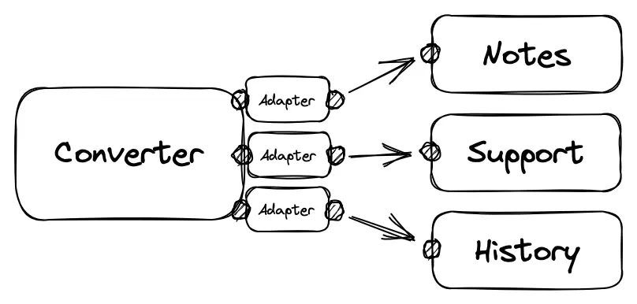
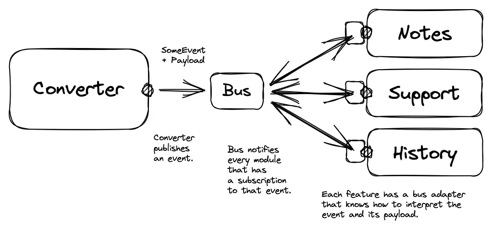

# Part 9. Decoupling Features with Events

[Last time](/blog/explicit-design-8), we created a new feature and implemented it, exploring how to develop and refine various modules with different levels of depth depending on the requirements. In this post, we will discuss how to make application slices more independent using events and when it may be justified.

<aside>

By the way, all the [source code for this series](https://github.com/bespoyasov/explicit-design)
and the [blog's source code](https://github.com/bespoyasov/www) are available on GitHub. Give
these repositories a star if you liked the post!

</aside>

## Vertical Slices Reviewed

Earlier, we mentioned that slices in the application help to scope [bounded contexts](https://martinfowler.com/bliki/BoundedContext.html) and represent features as independent parts of the application.

For small applications, the benefits of such separation may not be particularly noticeable and may not outweigh the costs of [“slicing” the app](https://en.wikipedia.org/wiki/Vertical_slice). However, for larger projects, this can be useful, especially for [micro frontends](https://micro-frontends.org), where each feature can be a [separate application](https://microfrontend.dev/architecture/#composablearch) written in a different technology stack.

Of course, it is possible to link features through direct calls in micro frontends, but this greatly limits the freedom of development and undermines the meaning of micro frontends. (Teams will have to synchronize work and wait for each other to publish significant changes in the project.)

Instead of direct calls in such projects, it is more convenient to organize communication between features through events.

## Coupling via Adapters

Last time, we connected features to each other through an adapter for the converter. In simple cases, this may be enough, but let's agree that our application is going to grow.

If, in addition to notes, the converter needs to notify other features about refreshed rates, the number of adapters can increase uncontrollably:



Each of the signals to other features is a point of coupling and a potential failure point. If we want to avoid direct coupling between features, we should not “notify each” feature by hand, but “send a signal” to the outside world that the rates have been updated. Following this principle, in response to this event, [other features will _decide for themselves_](https://en.wikipedia.org/wiki/Inversion_of_control) which of them and how to react to this event.



In the second case, the point of contact between the use case and the external world is only one, and no matter how many other reactions to this event we need to add, we will add them separately “somewhere outside”. This way of organizing is sometimes called event-driven, and the place where events are sent is called an _message bus_.

## Message Bus

Let's try to apply the idea of a [message bus](https://www.enterpriseintegrationpatterns.com/patterns/messaging/MessageBus.html) to our application. Instead of directly calling another feature, the converter will publish an event indicating that the rates have been updated and pass the values of these rates:

```ts
// core/ports.output
type PublishRefreshed = (rates: ExchangeRates) => void;
```

These messages will be sent to a “hub”, which will forward these messages to all interested parts of the application. “Interest” will be expressed by modules subscribing to specific events that they need to process. We will call this “hub” a message bus.

<aside>

Message bus, message queue, message broker, pub-sub model—each term has its own distinctive
features, and in some aspects, they intersect. We won't go into detail about the differences
between them, but I will leave useful links on the topic.

</aside>

Our bus will provide 3 interfaces: for publishing events, subscribing to them, and unsubscribing. These interfaces will be shared among all modules, so we will place them in the [Shared Kernel](http://ddd.fed.wiki.org/view/welcome-visitors/view/domain-driven-design/view/shared-kernel):

```ts
// shared/kernel

export type PublishEvent = (event: InternalEvent, data: EventPayload) => void;
export type SubscribeTo = (event: InternalEvent, handler: EventHandler) => void;
export type Unsubscribe = (event: InternalEvent, handler: EventHandler) => void;
```

Also, in the Shared Kernel, we will describe the types of events that can occur in different parts of the application:

```ts
// shared/kernel

type ConverterEvent = 'RatesRefreshed';

// Maybe in the future, we'll also have:
// type NotesEvent = "NoteCreated"
// type UserEvent = "SessionExpired"

export type InternalEvent = ConverterEvent; /* | NotesEvent | UserEvent | etc */
```

<aside>

We can use Shared Kernel because events (and the bus interface) will be used in different parts of
the application anyway. We don't create any “extra” coupling between modules, except for what is
necessary for modules to “communicate.” For more information on what Shared Kernel is and why it
is used, see [this post](https://herbertograca.com/2018/07/07/more-than-concentric-layers/).

</aside>

The implementation can vary widely depending on the requirements. For our application, we will take a [small library](https://github.com/developit/mitt) that will do almost everything for us:

```ts
// shared/infrastructure/bus

import mitt from 'mitt';

const emitter = mitt<Record<InternalEvent, Optional<string>>>();

export const publishEvent: PublishEvent = emitter.emit;
export const subscribeTo: SubscribeTo = emitter.on;
```

<aside>

Generally, the choice of library will [strongly depend](https://dataintensive.net) on requirements and conditions of use. For example, in distributed systems (such as micro frontends), it is important that the message is [guaranteed to be delivered to all subscribers, and only once](https://exactly-once.github.io/posts/exactly-once-delivery/).

In our case, the application is “monolithic,” and delivery will mainly be synchronous, so we can afford a simple in-memory bus.

</aside>

### Decoupling Features

We use our message bus to decouple features. In the use case of the converter, the first thing we do is replace the adapter with event publishing:

```ts
// converter/refreshRates

type Dependencies = {
	// ...
	publishRefreshed: PublishRefreshed;
};

export const createRefreshRates =
	({ publishRefreshed /* ... */ }: Dependencies): RefreshRates =>
	async () => {
		// ...
		publishRefreshed(rates);
	};
```

Let's rewrite the adapter so that it doesn't call a specific feature, but triggers the publish method on the bus:

```ts
// converter/infrastructure/bus

import type { PublishEvent } from '~/shared/kernel';
import type { PublishRefreshed } from '../../core/ports.output';

export const createPublisher =
	(publish: PublishEvent): PublishRefreshed =>
	(rates) => {
		const noteContent = JSON.stringify(rates, null, 2);
		publish('RatesRefreshed', noteContent);
	};

// converter/infrastructure/bus.composition

export const publishRefreshed: PublishRefreshed = createPublisher(publishEvent);
```

Then, we'll register the publisher:

```ts
// converter/refreshRates.composition

import { publishRefreshed } from '../../infrastructure/bus';

export const refreshRates: RefreshRates = withAnalytics(
	createRefreshRates({
		fetchRates,
		readConverter,
		saveConverter,
		publishRefreshed
	})
);
```

...And update tests:

```ts
// converter/refreshRates.test

// ...
const publishRefreshed = vi.fn();
const refreshRates = createRefreshRates({ publishRefreshed /*...*/ });

describe('when called', () => {
	// ...

	it('calls a message bus with the rates refreshed event', async () => {
		await refreshRates();
		expect(publishRefreshed).toHaveBeenCalledWith(rates);
	});
});
```

At first glance, nothing much has changed, but now, instead of changing the `refreshRates` use case code to notify the third feature about the update, we can allow the third feature to subscribe to the event itself, if it needs to.

The use case also does not need to know about the format in which other features want to work with the data. The event format is the same throughout the application, so it is enough to publish the event with the necessary data, and each subscriber will decide for itself how to convert this data into the format it needs for its work.

### Subscription to Events

Inside the notes feature, we will create a mechanism for subscribing to an event:

```ts
// notes/infrastructure/bus

import { subscribeTo, unsubscribeFrom } from '~/shared/infrastructure/bus';
import { createNote } from '../../core/createNote';

const subscribe = () => subscribeTo('RatesRefreshed', createNote);
const unsubscribe = () => unsubscribeFrom('RatesRefreshed', createNote);
```

In general, this could be a separate use case, but for simplicity we will skip this step. Let's subscribe to the event when the component is mounted, for example:

```ts
export const useBus = () => {
	useEffect(() => {
		subscribe();
		return unsubscribe;
	}, []);
};
```

...And initialize the subscription:

```ts
export function Notes() {
	useBus();
	// return ...
}
```

Using hooks is not necessary again because subscribing to the event bus is not dependent on the framework and generally not dependent on the UI.

### But isn't it... Redux? 🤨

The working principle of our message bus is suspiciously similar to Redux. If we don't delve into the details, the mental model almost coincides: events are actions, the bus is the store, subscriptions are well... subscriptions.

The difference here is probably in who initiates the subscription: in Redux, the entry point is the global store, while in our example, features themselves decide when and what to subscribe to. Events only come to those parts of the code that have decided to follow them.

Actions are also slightly different from events. Events describe what has already happened, while actions often say what [should happen](https://redux.js.org/tutorials/fundamentals/part-2-concepts-data-flow#actions). But in general, the approaches are indeed similar.

<aside>

By the way, I have even seen implementations of event buses made with Redux. I wouldn't recommend
pulling in the entire RTK just for a pub-sub pattern, as it seems excessive, but if the
application is already using Redux, you could, in principle, create a separate store and use it as
a “message bus.”

</aside>

However, not only Redux, but any tool that helps to establish “more or less decoupled” communication between modules is similar to a “message bus.” If you want to, you can reduce to an event-based model even atomic stores or observers.

The essence of the idea is in low coupling and communication through contracts (events, messages, actions, etc.), so “borrowing” ideas from such tools comes naturally 🙃

## Events and DDD

In DDD, events play an even more important role. They help coordinate the work of different bounded contexts and serve as the result of business workflows.

In the use case of the converter, we did something similar. We published the `RatesRefreshed` event based on the results of the user scenario:

```
Handle Command:       Perform Use Case:        Publish Event:
RefreshButtonClick -> [ FetchRates        ] -> RatesRefreshed
                      [ -> ReadConverter  ]
                      [ -> LookupRate     ]
                      [ -> CalculateQuote ]
                      [ -> SaveConverter  ]
```

This approach helps to think about workflows in the application as a transformation of commands into events.

DDD in its “canonical” form is not always necessary, but the idea of a proper separation of subdomains, representing processes as sequences of transformations and events, can help in designing an application.

## Next Time

In this series, we looked at how to write an application using various principles from books and discussed their benefits and usefulness. In the next post, we will summarize everything we've done, create a list of topics we haven't covered yet, and make a plan for continuing the series some time in the future.

## Sources and References

Links to books, articles, and other materials I mentioned in this post.

- [Source code for the current step on GitHub](https://github.com/bespoyasov/explicit-design/tree/main/09-decoupling-features-using-events)
- [Blog's source code for typos and corrections](https://github.com/bespoyasov/www)

### Architecture and Micro Frontends

- [Designing Data-Intensive Applications](https://dataintensive.net)
- [Micro Frontends, Architecture](https://microfrontend.dev/architecture/#composablearch)
- [More than concentric layers](https://herbertograca.com/2018/07/07/more-than-concentric-layers/)
- [Vertical slice, Wikipedia](https://en.wikipedia.org/wiki/Vertical_slice)
- [What are Micro Frontends?](https://micro-frontends.org)

### Messaging and Messaging Patterns

- [Exactly-once message delivery](https://exactly-once.github.io/posts/exactly-once-delivery/)
- [Message Queue vs Message Bus—what are the differences?](https://stackoverflow.com/questions/7793927/message-queue-vs-message-bus-what-are-the-differences)
- [Messaging Patterns](https://www.enterpriseintegrationpatterns.com/patterns/messaging/MessageBus.html)
- [Mitt, functional event emitter](https://github.com/developit/mitt)

### DDD and “Dogmatism”

- [Bounded Context](https://martinfowler.com/bliki/BoundedContext.html)
- [Domain Modeling Made Functional by Scott Wlaschin](/blog/domain-modelling-made-functional/)
- [Stop “doing” DDD](https://youtu.be/8XmXhXH_q90)

### Other Topics

- [Actions in Redux](https://redux.js.org/tutorials/fundamentals/part-2-concepts-data-flow#actions)
- [Inversion of control](https://en.wikipedia.org/wiki/Inversion_of_control)
- [Shared Kernel](http://ddd.fed.wiki.org/view/welcome-visitors/view/domain-driven-design/view/shared-kernel)

### Table of Contents for the Series

- [Introduction, assumptions, and limitations](/blog/explicit-design-series)
- [Modeling the domain](/blog/explicit-design-1)
- [Designing use cases](/blog/explicit-design-2)
- [Describing the UI as an “adapter” to the application](/blog/explicit-design-3)
- [Creating infrastructure to support use cases](/blog/explicit-design-4)
- [Composing the application using hooks](/blog/explicit-design-5)
- [Composing the application without hooks](/blog/explicit-design-6)
- [Dealing with cross-cutting concerns](/blog/explicit-design-7)
- [Extending functionality with a new feature](/blog/explicit-design-8)
- Decoupling features of the application (this post)
- [Overview and preliminary conclusions](/blog/explicit-design-10)
