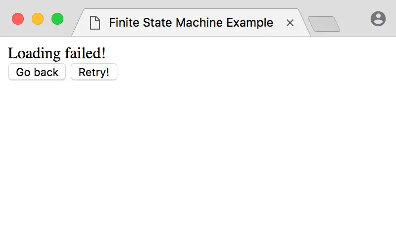
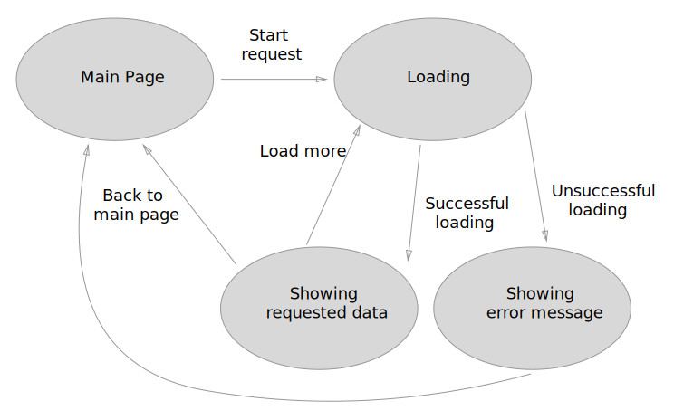

# Application State Management with Finite State Machines

A finite state machine is a model of a system that has a finite number of states and transitions between those states.

It sounds complicated, but you can think of it as a light bulb. The bulb has two states: “on” and “off”. To switch a light bulb from one state to another, we give a signal—we press the “on” button. Then a transition is triggered and the state of the bulb changes.

The set of states and transitions between them can be drawn as a graph, with states as vertices and transitions as edges.


This abstraction is good for building user interfaces. For example, to control the state of an application or some part of it.

## Sounds Complicated. What's the Point?

**All** state changes in the application are described in **one** place. For each transition, it is specified which signal will trigger it, which state it can come from, and which state the transition will lead to. If the transition cannot be made, either nothing happens or an exception can be thrown.

With a finite state machine there can't be a “we pressed something and everything disappeared” situation. This is because the cause and effect relationships are not scattered around the application in different places.

It is clear that if the system is very complex, then the number of transitions will grow quickly. But in this case you should think about splitting the application into several automata which do not depend on each other.

Also, the list of transitions makes it possible to quickly generate a bunch of autotests for state changes.

## Dummy Example App

Let's say we have an [app](https://bespoyasov.me/showcase/fsm/) that downloads data from the server at the click of a button.

This application has several states, which can be displayed on the screen.




Then possible transitions between states:

- From the main page to the “loading“ state by clicking on the “download” button;
- From the “loading” state to the data page, if everything is ok;
- Or to the error page, if something is wrong;
- From the data page or error page to the main page by pressing the “clear” button;
- From the data page to the “loading” state by pressing the “load more” button.

If we visualize this as a graph, it goes like this:



## Fake API

We will use JSON Placeholder to emulate data loading. Let's write a small function that will request data from the server:

```js
// api.js
const fetchPosts = async () => {
	const response = await fetch('https://jsonplaceholder.typicode.com/posts');
	const posts = await response.json();
	return posts;
};
```

## States, Transitions, and State Machine

Now let's describe the states for our state machine. The states will be located in the `states` object, where each state will be a string value of the keys inside:

```js
// fsm/states.js
const states = {
	INITIAL: 'idle',
	LOADING: 'loading',
	SUCCESS: 'success',
	FAILURE: 'failure'
};
```

Transitions will be functions that return a new state. We will use this new state to move the automaton to it.

There can be several conditions inside the function, which will decide which state we want to return.

```js
// fsm/transitions.js
const transitions = {
  [states.INITIAL]: {
    fetch: () => /* Returns states.LOADING */,
  },

  [states.LOADING]: {},

  [states.SUCCESS]: {
    reload: () => /* Returns states.LOADING */,
    clear: () => /* Returns states.INITIAL */,
  },

  [states.FAILURE]: {
    retry: () => /* Returns states.LOADING */,
    clear: () => /* Returns states.INITIAL */,
  },
}
```

The state machine itself will be described as a class. In the constructor we will pass the initial state, the list of possible transitions, and the data that the machine will contain.

The method `stateOf` will show what state the automaton is in now. The private method `updateState` will update the state and data if needed.

```js
// fsm/machine.js
class StateMachine {
	constructor({ initial, states, transitions, data = null }) {
		this.transitions = transitions;
		this.states = states;
		this.state = initial;
		this.data = data;
	}

	stateOf() {
		return this.state;
	}

	_updateState(newState, data = null) {
		this.state = newState;
		this.data = data;
	}
}
```

## Transition Trigger

To control transitions externally, we'll create a method called `performTransition`. It will accept the name of the transition and check whether the transition is possible. If it is possible, it will update the state.

```js
// fsm/machine.js
performTransition(transitionName) {
  const possibleTransitions = this.transitions[this.state]
  const transition = possibleTransitions[transitionName]
  if (!transition) return

  // Transition returns a new machine state.
  const newState = transition()
  this._updateState(newState)
}
```

In theory, it's simple: we load the data, so we put the machine into `states.LOADING`. If it's loaded, then we put it into `states.SUCCESS`. But in practice: how do we manage the event stream? How do we know that the data is actually loaded? How do we know that the request wasn't unsuccessful?

We see that when data is loaded, the machine goes through several states, and we need to handle all of them somehow. It seems to me that the best way to handle such a flow of events is to use generators.

## Generators and Asynchronous Generators

A generator is a function which execution can be paused and continued later. Generators are based on iterators, so any generator can be iterated through `for...of`.

In our case, if we want the state machine to take several states in a row, we can, for example, write it like this:

```js
function* transition() {
	yield states.LOADING;
	yield states.SUCCESS;
}
```

This generator will sequentially yield a load state and then a success state.

To get the data from the generator, we can iterate it manually:

```js
const generator = transition();
generator.next(); // { done: false, value: 'loading' }
generator.next(); // { done: false, value: 'success' }
generator.next(); // { done: true, value: undefined }
```

...Or using `for...of`:

```js
for (const state of transition()) {
	console.log(state);
}
```

Then, if we want to apply a similar transition to a the state machine, we can change the `performTransition` method a bit:

```js
// fsm/machine.js
performTransition(transitionName) {
  const possibleTransitions = this.transitions[this.state]
  const transition = possibleTransitions[transitionName]
  if (!transition) return

  // Using for...of here:
  for (const state of transition()) {
    this._updateState(state)
  }
}
```

But that's not enough 🙃<br />
After all, in addition to several states, we also have a request to the server, which must be processed.

The request is asynchronous, so we will use `await` to get its result. But `await` can only be used inside an asynchronous function, so the transition generator will become asynchronous too.

The asynchronous generator is almost the same as a regular generator, only it yields promises instead of values. And you have to iterate it through `for await...of`:

```js
// fsm/transitions.js
async function* transition() {
	yield states.LOADING;

	try {
		const data = await fetchPosts();
		yield states.SUCCESS;
	} catch (e) {
		yield states.FAILURE;
	}
}
```

Since the generator yields promises, we need `await` here too in order to “unwrap” them. So the `performTransition` method also becomes asynchronous.

```js
// fsm/machine.js
async performTransition(transitionName) {
  const possibleTransitions = this.transitions[this.state]
  const transition = possibleTransitions[transitionName]
  if (!transition) return

  for await (const newState of transition()) {
    this._updateState(newState)
  }
}
```

## Data Associated with Transition

We now process state when transitioning, but we don't use the data from the server anywhere yet.

In the state machine, have a field called `data` for this. We will update this field when we get data from the transition, if there is any:

```js
// fsm/transitions.js
async function* transition() {
	yield { newState: states.LOADING };

	try {
		const data = await fetchPosts();
		yield { newState: states.SUCCESS, data };
	} catch (e) {
		yield { newState: states.FAILURE };
	}
}
```

And in `performTransition` we populate the `data` field with it accordingly:

```js
// fsm/machine.js
async performTransition(transitionName) {
  const possibleTransitions = this.transitions[this.state]
  const transition = possibleTransitions[transitionName]
  if (!transition) return

  for await (const {newState, data=null} of transition()) {
    this._updateState(newState, data)
  }
}
```

## Render UI

Okay, now we have to draw it somehow on the screen. We could use some lib like React here, but we're writing everything from scratch, so we'll write our own renderer, too.

The `render` function will take the state of the machine and the data it contains. According to the state, it will choose which element to render. In case of React, not much will change, we will just return components instead of strings.

```js
// renderer.js
const render = (state, payload) => {
	switch (state) {
		case states.INITIAL:
			return `<div>...</div>`;

		case states.LOADING:
			return `<div>...</div>`;

		case states.FAILURE:
			return `<div>...</div>`;

		case states.SUCCESS:
			return `<div>...</div>`;

		default:
			return '';
	}
};
```

We'll use it like this:

```js
// index.js
const renderApp = (state, data) => {
	const html = render(state, data);
	document.getElementById('root').innerHTML = html;
};

renderApp(states.INITIAL);
```

Yeah-yeah, `innerHTML` is better not to use to avoid redrawing the whole application. But c'mon, that's not what this post is about 🙃

## Render Updated UI

We will use the same renderer when the state machine changes its state.

To track the transitions, we need to somehow subscribe to the state updates. Let's create method `subscribe` and update `updateState` a bit:

```js
// fsm/machine.js
subscribe(event, callback) {
  if (event === 'update') this._onUpdate = callback || null
}

_updateState(newState, data=null) {
  this.state = newState
  this.data = data

  this._onUpdate
    && this._onUpdate(newState, data)
}
```

Now create an instance of the state machine, and in `subscribe` pass the `update` event, to which we subscribe, and a callback:

```js
// index.js
const fsm = new StateMachine({
	states,
	transitions,
	initial: states.INITIAL
});

fsm.subscribe('update', (state, data) => renderApp(state, data));
```

And it remains to call transitions on events, for example when a user clicks a button. We will call the transitions using the `performTransition` method:

```js
// index.js
fsm.performTransition('fetch');
```

## “Load More” Button

I created two different ways to load data: one overrides the old data in the state machine, the other adds new data. They work through two different transitions: `loadMore` and `reload` from `states.SUCCESS` state.

I won't go down in details about these two, but I will leave a [link to source code](https://github.com/bespoyasov/fsm-example) if you are interested 🙃

## But Why Writing From Scratch?

Of course, you don't need to write it from scratch. There are plenty of libraries that implement finite state machines. For example, these ones:

- [javascript-state-machine](https://github.com/jakesgordon/javascript-state-machine)
- [xstate](https://github.com/davidkpiano/xstate)
- [stately.js](https://github.com/fschaefer/Stately.js)
- [react-automata](https://github.com/MicheleBertoli/react-automata)

But if you want to understand something properly, it's worth doing it from scratch. Just to get a grip with the problems the library solves, and begin to understand why you should use it at all and how it will help.

## Resources

There really are a lot of references this time.

### Finite State Machines

- [Getting from Redux to a state machine](http://krasimirtsonev.com/blog/article/getting-from-redux-to-state-machine-with-stent)
- [Robust React User Interfaces with Finite State Machines](https://css-tricks.com/robust-react-user-interfaces-with-finite-state-machines)
- [Finite State Machines on Wiki](https://en.wikipedia.org/wiki/Finite-state_machine)
- [FSM written in JavaScript](https://www.ibm.com/developerworks/ru/library/wa-finitemach1/index.html)

### Generators and Iterators

- [Generators on Javascript.info](https://javascript.info/generators)
- [Generators on MDN](https://developer.mozilla.org/en-US/docs/Web/JavaScript/Guide/Iterators_and_Generators)
- [Using async generators to stream data in JavaScript](https://www.youtube.com/watch?v=wrI-Jb0oFyk)

### Libraries

- [javascript-state-machine](https://github.com/jakesgordon/javascript-state-machine)
- [xstate](https://github.com/davidkpiano/xstate)
- [stately.js](https://github.com/fschaefer/Stately.js)
- [react-automata](https://github.com/MicheleBertoli/react-automata)

### Source Code and Sample App

- [Sample App](https://bespoyasov.me/showcase/fsm/)
- [Source Code](https://github.com/bespoyasov/fsm-example)
