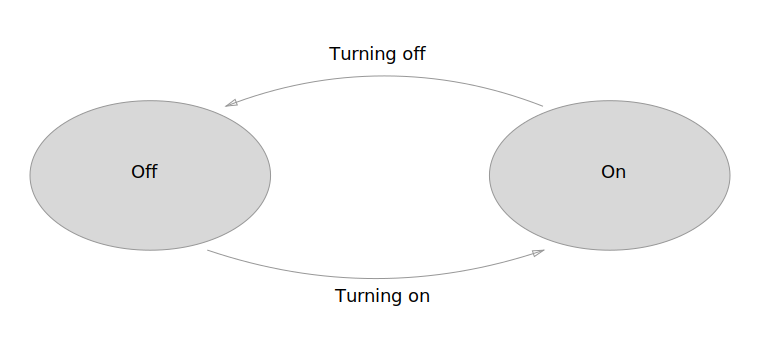
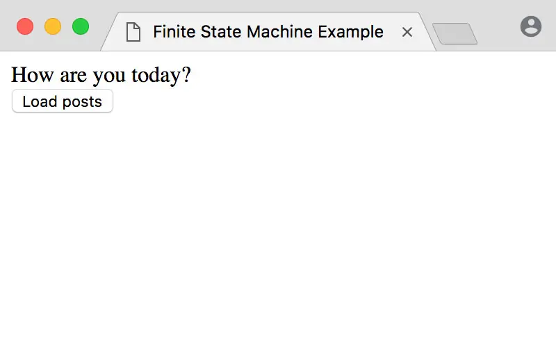
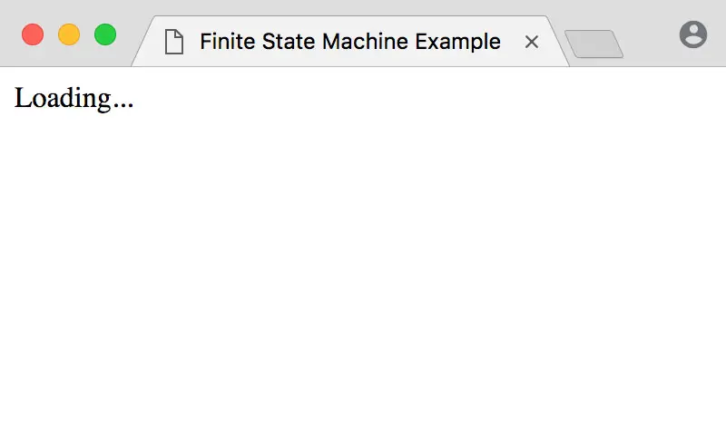
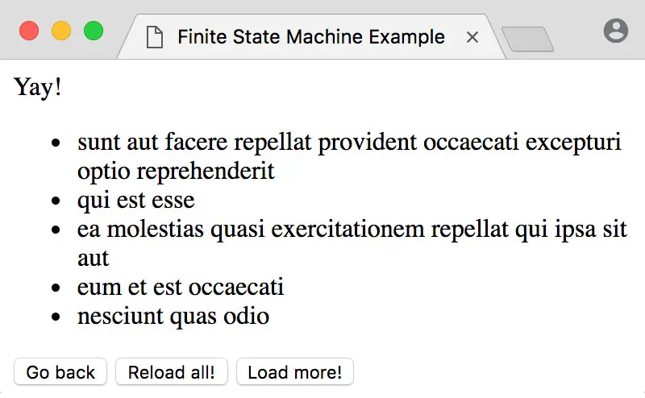
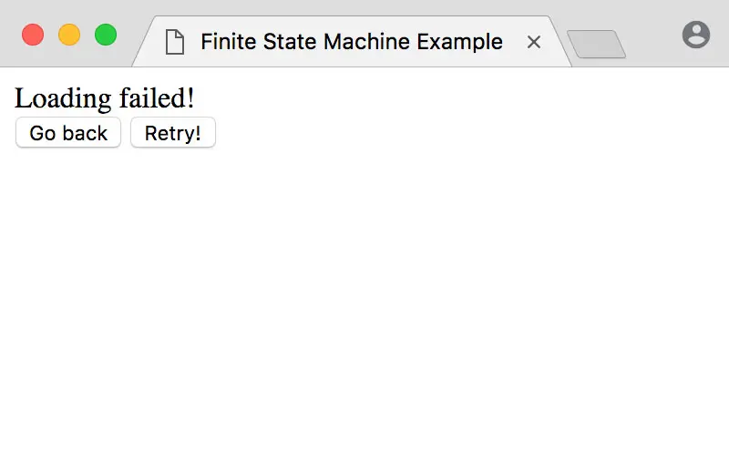
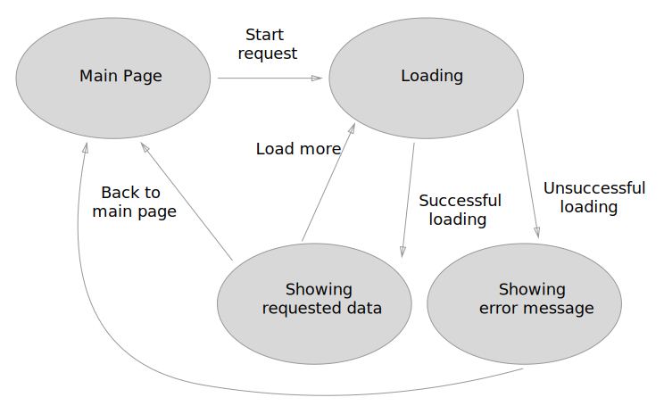

# Управление состоянием приложения с помощью конечного автомата

Конечный автомат — это модель системы, у которой есть конечное количество состояний и переходов между этими состояниями.

Звучит заумно, но всё это можно представить в виде лампочки. У неё есть два состояния: включена и выключена. Чтобы перевести лампочку из одного состояния в другое, мы подаём сигнал — нажимаем на кнопку включения. Тогда срабатывает переход, и состояние лампочки меняется.

Набор состояний и переходов между ними можно нарисовать в виде графа, где вершинами будут состояния, а рёбрами — переходы.



Такая абстракция хорошо подходит для построения пользовательских интерфейсов. Например — чтобы управлять состоянием приложения или какой-то его части.

## Чё-та сложна. В чём польза?

**Все** изменения состояния в приложении описываются в **одном** месте. Для каждого перехода указано, какой сигнал его запустит, из какого состояния это может произойти и в какое состояние этот переход приведёт. Если переход осуществить нельзя, то либо ничего не произойдёт, либо можно выбросить исключение.

С конечным автоматом не возникает ситуации, когда «мы что-то нажали, и всё исчезло». Потому что причинно-следственные связи прописаны жёстко и не разбросаны по приложению в разных местах.

Понятно, что если система очень сложная, то и количество переходов будет быстро расти. Но тогда стоит задуматься о разделении приложения на несколько автоматов, не зависящих друг от друга.

А ещё список переходов даёт возможность быстро нагенерировать кучу автотестов на изменения состояния.

## Обзор тупого приложения для примера

Допустим, у нас есть [приложение](https://bespoyasov.ru/showcase/fsm/), которое загружает данные с сервера по нажатию на кнопку. (Работает в последнем Хроме, за другие браузеры не ручаюсь. В Сафари точно не работает.)

В этом приложении есть несколько состояний, которые отображаются на экране.






Тогда возможные переходы между состояниями:

- с главной по нажатию на кнопку «загрузить» переходим в состояние загрузки;
- из состояния загрузки попадаем в отображение данных, если всё ок;
- либо в отображение ошибки, если что-то не ок;
- из отображения данных или ошибки можем попасть на главную по нажатию на кнопку «очистить»;
- из отображения данных можем перейти в состояние загрузки, если нажмём на кнопку «загрузить ещё».

Если представить это дело в виде графа, то получится так:



## Фейковое API

Для эмуляции загрузки данных будем использовать джейсон-плейсхолдер. Напишем небольшую функцию, которая будет запрашивать данные с сервера:

```js
// api.js
const fetchPosts = async () => {
	const response = await fetch('https://jsonplaceholder.typicode.com/posts');
	const posts = await response.json();
	return posts;
};
```

## Состояния, переходы и сам автомат

Теперь опишем состояния для нашего автомата. Состояния будут находиться в объекте `states`, где каждое состояние будет строковым значением ключей внутри:

```js
// fsm/states.js
const states = {
	INITIAL: 'idle',
	LOADING: 'loading',
	SUCCESS: 'success',
	FAILURE: 'failure'
};
```

Переходы будут функциями, которые возвращают новое состояние. Это новое состояние мы будем использовать, чтобы перевести автомат в него.

Внутри функции может быть несколько условий, по которым мы будем решать, какое состояние требуется вернуть.

```js
// fsm/transitions.js
const transitions = {
  [states.INITIAL]: {
    fetch: () => /* возвращает states.LOADING */,
  },

  [states.LOADING]: {},

  [states.SUCCESS]: {
    reload: () => /* возвращает states.LOADING */,
    clear: () => /* возвращает states.INITIAL */,
  },

  [states.FAILURE]: {
    retry: () => /* возвращает states.LOADING */,
    clear: () => /* возвращает states.INITIAL */,
  },
}
```

Сам автомат опишем в виде класса. В конструктор будем передавать начальное состояние, список возможных переходов, и данные, которые будет содержать автомат.

Метод `stateOf` будет показывать, в каком состоянии находится автомат сейчас. Приватный метод `updateState` будет обновлять состояние и данные, если требуется.

```js
// fsm/machine.js
class StateMachine {
	constructor({ initial, states, transitions, data = null }) {
		this.transitions = transitions;
		this.states = states;
		this.state = initial;
		this.data = data;
	}

	stateOf() {
		return this.state;
	}

	_updateState(newState, data = null) {
		this.state = newState;
		this.data = data;
	}
}
```

## Запуск переходов

Чтобы можно было управлять переходами извне, создадим метод `performTransition`. Он будет принимать название перехода и проверять, возможен ли такой переход. Если возможен, то будет обновлять состояние.

```js
// fsm/machine.js
performTransition(transitionName) {
  const possibleTransitions = this.transitions[this.state]
  const transition = possibleTransitions[transitionName]
  if (!transition) return

  // переход возвращает новое состояние для автомата
  const newState = transition()
  this._updateState(newState)
}
```

В теории всё просто: вот мы загружаем данные, значит переводим автомат в `states.LOADING`. Вот они загрузились, значит переводим в `states.SUCCESS`. Но на деле: как управлять потоком событий? как узнать, что данные действительно загрузились? как определить, что не произошла ошибка по пути?

Мы видим, что при загрузке данных автомат по очереди сменяет несколько состояний, и нам требуется их все как-то обработать. Мне кажется, удобнее всего для работы с таким потоком событий использовать генераторы.

## Генераторы и асинхронные генераторы

Генератор — это функция, которая может приостанавливать своё выполнение и продолжать его позже. В основе работы генераторов лежат итераторы, поэтому любой генератор можно проитерировать через `for...of`.

В нашем случае, если мы хотим, чтобы автомат принимал последовательно несколько состояний, то мы можем, например, записать это так:

```js
function* transition() {
	yield states.LOADING;
	yield states.SUCCESS;
}
```

Этот генератор будет последовательно выбрасывать состояние загрузки, а в потом — состояние успеха.

Чтобы получить данные из генератора, мы можем проитерировать его вручную:

```js
const generator = transition();
generator.next(); // { done: false, value: 'loading' }
generator.next(); // { done: false, value: 'success' }
generator.next(); // { done: true, value: undefined }
```

Либо через `for...of`:

```js
for (const state of transition()) {
	console.log(state);
}
```

Тогда если мы хотим применить подобный переход к автомату, то мы немного изменим метод `performTransition`:

```js
// fsm/machine.js
performTransition(transitionName) {
  const possibleTransitions = this.transitions[this.state]
  const transition = possibleTransitions[transitionName]
  if (!transition) return

  // вот тут используем for ... of
  for (const state of transition()) {
    this._updateState(state)
  }
}
```

Но этого мало 🙃<br />
Ведь помимо нескольких состояний, у нас есть ещё и запрос на сервер, который надо обработать.

Запрос асинхронный, чтобы получить его результат, мы будем использовать `await`. Но `await` можно использовать только внутри асинхронной функции, поэтому генератор перехода станет асинхронным.

Асинхронный генератор почти не отличается от обычного, только вместо значений он выбрасывает промисы. И итерировать его придётся через `for await...of`:

```js
// fsm/transitions.js
async function* transition() {
	yield states.LOADING;

	try {
		const data = await fetchPosts();
		yield states.SUCCESS;
	} catch (e) {
		yield states.FAILURE;
	}
}
```

Так как генератор выбрасывает промисы, то чтобы их развернуть, нам и здесь понадобится `await`. Поэтому метод `performTransition` тоже становится асинхронным.

```js
// fsm/machine.js
async performTransition(transitionName) {
  const possibleTransitions = this.transitions[this.state]
  const transition = possibleTransitions[transitionName]
  if (!transition) return

  for await (const newState of transition()) {
    this._updateState(newState)
  }
}
```

## Не только состояние, но ещё и данные

Состояния мы теперь записываем и обрабатываем, но пока что никуда не записываем данные от сервера.

В автомате для этого у нас есть поле `data`. Будем его обновлять при получении данных из перехода если они есть:

```js
// fsm/transitions.js
async function* transition() {
	yield { newState: states.LOADING };

	try {
		const data = await fetchPosts();
		yield { newState: states.SUCCESS, data };
	} catch (e) {
		yield { newState: states.FAILURE };
	}
}
```

И в `performTransition` соответственно записываем их в поле `data`:

```js
// fsm/machine.js
async performTransition(transitionName) {
  const possibleTransitions = this.transitions[this.state]
  const transition = possibleTransitions[transitionName]
  if (!transition) return

  for await (const {newState, data=null} of transition()) {
    this._updateState(newState, data)
  }
}
```

## Рендер интерфейса

Окей, теперь надо это как-то отрисовать. Можно сюда вкорячить какой-нибудь Реакт, но мы пишем всё с нуля, поэтому и отрисовщик напишем тоже свой.

Функция-рендер будет принимать состояние автомата и данные, которые он содержит. По состоянию будет выбирать, какой шаблон надо отрисовывать. Если использовать Реакт, то не многое изменится: мы просто будем возвращать не строки, а компоненты.

```js
// renderer.js
const render = (state, payload) => {
	switch (state) {
		case states.INITIAL:
			return `<div>...</div>`;

		case states.LOADING:
			return `<div>...</div>`;

		case states.FAILURE:
			return `<div>...</div>`;

		case states.SUCCESS:
			return `<div>...</div>`;

		default:
			return '';
	}
};
```

Использовать это будем так:

```js
// index.js
const renderApp = (state, data) => {
	const html = render(state, data);
	document.getElementById('root').innerHTML = html;
};

renderApp(states.INITIAL);
```

Да-да, `innerHTML` лучше не использовать, приложение лучше полностью не перерисовывать. Но камон, этот пост не об этом 🙃

## Отрисовка изменений

Тот же рендер мы будем использовать и когда автомат будет менять своё состояние.

Чтобы отследить изменения, нам понадобится как-то подписаться на обновления состояния. Создадим метод `subscribe` и чуть обновим `updateState`:

```js
// fsm/machine.js
subscribe(event, callback) {
  if (event === 'update') this._onUpdate = callback || null
}

_updateState(newState, data=null) {
  this.state = newState
  this.data = data

  this._onUpdate
    && this._onUpdate(newState, data)
}
```

Теперь создадим экземпляр автомата, и в `subscribe` передадим событие `update`, на которое подписываемся и колбек:

```js
// index.js
const fsm = new StateMachine({
	states,
	transitions,
	initial: states.INITIAL
});

fsm.subscribe('update', (state, data) => renderApp(state, data));
```

И осталось повесить вызовы переходов на события, например — клики по кнопкам. Вызывать переходы будем методом `performTransition`:

```js
// index.js
fsm.performTransition('fetch');
```

## Кнопка «загрузить ещё»

Я сделал два разных способа загрузки данных: один перетирает старые данные из автомата, второй — добавляет новые к старым. Работают они через два разных перехода: `loadMore` и `reload` от состояния `states.SUCCESS`.

В этой статье это уже не поместится, но [ссылку на исходники](https://github.com/bespoyasov/fsm-example) я оставлю, если интересно почитайте 🙃

## Но зачем писать с нуля

Конечно, писать с нуля это не надо. Есть куча библиотек, которые реализуют конечные автоматы. Например, вот:

- [javascript-state-machine](https://github.com/jakesgordon/javascript-state-machine)
- [xstate](https://github.com/davidkpiano/xstate)
- [stately.js](https://github.com/fschaefer/Stately.js)
- [react-automata](https://github.com/MicheleBertoli/react-automata)

Но если в чём-то хочется разобраться нормально, то стоит сделать это с нуля. Просто для того, чтобы упереться в проблемы, которые библиотека решает, и начать понимать, зачем её вообще использовать и чем она поможет.

## Ссылки по теме

В этот раз ссылок действительно много.

### Статьи о конечных автоматах

- [От Редакса к автоматам](http://krasimirtsonev.com/blog/article/getting-from-redux-to-state-machine-with-stent)
- [Конечный автомат на примере плавающей боковой панели](https://medium.com/@vursen/state-machine-for-sticky-blocks-70ca0bf4ee97)
- [Крепкие интерфейсы с помощью конечных автоматов](https://css-tricks.com/robust-react-user-interfaces-with-finite-state-machines)
- [Конечный автомат на Википедии](https://ru.wikipedia.org/wiki/Конечный_автомат)
- [Теория и реализация](https://tproger.ru/translations/finite-state-machines-theory-and-implementation/)
- [Конечный автомат на Джаваскрипте](https://www.ibm.com/developerworks/ru/library/wa-finitemach1/index.html)

### О генераторах и итераторах

- [На learn.javascript.ru](https://learn.javascript.ru/generator)
- [На developer.mozilla.org](https://developer.mozilla.org/ru/docs/Web/JavaScript/Guide/Iterators_and_Generators)
- [Асинхронные генераторы на ютубе](https://www.youtube.com/watch?v=wrI-Jb0oFyk)

### Библиотеки

- [javascript-state-machine](https://github.com/jakesgordon/javascript-state-machine)
- [xstate](https://github.com/davidkpiano/xstate)
- [stately.js](https://github.com/fschaefer/Stately.js)
- [react-automata](https://github.com/MicheleBertoli/react-automata)

### Материалы к статье

- [Пример работы](https://bespoyasov.ru/showcase/fsm/)
- [Ссылка на исходники](https://github.com/bespoyasov/fsm-example)
