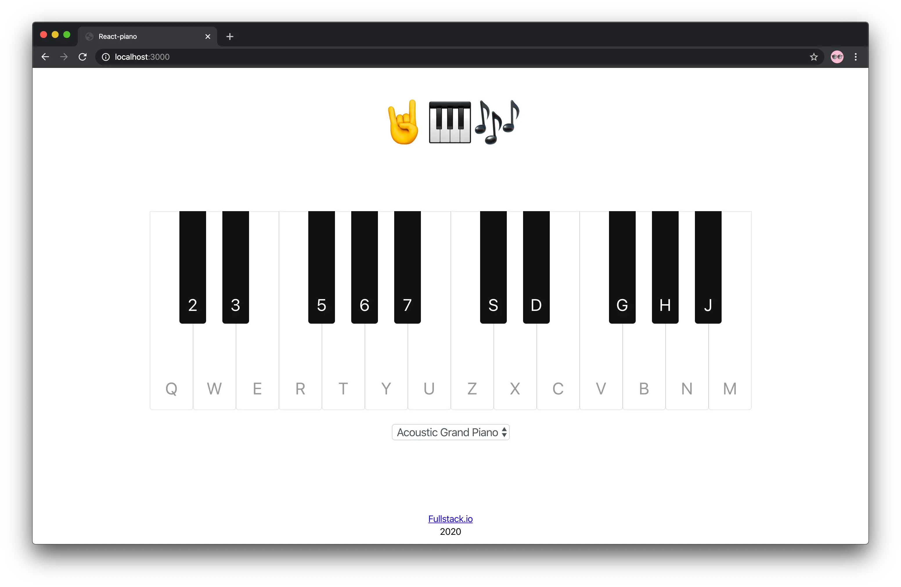
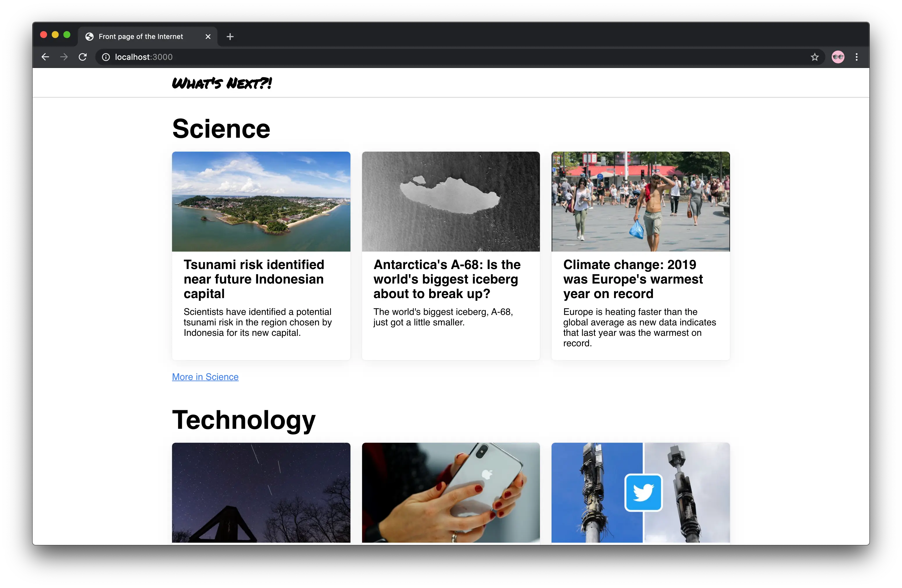

# Fullstack React with TypeScript

Maxim Ivanov and I published the book [“Fullstack React with TypeScript”](https://www.newline.co/fullstack-react-with-typescript) with the support of Newline publisher. I wrote chapters 3 and 5 for it.

## Chapter 3. React Patters

In chapter 3, using the example of a virtual musical keyboard, I described such patterns as _Render-Props_ and _Higher Order Component_ and how to solve the same problem with React Hooks.

In it, I explained the basics of music theory and showed how we would represent notes and their relationships in TypeScript. I described the specifics of working with types and interfaces, and explained how we can separate the business logic from the UI layer of the application.

Explaining complex concepts, like _Higher Order Component_, I started with the simplest cases—using examples of simple functions and describing data flows step by step.

Here I purposely chose a musical keyboard to show how to solve the same problem in different ways, using different patterns. In this way, the examples are more illustrative and it is easier to compare the methods with each other.

## Chapter 5. SSG and SSR with Next.js

In chapter 5, using a news site as an example, I showed how to use Next.js for static site generation and server side rendering.

I showed the advantages of SSR and SSG and how to set up SSR and SSG with Next. I explained how to use _next-redux-wrapper_ to manage state before and during hydration. Walked readers through the steps from initializing a new project to building and deploying a project.

Showed the difference between static site generation and server-side rendering per request. Told what and under what circumstances is better to use.

In addition to the text with code examples, the book comes with the source code of each of the applications, as well as each step of creation separately.

## What Else

The book also touched on testing React projects with TypeScript, described working with data, and talked about state management. We talked about _tsconfig.json_, how to render React into a console application, and how to work with GraphQL and automatically generate types.

## Target Audience

This book is for those who know a little bit about React, and almost nothing about TypeScript. We cover and explain the basics of typing and integrating TS into projects.

We assume that readers know the basics of JavaScript, are superficially familiar with CSS, and are familiar with the concept of component lifecycle in React.

If you wanted to try working with TypeScript and try it with React or just want to support the authors, you can [purchase the book](https://www.newline.co/fullstack-react-with-typescript) on the publisher's website.
