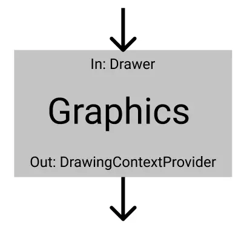
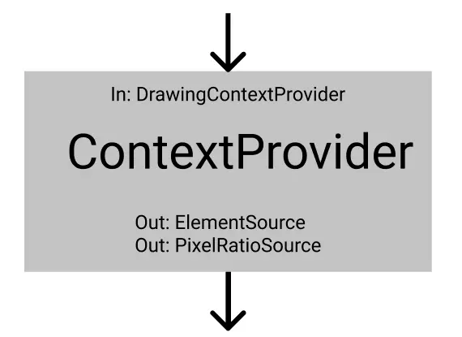
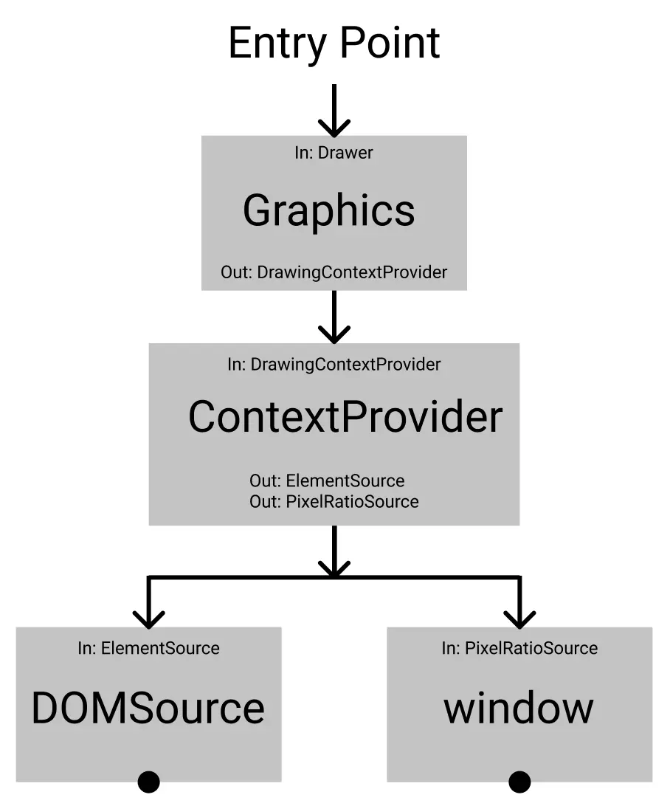
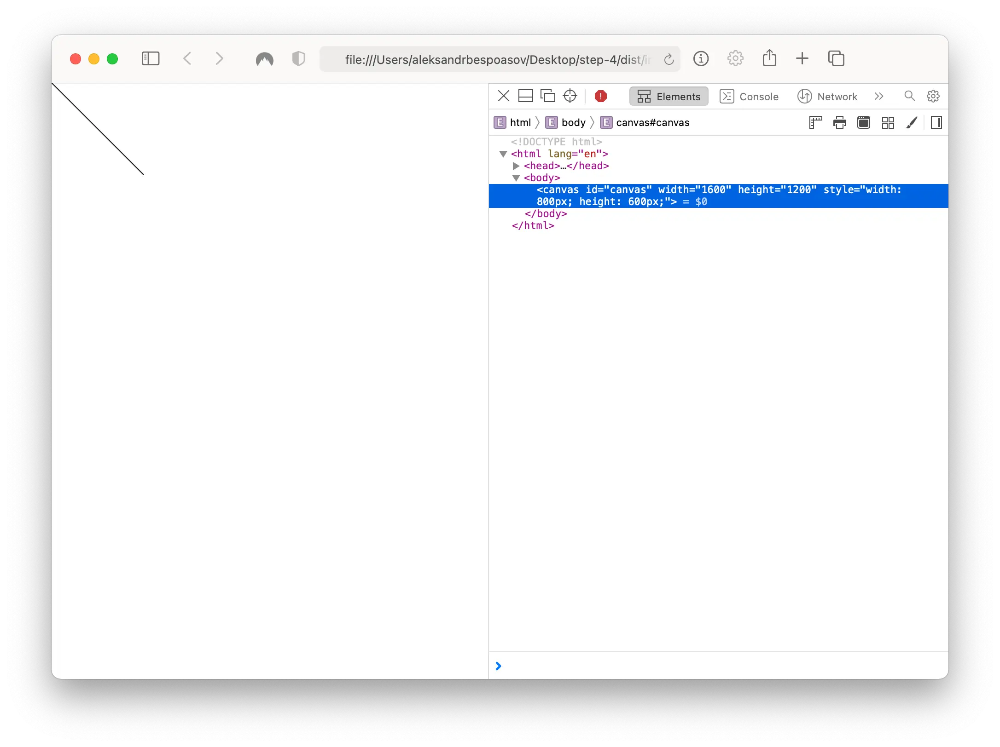

# Generating Trees Images, Part 2. Geometry, Graphics and DOM

Let's continue creating trees images generator!

In the [previous post](/blog/generating-trees-on-canvas-using-typescript-and-oop), we designed the application architecture, set up the environment and dependency injection. In the end, we created an L-Systems module that could generate a string representation of a tree.

In this post, we're going to create a geometry module. It will calculate points position on a `canvas`. After, we will create a DOM adapter for accessing `canvas` elements. In the end, we will display the first image on the screen.

## Geometry Module

The second module in the domain layer is geometry. We [split its interface](https://en.wikipedia.org/wiki/Interface_segregation_principle) into 2 parts:

- `ShapeBuilder`, will create geometric shapes,
- `StartSelector`, will select a starting point on the canvas for the first line.

Let's define a public API:

```ts
// src/geometry/shape/types.ts

export interface ShapeBuilder {
	createLine(start: Point, length: Length, angle?: Angle): Line;
}
```

Add missing domain types:

```ts
// typings/geometry.d.ts

type PixelsAmount = number;
type DegreesAmount = number;
type Coordinate = number;

type Length = PixelsAmount;
type Angle = DegreesAmount;

type Point = {
	x: Coordinate;
	y: Coordinate;
};

type Size = {
	width: Length;
	height: Length;
};

type Line = {
	start: Point;
	end: Point;
};
```

Now, let's implement the module:

```ts
// src/geometry/shape/implementation.ts

import { ShapeBuilder } from './types';

export class CoreShapeBuilder implements ShapeBuilder {
	public createLine(start: Point, length: Length, angle: Angle = 0): Line {
		const radians = (angle * Math.PI) / 180;
		const end: Point = {
			x: start.x + length * Math.sin(radians),
			y: start.y - length * Math.cos(radians)
		};

		return { start, end };
	}
}
```

The tree “grows” from the bottom of the `canvas` to the top, so we decrease the Y coordinate by the line length. If the angle is set we change the point position accordingly.

Let's register the module:

```ts
// src/geometry/shape/composition.ts

import { container } from '../../composition';
import { CoreShapeBuilder } from './implementation';
import { ShapeBuilder } from './types';

container.registerSingleton<ShapeBuilder, CoreShapeBuilder>();

// Also, we need to import `src/geometry/shape/composition.ts`
// inside of `src/composition/index.ts`.
// Later, I won't remind you of composition imports.
```

### Side Note About Naming and Standard Implementations

In fact, I don't really like the name `CoreShapeBuilder`. It would be okay to use just `ShapeBuilder` but this name is already taken by the interface.

If an interface can be implemented only in 1 way, we can use [class methods as the public API](https://thomaspoignant.medium.com/java-how-to-name-interface-and-implementor-94c0fa564b87):

```ts
class ShapeBuilder {
	/* ... */
}

container.registerSingleton<ShapeBuilder>();
```

However, _for consistency_ we will use both the interface and implementation.

By the way, in C# the naming issue is [solved](https://docs.microsoft.com/en-us/dotnet/standard/design-guidelines/names-of-classes-structs-and-interfaces) with `I` prefixes.

### Selecting Starting Point

For selecting an initial point, we will create another module. Define a public API:

```ts
// src/geometry/location/types.ts

export interface StartSelector {
	selectStart(): Point;
}
```

For implementing the `selectStart` method, we need to know the `canvas` size. We can solve this in 2 ways:

- pass the size as an argument for the method;
- create a settings object for the whole application where to keep all the configs.

I decided to use the second example just to show how to inject these kinds of objects. Let's create the method:

```ts
// src/geometry/location/implementation.ts

import { AppSettings } from '../../settings';
import { StartSelector } from './types';

export class StartPointSelector implements StartSelector {
	public selectStart(): Point {
		const { width, height } = this.settings.canvasSize;

		return {
			x: Math.round(width / 2),
			y: height
		};
	}
}
```

Inside, we refer to `this.settings.canvasSize`. Right now, we don't have this field, we need to create it.

```ts
// 1. Напрямую:
export class StartPointSelector {
	settings = {
		/*…*/
	};
}

// 2. Через конструктор:
export class StartPointSelector {
	constructor(settings) {
		this.settings = settings;
	}
}
```

The most convenient way would be to use the second option. Thus, we can delegate all the work of selecting the object to the DI container.

```ts
// src/geometry/location/implementation.ts

export class StartPointSelector implements StartSelector {
	// This entry immediately assigns a value to the private field,
	// we won't have to duplicate it in the class by hand:
	constructor(private settings: AppSettings) {}

	// …
}
```

In the code above, we tell the container:

> — When you create an instance of the `StartPointSelector` class pass in its constructor _something that implements `AppSettings`_

Since we request an interface we [don't depend on any implementation details](https://en.wikipedia.org/wiki/Dependency_inversion_principle). It doesn't matter if the implementation is a class instance or a plain object. The only thing that matters is that this object contains all the properties defined in the interface.

Later, all the dependencies we will inject this way.

### Creating Settings

There's not much code, so we will do it in one file:

```ts
// src/settings/index.ts

import { container } from '../composition';

export type AppSettings = {
	canvasSize: Size;
};

export const settings: AppSettings = {
	canvasSize: {
		width: 800,
		height: 600
	}
};

container.registerSingleton<AppSettings>(() => settings);
```

On the last line, we register the `settings` object as something that implements `AppSettings`. From now on, any module that requests `AppSettings` in its constructor will get the `settings` object.

In the last post we discussed how a container works—it [replaces interfaces with specific objects](https://github.com/wessberg/di-compiler#faq). Usually it's instances of classes, but in the case of settings it's just an object. You can do it that way too 🙂

### Registering Module

Let's register the geometry module:

```ts
// src/geometry/location/composition.ts

import { container } from '../../composition';
import { StartPointSelector } from './implementation';
import { StartSelector } from './types';

container.registerSingleton<StartSelector, StartPointSelector>();
```

Done! The domain layer is all set.

## Working with Graphics

With good architecture, we can work on each layer independently.

A part of the team can work on the domain layer, another—on the application or adapters layer. As long as developers are agreed on the modules' API they can work on implementation separately.

Let's try to jump over the application layer and start working on adapters to see if this is indeed possible.

The adapter we're going to work on is graphics. Let's define its public API:



The module will provide a `Drawer` interface and will depend on `DrawingContextProvider`. Remember adapter has to satisfy the application need: we want the outer world to play by our rules, not otherwise.

Notice that we don't name it `CanvasDrawer` but just `Drawer`. The interface name should be abstract so that different modules could implement it:

- `CanvasDrawer` for drawing on a `canvas`,
- `SvgDrawer` for working with `SVG` elements, etc.

This also helps to hide the implementation details from the external world. So when we need to change the implementation [all the other modules](https://en.wikipedia.org/wiki/Open–closed_principle) stay the same.

The `DrawingContextProvider` will provide access to a `canvas` element. Why not get the element from the DOM right here?

We want to [separate concerns](https://en.wikipedia.org/wiki/Single-responsibility_principle) between entities, so each module should have only one task to perform. “Providing access” and “handling drawing commands” are different tasks, so we need separate entities for them.

### `Drawer` Interface

In the `Drawer` interface, we define the `drawLine` method. It will take a line and “brush” settings as arguments:

```ts
// src/graphics/drawer/types.ts

export type BrushSettings = {
	color?: Color;
	width?: PixelsAmount;
};

export interface Drawer {
	drawLine(line: Line, settings?: BrushSettings): void;
}
```

Also, add the type annotations:

```ts
// typings/graphics.d.ts

type HexadecimalColor = string;
type Color = HexadecimalColor;
```

### Drawer Implementation

Let's define dependencies and implement the public API:

```ts
// src/graphics/drawer/implementation.ts

import { DrawingContext, DrawingContextProvider } from '../context/types';
import { Drawer, BrushSettings } from './types';

export class CanvasDrawer implements Drawer {
	private context: DrawingContext = null;

	constructor(private contextProvider: DrawingContextProvider) {
		this.context = this.contextProvider.getInstance();
		if (!this.context) throw new Error('Failed to access the drawing context.');
	}

	public drawLine({ start, end }: Line, { color, width }: BrushSettings = {}): void {
		// Handle the drawing commands here...
	}
}
```

In the constructor, we get access to a `DrawingContextProvider`. It will provide an element that can be drawn on. If there is no element an error will be thrown.

This class “translates” a given line into API calls on the element provided by `DrawingContextProvider`.

In our case, this element is a DOM node. However, it can be basically anything with compatible APIs. That's the reason why we don't access the DOM directly in the `Drawer`.

The `DrawingContext` by the way is only a wrapper:

```ts
export type DrawingContext = Nullable<CanvasRenderingContext2D>;
```

This isn't very good because it _binds us to `CanvasRenderingContext2D` methods_:

```ts
// src/graphics/drawer/implementation.ts

export class CanvasDrawer implements Drawer {
	// ...

	public drawLine({ start, end }: Line, { color, width }: BrushSettings = {}): void {
		if (!this.context) return;

		this.context.strokeStyle = color ?? DEFAULT_COLOR;
		this.context.lineWidth = width ?? DEFAULT_WIDTH;

		// The beginPath, moveTo, lineTo, and stroke methods are
		// a direct dependency on `CanvasRenderingContext2D`:

		this.context.beginPath();
		this.context.moveTo(start.x, start.y);
		this.context.lineTo(end.x, end.y);
		this.context.stroke();
	}
}
```

Ideally, we would write a [facade](https://github.com/kamranahmedse/design-patterns-for-humans#-facade) for those methods and provide an API like:

```ts
this.context.line(start, end);
```

But in that case, the post will be even bigger 😃<br />
So we won't implement the facade but we will keep it in mind.

### Registering Drawer

Finally, add the drawer registration to the container:

```ts
// src/graphics/drawer/composition.ts

import { container } from '../../composition';
import { CanvasDrawer } from './implementation';
import { Drawer } from './types';

container.registerSingleton<Drawer, CanvasDrawer>();
```

## Designing `DrawingContextProvider`

`DrawingContextProvider` depends on 2 things:

- `ElementSource`, provides the `canvas` element;
- `PixelRatioSource`, provides the information about pixel density of the screen.

We need the second one to normalize the `canvas` size because displays with higher pixel density need to rescale the element for the image to be sharper.



Опишем интерфейс для провайдера и контекста. (Помним, что по-хорошему контекст должен быть фасадом над `CanvasRenderingContext2D`.)

```ts
// src/graphics/context/types.ts

// Keep in mind that the context
// should be a facade over `CanvasRenderingContext2D`.

export type DrawingContext = Nullable<CanvasRenderingContext2D>;

export interface DrawingContextProvider {
	getInstance(): DrawingContext;
}
```

### Implementing Provider

Inside, we will keep references to the element and its 2D-context:

```ts
import { AppSettings } from '../../settings';
import { ElementSource, PixelRatioSource } from '../../dom/types';
import { DrawingContext, DrawingContextProvider } from './types';

export class CanvasContextProvider implements DrawingContextProvider {
	private element: Nullable<HTMLCanvasElement> = null;
	private context: Nullable<DrawingContext> = null;

	constructor(
		private elementSource: ElementSource,
		private pixelRatioSource: PixelRatioSource,
		private settings: AppSettings
	) {
		const element = this.elementSource.getElementById('canvas');
		if (!element) throw new Error('Failed to find a canvas element.');

		this.element = element as HTMLCanvasElement;
		this.context = this.element.getContext('2d');
		this.normalizeScale();
	}

	public getInstance(): DrawingContext {
		return this.context;
	}

	// ...
}
```

In the constructor, we get access to the element via `ElementSource` and if successful get its 2D-context. Then we normalize the element scale.

From the `getInstance` method return the context. Notice that the element itself is kept private. It's encapsulated in this class and no other module knows how exactly the context is created.

If we decide to migrate from `canvas` to `SVG` we will only need to change this class. (If the `DrawingContext` is a facade of course 😃)

Scale normalization is performed in this class as well. No other module should be worried about how to get `canvas` ready. [You can find its code on GitHub ;–)](https://github.com/bespoyasov/treees/blob/a09fce0cbd69c8f078d257c3c5b01eb6aedeb6e4/src/graphics/context/implementation.ts#L26)

### Registering Provider

As always, add the module to the container:

```ts
// src/graphics/context/composition.ts

import { container } from '../../composition';
import { CanvasContextProvider } from './implementation';
import { DrawingContextProvider } from './types';

container.registerSingleton<DrawingContextProvider, CanvasContextProvider>();
```

### What Else

We also need to create and register `ElementSource` and `PixelRatioSource`. The first one is an adapter for `document`, the second one is `window`.

```ts
// src/dom/types.ts

export interface ElementSource {
	getElement(id: string): Nullable<HTMLElement>;
}

export interface PixelRatioSource {
	devicePixelRatio?: number;
}
```

You can find the [implementation of these modules on GitHub as well](https://github.com/bespoyasov/treees/tree/main/src/dom).

## Combining Modules

Right now, the adapters diagram looks like this:



Modules [depend on interfaces](https://ota-solid.now.sh/dip) of other modules. This makes it easier to refactor and update the code, replace modules with others.

### Testing Application

To test how the drawer works we access an object that implements the `Drawer` interface and calls the `drawLine` method with 2 points:

```ts
// src/index.ts

import { container } from './composition';
import { Drawer } from './graphics/types';

const drawer = container.get<Drawer>();

drawer.drawLine({
	start: { x: 0, y: 0 },
	end: { x: 100, y: 100 }
});
```

This code should draw a diagonal line on the `canvas`:



Works! 🎉

The only thing to do now is to connect graphics and the domain layer 🤓

## To Be Continued

In [the last part](/blog/generating-trees-on-canvas-using-typescript-and-oop-3) of the post, we will write a “translator” for L-System characters. Also, we will generate the Pythagoras tree and add some randomness to make it look more like a real tree.

## Resources

- [First Part of the Post](/blog/generating-trees-on-canvas-using-typescript-and-oop)
- [Last Part of the Post](/blog/generating-trees-on-canvas-using-typescript-and-oop-3)
- [Application](https://bespoyasov.me/showcase/treees/)
- [Source on GitHub](https://github.com/bespoyasov/treees)

### SOLID Principles

- [Single-Responsibility Principle, SRP](https://en.wikipedia.org/wiki/Single-responsibility_principle)
- [Open-Closed Principle, OCP](https://en.wikipedia.org/wiki/Open–closed_principle)
- [Liskov Substitution Principle, LSP](https://en.wikipedia.org/wiki/Liskov_substitution_principle)
- [Interface Segregation Principle, ISP](https://en.wikipedia.org/wiki/Interface_segregation_principle)
- [Dependency Inversion Principle, DIP](https://en.wikipedia.org/wiki/Dependency_inversion_principle)

### Tools and Patterns

- [How the Transformer Works](https://github.com/wessberg/di-compiler#faq)
- [Facade Pattern](https://github.com/kamranahmedse/design-patterns-for-humans#-facade)
