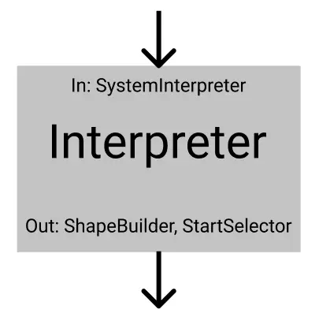
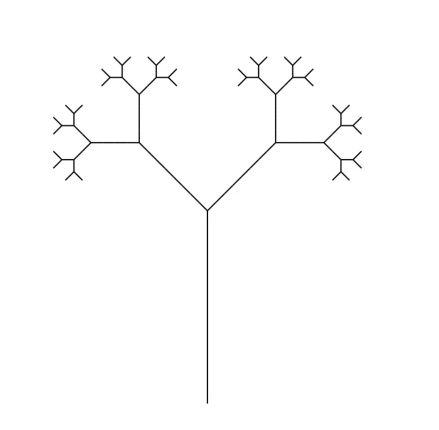
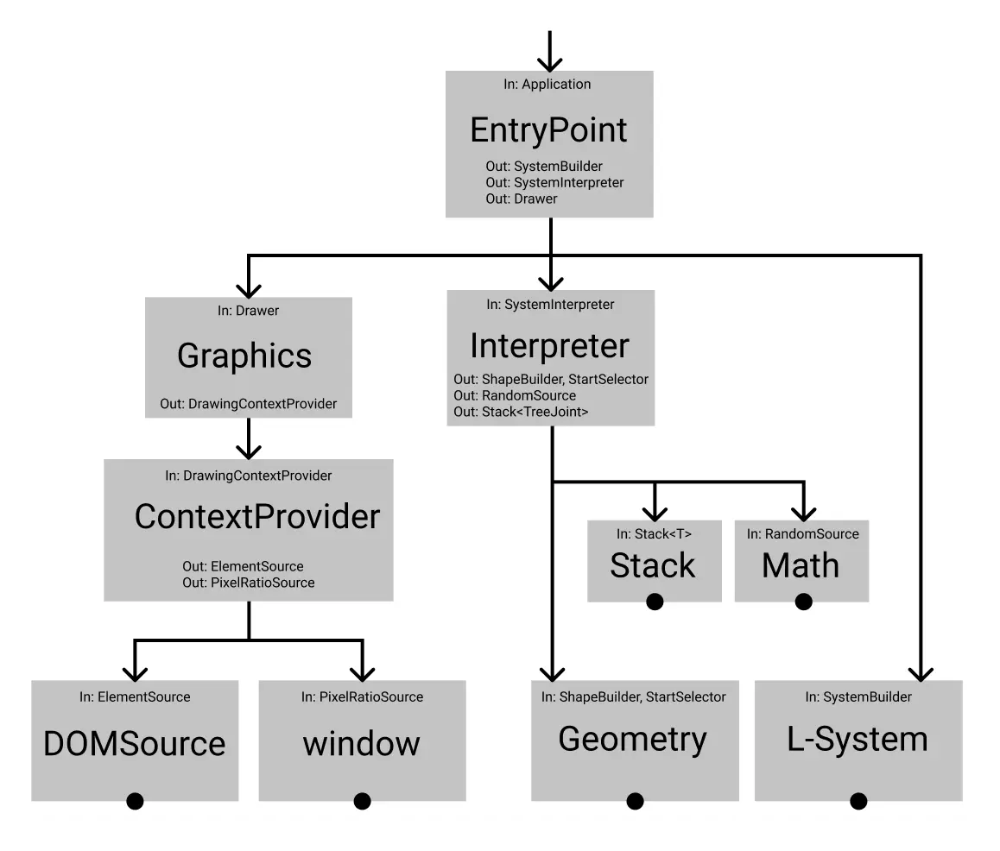

# Generating Trees Images, Part 3. From Fractal to a Real Tree

Let's finish our trees images generator!

In [the first part](/blog/generating-trees-on-canvas-using-typescript-and-oop) of this series, we designed the application architecture, set up the environment and dependency injection. In the end, we created an L-Systems module that could generate a string representation of a tree.

In [the second part](/blog/generating-trees-on-canvas-using-typescript-and-oop-2), we created a geometry module and a DOM adapter for accessing canvas elements. In the end, we displayed the first image on the screen.

In this final post, we're going to create a “translator” for L-System characters. Also, we will generate the Pythagoras tree and add some randomness to make it look more like a real tree.

## Making Interpreter

The interpreter module takes a string representation of an L-System and “translates” it into a set of drawing commands. Let's design the API and define dependencies:



This module depends on the geometry module and provides a `SystemInterpreter` interface.

```ts
// src/interpreter/types.ts

export interface SystemInterpreter {
	translate(expression: Expression): List<Line>;
}
```

Let's implement the interface:

```ts
// src/interpreter/implementation.ts

import { AppSettings } from '../settings';
import { StartSelector } from '../geometry/location';
import { ShapeBuilder } from '../geometry/shape';
import { Stack } from './stack/types';
import { SystemInterpreter } from './types';

export class SystemToGeometryMapper implements SystemInterpreter {
	// We will change these fields while translating commands:
	private currentLocation: Point = { x: 0, y: 0 };
	private currentAngle: DegreesAmount = 0;

	// These fields keep characters of an initial expression
	// and a list of corresponding commands:
	private systemTokens: List<Character> = [];
	private drawInstructions: List<Line> = [];

	// Define dependencies:
	constructor(
		private shapeBuilder: ShapeBuilder,
		private startSelector: StartSelector,
		private stack: Stack<TreeJoint>,
		private settings: AppSettings
	) {}

	// Implement public methods:
	public translate(expression: Expression): List<Line> {
		this.currentLocation = { ...this.startSelector.selectStart() };
		this.systemTokens = expression.split('');
		this.systemTokens.forEach(this.translateToken);
		return this.drawInstructions;
	}

	// …
}
```

In the `translate` method, we take an L-System expression and split it into individual characters. Then, we process each character with the `translateToken` method which we will write a bit later.

As a result, we return the `drawInstructions` list that contains all the translated commands.

You may notice the `Stack<TreeJoint>` in the dependencies. This is literal [stack structure](https://en.wikipedia.org/wiki/Stack_%28abstract_data_type%29) implementation. You can find its [code on GitHub](https://github.com/bespoyasov/treees/blob/main/src/interpreter/stack/implementation.ts).

Then we create the private `translateToken` method:

```ts
// src/interpreter/implementation.ts

export class SystemToGeometryMapper implements SystemInterpreter {
	// …

	private translateToken = (token: Character): void => {
		switch (token) {
			// If the character is 0 or 1
			// we draw a line from the current position
			// with a current angle:
			case '0':
			case '1': {
				const line = this.shapeBuilder.createLine(
					this.currentLocation,
					this.settings.stemLength,
					this.currentAngle
				);

				this.drawInstructions.push(line);
				this.currentLocation = { ...line.end };
				break;
			}

			// If the character is an opening bracket we turn left
			// and push the current position and angle in the stack:
			case '[': {
				this.currentAngle -= this.settings.jointAngle;
				this.stack.push({
					location: { ...this.currentLocation },
					rotation: this.currentAngle,
					stemWidth: this.settings.stemLength
				});

				break;
			}

			// If the character is the closing bracket
			// we pop the last position and the angle from the stack
			// and turn right from there:
			case ']': {
				const lastJoint = this.stack.pop();
				this.currentLocation = { ...lastJoint.location };
				this.currentAngle = lastJoint.rotation + 2 * this.settings.jointAngle;
				break;
			}
		}
	};
}
```

Now, when the method is called on a token, it either draws a new line or decides which side to turn. Stack helps us return to the last branching point.

Let's now update settings and call the method to see what's going to happen:

```ts
// src/settings/index.ts

export const settings: AppSettings = {
	canvasSize: {
		width: 800,
		height: 600
	},

	// Using 5 iterations
	// with Pythagoras tree rules:
	iterations: 5,
	initiator: '0',
	rules: {
		'1': '11',
		'0': '1[0]0'
	},

	// Stem length is 10 pixels;
	// turn 45 degrees each time:
	stemLength: 10,
	jointAngle: 45
};
```

Update the app entry point:

```ts
// src/index.ts

const builder = container.get<SystemBuilder>();
const drawer = container.get<Drawer>();
const interpreter = container.get<SystemInterpreter>();
const settings = container.get<AppSettings>();

const system = builder.build(settings);
const lines = interpreter.translate(system);
lines.forEach((line) => drawer.drawLine(line));
```

With these settings, we get a canonical Pythagoras tree:



We can play with the angle and see what figures we will get 😃


Cool! We've got the basics for the tree. But before we start making it more real we need to clean up the entry point a bit.

## Cleaning Up Entry Point

Right now the entry point is a bit dirty:

```ts
// src/index.ts

const builder = container.get<SystemBuilder>();
const drawer = container.get<Drawer>();
const interpreter = container.get<SystemInterpreter>();
const settings = container.get<AppSettings>();

const system = builder.build(settings);
const lines = interpreter.translate(system);
lines.forEach((line) => drawer.drawLine(line));
```

We get far too many services from the container, initialize all the operations manually. Let's hide all this in a single object that will be responsible for the application start:

```ts
// src/app/types.ts

export interface Application {
	start(): void;
}
```

Now we hide all the code behind the `start` method:

```ts
// src/app/implementation.ts

export class App implements Application {
	constructor(
		private builder: SystemBuilder,
		private drawer: Drawer,
		private interpreter: SystemInterpreter,
		private settings: AppSettings
	) {}

	start(): void {
		const system = this.builder.build(this.settings);
		const lines = this.interpreter.translate(system);
		lines.forEach((line) => this.drawer.drawLine(line));
	}
}
```

...And register it:

```ts
// src/app/composition.ts

import { container } from '../composition';
import { App } from './implementation';
import { Application } from './types';

container.registerSingleton<Application, App>();
```

Now the entry point is much cleaner:

```ts
// src/index.ts

import { container } from './composition';
import { Application } from './app/types';

const app = container.get<Application>();
app.start();
```

## Making Trees More Real

Now our trees are too strict and “mathematical”. To make them look more real we need to add some randomness and dynamics:

- The stem width should decrease when the tree grows;
- The angle should randomly deviate from a standard value;
- Branches should appear from relatively random places;
- Leaves should be green 😃

First, we slightly change the rules of the L-System. We add a new constant `"2"`. Now, tree branches become twice shorter on each iteration, the new constant will slow down this process.

We also make the axiom a bit longer to make the tree stem longer. Finally, we increase the iteration count up to 12.

```ts
// src/settings/index.ts

export const settings: AppSettings = {
	// …

	iterations: 12,
	initiator: '22220',
	rules: {
		'1': '21',
		'0': '1[20]20'
	},

	leafWidth: 4,
	stemWidth: 16

	// …
};
```

Now let's change the interpreter code:

```ts
export class SystemToGeometryMapper implements SystemInterpreter {
	private currentLocation: Point = { x: 0, y: 0 };
	private currentAngle: DegreesAmount = 0;

	// We will also change the stem width:
	private currentWidth: PixelsAmount = 0;

	private systemTokens: List<Character> = [];
	private drawInstructions: List<Instruction> = [];

	constructor(
		private shapeBuilder: ShapeBuilder,
		private startSelector: StartSelector,
		private stack: Stack<TreeJoint>,
		private settings: AppSettings,

		// Here, we're going to need a random source.
		// In our case, it is a wrapper over `Math.random`
		// with a bit more convenient API.
		// You can find its source on GitHub as well.
		private random: RandomSource
	) {}

	// …
}
```

Then, if we process a leaf (`"0"` character) we paint it randomly chosen green color:

```ts
private translateToken = (token: Character): void => {
  switch (token) {
    case "0": {
      const line = this.createLine();

      this.currentLocation = { ...line.end };
      this.drawInstructions.push({
        line,
        color: this.selectLeafColor(),  // Adding the leaf color
        width: this.settings.leafWidth, // and width.
      });

      break;
    }

    // …
  }
}
```

Then, we sometimes skip a new branch. It makes branch positions a bit more chaotic:

```ts
private translateToken = (token: Character): void => {
  switch (token) {
    // …

    case "1":
    case "2": {
      // Draw a new branch only in 60% of cases:
      if (this.shouldSkip()) return;

      const line = this.createLine();
      this.drawInstructions.push({ line, width: this.currentWidth });
      this.currentLocation = { ...line.end };

      break;
    }

    // …
  }
};
```

When turning, add a random deviation to the angle value:

```ts
private translateToken = (token: Character): void => {
  switch (token) {
    // …

    case "[": {
      // Making the width smaller:
      this.currentWidth *= 0.75;

      // Adding a random angle deviation:
      this.currentAngle -=
        this.settings.jointAngle + this.randomAngleDeviation();

      // Remember the branching position,
      // angle, and current branch width:
      this.stack.push({
        location: { ...this.currentLocation },
        rotation: this.currentAngle,
        stemWidth: this.currentWidth,
      });

      break;
    }

    case "]": {
      // Getting the last branching position:
      const lastJoint = this.stack.pop();

      // Using its position, angle, and width as current:
      this.currentWidth = lastJoint.stemWidth;
      this.currentLocation = { ...lastJoint.location };
      this.currentAngle =
        lastJoint.rotation +
        2 * this.settings.jointAngle +
        this.randomAngleDeviation();

      break;
    }
  }
};
```

Also, we add all the missing private methods:

```ts
export class SystemToGeometryMapper implements SystemInterpreter {
	// …

	private createLine = (): Line => {
		return this.shapeBuilder.createLine(
			this.currentLocation,
			this.settings.stemLength,
			this.currentAngle
		);
	};

	// Draw branches only 60% of the time:
	private shouldSkip = (): boolean => {
		return this.random.getValue() > 0.4;
	};

	// Random deviation will be from -5 to 5 degrees:
	private randomAngleDeviation = (): Angle => {
		return this.random.getBetweenInclusive(-5, 5);
	};

	// Green color will be chosen among 3 different colors:
	private selectLeafColor = (): Color => {
		const randomColor = this.random.getBetweenInclusive(0, 2);
		return leafColors[randomColor];
	};
}
```

Finally, let's try to run the application and look at the result:


We've got a real tree! 🌳

### Changes Are Local

What's important is that the last changes we made are limited by the `Interpreter` module. Even though the image is changed drastically we changed only interpreter implementation. All other modules stay the same.

More on that, interfaces are also the same. We didn't have to change `SystemInterpreter` and `ShapeBuilder`.


We even could change the implementation completely! As long as the interfaces are the same app works without any additional changes.


## Results

Let's now look at the whole system together:



Modules communicate via interfaces.

It is convenient for testing. Each module can be tested in isolation. Dependencies can be _replaced with [mock objects](https://en.wikipedia.org/wiki/Mock_object)_ implementing the same interfaces.

Interfaces also tell us what exactly to test because _we don't need to test implementation details_. Interfaces show the public API and show us what to test.

Another advantage is to combine modules in different packages. It is described in [“DDD, Hexagonal, Onion, Clean, CQRS, …How I put it all together”](https://herbertograca.com/2017/11/16/explicit-architecture-01-ddd-hexagonal-onion-clean-cqrs-how-i-put-it-all-together/) in so much detail.

For instance, we can split packages by application layers:


Dependencies always are directed _towards the domain_. It makes the domain layer totally independent so that we can share the code between many different applications.

## Side Note About Shared Kernel And Infrastructure

Infrastructure is usually the code that is used to connect to a database, search engine, and other _external driven services_.

Our application doesn't have infrastructure because we don't need to save the result in any way.

If we had it, infrastructure modules would have been very similar:

- application layer would describe conditions when to save an image;
- application layer would also contain ports that would describe _how exactly our application wants_ to save the result;
- adapters would _make external interfaces compatible_ with our application.

Shared Kernel is anything that [several modules](https://herbertograca.com/2017/11/16/explicit-architecture-01-ddd-hexagonal-onion-clean-cqrs-how-i-put-it-all-together/) can depend on at the same time, while still being decoupled. In our case it could be `lib.d.ts`, because we use it without even noticing.

The settings and annotations of domain types in our application can also be called Shared Kernel.

We don't refer to the `L-system` module to get the `Expression` type from it; we have annotations available to all modules, although they are still decoupled. This is more a feature of annotations, though—because if we “seal” the types inside `.ts` files, we have to import them with normal `import`.

## What Can Be Improved

If being idealistic, we can think of a lot of other things to do 😃<br />Well, for example:

- Add [pattern-matching](https://en.wikipedia.org/wiki/Pattern_matching) to the `translateToken` method to make sure it knows what tokens are valid.
- Make the [`Instruction`](https://github.com/bespoyasov/treees/blob/a09fce0cbd69c8f078d257c3c5b01eb6aedeb6e4/src/interpreter/types.ts#L4) type more extendable.
- Extract [leaves colors](https://github.com/bespoyasov/treees/blob/main/src/interpreter/constants.ts) into settings; it could be useful for creating different palettes and “themes” (e.g. for drawing trees on sunset).
- Implement an adapter for `PixelRatioSource`, to avoid [depending](https://github.com/bespoyasov/treees/blob/a09fce0cbd69c8f078d257c3c5b01eb6aedeb6e4/src/dom/composition.ts#L6) on `window` directly.
- In the [`ElementSource` interface](https://github.com/bespoyasov/treees/blob/a09fce0cbd69c8f078d257c3c5b01eb6aedeb6e4/src/dom/types.ts#L2) return not `Nullable<HTMLElement>`, but rather a custom type to avoid coupling with HTML.
- Imitate `internal`-implementation, exporting only types and composition for each modules.
- Make [the interpreter](https://github.com/bespoyasov/treees/blob/main/src/interpreter/implementation.ts) compact: determine what modules to divide it into so that the class isn't so big as now.

All in all, there's still some work to be done, but for an example of architectural design, it's fine 🙂

## Resources

- [First Part of the Post](/blog/generating-trees-on-canvas-using-typescript-and-oop)
- [Second Part of the Post](/blog/generating-trees-on-canvas-using-typescript-and-oop-2)
- [Application Example](https://bespoyasov.me/showcase/treees/)
- [Project on GitHub](https://github.com/bespoyasov/treees)

### From the Latest Post

- [Stack, Data Type](<https://en.wikipedia.org/wiki/Stack_(abstract_data_type)>)
- [Mock Object](https://en.wikipedia.org/wiki/Mock_object)
- [Shared Kernel](https://herbertograca.com/2017/11/16/explicit-architecture-01-ddd-hexagonal-onion-clean-cqrs-how-i-put-it-all-together/)
- [Pattern Matching](https://en.wikipedia.org/wiki/Pattern_matching)

### L-Systems and Fractals

- [L-Systems](https://en.wikipedia.org/wiki/L-system)
- [Pythagoras tree](<https://en.wikipedia.org/wiki/Pythagoras_tree_(fractal)>)

### Architecture, OOP, DI

- [Clean Architecture by Robert C. Martin](/blog/clean-architecture/)
- [Domain Driven Design](https://en.wikipedia.org/wiki/Domain-driven_design)
- [DDD, Hexagonal, Onion, Clean, CQRS, …How I put it all together](https://herbertograca.com/2017/11/16/explicit-architecture-01-ddd-hexagonal-onion-clean-cqrs-how-i-put-it-all-together/)
- [Dependency Injection with TypeScript in Practice](/blog/di-ts-in-practice/)
- [Encapsulation](<https://en.wikipedia.org/wiki/Encapsulation_(computer_programming)>)
- [Object Lifetime](https://simpleinjector.readthedocs.io/en/latest/lifetimes.html)

### SOLID Principles

- [Single-Responsibility Principle, SRP](https://en.wikipedia.org/wiki/Single-responsibility_principle)
- [Open-Closed Principle, OCP](https://en.wikipedia.org/wiki/Open–closed_principle)
- [Liskov Substitution Principle, LSP](https://en.wikipedia.org/wiki/Liskov_substitution_principle)
- [Interface Segregation Principle, ISP](https://en.wikipedia.org/wiki/Interface_segregation_principle)
- [Dependency Inversion Principle, DIP](https://en.wikipedia.org/wiki/Dependency_inversion_principle)

### Patterns, Terms from TypeScript and C#

- [Type Aliases](https://www.typescriptlang.org/docs/handbook/2/everyday-types.html#type-aliases)
- [Fields and Properties](https://docs.microsoft.com/en-us/dotnet/csharp/programming-guide/classes-and-structs/properties)
- [Facade Pattern](https://github.com/kamranahmedse/design-patterns-for-humans#-facade)
- [Adapter Pattern](https://github.com/kamranahmedse/design-patterns-for-humans#-adapter)

### Tools

- [How the Transformer Works](https://github.com/wessberg/di-compiler#faq)
- [createapp.dev](https://createapp.dev)
