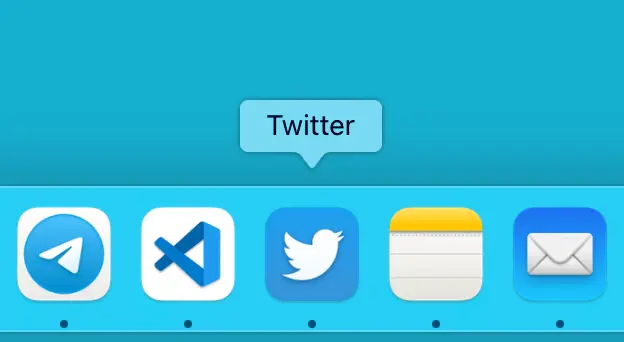

# How to Boost Productivity

It's easy to increase productivity. Pre-processors and transpilers, time management and a bunch of other useful stuff can help a lot.

But there's more. Let's take it step by step:

Yup, that's it.
