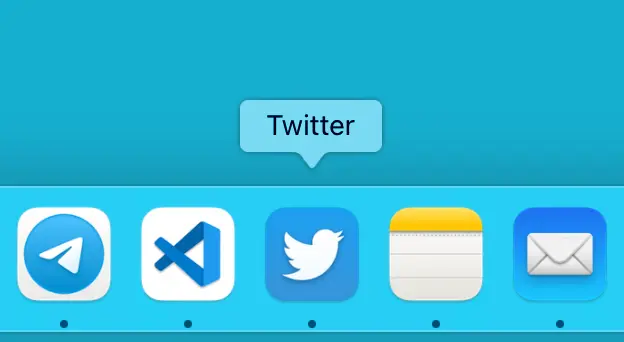

# Как повысить производительность

Повысить производительность просто. Системы сборки проектов, препроцессоры, тайм-менеджмент, ещё куча других полезных штук может здорово помочь.

Но есть ещё кое-что. Давайте разберём по шагам:

Угу, вот так всё просто.
