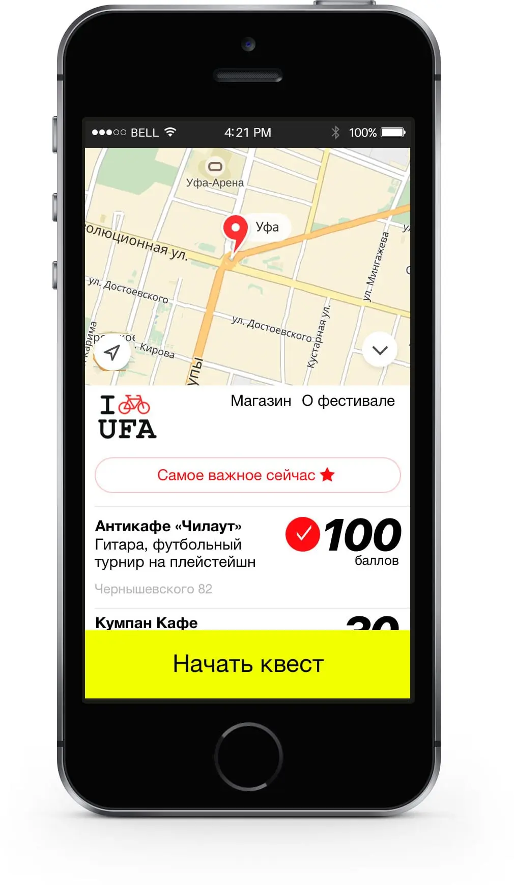
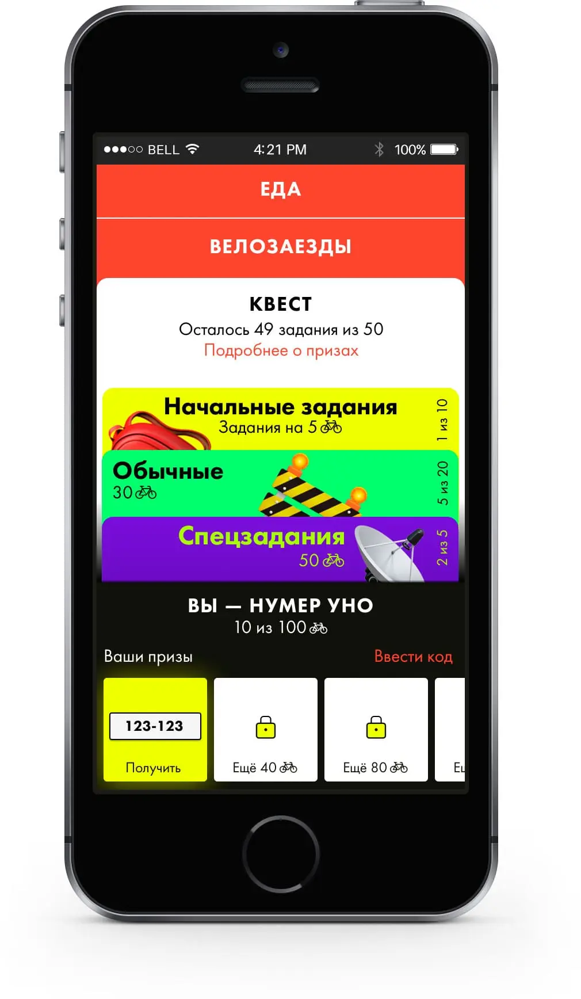
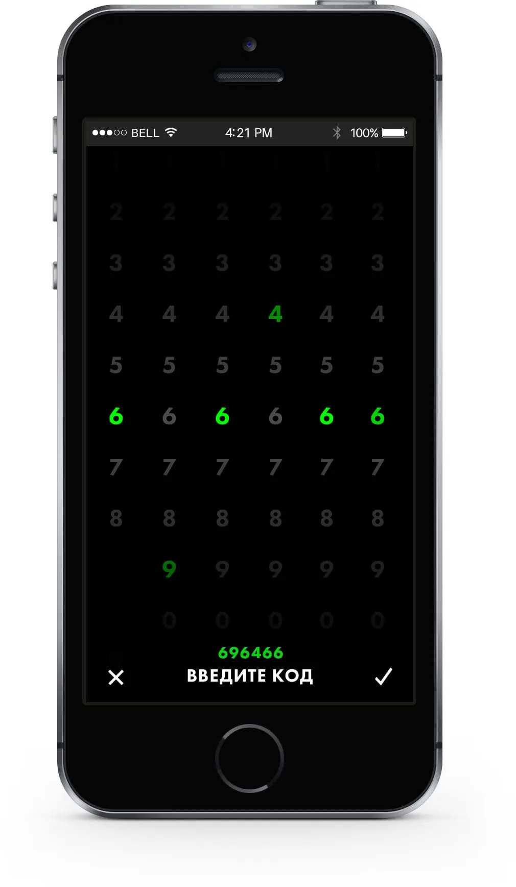

# Айбайк Уфа, как это было

В этой заметке я расскажу, с какими трудностями столкнулась наша команда, и какие мы принимали решения во время работы над [приложением для фестиваля Айбайк Уфа](https://game.ibikeufa.ru).

## Сроки, модульность и API

На дизайн, разработку и модерацию в магазинах у нас был месяц. Поэтому фронтенд и бекенд мы писали параллельно.

Фронт я писал сразу так, будто у меня уже есть API для общения с сервером. Описал, какие данные буду отправлять на сервер, и что буду ждать в ответ. Расписал, по каким ссылкам будет удобнее общаться и какого формата сообщения мы будем использовать.

Плюс такого подхода в том, что сложность прикрутки фронтенда к бекенду выносится в отдельную плоскость. Бек и фронт ничего не знают друг о друге. Им важно лишь, какого формата сообщения используются для общения между ними (по-умному это ещё называется слабая связность модулей).

Экраны и блоки мы спроектировали так, чтобы без костылей переносить их в другие части приложения. На всём этом мы сэкономили несколько дней перед запуском.

## Редизайн в середине разработки

В середине разработки мы поняли, что структура экранов приложения слабая, и надо её переделать.

Здесь помогла грамотная архитектура. Мы разнесли представление, бизнес-логику и общение с сервером по разным частям приложения, поэтому редизайн затронул только интерфейс.

Для сравнения — первая версия главного экрана выглядела так:

Финальная — так:

## Подстройка под реалии

Кроме глобального редизайна мы переделывали куски интерфейса, на которые жаловались пользователи.
Например, переделали страницу ввода кода, потому что решение с крутящимися цифрами оказалось непонятным.

Вместо барабанчиков мы поставили поле:

Пришлось подстраивать и карточку площадки — на некоторых площадках заданий не было, на других заданием был репост в соцсети. Для этого мы изменили блоки с заданием и кнопку под расписанием событий на площадке.

## Людям пофиг, что это веб. Требования — как от натива

Мы старались создать ощущение от нашего приложения, как от нативного. С вебом это сделать трудно, потому что он многого не умеет.

К примеру, анимация перехода между экранами по задумке должна была быть, как будто меняются карточки на экране. Но из-за проблем с прокруткой на странице и особенностями Реакта пришлось сделать «псевдонаплыв» одной карточки на другую.

В вебе трудно справляться с асинхронными запросами, как принято в нативных приложениях; карты не работают в офлайне; механика экранов с картами проще, чем в нативе. Из-за этого мы словили несколько негативных отзывов.

Вывод — люди не видят разницы, между нативным, веб-приложением или гибридным, им всё равно, сколько по срокам заняла разработка. Требования к приложению всегда будут жёсткими.

## Фестиваль отменили

Самая большая проблема появилась за день до запуска — фестиваль отменили. Из программы осталось несколько площадок и рекорд Гиннеса.

Как так получилось, и почему — [в обращении организаторов](https://vk.com/ibikeufa?w=wall-122711751_2490).

## Итог

Было жаль, что фестиваль не получился, каким его планировали. Но для [нас](https://game.ibikeufa.ru/static/team.html) это был ценный опыт. Мы доказали себе, что пилить приложение по выходным, сделать его за месяц и запустить в магазинах — трудно, но реально.
