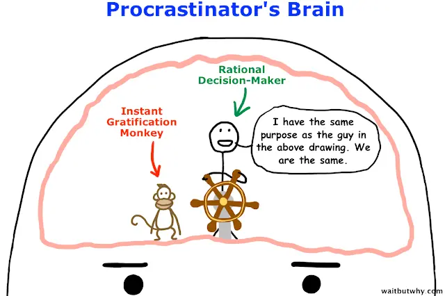

# Jedi Techniques by Maxim Dorofeev

This is a book about task management and personal performance that offers a way of dealing with tasks with a less cognitive load as possible.

In general, the way of working I have developed for myself and how I have been working for the last 5 years is reminiscent of Jedi Techniques. It is just that Dorofeev's level of “nerdiness” is higher. But, for example, working with reference books, meetings, and daily tasks repeats his methodology.

Working with projects using Dorofeev's methods reminded me of GTD (Get Things Done), but I cannot stand GTD, while the “Jedi” method seemed to work well with me for some reason. Maybe because Dorofeev describes how cognitive biases work (or, rather, prevent us from working). Perhaps because it is written in simple words.

<aside>

I've read this book in Russian and haven't found an official translation in English. So I hope my
translation of quotations is okay.

</aside>

And, yeah, the summary of the book is huge, make yourself a snack or something.

## Reasons for Performance Issues

People solve problems with their brains, and the brain has a lot of limitations. The most important of them is that the brain does not like to think. Kahneman wrote about this in his book “Thinking, Fast and Slow”, to which Dorofeev also refers in the text.

> Almost always when there is a choice between an important thing and an urgent thing, the brain tends to choose ...the easiest

> Because we're too lazy to really think, we ...look for a universal rule so that we can act without thinking...

...Which, of course, does not exist. Instead, Dorofeev gives universal advice for all times.

<mark>In any situation you don't understand, think</mark>

Because...

> You'll still have to think after all

Further in the text I will give examples from the book, why we really have to think.

## Why Performance Goes Down

The resources of the body are limited and especially the resources of the brain. We remember that the brain itself is a lazy beast, and it is already difficult to make it work. And if we are anxious, hungry, or sleep-deprived, it becomes even harder to concentrate on the task at hand.

However, even if the stars are aligned and we begin to solve the problem, it doesn't guarantee that we'll solve it. Because...

> For physiological reasons it's infinitely harder for us to focus on one object longer than a small amount of time

> The larger and more difficult the task, the more prone the doer is to procrastination

> The thing inside us that we use to “force ourselves” works on the same principle as a muscle. It can become exhausted, then you can do nothing with yourself and succumb to the first impulse to quit

Memory, concentration, mood-all of these are resources that we expend throughout the day.

> You have to learn to use your mind gently and carefully without overestimating your own level of awareness and intelligence

> Whenever somebody asks you to do something and you say “Yeah yeah, I'll remember that,” you're going to lower your ability to think really badly

> There's a thing in psychology called “repetitive inhibition” where there's less and less attention given to unchanging information

## Thought Fuel

According to Dorofeyev, the body resources I wrote about above are called thought-fuel, and the brain requires two things for mental work: _thought fuel_ and _time_. A shortage of either of these leads to failure, but often people make the mistake of thinking they are short of time, when in fact they are short of thinking-fuel.

The main purpose of the methodology is to learn to spend this very thought fuel more economically. To do this, the author suggests to:

- accept the absence of an easy path;
- recover regularly;
- unload the working memory;
- regularly clean out the inboxes;
- don't spread yourself over thousands of tasks.

Regular recovery is required because overstretching the “mental muscle” reduces its specific capacity for work. Roughly speaking, if you're in overdrive for 4 weeks, by the end of it you'll have trouble doing even simple tasks.

> Constant brain overload reduces the maximum amount of thought fuel you can put into anything at any one time

> Almost any development takes place at the resting point

Unloading the working memory is necessary so that we don't have to spend thought fuel to hold onto an idea or thought in our memory. Any attempt to focus on something eats up resources. To unload, Dorofeev suggests using external stores of information: notepads, notes on your phone, computer, stickers, etc.

> Noticing that you are distracted... write down what distracted you and go back... This gives birth to a list of things that still matter to you and need to be either scrubbed or resolved

Keeping the inboxes empty is also helpful, because a lot of tasks or upcoming work takes your attention away, makes you think about how you're going to tackle it. (Or “how little time you have for everything.”)

And...

> Over-responsiveness to requests for help leads to thought fuel depletion. You can help everyone, but still fail to fulfill your obligations. As a rule, the first ones to suffer are your commitments to yourself: health, comfort in the home, self-development, and family life

## Where Anxiety Comes From

The book refers to a Tim Urban's [article about procrastination](https://waitbutwhy.com/2013/10/why-procrastinators-procrastinate.html). In this article Tim presents two characters: the rational decision-maker and the instant gratification monkey.

They can be compared to Kahneman's two systems of thinking: the solver is System 2, thorough slow thinking, logic, rationality and all that; the monkey is System 1, fast, impulsive, on emotion.

The monkey looks for ways to “have fun” and “make it fast.” It is the reason why a person procrastinates for a long time before he starts working on a task.

> Incomplete tasks create the urge to complete them

> If there's a lot of work to do, our natural monkey urge is to get it over with as fast as possible

> For an overexcited monkey... there's nothing worse than waiting around calmly when there's so much work to be done

In addition to this the level of anxiety is raised by the notifications. It can be hard to turn off notifications: “what if I miss something?” or “I can't, it's just work,” and so on, but...

> In a state of high internal anxiety and/or external fuss you can be thrown off this task by a new piece of information that pops in all of a sudden

> “I don't notice the notifications” should really be understood as: “I'm no longer aware of how or to what extent these notifications piss me off”

To determine your level of anxiety, you have to...

> Sit quietly, relax, start a stopwatch, close your eyes and let your thoughts wander as they please. As soon as you feel a minute has passed, look at the stopwatch: it will show how many real astronomical seconds are in your subjective minute. This test is a great indicator of your current level of anxiety

## Cognitive Biases

Apart from the anxiety one's state is affected by [cognitive biases](https://en.wikipedia.org/wiki/List_of_cognitive_biases). For example...

> Sometimes we subconsciously look for something (even very difficult) that is worth doing once and our wish will come true

> We confuse “difficult” (or “ineffective”) with “impossible”

> We confuse a temporal sequence of events with a cause and effect relationship

> In the realm of personal effectiveness, we run the risk of being fooled by chance, when one day we miraculously accomplish noticeably more things and tasks than we usually have managed to do up to that point. This is followed by pleasant fatigue and pride in the accomplished feat. But does this mean that our productivity has reached a new level?

The answer to the latter question is no, because...

> Our bursts of productivity are not a consequence of our personal progress, but simply the result of several random circumstances superimposed on each other

What's more, we don't really know how to plan, also in particular because of distortions:

> Another unpleasant point arising from the early making of plans is the einstellung effect. It consists in the fact that having an idea prevents you from having a better idea

> The [SMART] method itself is probably very useful... but in practice its application often stumbles over a trait that is characteristic of living people, the selectivity of attention. The point is that the more focused we are on an object, the more likely we are to miss everything going on around that object

In general, life is ruled by uncertainty.

## Uncertainty

Dorofeev often refers to Taleb, the author of [The Black Swan](https://en.wikipedia.org/wiki/The_Black_Swan:_The_Impact_of_the_Highly_Improbable). Uncertainty not only prevents us from predicting our future performance, it also prevents us from planning projects.

> Right now we don't know everything about our project and we recognize the uncertainty. As we move toward completing the project, we will receive new information, and the uncertainty will gradually diminish. We will revise our plans based on this information

> In order to answer questions about timelines, a plan must be made in some form. If in the beginning we know very little about the case, then the plan will be very approximate and the answers about deadlines will contain a large margin of error. In itself, this is not very bad, at least if the plan has not turned into an obligation. But very often that is exactly what happens. According to Eliyahu Goldratt, this is one of the root causes of multiples of project deadlines

There is a way to deal with this:

> A project plan is not a commitment, it's a plan. It can change as circumstances change

> The essence of the [minimum acceptable result] method is that the nearest target state should be chosen in such a way that even if, suddenly, the project is terminated or forcibly closed when it is reached, the result can still be used

## Willpower and Context

I once [stopped relying on willpower](/blog/do-not-push/). I began to create an environment around me so that doing something wrong was simply “impossible,” or wildly inconvenient. Dorofeyev tells about the same thing:

> If you can't avoid something, then put it in order

> Going down into a cave, don't forget the guiding thread. Time on social media flies quickly, and many of us probably regret the enormous number of hours spent browsing through the news feed... So the next time you go to see what's new with your friends, set yourself a timer for ten or fifteen minutes

> Eat with your left hand... if you constantly catch yourself doing something too often, make that activity less convenient

> Willpower is useless for constantly maintaining a new habit or a new way of doing something. We need to get it to the point of automatism

> [If] the original task is really important, you need a safety net so that after an unexpected distraction you can remember it and go back to doing it

> Using recurring tasks, you can easily (and effortlessly) make it so that you handle social media notifications on Tuesdays and Thursdays, and accounting emails and JIRA notifications on Wednesdays and Fridays. Not creating these periodic tasks and trying to manage the processing of these categories of emails “from memory” will result in an additional waste of thought fuel

The context in which you find yourself is inextricably bound up with uncertainty. I would even say that it is determined by uncertainty:

> To give a distance in days of travel without specifying the mode of travel is no longer appropriate

> If you dig, it doesn't guarantee you a mink. But if you don't, you're pretty much guaranteed not to have one

> When you try to cram in what you can't cram in, 1) you're pushing out what you can't cram in, and 2) you're pushing down the limit of what you can cram in

The author also says that there is no panacea against all this:

> If you doubt that you can force yourself to follow this (or any other) model of self-organization, don't doubt. You are guaranteed not to be able to force yourself to follow it

But at the very least...

> Don't be in a hurry with... promises

> Don't demand that you stop using social media once and for all. This is exactly the reason for the above failure. Try adding daily recurring tasks to your list like “spend fifteen minutes reading the new”

## Methodology

Now that we are done with the “prerequisites,” let's move on to the methodology in the book. We divide all incoming information into:

- tasks;
- projects;
- background information;
- meetings.

> The most important thing is not to mix all these entities

### Tasks

A task is an answer to the question “What needs to be done.” The wording is very important for the task. You see...

> The task list is a tool primarily for your inner monkey

> Proper task wording is designed to reduce the intensity of thought exercise

> A task can be accomplished by using your thinking as little as possible

The last point, “using your thinking as little as possible,” is critical. Because if the task cannot be understood, the brain will choose some easier thing to do instead. The task will be postponed, the work won't get done.

So, for example, instead of Alice,” the task should be phrased something like “Arrange a meeting with Alice on Monday.” Thus:

- The wording should begin with an infinitive verb.
- The task can be accomplished with a minimum of thinking.
- The task should represent the primary action to achieve the end goal.

It may seem like a long time to write this kind of wording, but...

> When we get to a task, we're going to have to determine the first priority action one way or another. And if we don't keep the right formulation of the calculated first step, we can easily waste even more time and thought fuel

> Clearly defined tasks will always defeat the large, general and unspecific

It's the same with delegating:

> Delegate... tasks explicitly. Set yourself tasks to “remind” yourself..., to “ask how they're [the people you've delegated tasks to] doing,” to “see if they need help.” Do not get mad too often because a rare task gets done without reminders

The author also talks about what to do with tasks that “need to be done HURRY!!!!11!1”

> There are “must-be-done” tasks, if they are not done, the anger of management or colleagues will not be long in coming. Often they contribute to the achievement of goals, their systematic performance provides a long-term positive effect. But if you don't do them, then at least in the short term no harm will come of it

> Many people tend to group “must-be-done” (combine them into large batches to do everything at once in one fell swoop), leaving the “pleasures” and “better-be-dones" for later

...For such tasks he advises applying [the 20/80 principle](https://en.wikipedia.org/wiki/Pareto_principle). It is better to do something slowly than not to do it at all.

> Those who dont't dig don't have a mink.

### Projects

Reviewing the project and composing tasks for it comes down to the following:

- Think about the project and figure out the closest task (formulated by all the rules and understood by your monkey) on the project.
- Write the task into the task list.
- Execute the task.
- Go back to step 1.

But the planning is more complicated, you'll have to answer the questions:

- What do I have to do?
- To achieve what? (Why do it?)
- And what else? (What did we miss?)
- Or else? (What happens if the project isn't done?)
- So what? (How dire and severe are the consequences of not doing this project?)
- Who needs the results of this project and for what purpose?
- How else can the “to achieve what” be achieved?

> A very difficult point in planning, and the cause of many woes, is that we put as many tasks in the plan as we need to accomplish, rather than as many as we can accomplish

And we also don't forget about uncertainty (we don't know how to predict performance) and distortions (setup effects, focus, priming, that sort of thing). How to live with it—¯\\\_(ツ)\_/¯

### Background Information

The most important thing when adding new reference information is to decide...

> When (under what conditions) will I need this piece? Where am I most likely to find it at that moment? These two questions are an element of self-care for the future

Again, we do everything to think as little as possible about the future—think ahead, make it more comfortable for ourselves.

### Meetings

It's best to use a calendar for appointments and notes about them.

### Life Style

Sometimes we confuse projects with a life style:

> A huge part of everything we think of as projects is actually a new way of living

Falling headfirst into a new way of life isn't a good idea either. It's better to break down the life style into pieces. See if you like it, and then make a decision whether to continue or not. And don't make promises too soon.

### Check Lists

A checklist helps to standardize the process of completing a task or project. Again, we unload the working memory from trying to keep everything in your head—we create a list that makes it easier for the inner monkey to go and bluntly do what is written.

> Almost any situation in which you at least once exclaimed with annoyance, slapping yourself on the forehead: “Next time I will do X, I must not forget about Y and Z,” subtly hints you that you should have a checklist for doing X

### Pomodorro

I don't really like the [pure pomodorro technique](https://pomodoro-tracker.com/), I have a slightly [different approach](/blog/efficient-workday-division/). But since we're here:

> Every period should consist of three basic steps:

> Prepare for it. Go through your list of tasks and decide what you will do in the next 15-25 minutes

> Do stuff. Set a timer and get to work

> Complete the period and make a decision. As soon as the timer beeps, take your eyes off the task, see what you got done, and decide what you will do next

### Reviews of Tasks, Projects, Whole System

Reviews are needed to adjust the plan when new inputs arise in the context. We divide reviews into daily, weekly, and on-demand.

The daily ones are needed to plan the day:

- Review the tasks planned for today but not completed. Is there anything you need to do about it right now?
- What tasks will you need to accomplish tomorrow?
- Are there tasks on your list for today that were changed more than a day ago? Restate them.

Weekly—to plan (surprise) the week:

- Have you planned the tasks you absolutely need to accomplish this week? Look at your calendar a week or two ahead. Is there anything you need to do about what you see?
- Do all the tasks on the list still need to be done?
- Look over your list of active projects. Are there tasks worth putting on your list to keep projects moving forward?
- Are all the projects on your project list still active?
- Review the tasks completed last week. Is there anything else you need (can) do?

> The weekly review is a very responsible activity, so it is important to do it by all means, even superficially

> The weekly review should be easy and quick [otherwise you'll procrastinate]

> The key is to limit your time and by no means try to do everything at once and perfectly

## Fears and “Besides Work”

If the methodology (or something based on it, like mine) suddenly starts working and you have some free time, along with it may come some fears and concerns about possible problems in the future.

### So Much Isn't Done

> In this case, as before, you won't have to do everything

> You don't have to be afraid of task overload. Just don't be surprised if a very productive and stressful day is followed by a day during which you feel a loss of energy and efficiency

> Over time, you'll learn how to ration the workload on your brain

### There're Some Missing Tasks in the List

> The worst thing is not sorting out the backlog, but not answering the question “Why do I need to keep things in order in the first place?”

> If you don't have what you sincerely want to do for yourself personally (if someone else will benefit from it too, that's fine, but you should enjoy doing it first and foremost), you are left with the only goal to work harder and more productively - to work even harder and more productively

> Trying to do all the work before you do yourself (violation of the oxygen mask principle)

### Implicit Task Lists

> A tool becomes a task list not because its developers say it is, and not because you think it is, but because you react to its contents accordingly

> And the more mental fuel you spend on the fulfillment of tasks from this implicit list the more likely it is that you will soon stop trusting your main task list, it will start to feel like a burden to you, you will give it up

### Delegating to Your Future Self

> The key to personal productivity is to love yourself in the future. Trying to make the life of your future self easier, not leaving it all the bullshit

### Intolerance to Unfinished Business

> In order to get things done, you have to be able to live comfortably in a state of not getting things done

> A “fixation,” is described as a state in which you expend energy on a goal at a time when you can do nothing to achieve it. The more motivated you are to achieve the goal, the stronger the fixation effect will be

## Bottom Line

- In any situation you don't understand, think.
- You'll still have to think anyway.
- Conduct regular reviews.
- Reduce harmful task switching.
- Don't trust willpower, but change the context.
- Those who don't dig don't have a mink.
- It's not the time that counts, it's the thought fuel.
- Find a favorite thing to do outside of the office.
- Spend the time and energy that you have managed to “reclaim” from work only on yourself.
- This world is not about “everything and everywhere”, but rather “some things are sometimes”.

## From Book Appendix

- Do not look for universal solutions and methods, programs and tools.
- Don't try to solve the problem completely at once.
- Trust the experience more than the results of your thinking.
- Offload the contents of the working memory.
- Create a periodic task for the processing of old incoming messages with a wording like: “Dedicate ten minutes to processing inboxes from my old inbox.”
- Create a task for the weekly system review. Include the appropriate checklist in the task description and use the checklist as a basis.

## Resources

Again, I don't know if there's an official translation of the book, so I leave a link to the Russian version.

- [Jedi Techniques by Maxim Dorofeev](https://www.mann-ivanov-ferber.ru/books/dzhedajskie-texniki/)

### Other Useful Stuff

- [The Black Swan by Nassim N. Taleb](https://en.wikipedia.org/wiki/The_Black_Swan:_The_Impact_of_the_Highly_Improbable)
- [Thinking, Fast and Slow by Daniel Kahneman](https://www.amazon.com/Thinking-Fast-Slow-Daniel-Kahneman/dp/0374533555)
- [Why Procrastinators Procrastinate](https://waitbutwhy.com/2013/10/why-procrastinators-procrastinate.html)
- [List of Cognitive Biases](https://en.wikipedia.org/wiki/List_of_cognitive_biases)
- [Pareto Principle](https://en.wikipedia.org/wiki/Pareto_principle)

### From My Blog

- [Don't Push Yourself](/blog/do-not-push/)
- [How I Divide My Work Time](/blog/efficient-workday-division/)
