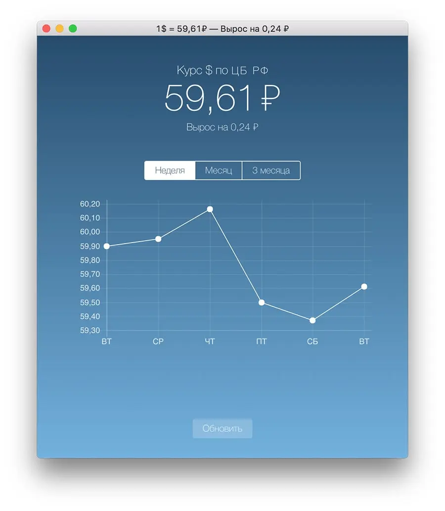

# Курсовик

Пока был в отпуске, решил поковырять новые технологии. Начал с Электрона.

[Электрон](https://electron.atom.io/) — это библиотека, которая помогает писать приложения для настольных операционных систем на веб-технологиях. Вы пишете веб-приложение, оборачиваете его в электрон-оболочку, собираете, и оно работает, как обычное приложение.

Туду-лист показался мне простым, поэтому я решил сделать [Курсовик](https://github.com/bespoyasov/kursovik-redux-electron) — приложение, которое показывает курс доллара.

Попробуйте скачать и поставить себе. Есть версия [для Винды](https://yadi.sk/d/crwaJyz-38qV6X) и [Мака](https://yadi.sk/d/lk63ss2C38qV3N). Я также выложил проект [на гитхабе](https://github.com/bespoyasov/kursovik-redux-electron). Можно посмотреть, как всё устроено, или попробовать собрать самим 🙃

Курсовик показывает курс на сегодня и разницу со вчерашним курсом. Если есть курс на завтра, показывает и его. Рисует график курса за неделю, месяц или квартал.

Если интернета нет, показывает последние загруженные данные и предупреждение, что соединения нет. Когда интернет появляется, автоматически обновляет курс.

Это бета. Буду рад, если поможете найти в приложении ошибки. Предложения и баги — присылайте [на гитхаб](https://github.com/bespoyasov/kursovik-redux-electron/issues) или на почту bespoyasov@me.com.

Как итог — разобрался с API Электрона, передачей данных между процессами в приложении, треем на Макоси и Фетчем, пока писал основу. Немного узнал об архитектуре Винды, пока копал, как собрать приложение под неё. Вспотел, пока парсил данные с сайта ЦБ, негодовал оттого, как нестабильно он работает.
