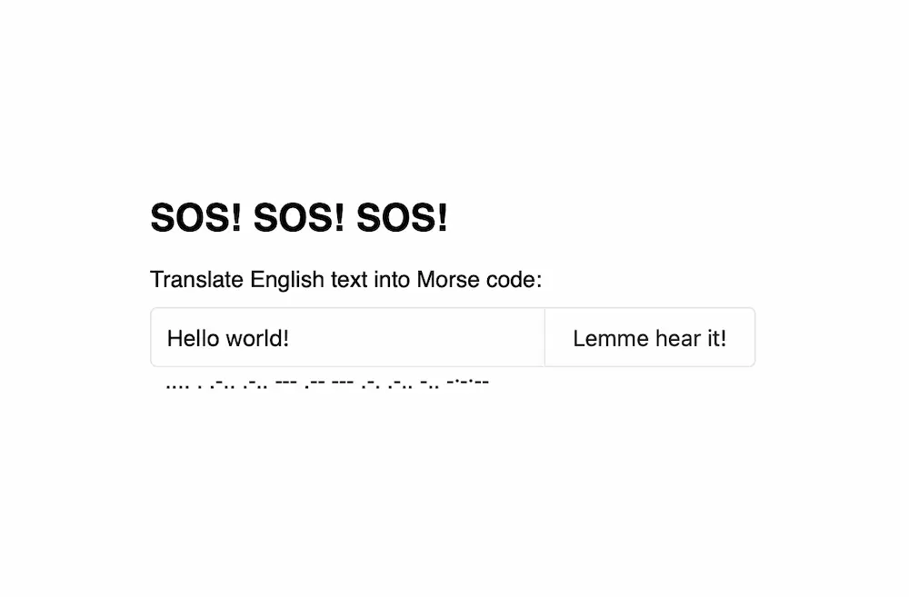

# Пишем переводчик фраз на азбуку Морзе

Для одного из проектов мне понадобилось поэкспериментировать с Web Audio API и генерацией звуковых последовательностей. В рамках этого эксперимента я написал небольшой (и не очень полезный) [генератор морзянки](https://bespoyasov.ru/showcase/morse/). В этом посте покажу, как он устроен.



## Алфавит и модуль перевода

Первое, что нам понадобится, — это переводчик обычного текста в азбуку Морзе. Он нам будет нужен, чтобы разбивать введённый пользователем текст на символы и заменять их на точки и тире.

<aside>Для эксперимента мы ограничимся только английским алфавитом, цифрами и несколькими знаками препинания.</aside>

Создадим объект, в котором укажем соответствия между символами и знаками из азбуки Морзе:

```js
const defaultAlphabet = {
	'.-': 'a',
	'-...': 'b',
	'-.-.': 'c',
	'-..': 'd',
	'.': 'e',
	// ...Остальные буквы.

	'-----': '0',
	'.----': '1',
	// ...Остальные цифры.

	'·-·-·-': '.',
	'--··--': ',',
	'-·-·--': '!',
	' ': ' '
};
```

<aside>

Полный набор символов, можно найти у меня [в исходниках](https://github.com/bespoyasov/morse/blob/master/Translator/dictionary.js) или [на Википедии](https://ru.wikipedia.org/wiki/Азбука_Морзе).

</aside>

Далее создадим модуль перевода, который будет использовать эти соответствия для перевода текстов:

```js
class Translator {
	constructor({ alphabet = defaultAlphabet, space = ' ' }) {
		this.space = space;
		this.alphabet = alphabet;
	}
}
```

Мы передаём алфавит как часть конфигурации в конструкторе класса `Translator`, чтобы при необходимости его можно было заменить. Это не так уже нужно, но будет полезно, если мы, например, захотим менять алфавит в зависимости от локали пользователя.

Кроме алфавита мы также указываем знак пробела. Его мы будем использовать для разбиения фраз на слова, и композиции слов обратно во фразы. (Об этом чуть дальше.)

Чтобы кодировать текст в азбуку Морзе, мы напишем метод `encode`:

```js
class Translator {
	// ...

	encode = (message) => {
		return message
			.toLowerCase()
			.split('')
			.reduce((encoded, char) => {
				// TODO: Превратить символы в морзянку.
			}, '');
	};
}
```

Метод `encode` будет принимать строку, разбивать её на отдельные символы, находить соответствующие им символы из морзянки, а затем склеивать их в текст из точек и тире.

Чтобы найти соответствие между буквой или цифрой и символом из азбуки Морзе, нам понадобится инвертированный дубликат алфавита, где ключами будут символы морзянки. Для этого напишем метод `inverse`:

```js
class Translator {
	constructor({ alphabet = defaultAlphabet, space = ' ' }) {
		this.space = space;
		this.alphabet = alphabet;
		this.inverted = this.inverse(alphabet);
	}

	inverse = (alphabet) =>
		Object.keys(alphabet).reduce(
			(inverted, key) => ({
				...inverted,
				[alphabet[key]]: key
			}),
			{}
		);

	// ...
}
```

Инвертированный алфавит тогда мы сможем использовать в методе `encode`:

```js
class Translator {
	// ...

	encode = (message) => {
		return message
			.toLowerCase()
			.split('')
			.reduce((encoded, char) => {
				// Для каждой буквы, цифры или знака препинания
				// находим соответствующий символ из Морзе:
				const code = this.inverted[char] || '';

				// Добавляем пробел между символами,
				// чтобы результат не слипался с сплошную
				// мешанину из точек и тире:
				const part = code + this.space;

				// Наращиваем текст-результат:
				return (encoded += part);
			}, '');
	};
}
```

Мы ставим пробел между символами азбуки Морзе, чтобы они не слипались в одну неразборчивую строчку. Между символами мы оставляем один пробел, между словами — два.

<aside>

Подробнее об алгоритме перевода и том, зачем нужно два пробела между словами, можно почитать вот [в этой статье](https://www.geeksforgeeks.org/morse-code-translator-python/). Там примеры кода на Python, но написано понятно даже для меня.

</aside>

Закончим модуль перевода последним методом для декодирования азбуки Морзе:

```js
class Translator {
	// ...

	decode = (message) => {
		message += this.space;

		let decoded = '';
		let currentCode = '';
		let spaceCount = 0;

		for (const char of message) {
			// Разбиваем строку на отдельные символы:
			// точки, тире и пробелы
			// и проверяем каждый символ.

			// Если это не пробел, значит,
			// надо «дослушать» символ азбуки до конца:

			if (char !== this.space) {
				currentCode += char;
				spaceCount = 0;
				continue;
			}

			// Если это был пробел, проверяем,
			// сколько пробелов мы послушали.
			// Если прослушано 2 пробела,
			// то закончилось слово, и надо
			// добавить пробел в результирующую строку:

			spaceCount += 1;
			if (spaceCount === 2) {
				decoded += this.space;
				continue;
			}

			// Если был всего один пробел,
			// то мы прослушали символ, соответствующий
			// букве, цифре или знаку препинания.
			// Находим совпадение в алфавите и
			// добавляем в результирующую строку:
			decoded += this.alphabet[currentCode];
			currentCode = '';
		}

		return decoded;
	};
}
```

## Осциллятор и генератор звука

Чтобы переводимые фразы можно было не только видеть на экране, но и послушать, нам понадобится [Web Audio API](https://developer.mozilla.org/ru/docs/Web/API/Web_Audio_API).

Напишем модуль генератора звуков:

```js
class SoundEmitter {
	constructor(config) {
		// ...
	}

	play = (durationMS) => {
		// ...
	};
}
```

Сперва получим доступ к [аудио-контексту](https://developer.mozilla.org/ru/docs/Web/API/AudioContext). Через него мы будем стучаться в звуковое API:

```js
class SoundEmitter {
	constructor(config = {}) {
		const { glbl = window } = config;

		const AudioContext = glbl.AudioContext || glbl.webkitAudioContext;
		if (!AudioContext) throw new Error('Failed to access Audio Context.');

		this.audioCtx = new AudioContext();
	}

	// ...
}
```

Настроим частоту звуковой волны, которую собираемся воспроизводить. Обычно азбука Морзе [воспроизводится на частоте 600–1000 Гц](https://ru.wikipedia.org/wiki/Азбука_Морзе). Эту частоту и укажем в настройках:

```js
class SoundEmitter {
	constructor(config = {}) {
		const { glbl = window, frequencyHZ = 600 } = config;

		// ...

		this.frequencyHZ = frequencyHZ;
	}

	// ...
}
```

Для собственно генерации звука с Web Audio API нам понадобится [осциллятор](https://developer.mozilla.org/en-US/docs/Web/API/OscillatorNode) — репрезентация волны определённой частоты. Добавим метод для его создания:

```js
class SoundEmitter {
	// ...

	createOscillator = () => {
		const oscillator = this.audioCtx.createOscillator();
		oscillator.frequency.value = this.frequencyHZ;
		oscillator.connect(this.audioCtx.destination);

		return oscillator;
	};
}
```

Наконец создадим метод для проигрывания звуковой волны, который будет принимать на вход её длительность в миллисекундах:

```js
class SoundEmitter {
	// ...

	play = (durationMS) => {
		const oscillator = this.createOscillator();
		oscillator.start();
		oscillator.stop(this.audioCtx.currentTime + durationMS / 1000);
	};
}
```

<aside>

Обратите внимание, что для корректного расчёта длительности мы используем [`AudioContext.currentTime`](https://developer.mozilla.org/ru/docs/Web/API/BaseAudioContext/currentTime).

</aside>

## Проигрыватель фраз

Последнее, что осталось сделать, — написать модуль, который будет запускать и останавливать воспроизведение звука по точкам и тире из сообщения.

Длительность точки [обычно равна 50 мс](https://ru.wikipedia.org/wiki/Азбука_Морзе), а тире по длительности равно 3 точкам. Пробел между словами сделаем паузой длительностью в 5 точек, а пробел между символами — паузой в 3. Внутри символа точки и тире отделим паузой длительностью в одну точку.

```js
class MorseCodePlayer {
	constructor({ translator, soundEmitter, dotLengthMS = 50 }) {
		this.isPlaying = false;
		this.translator = translator;
		this.soundEmitter = soundEmitter;

		this.durations = {
			dot: dotLengthMS,
			dash: 3 * dotLengthMS
		};

		this.gaps = {
			part: dotLengthMS,
			char: 3 * dotLengthMS,
			word: 5 * dotLengthMS
		};
	}
}
```

В конструкторе мы получаем доступ к экземплярам ранее созданных классов: `translator` и `soundEmitter`. Это так называемое [внедрение зависимостей](/blog/di-ts-in-practice/). С его помощью мы не прицепляемся к конкретным и заранее созданным объектам, а делаем эту связь настраиваемой.

<aside>

С его помощью, например, удобно делать классы более тестируемыми, потому что в тестах можно подменять зависимости на [фиктивные объекты](https://ru.wikipedia.org/wiki/Mock-объект).

</aside>

Далее добавим методы для поиска длительностей по переданным строкам:

```js
class MorseCodePlayer {
	// ...

	getSignalDuration = (smbl) => {
		const { dot, dash } = this.durations;

		switch (smbl) {
			case '.':
				return dot;
			case '-':
				return dash;
			default:
				return 0;
		}
	};

	getGapDuration = (smbl) => {
		const { word, char, part } = this.gaps;

		switch (smbl) {
			case '  ':
				return word;
			case ' ':
				return char;
			default:
				return part;
		}
	};
}
```

Чтобы преобразовать последовательность символов во временную последовательность, используем [асинхронный генератор](https://developer.mozilla.org/en-US/docs/Web/JavaScript/Reference/Global_Objects/AsyncGenerator). Когда мы будем по нему итерироваться, он будет управлять «расписанием» пауз и звуков, откладывая их с помощью таймера:

```js
class MorseCodePlayer {
	// ...

	*generateSequence(symbols) {
		for (const smbl of symbols) {
			const signal = this.getSignalDuration(smbl);
			const gap = this.getGapDuration(smbl);

			yield Promise.resolve({ signal });
			yield new Promise((resolve) => setTimeout(() => resolve({ gap }), signal + gap));
		}
	}
}
```

Теперь осталось только написать метод, который будет запускать воспроизведение волны осциллятора по этому расписанию:

```js
class MorseCodePlayer {
	// ...

	togglePlayingState = () => {
		this.isPlaying = !this.isPlaying;
	};

	playMessage = async (message) => {
		// Запрещаем «перебивать» играющие сообщения:

		if (this.isPlaying) return false;
		this.togglePlayingState();

		// Переводим сообщение в азбуку Морзе:

		const morseString = this.translator.encode(message);
		const symbols = morseString.split('');

		// Проходим по каждому символу и составляем
		// «расписание» для проигрывания звуков:

		for await (const bit of this.generateSequence(symbols)) {
			const { signal } = bit;

			// Если в текущий момент расписания
			// мы видим «сигнал», то проигрываем его.
			if (signal) this.soundEmitter.play(signal);

			// Если вместо сигнала мы видим паузу,
			// не проигрываем ничего, просто ждём
			// следующего по расписанию сигнала.
		}

		// Записываем в состоянии проигрывателя,
		// что он занят воспроизведением сообщения:
		this.togglePlayingState();
	};
}
```

## Всё вместе

Последнее, что нам надо сделать, — скомпоновать приложение и настроить все зависимости:

```js
// Создадим экземпляры переводчика и генератора звуков:
const translator = new Translator();
const soundEmitter = new SoundEmitter();

// Создадим экземпляр приложения
// и передадим все зависимости в конструкторе:
const codePlayer = new MorseCodePlayer({
	soundEmitter,
	translator
});
```

Далее настроим обработчики событий на отправку формы, которая будет запускать перевод сообщения и проигрывание звука, и используем в нём `codePlayer`:

```js
const form = document.getElementById('form');
const input = document.getElementById('message');
const output = document.getElementById('translated');

form.addEventListener('submit', (e) => {
	e.preventDefault();

	const message = input.value;
	codePlayer.playMessage(message);

	const encoded = translator.encode(message);
	output.innerHTML = encoded;
});
```

[Готово!](https://bespoyasov.ru/showcase/morse/) 🙃

## Ссылки и ресурсы

- [Готовый генератор](https://bespoyasov.ru/showcase/morse/)
- [Исходники на Гитхабе](https://github.com/bespoyasov/morse)

### Азбука Морзе

- [Morse code, Wikipedia](https://ru.wikipedia.org/wiki/Азбука_Морзе)
- [Morse Code Translator In Python](https://www.geeksforgeeks.org/morse-code-translator-python/)

### Web Audio API

- [Web Audio API](https://developer.mozilla.org/ru/docs/Web/API/Web_Audio_API)
- [AudioContext](https://developer.mozilla.org/ru/docs/Web/API/AudioContext)
- [OscillatorNode](https://developer.mozilla.org/en-US/docs/Web/API/OscillatorNode)
- [`currentTime`](https://developer.mozilla.org/ru/docs/Web/API/BaseAudioContext/currentTime)

### Управление зависимостями

- [Внедрение зависимостей](/blog/di-ts-in-practice/)
- [Фикитвные объекты](https://ru.wikipedia.org/wiki/Mock-объект)

### Остальное

- [Асинхронный генератор](https://developer.mozilla.org/en-US/docs/Web/JavaScript/Reference/Global_Objects/AsyncGenerator)
