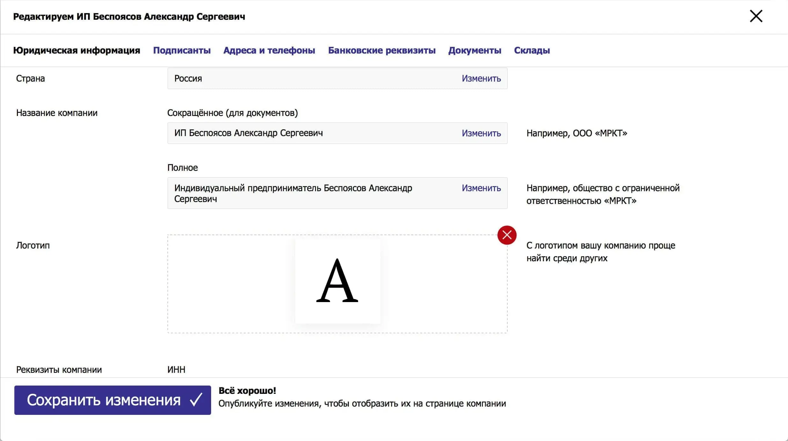

# Как я делал торговую площадку. Часть 2

[В прошлом посте](/blog/mrkt/) я рассказал, с какими проблемами столкнулся при разработке новой версии [торговой площадки](/projects/mrkt/). В этом посте расскажу о ролях, которые успел примерить за время работы помимо «фронтенд-разработчика» и том, какие скиллы помогли довести дело до конца.

## Технолог тоже дизайнер

Ни один план не выдерживает встречи с реальностью, с дизайном та же история.

В разработке неизбежно настаёт момент, когда макеты перестают работать: поменялись бизнес-требования, появились новые технические ограничения, мы что-то не учли в дизайне, на устройстве работает всё совсем не так, как хотели, сроки горят, надо упрощать… Короче, картинки перестают работать, надо принимать решения на ходу. [Часто — технологам](http://artpolikarpov.ru/2012/01/10/1/).

Площадку задизайнил [Костя Константинопольский](http://yumadilov.com). С ним мы работаем давно, и у нас есть наработанный общий контекст, который помогает мне быстрее понимать его решения и развивать их, прорабатывая детали. В этом проекте это особенно помогло.

Главной частью моего участия в дизайне была сверка макетов с реальностью. Я оценивал, насколько ресурсозатратным каждое решение могло оказаться. Что-то я намеренно упрощал, чтобы не получалось чрезмерно дорого, что-то распланировал на время после запуска, где-то даже находил решения проще.

Пока не набил руку, каждое изменение утверждал у команды, потому что я не дизайнер и мог пропустить что-то важное. Так, например, было с первым шагом регистрации компании. Мне показалось, что я смогу упростить автозаполнение реквизитов. Новое решение не подошло под требования, о которых я не узнал заранее.

Другой частью моего дизайнерства была разработка мобильной версии. Мобильные макеты у нас были, но они были больше похожи на отдельную версию для телефонов, чем адаптив того же приложения. Сделать ровно как на макетах было бы слишком дорого и долго. Поэтому мы обсуждали каждый экран, думая, как можно совместить нарисованное с техническими ограничениями.

Самой сложной частью оказалась работа с пользовательским контекстом, переходами между экранами и пользовательскими сценариями. Картинки нельзя прокликать и посмотреть, как будет работать дизайн в жизни.

Что произойдёт, когда я поставлю невалидную ставку; как мне придёт сообщение о победе в торгах; насколько запарно создавать таблицу с товарами для торгов? Всё это можно было ощутить либо имея кликабельный прототип, либо в ходе разработки. Каждое слабое решение мы меняли на другое.

Совмещать разработку с дизайном трудно, потому что необходимо помнить о принципах и цели продукта. Я разработчик, и ~~у меня лапки~~ иногда мои решения страдали от [технозависимости](https://bureau.ru/bb/soviet/20160322/). Принципы и цель помогали с этим бороться.

## Тоже бекендер и девопс

Код писало двое человек: я и серверный программист. У нас не было ресурсов на отдельного человека для инфраструктуры, поэтому окружение, интеграцию и доставку настраивали мы сами.

Окружение и процессы — важная штука. Кажется, что они не особо влияют на результат, но они влияют на производительность, а вот уже она непосредственно влияет на результат. Чем хуже окружение, чем больше рутинных операций нужно выполнять вручную, чем дольше собирается билд и проходят тесты — тем больше времени тратится на непонятную херню, вместо решения задач.

У меня не получилось на 100% создать структуру с сине-зелёным продакшеном и выделенным сервером под тестирование. Получилось примерно наполовину: мы ограничились CI/CD и прогонкой тестов в _Travis_.

Но вот для сборки и дев-окружения фронтенда я автоматизировал кучу процессов: от старта проекта до прогона всех приёмочных критериев в CI. Оптимизировал запуск тестов под разные задачи: юниты на ядро, глупые компоненты, контейнеры, снапшоты, такая часть проекта, сякая часть проекта — всё можно было запускать отдельно, если нужно. Пару раз оптимизировал сборку, чтобы работало быстрее.

На окружение важно выделять время, потому что обидно находить себя в ситуации, когда четверть рабочего времени уходит на бесконечные сборки-пересборки-деплои-и-билды. От этого надо избавляться. Запускайте в фоне всё, что только можно, параллельте процессы, жгите процессор — делайте окружение комфортным.

Автоматизация также спасает от человеческой невнимательности. Если надо сделать несколько рутинных операций, [человек всегда будет ~~тупить~~ проигрывать компьютеру](https://t.me/meow_design/374). Люди ленятся идти по списку, делают что-то неправильно, случайно (или неслучайно) пропускают пункты. Компьютер всегда выполняет инструкцию полно и правильно. Перестраховывайтесь от человеческого фактора.

## Тоже редактор и маркетолог

Вместе с задачами на дизайн прилетали задачи на тексты и интерфейсные подписи. В основном приходилось думать над подписями элементов, чтобы было понятно, какую задачу они решают и зачем нужны.

Была и пара задач на «продажу» фич. В голландских аукционах мы сделали экран, где участник мог видеть положение курсоров соперников. Это стимулирует принимать решение быстрее, а значит покупать по более высокой цене.

Мы думали, как объяснить пользу этого экрана, показать принцип работы, как подписать «включатель» этой фичи. Потом то же — но для участников. Если бы за каждой кнопкой я бежал к дизайнеру за макетом, то мы, скорее всего, зарелизились бы году в 3019. [Умейте работать с текстом](http://igorshevchenko.ru/blog/entries/interface-copy), экономьте время и запускайте проекты быстрее.

## Тоже менеджер

В прошлом посте я писал, что было трудно поддерживать мотивацию и ритм работы. С этим может помочь планирование и менеджерский скилл.

Мне по началу было трудно привыкнуть уделять время планированию и определению приоритетов, а не программированию. Но меня спасала аналогия с процессами в разработке — планирование же тоже автоматизация. Оно [помогает](https://t.me/kkonstantinopolskiy/32) на время забыть о том, «сколько всего надо сделать и не упустить бы ещё вот это».

Календарь и чеклисты разгружают голову. А свободное место в голове — [основа хорошего отдыха](/blog/efficient-workday-division/), без которого работать продуктивно не получится.

Кроме того, без своевременной корректировки требований и ограничений запуститься было бы нереально. Чтобы проект к релизу всё ещё был нужен, его надо актуализировать, а делать это стихийно бесполезно. С этим тоже помогает планирование.

## Тоже эйчар

После релиза я начал искать бойцов себе на замену. Я отбирал не просто фронтендеров, я искал людей, близких по духу и ценностям. Мне было важно, чтобы после моего ухода продукт был в порядке и развивался дальше. Людям, ценности которых не совпадают с моими или ценностями компании, довериться было страшно.

Проводить собеседования для меня было в новинку. Я сделал вывод, что проводить именно технические собеседования не имеет смысла. Вместо этого я фокусировался на вопросах о видении человека своей работы, на том, насколько кандидаты подходят нам, а наша компания — им.

Я рассказывал о продукте и для кого мы его делаем, как мы работаем и что для нас важно, как устроены процессы и как мы видим идеальную рабочую среду и т. д. После я слушал, что кандидаты рассказывают о своём опыте, расспрашивал о задачах, которые они решали, о проблемах, с которыми сталкивались, почему хотели работать у нас. Ближе к концу созвона я ещё раз обозначал наши ожидания: мы искали не просто фронтов, а людей, двое или трое которых смогли бы полностью заменить меня.

Однажды всего этого стало слишком много. У меня была неделя с 25 созвонами примерно по 2 часа каждый. Это не считая ревью тестовых заданий для тех, кто согласился на тестовое.

Я сильно закопался. Тогда на помощь пришёл [Костя](http://yumadilov.com). Мы поняли, что собеседования превратились в конвейер, а я подзабыл, зачем это всё.

Мы с Костей проговорили цели, задачи и проблемы и решили, как именно надо искать нового человека. Снизили напряг, сократили ресурсы на поиск и фильтр кандидатов. В итоге я нашёл двух отличных ребят: [Тимофея Аксенова](https://github.com/taksenov) и [Романа Макарова](https://github.com/SmartRW). Сейчас весь фронт на них.

## Тоже тимлид

Когда я нашёл людей в команду, начал думать, как их погружать в проект. Заготовок у меня не было, пришлось импровизировать. Придумал план рассказа о проекте.

Первый шаг — рассказ о высокоуровневых штуках: как работает архитектура, какие есть роли у клиентов, в чём разница между организатором и участником, какие сущности в принципе есть в предметной области. Без кода. Только интерфейс приложения и рассказ с примерами того, как работает.

Второй шаг — рассказ, где в коде какая часть интерфейса находится, как работает, какие сущности на экране каким сущностям соответствуют в коде. Всё это — шаря экран и показывая в живую, «вот здесь — это, здесь то».

Я быстро осознал, что это решение не масштабируется. Если бы мне приходилось нанимать людей чаще, то я бы быстро сдулся. Начал думать про автоматизацию онбординга и сбор базы знаний. Довести идею до реализации не успел, и настроить онбординг у меня не получилось.

Зато поуправлять командой перед уходом — получилось. Я научился распределять задачи по приоритетам для бизнеса в соответствии со скиллами разработчиков. Было клёво наблюдать как уровень ребят рос, и можно было делегировать более серьёзные задачи.

Делегировать оказалось трудно. Для меня было важно преодолеть желание сделать самому. Не имело значения, что я это сделаю быстрее, моя роль изменилась. Теперь задача состояла не в том, чтобы писать код, а в том чтобы код писался без меня. Когда осознал, полегчало, делегировать задачи стало проще.

Параллельно учился описывать задачи более понятно. Скудное описание демотивирует, потому что [непонятно откуда брать нужные данные](/blog/cannot-reproduce/). Слишком объёмное — лень читать. Учился находить баланс.

## И вообще кто угодно

Короче. [Нинужных знаний и умений](https://felixit.blog/2017/09/29/ninuzhnie-znaniia-i-umeniia/) — нет. Я бы никогда не угадал, что пригодится мне в работе. [Качать разные скиллы](https://fff.works/octopus/) оказалось полезным.

Конечно, у меня тоже бывают моменты, когда я думаю «уф, это же не моя работа, почему я вообще должен этим заниматься?», но чаще всего — это от усталости. [Работа может приносить удовольствие](https://front-not-pain.bespoyasov.ru/), если найти отчего прёт. Меня пёрла огромная амбициозная задача. Вроде, справился.

## Список литературы, кек

- [Первая часть рассказа](/blog/mrkt/)
- [Сам проект](/projects/mrkt/)

### Статьи, посты, доклады

- [Технолог тоже дизайнер](http://artpolikarpov.ru/2012/01/10/1/)
- [Технозависимость](https://bureau.ru/bb/soviet/20160322/)
- [Скрипты и автоматизация](https://t.me/meow_design/374)
- [Как писать интерфейсные надписи](http://igorshevchenko.ru/blog/entries/interface-copy)
- [Вжжжжж](https://t.me/kkonstantinopolskiy/32)
- [Нинужные знания и умения](https://felixit.blog/2017/09/29/ninuzhnie-znaniia-i-umeniia/)
- [Осьминожка навыков](https://fff.works/octopus/)

### Я награфоманил

- [Об эффективном делении рабочего времени](/blog/efficient-workday-division/)
- [Как описывать баги](/blog/cannot-reproduce/)
- [Фронтенд — это не больно!](https://front-not-pain.bespoyasov.ru/)

### Крутые ребята

- [Костя Константинопольский](http://yumadilov.com)
- [Тимофей Аксенов](https://github.com/taksenov)
- [Роман Макаров](https://github.com/SmartRW)
