# MRKT Release

In the second half of 2017, I started developing the MRKT trading platform. On it, companies hold tenders and auctions for agricultural products and components.

The task was to rebuild the existing service, update the design of the site and add the ability to conduct new types of bidding.

We divided the work on the project into 6 parts:

- Registration of users and companies on the site, profiles;
- Creation of tenders;
- Creation of auctions to raise bids;
- Creation of auctions for lower bids;
- Participation in bidding and selection of winners;
- Catalog of standard goods.

## User Registration

Only real companies can trade on the site, so when registering we ask the user's name, mail, phone number and their company.

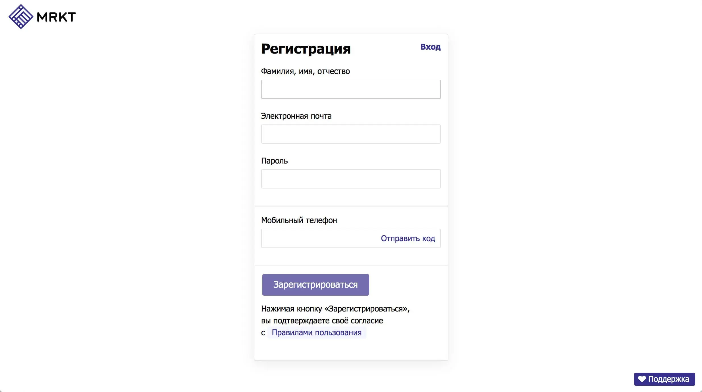

If he or she indicates a company that is already registered, we will ask staff to confirm that the user is working with them.

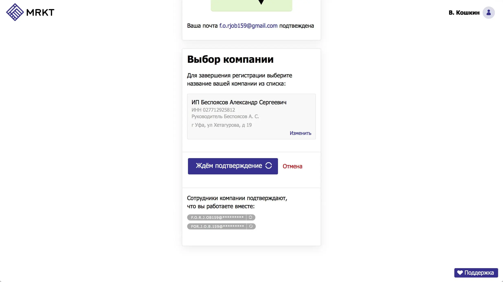

## Company Registration

If the specified company has not been registered with us yet, we will offer to create it. We pre-fill the fields, which we managed to recognize automatically, in order not to force the user to type the data by hand and to facilitate the registration process.

We try to ask only the essentials so that the company can start trading faster. For example, there are two sets of documents: minimum and advanced. The minimum set is mandatory for downloading.

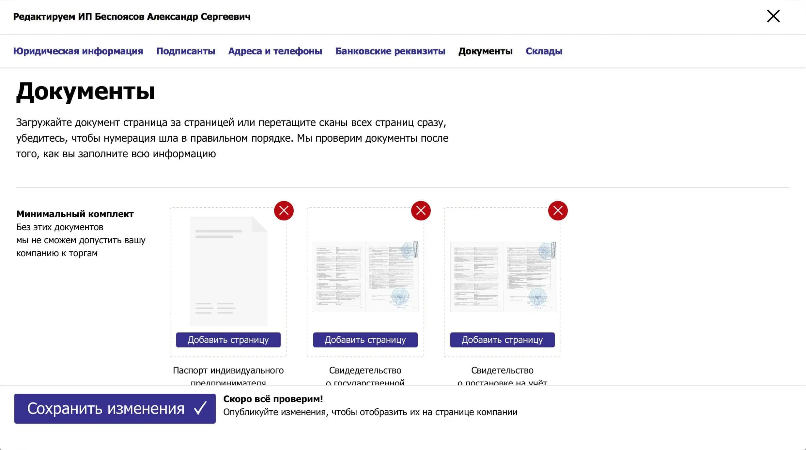

Documents from the extended list can be not uploaded during registration. If some of the documents will be required when working with other parties in the future, they can be uploaded later.

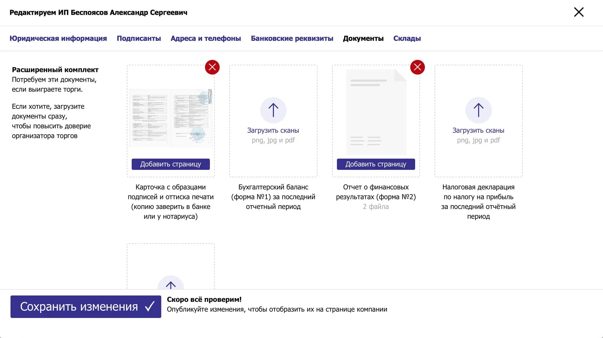

## Company Page

All information about the company is displayed on its page.

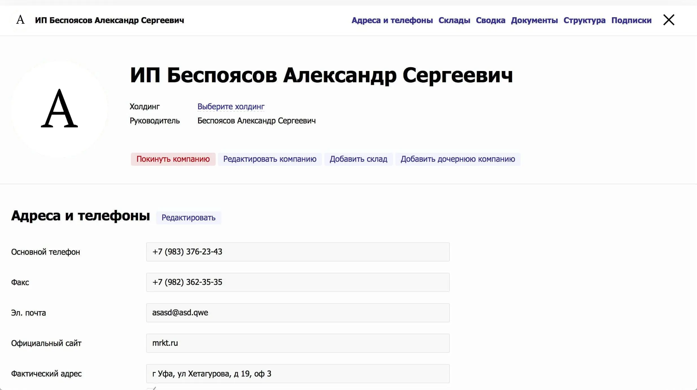

At the bottom of the page, the structure of departments and the hierarchy of employees is displayed. The company administrator appoints department heads and auditors for each department, and determines which members can view and participate in trades on behalf of the company.

<YouTube caption="Company department structure and how the UI displays it" src="https://www.youtube.com/embed/Yz5P67s-Luc">https://youtu.be/Yz5P67s-Luc</YouTube>

## Creating Trades

Companies with a premium account can create trades. When creating trades, the organizer describes the rules, deadlines, sends invitations to participants, specifies the delivery or shipping location, delivery terms, and the items being traded.

One of the most complicated parts was the position builder in creating trades:

<YouTube caption="Position builder in for creating bids UI" src="https://www.youtube.com/embed/ex27v2C-Xpo">https://youtu.be/ex27v2C-Xpo</YouTube>

In bidding, participants respond to items and make bids on them.

If the organizer allows it, participants can see whose price is the best. The rules also determine whether participants can bid more than or equal to the leading bid.

When creating positions, the organizer specifies which fields participants can edit in the bid and which fields they cannot.

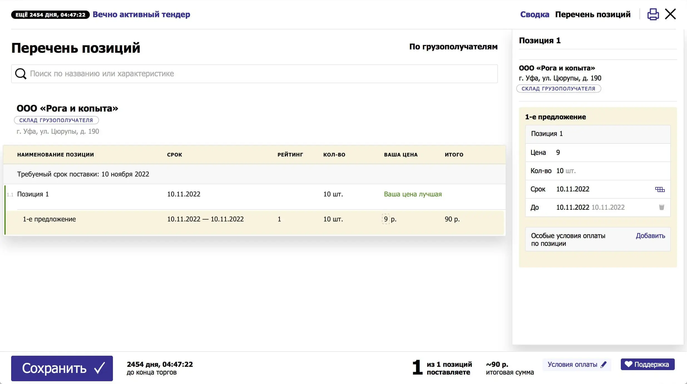

For the organizer, we display recommendations for positions or consignees. We help to make decisions by showing how the bidder's offer differs from the requested item. If a bidder has changed, for example, the delivery date, we will show it with a red tag for the organizer.

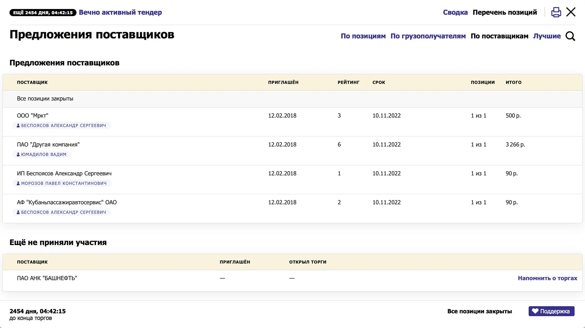

We update the bids, the best price and the leading company from the bidders and the organizer in real time.

The hardest part of bidding was from the raw data to build the right structure to display it. The structure depends on the grouping, bidding rules, current stage and search string.

## Winners Selection

The organizer can choose one winner for all bids, can give the 1st position to one, the 2nd to another, or can split the delivery of one position between bidders.

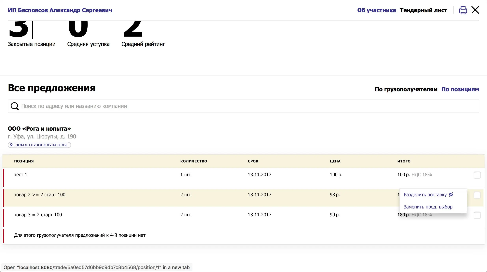.

In the last case we will offer to split the delivery equally. But if the organizer wants to change the quantity, he will change it in the form on the left.

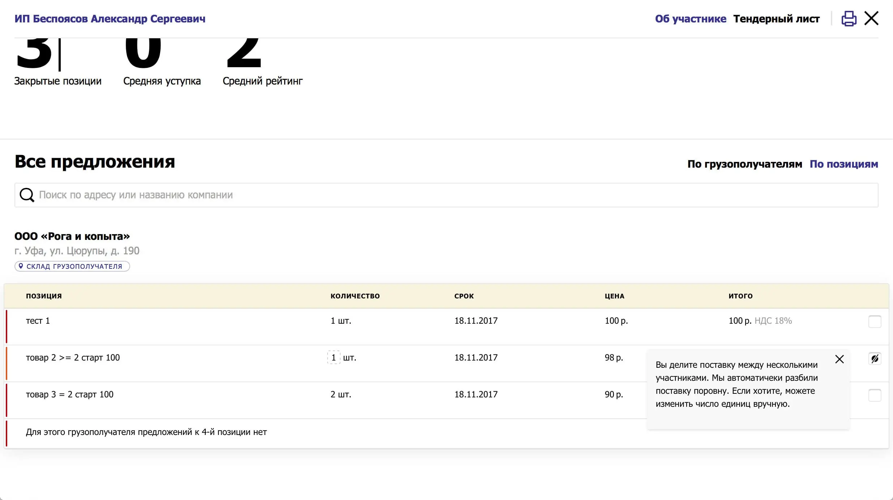

If the organizer has selected multiple companies as winners, we will ask participants if they agree to such conditions.

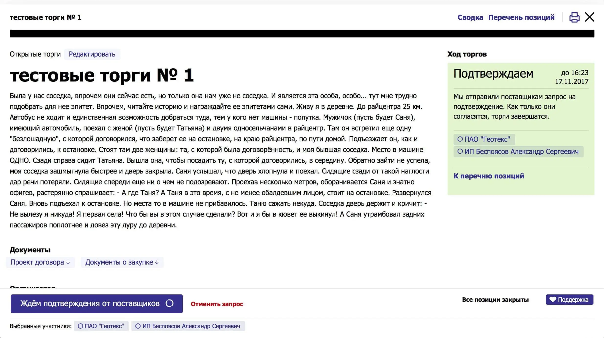

The participant will see the difference and can confirm the delivery or refuse.

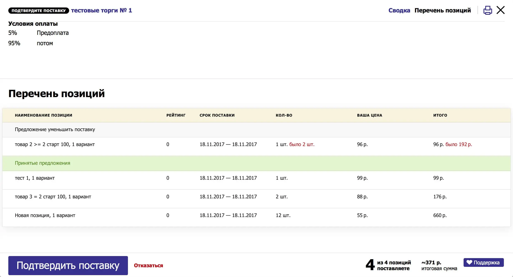

If all participants have confirmed the delivery, the bidding is considered completed.

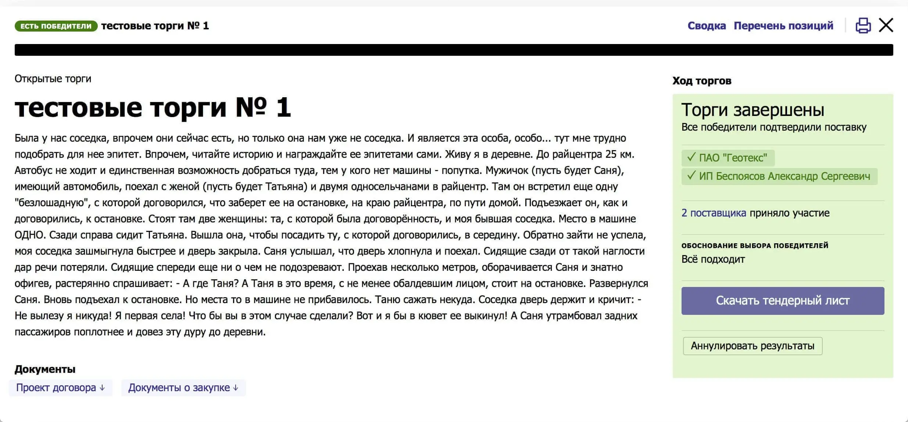

## What I Learned

This was [the biggest and the most difficult](/blog/mrkt/) project for me yet. Over the course of the work:

- I've learned many software design patterns. Wrote a post about the [adapter pattern](/blog/adapter-pattern/).
- Understood [the importance of documentation](/blog/documentation/), and especially the reasons behind the decision. The reasons are quickly forgotten, but they are the reasons that determine the behavior of the interface.
- Learned how to [correctly describe bugs](/blog/cannot-reproduce/) for more efficient bug hunting.
- Discovered technologies like [webworkers](/blog/web-workers-for-better-performance/) and [integration testing tools](/blog/coin-e2e-with-cypress/).
- Convinced of [the importance of releases and feedback](/blog/mrkt/).
- Realized the importance of changing activities and alternating tasks.
- Learned that “not a bug, but a feature” is not a joke. Sometimes a team can simply forget that some part of the interface is supposed to work a certain way and how to avoid this.
