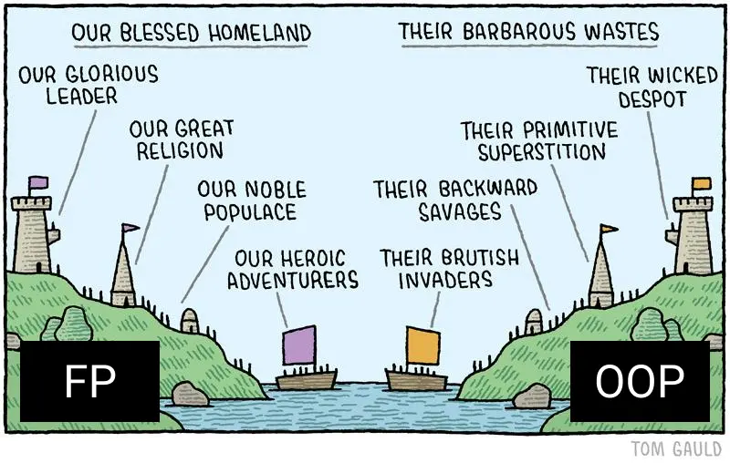

# My Week at @jsunderhood

It so happened that I got a chance to run a collective developers account on Russian Twitter called [@jsunderhood](https://twitter.com/jsunderhood) for a week [from April, 26 to May, 2](https://jsunderhood.ru/bespoyasov/).

In this post I want to collect the most important stuff I tweeted and share a translated version on my blog.

## Monday. Architecture

I started the week with an idea: what is [clean architecture](/blog/clean-architecture/), why do we need it, what are the pros, the costs, is it really a useful tool, or just an over-complicated hype?

### Architecture and Frontend

When I started posting book summaries and articles about architecture on the frontend blog, I started getting questions like “Who needs it, and why do I need it at all?”

I partly understand the nature of these questions. It seems that architecture is something far from the frontend: we are just flipping forms and moving buttons. And all these Martins and Feathers somehow overcomplicate it too much.

Why should I need to create “layers” in my application if my _all_ application is a small PWA with a couple of buttons? There are arguments like “it would be easier to move from React to something else”—but I'm not going to move from React, then why do I need adapters for it?

### Architecture is a Tool

I would like to begin by saying that architecture is first and foremost a tool. Every tool has its uses and limitations.

I probably wouldn't buy a screwdriver just to screw in one screw. But if there are 1000 screws, I would think: spend a couple hundred on an electric screwdriver or treat arthritis of the hand for more money in the future 😃

<mark>Architecture, like a screwdriver, costs resources. Supporting a complex spaghetti-code project, like arthritis—also costs resources, and also tends to be more</mark>

My first conclusion I made to myself when I compared a small and simple project with a clever architecture and a large and complex project without any architecture at all.

### Code without Architecture

The thing was, I once got into a complicated PHP project with lots of legacy and messy code. Of course, there was no architecture whatsoever. The guys started a startup, it worked, I got bugs and features, and then I came along.

That time I was just starting to get acquainted with good software development practices, I had just started reading books and stuff like that. But even then it was clear that no one had a clear understanding of how the system worked.

It was difficult to maintain this mess. And not only because it was inconvenient to test it, but it was even difficult to understand what and which module should do what. Now I would say that the _domain layer code_ was smeared in an even layer (no pun intended) throughout the application.

Everything was [jumbled together](https://en.wikipedia.org/wiki/Single-responsibility_principle), it was hard to keep even one module in mind: a module could be responsible for both templating and data conversion.

### Costs ≤ Benefits

Now a counter-example: a prototype application in React. It needs to be fast, it probably won't be necessary to maintain it. And even if you do, you'll have to rewrite it anyway, because the design will be different, the UX will change.

Suffering from “PTSD” from my past experience, I've set up the architecture there according to all the rules: here's the domain, here's the application layer, adapters, everything is independent, nice. Only no one needed the prototype, and the project faded away. Instead of testing the hypothesis with a minimum of effort, I poured a lot of resources into it.

And here is my first conclusion at the time:

<mark>The costs of the tool should be less than the benefits</mark>

After that project, I decided to reflect on it. What would happen if I had to rewrite the prototype after all.

- How much code would I have been _able_ to reuse?
- What code _would_ have to be reused?

### Domain

The domain is the most important thing about an application. It's the functionality that distinguishes the idea of one application from another. What I would definitely have had to transfer from the prototype to the product is the domain. Yes, probably with modifications, but it's the code that _would have to be ported_. Hence the second conclusion:

<mark>Start with the domain</mark>

At the beginning of the project, you don't have to build the remaining layers or write adapters to libraries, but it is worth describing the domain.

You can write it however you want, as long as the code is clear and independent. If I'm not writing in OO style, then I like to describe domain as types and pure functions that operate with data of these types.

The upside is that if the project fires and starts to grow quickly, it's easier to put the stuff around the most important code than to look for that most important code all over the code base. The simpler and more straightforward the domain, the more obvious what's going on in the system. And the more obvious the rules, the easier it is to build data flows around them and use additional tools.

Generally speaking, I think that a dedicated domain is the _minimum amount of resources_ worth allocating to the architecture at the very beginning of a project. Everything else, it seems to me, should be added as the complexity grows.

### Other Layers

Okay, done with the domain. What about [other layers](https://herbertograca.com/2017/11/16/explicit-architecture-01-ddd-hexagonal-onion-clean-cqrs-how-i-put-it-all-together/)? Do we need them? The short answer is “Not always”.

When I thought “It's easier to move out of React using an adaptor layer”, I told myself that “I wasn't going to move out of React”. And it's true, it's hard to migrate from React to some other template engine. But what if I wanted to replace “Redux”?

Replacing a state manager is usually a costly undertaking. It involves a lot of code: storage, events, UI binding. Along with all this code you have to rewrite the tests, which is twice as much work.

It's easier to migrate with a state manager adapter 🙂<br />The adapter layer is a barrier that says where third-party code ends and ours begins.

### Ports and Adapters

Adapters distinguish the outside world from our application like the membrane of a cell distinguishes it from its environment.

It's like adapters limit the spread of change. We write such adapters that make the outside world more convenient for our application. Because of this, the API of the _application_ rarely changes. Adapters, on the other hand, can be written for any entity the application wants to interact with.

This also limits error propagation. Hanmer wrote about this in [“Patterns for Fault Tolerant Software”](/blog/patterns-for-fault-tolerant-software/). Besides bugs, it helps refactor the code. Layer-by-layer separation is the perfect “seam,” as Feathers calls it in [“Working Effectively with Legacy Code”](/blog/working-effectively-with-legacy-code/).

### Software Design

Okay, so imagine, we realized that our project on React _needs_ scalability, and we can't do much with a single domain layer in our case. What to do?

The first thing to do is to take a pen and paper and go “program with our feet.” We humans are poor at predicting the future, and system design is precisely the prediction. We need to know:

- What problems we face.
- What solution is considered satisfactory.
- What the limitations are.

What we want to achieve:

- The domain layer should be self-sufficient and independent.
- Adapters should adjust external services to the needs of our application, not the other way around.
- The code should be the minimum amount needed.
- The system model should be as simple as possible.
- The direction of dependencies should be _to the domain_.

When designing systems, we need to tone down the perfectionism dynamic, because perfectionism gets in the way. It is impossible to design a system to 100% perfection. There will always be something left over that can be improved. This is worth keeping in mind when we weigh the benefits and the costs.

When designing, I usually take a piece of paper and a pen and draw squares with arrows. In the arrows I specify a public API, abstractly the format of messages that entities should communicate with.

When the picture is roughly put together, I lay out the modules into layers and check:

- Is everything OK with the direction of dependencies;
- Am I following SOLID principles;
- What happens if I want to replace some module implementation with another;
- How many resources will it take to change the platform, infrastructure, whatever.

A diagram helps not to write code right away, but to first make a note on paper—“Will it even work?”. Sometimes diagrams help you spot design errors:

- Functionality is in the wrong place;
- Modules are coupled too much;
- There's a need an event bus to link some entities;
- We break SRP, DIP, ISP, etc.

If it's working on the paper then we can start thinking about the code.

### Modules Interaction

Let's design the interaction using an example of an online cookie store 🍪

Let's say our store sells different kinds of cookies. Each cookie has a price, composition, and manufacturing time. Users can buy cookies online by specifying preferences for flavors, allergies, dairy availability, and more.

In the domain layer, I would put the following:

- Cookies and the user;
- A function to calculate the discount on the cookie by promo codes;
- Functions for determining if a cookie is suitable for taste preferences.

Next, a layer of adapters and ports. There:

- UI, page and component rendering, event handling;
- Communication with the server and API;
- saving to `localStorage` and so on.

The task of the adapter is to make the interface of a third-party service compatible with what our application _wants_. This means that if the API gives data in the form of `snake_case` and we want `camelCase`, this will be handled by the adapters.

Port is a specification of how a third-party service _can_ communicate with our application, or how our application _wants_ third-party services to communicate with it.

Application layer (between the domain and the ports/adapters)—describes the use cases specific to that application. Suppose that in addition to this store, we have another project, where cookies are simply displayed as a work of art (you can't buy them). Then the application layer of the store will contain:

- Work with a list of items and a shopping cart,
- Purchase scenarios.

In this case, we will put the part of, for example, payment that uses an external service (eg, PayPal), in the adapter. And in the application layer we will leave the logic that describes what must be done to trigger payment, what to do after a successful payment or rejection of the payment.

## Tuesday. OOP and Frontend

On Tuesday, I wrote about the OOP on the frontend. In the beginning of the day I asked the community what they think about it. Are OOP and frontend “good friends” or “nemeses”.

Judging by the poll, more people think that PLO and frontend are “good friends” (26.8%) rather than “nemeses,” (12.1%) but most people (61.1%) prefer popcorn 😊

### Why OOP is Hated

To begin with, not every project needs OOP. Sometimes it's much easier to write a couple of functions with objects, and you don't need any solids. More on this at the end.

Secondly, as far as I see, OOP is firmly associated with data mutation, and this is now unfashionable. I agree that immutable data structures are cool and reliable. But I personally don't think mutations are a bad thing, as long as they are _controllable_. When mutations become _chaotic_, then things do get drastically complicated and confusing.

But messy mutations are not a problem of OOP, they are a problem of badly written code. It is possible to write tangled code without mutating structures.

Many ways to handle mutations have long been invented, for example [CQS, command-query separation](/blog/commands-and-queries/). It involves separating code into “queries” and “commands”. Queries return data and commands change state.

What about extra entities? “With OOP, you start hatching provider factories of provider factories.” But again, that's not an OOP problem, I've seen factory factories not only in just OOP code.

Maybe it's just a matter of its complexity itself then? Well... OOP is complicated, but no more complicated than real™ functional programming. I still can't say I've mastered the [group theory](https://github.com/fantasyland/fantasy-land) for example.

### TypeScript

It seems to me that the whole hate is that the OOP with JS just isn't convenient. You can't really use it because of JS. It lacks a lot of things, trivially—there are no interfaces.

But there is TypeScript. It still suffers from JS-runtime, but it already has enough API to write normal™ code. I was really lacking a decent DI until I stumbled upon [`@wessberg/DI`](https://github.com/wessberg/di).

### Paradigm is Also a Tool

A programming paradigm, like architecture, is a [tool to tame complexity](https://herbertograca.com/2017/11/16/explicit-architecture-01-ddd-hexagonal-onion-clean-cqrs-how-i-put-it-all-together/). And, as with architecture, we should investigate the benefits and costs before applying it.

Take the same [SOLID principles](https://en.wikipedia.org/wiki/SOLID). We can use them (not all of them but still) without OOP, as a design tool. [I rewrote Tzlvt](/blog/tzlvt-architecture-upgrade/) this way, and there aren't even classes there in that app.

I generally think that OOP is more about relationships between entities than classes. But classes are still the most convenient tool for writing OOP code.

In the simplest cases, you can get by with an object and a couple of functions. But here is how these objects will interact with each other, what relations they will be in, [_it is easier to design_ in terms of OOP](https://herbertograca.com/2017/11/16/explicit-architecture-01-ddd-hexagonal-onion-clean-cqrs-how-i-put-it-all-together/).

### Tame Complexity

There's a misconception that the frontend is, like, not real programming. But the modern front end is complex. Some people may not like it, some people want all the complexity to go back to servers, but now we have what we have.

Complexity has to be dealt with somehow. We have frameworks and libraries, but they only solve part of the problem. We still have to design the system ourselves.

Of everything I've tried, OOP has the richest tools and vocabulary for system design:

- How to divide responsibilities among modules,
- How to use composition,
- What should be polymorphic,
- Where and what preconditions to put,
- What should depend on what.

By the way, OOP doesn't prohibit using the advantages of FP! We can go on [using pure functions](https://blog.ploeh.dk/2020/03/02/impureim-sandwich/), immutable structures and all that, even by writing OOP-style.



### How to Apply OOP

I recently wrote a post about how to combine the principles of clean architecture, OOP, DDD and all that stuff. For React, people also came up with [startup templates](https://github.com/eduardomoroni/react-clean-architecture).

### How OOP is Useful

I really like how OOP helps make my code scalable and testable. By scalability I mean the ability to add, rewrite, delete some module _without having to rewrite adjacent modules_. By testability I mean the ability to conveniently substitute dependencies in a stub or moc test.

### Problem of “Seeing Things Through”

You have to constantly maneuver between “a bunch of entities” and “leaky abstractions”. I have a suspicion that the skill to write understandably comes only with experience and insight.

And the problem with revision is that not all the code we see every day is understandable. We start to think it's normal™ when it really isn't. From there we often get the feeling that “OOP is 💩”, “frontend is 💩”, “JS is 💩”.

### How OOP Helps with Design

OOP in its principles implies the division of the complex into parts.

[Encapsulation](<https://en.wikipedia.org/wiki/Encapsulation_(computer_programming)>), for instance, eliminates the need to know how the details of a module are arranged. [Polymorphism](<https://en.wikipedia.org/wiki/Polymorphism_(computer_science)>) also abstracts from details, allowing you to use one mechanism to handle different entities. Composition teaches you how to isolate functionality so that you can combine it later.

In the SOLID principles, there's also the division of the complex into parts, and also the barriers to the diffusion of change.

### Inheritance is Dead

Class inheritance is a direct path to the [God-Object](https://en.wikipedia.org/wiki/God_object) anti-pattern. The problem with inheritance is that the future cannot be predicted, and we cannot design in advance such a _hierarchy_ that would meet all requirements.

<mark>We should, on the contrary, assemble the complex from the simple—use the composition</mark>

Let's use inheritance and composition as an example and see what the difference is. Suppose we are writing an application in which we describe living organisms.

What do we need to describe humans using composition? We need to build a hierarchy of entities with their own properties:

```
Animals → Mammals → Primates → Human.
```

What do we need to describe a person using the composition of interfaces? Collect the properties and methods that we will need:

```
Human =
  Skeleton +
  Nervous system +
  Immune system +
  Cardiovascular system + .
```

Okay, as long as it looks the same. ...As long as the task of teaching a man to fly doesn't come.

Let Superman appear in our app. He can shoot lasers out of his eyes and fly. How do we fit that into the hierarchy of entities?

```
Animals → (Flying animals? Flying apes? Superman?) → Human.
```

A superhero can, of course, inherit from a human and extend the base type, but that violates LSP and OCP. You could even say that inheriting _types_ in general violates these principles, because it reinforces preconditions in subtypes.

If we try not to violate LSP and OCP, then at some point we will have to create an object that can do everything, knows everything, does too much. In the composition, however, we will add additional interfaces:

```
Superhero = <...Human Interfaces> + LaserShooter + Flyable.
```

How to protect yourself from inheritance:

- Forget about the word `extends` (or whatever your language uses)
- If possible, use `sealed` classes.

## Wednesday. Readability and Testability

On Wednesday, I shared techniques and heuristics I use to make code cleaner and easier to test.

### How to Make Code Readable

The easiest and at the same time the most difficult is naming. Good and clear names for variables and functions are very powerful tools. The first book on the subject I read was [“The Art of Readable Code” by Foucher](/blog/the-art-of-readable-code/).

I like to check the names of all the entities I export for clarity on the user side. “If I import this function from a module, do I understand what it does? What is its area of responsibility? How do I use it?”

A good name for an entity: short but complete and descriptive. There's a [cool checklist](https://github.com/kettanaito/naming-cheatsheet#s-i-d) on naming entities on GitHub. This checklist has an A/HC/LC template:

```
prefix? + action (A) + high context (HC) + low context? (LC)
```

Ideally, it should be clear from the name of the variable whether it is a function, a boolean value, or something else.

- For boolean values you can use prefixes: `should`, `is`, `has`, `will`, `did`.
- For functions, the first word is better to put an action verb: `get`, `set`, `update`, `remove`, `delete`, `push`.

Sometimes (rarely) the pattern can be departed from if ambiguity can be eliminated: `let mounted = false`—here it is hard to think that `mounted` is anything but `boolean`.

Please, don't use abbreviations 😃 <br />
And if you do, be sure to document it.

It's better to put everything configurable into configs right away. Even if at first it will be an object in the same file. This will improve readability and testability.

### Design Patterns

As a rule, most of our problems have already been solved for us. Such solutions are called patterns.

Their usefulness is not only that solving problems becomes easier, but also that a familiar pattern is visible when read by other developers. There is a great [collection of patterns](https://github.com/kamranahmedse/design-patterns-for-humans) on the same GitHub, I highly recommend checking it out.

### Refactor without Fanaticism

Writing code and refactoring are like “writing” and “editing an article,” difficult to do simultaneously. If you come across a large piece of code, you should let it “rest”. When you start working on it with a clear head, it will be much easier to start thinking about the code from the reader's point of view.

<mark>And also (the hardest thing for me) we have to stop perfectionism when refactoring</mark>

Refactoring to perfection is difficult, and most often unnecessary. We use the rule [20/80](https://en.wikipedia.org/wiki/Pareto_principle)—20% of efforts should bring 80% of the result.

To refactor safely, write tests. Feathers in [“Working Effectively with Legacy Code”](/blog/working-effectively-with-legacy-code/) wrote about how you can refactor an old clumsy mess. He suggests looking for seams—places where you can relatively safely “split” the code into pieces. Cover the seams with tests, and then start refactoring.

Usually a good seam is a place where we can replace one behavior with another: the place where modules are connected. In well-written code, such places are explicitly highlighted because the modules are loosely coupled. Imagine exactly where you would divide the system into several parts (by meaning, by behavior, by dependencies)—there will be a seam.

There are lots of techniques in the book on how to work with the code when you've already decided on the seam. Like, how to replace an addiction:

- one dependency at a time;
- determine which dependency we want to change;
- cover the seam with tests;
- put the current code into a separate class;
- replace the class with another class.

### Other Ways to Improve Readability

Another technique that improves readability is [_CQS, command-query separation_](/blog/commands-and-queries/). A query is a function that returns a result and has no side-effects. A command is a function that changes the state of the system and returns nothing.

Reading such code takes less effort because reading expectations are met and we can make predictions about the functions we are working with.

Another refactoring technique which improves readability is [putting details into a method or function](/blog/missing-abstraction/). This is somewhat like a facade, but on top of your code. In this case we sort of hide the details behind the function name.

The advantage is that we no longer need to jump through different levels of abstraction, reading the condition code from the example. We will look at the details separately if necessary. And the meaning of the function is reflected in the name.

### Useful Books

Since we're talking about books, I can also recommend [“Debug it!”](/blog/debug-it/) by Paul Butcher. It's all made up of recipes on how to deal with bugs because of obscure code.

Even the content there is already a recipe! 😃

- Chapter 1—Explore the setting.
- Chapter 2—Reproduce the problem.
- 3—Determine the cause
- 4—Fix it
- 5—How to avoid making the same mistake in the future

Inside each chapter there are action lists for the situation. In short, I recommend it.

### How to Make Code Testable

<mark>Use TDD</mark>

TDD save a lot of time. You, of course, need to get used to it because it requires shifting a paradigm of writing the code. But it pays of quickly. With TDD:

- The “extra work for writing tests” problem is eliminated;
- Writing tests and refactoring becomes a habit;
- Refactoring is safer;
- Entities that do too much are easier to spot;
- API is designed before implementation, so it becomes more convenient.

### About TDD

I recently gave a talk about TDD on the Frontend-crew in Russian. In the talk, I discuss:

- How to start using it in a project;
- How to make most it;
- How to make the test code simpler.

How to simplify tests when working with TDD:

- Use clean functions more often.
- Pay attention to module coupling.
- Test only your own code.
- Use handy tools.
- Spend time on a convenient infrastructure.

TDD can be used with React too. I recently did a 5-hour workshop on using TDD when developing React applications in Russian. It's long, but there I go over all the basic concepts, namely how to test:

- Business logic functions;
- Functions that return random values;
- Simple components;
- Custom hooks, their relationship to components;
- Working with the table;
- Asynchronous functions and API calls;
- User actions: click, keyboard.

### How TDD is Useful

It immediately puts us in a situation where we have to think about testability first. It's difficult to write code that's inconvenient to test with TDD.

When we write a test first, we automatically make sure that it's convenient to call the function. By this I mean both the arguments to be passed to the function and the dependencies to be created before the test. The more dependencies we have to prepare, the more likely it is that the module does too much—and that's an SRP violation and a code smell.

When we check to see what cause the test fails, we increase the credibility of the test. If we see that the test is red when the expectation is not met, and green when it is met, that's proof that the correct test is working.

Correct tests immediately cover the written functionality. Refactoring code becomes safe: if we break something along the way, we'll know it instantly by the reddened tests.

And TDD is also one of the ways to safely (or even at all) refactor legacy code 😃

### Other Ways to Improve Testability

In addition to TDD, Dependency Injection will improve testability. Rather than mocking everything, you can use DI, and inject the dependencies you need during tests.

DI doesn't have to be about containers and all that scary stuff, you can use a “crooked” DI through an object with dependencies at the end. I recently [wrote a post about this too](/blog/di-ts-in-practice/).

### Copypaste in Code

Duplicating code _in the early stages_ [can show how things really work](/blog/copy-paste/), and what underlying patterns we haven't seen yet. Removing duplication is about predicting the future. The more raw data we can gather, the more accurate the prediction will be.

This is a bit contrary to [DRY](https://en.wikipedia.org/wiki/Don%27t_repeat_yourself), but saves time in the future. It's easier to bring out _really common_ functionality later than to manage the details of _almost identical_ implementations.

But old and commented code is really evil. It is distracting and sometimes misleading.

## Thursday. How to Grow in Development

Again, I asked the audience about the most efficient ways to grow in development. Judging by the results of the poll, the greatest impact on the audience, among other things, was the development as a real job.

Open source contributing got 6.2%, university and courses—10.8%, working with a mentor—17.2%, and the real development—65.9%.

### University

Among the advantages:

- Networking (exactly what I did not have at university 😅)
- They can teach you really useful things if you get into the right university and the right specialty. By right I mean the ones that coincide with your interests.

Among the drawbacks (in Russia):

- Educational programs, for the most part, don't keep up with the market.
- Offline lectures.
- Single major.

### Real Development

The undoubtedly biggest plus is real work experience, which you can shine on your CV. Even if you get a job in the lower grade companies, it's still experience. Correspondingly, the disadvantage is that you can get into lower grade companies. If you are new to the field of development, it is hard to know if you are in a good company or not.

Another plus of real development: there is no romantic flavor of IT that courses sometimes sell. From the inside you can look at the “real code™”, the trade-offs, how business and development are connected in general, where requirements come from and all that stuff. The minus is that it can scare you off if you get in the wrong place.

Another plus is that it helps fight perfectionism. It gets in my way all the time, especially in pet projects—there are no deadlines. External constraints help me decide on a sufficient level of “okayness”.

What was difficult for me in real development: there were times when I did the same thing without growing at all. There was a job, nothing particularly new is going on in the company, we just make the same kind of sites, and it's ok. There were no new tasks, and I did not notice them.

It was especially clear in freelancing. I had to work hard to make money, but I had to do the same things. There was no time for anything else. How to avoid falling into that trap, I don't know. Apparently, you have to have some kind of heightened awareness.

But I learned how to automate a lot of things, and I invented my own, ahem, [“web components”](/blog/html-templates/) before that was a thing. That's where I also had to learn [“progressive jpeg”](/blog/how-not-to-screw-up-deadlines/) method to keep the deadlines. The work-life balance is hard to find on freelance though.

### Mentorship

I believe that mentors are not only necessary for juniors but for everyone. And also that the development without mentorship grows slower.

For me, a mentor is not a teacher, but someone “who moved to another country before me, picked up some lumps, and can now warn me exactly how to move”. And, _good_ mentors are able to determine which mistakes they can warn me about beforehand, and which ones it would be good for me to _do myself_. Well, maybe not to do, but to be in a situation that would clearly explain exactly what the problem is.

Experience is hard to convey in words. Words are a code, a model. (A map, if you like.) They cannot convey reality, experience completely. Some mistakes, it seems, are simply impossible to “realize without doing.” A good mentor is able to assess my level and conclude which things I can understand simply by discussing them, and which ones I cannot yet.

And here's where I want to say why I think a mentor is needed, not just for juniors. Middles and seniors [may have problems that don't have an unambiguous solution. Moreover, all the solutions that are available may seem to be the equal and there might be no obvious choice between them. Such problems are stultifying and can lead to analysis paralysis when [no solution is chosen at all](https://en.wikipedia.org/wiki/Analysis_paralysis).

A mentor is especially useful when we approach more philosophical problems:

- How do we not overengineer, yet not accumulate tech debt beyond measure and be able to scale?
- At what point is it time to buy into perfectionism?
- How to work with design constraints?
- How do you manage really large code bases?
- How do you manage people, how do you divide the workload, what do you pay attention to?

When I was faced with these kinds of challenges myself, it was the _decision making_ that was difficult. It seems to me that at later stages, mentors are more like ideological inspirers or something. They no longer tell you what the right thing to do is, rather you figure out together how it will probably be less effective.

## Friday. How and Why Write to Blog

Toward the end of the week, I decided to discuss blogging, technical and otherwise.

### Why to Blog

**1. Blogging helps you fight your inner impostor**. To test the hypothesis that I “don't know anything and can't do anything,” you have to try to disprove it. An article, a tweet, a post—all this gathers feedback from which you can draw a slightly more objective picture of the world.

Sometimes, though, it feels like there's nothing to write about. “Everybody wrote about everything a long time ago, and there's no point in repeating yourself.” Write anyway!

- Not everyone has read what you've read, someone will find it useful.
- You may have details that weren't in other posts.
- Refer to others so readers will understand the topic even better.

**2. Use the blog as a notebook**. I try to [summarize the books](/tags/books/) I read so I can get a better grasp on the subject. If I need to go back to a book later, I go back to the outline first. If it has what I was looking for—great, if not, that's an excuse to reread the book and supplement the outline.

**3. Standard answer to a question**. I started blogging constantly after I came to teach at Netology. I was checking students' homework and projects, which caused me to have to answer the same questions a lot. I started [collecting standard answers](/blog/one-and-a-half-year-of-teaching/) into a note, which I then used as a template.

Later, I started answering questions from people in the post and co-workers. When I noticed they were repetitive, too, I started blogging responses to them. That's partly why I often link to my blog—the posts spell out everything in more detail than you can tell in a tweet.

**4. It works almost like a GitHub!** Blogging often brings me good offers ¯\\\_(ツ)\_/¯

**5. It's a good trainer for formulating thoughts**. I've noticed that after some time of blogging, I'm getting good at formulating thoughts and tasks in writing. It then helps with tasks, too, because good problem formulation is half the solution.

### How to Make a Post

There are three principles I use to avoid stupor, procrastination, and frustration:

- ”Eat the elephant in pieces.”
- ”Well, in short...”
- ”Editing—after.”

I've noticed myself that I procrastinate on tasks that seem big and _incomprehensible_. A new post is an even more incomprehensible task.

The first principle of “eating an elephant in pieces” tries to break down a big, incomprehensible task into small chunks. Such small problems can be solved one at a time.

I apply this same principle to the actual writing of an article. I do not write a huge post of 40 thousand characters at once—it's difficult and exhausting. First, I outline the structure of the headings—it helps me create a “map” that I will follow later.

Moreover:

- First, the structure consists only of the top headings,
- Then I refine each section with subheadings,
- Then in each subsection I throw in main thoughts.

Next, the problem of a white sheet may appear. Against it I apply the second principle: “well, in short”. I start the text of the post with “Well, in short...” and then write everything that I think is necessary. No paragraphs, no division into sentences, I just write as long as it goes.

I edit the text separately afterwards. Writing and editing are different tasks, and you have to do them differently, too. In editing, you often have to remove text, replace it, rephrase it, add details. You could compare writing to a brainstorm, and editing to analyzing the results.

When editing, I usually check the logic of the narrative first:

- Does a sentence flow logically into another?
- Is the thought moving or standing still?
- How does one paragraph relate to the second?

At this stage, you can remake the structure of the entire text as you want, because not much effort is spent yet. You can move sections, paragraphs, headings, wherever you want. It's not a loaf yet, but a dough—it's okay to change it.

When all is well with logic, you can go deeper into the text itself:

- Are there enough details?
- Is there, on the contrary, no unnecessary details?
- Does every sentence relates to the topic?
- What can be removed without losing meaning?
- What is missing?

At the very end, you can get down to punctuation, spelling, and grammar.

### How to Insert Code Samples

Here we need to solve almost contradictory problems at the same time:

- There must not be too much code to make it easy to read.
- But there should be enough code to convey the context of the problem.

I try to add code that relates _directly_ to the topic of the article. I read the title or subtitle, ask myself, “Is this code relevant to the topic?” If yes, I add it, if no—I remove it. This way I bite off small pieces of code until there is nothing more to bite off.

If the sample code has two ideas, it's better to split it up. If it has some details which are not on the subject, it's better to cut them out. If, on the contrary, there are not enough details, add one at a time until the idea of the example is clear. I also try to emphasize the development of the example through the article.

## My Impression

Running a large account with 10,000 people is interesting. There is always an opinion in such an audience that is somehow different from mine. Opening discussions in such topics is useful.

For the most part, all of the feedback in my direction has been consistent and calm. Although to be honest, I expected the first threads to ignite the fires of the inquisition under me 😃

All in all, if you have something to talk about and have a week to try, I recommend it.

## Resources

I've compiled a list of books, articles, and tools I referred to in this post. There's much more material in the original Twitter threads but those links are mostly in Russian. For some, I found analogues though, so here's the list.

### Books

- [The Clean Architecture by Robert C. Martin](/blog/clean-architecture/)
- [Patterns for Fault Tolerant Software by Robert S. Hanmer](/blog/patterns-for-fault-tolerant-software/)
- [Working Effectively with Legacy Code by Michael C. Feathers](/blog/working-effectively-with-legacy-code/).
- [The Art of Readable Code by D. Bowsell, T. Foucher](/blog/the-art-of-readable-code/).
- [Debug It! by Paul Butcher](/blog/debug-it/)

### Posts From My Blog

- [Command-Query Separation](/blog/commands-and-queries/)
- [Tzlvt. Why Rewrite in TypeScript](/blog/tzlvt-architecture-upgrade)
- [Missing Abstraction](/blog/missing-abstraction/)
- [Dependency Injection with TypeScript in Practice](/blog/di-ts-in-practice/)
- [Copypaste in Code](/blog/copy-paste/)
- [How Not to Screw Up Deadlines](/blog/how-not-to-screw-up-deadlines/)
- [Templates for HTML Coding](/blog/html-templates/)
- [What I've Learned in a Year and a Half of Teaching](/blog/one-and-a-half-year-of-teaching/)

### FP, OOP, Software Design

- [DDD, Hexagonal, Onion, Clean, CQRS, … How I put it all together](https://herbertograca.com/2017/11/16/explicit-architecture-01-ddd-hexagonal-onion-clean-cqrs-how-i-put-it-all-together/)
- [Impureim Sandwich](https://blog.ploeh.dk/2020/03/02/impureim-sandwich/)
- [Encapsulation](<https://en.wikipedia.org/wiki/Encapsulation_(computer_programming)>)
- [Polymorphism](<https://en.wikipedia.org/wiki/Polymorphism_(computer_science)>)
- [SOLID Principles](https://en.wikipedia.org/wiki/SOLID).
- [DRY](https://en.wikipedia.org/wiki/Don%27t_repeat_yourself)
- [Design Patterns for Humans](https://github.com/kamranahmedse/design-patterns-for-humans)
- [Fantasy Land Specification](https://github.com/fantasyland/fantasy-land)

### Tools

- [Naming cheatsheet](https://github.com/kettanaito/naming-cheatsheet#s-i-d)
- [`@wessberg/DI`](https://github.com/wessberg/di)

### Non-Software Topics

- [Pareto Principle](https://en.wikipedia.org/wiki/Pareto_principle)
- [Analysis Paralysis](https://en.wikipedia.org/wiki/Analysis_paralysis)
