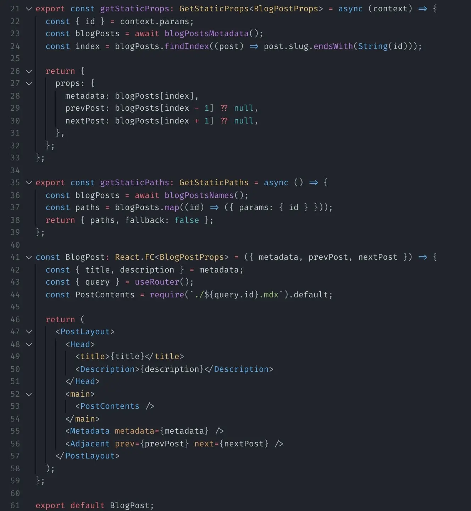
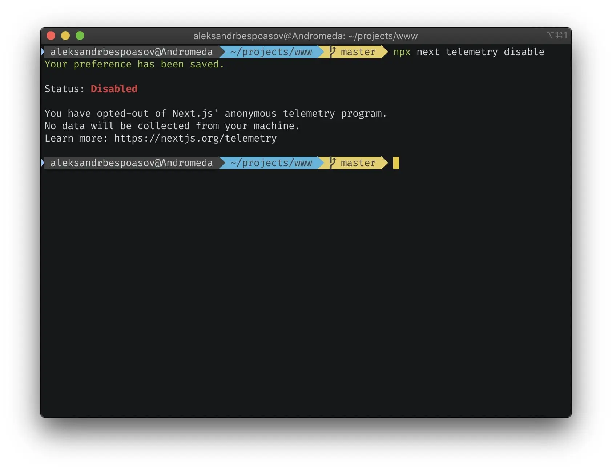
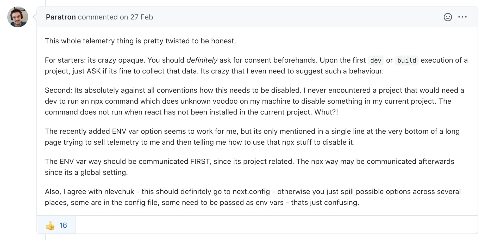
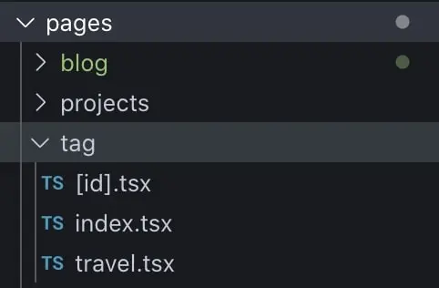

# Rebuilt Site with Next and TypeScript

This year my blog turns 10 years old. In honor of that, I rebuilt the site. I decided to completely change the stack and rewrite it in Next.js with TypeScript. In this post, I share my impressions of the stack, the process of moving and using it.

## Motivation

The main complaint with my [last stack](/blog/site-redesign/) is the poor usability.

My self-written static generator based on _Gulp_ worked, but with a huge number of pain points. The most problematic convention was infrastructure code. For example, if I wanted to add a new template for a page, I had to write not only the code for that template, but also all the infrastructure around it.

With new blog posts it didn't bother me much, but updating the design slowed down a lot. Changing the page design was becoming a whole adventure that I didn't really want to start.

I wanted a stack that wouldn't burden me with extra work.

## Constraints

Besides the specific pain I wanted to get rid of, I still had a few fundamental limitations. I didn't want to compromise and decided that I would give myself as much time as I needed to find and implement a fitting solution. Among the constraints, I had the following.

### No to CMS

I wanted a simple site without any CMS, backend, or data base. I wanted to store notes in an independent format, like text or `md` files.

### Yes to Static Generation

I wanted to be able to simply view the result of a build in a browser without bringing up the server. I also wanted the content to remain available if JavaScript was disabled, so I needed static generation.

### DX ≤ UX

Developer Experience, DX is how convenient it is to write code and how convenient the development tools are. DX is important, but the end users' convenience (User Experience, UX) was more important for me. Accordingly, more resources should be invested in the UX by default.

But since the project is primarily for _me_, I didn't want to sacrifice my comfort either. I wanted to find a tool that would minimize the amount of development resources and would be convenient for me too. Ideally, the inequality _DX ≤ UX_ should have turned into the equality _DX = UX_.

## Nice-to-Have

In addition to these limitations, there were also some things that “would be nice to have, but not necessarily.”

### Domain Types

I'm used to separating business logic in code from everything else. Usually I store all the additional information about processes and business processes in types, so _TypeScript_ was included in the requirements.

### Components

The past stack was bad partially because the components I had weren't “real” components.

I used [_pug_](https://pugjs.org/api/getting-started.html) and the “components” were pieces of markup that were injected into the template. The styles were smeared across the filesystem, and I kept forgetting the template syntax. In short, I wanted React—its concept of components is realized better, and I had already gotten used to it.

### Infrastructure

By infrastructure, I mean all sorts of graphics optimizations, service worker settings, offline mode and stuff like that. I wanted it all out of the box if possible.

## New Stack

Since I wanted a static site, I was choosing between static generators: Eleventy, Gatsby, and Next.js. I ended up choosing Next.

### Eleventy

[Eleventy](https://www.11ty.dev) didn't seem like a right tool for me. In terms of components components, it was very similar to my previous self-written generator, which I wasn't happy with. And it takes a lot of thought to set up TypeScript properly.

I also didn't understand how to make navigation with links to the previous and next post convenient and without ugly helpers.

(It doesn't mean that Eleventy is a bad tool; it just doesn't fit my task).

### Gatsby

[Gatsby](https://www.gatsbyjs.com) has components and TypeScript. Almost yay, I had drowned in its documentation. There were just too many themes and plugins and stuff. Lots of, to my taste cluttered, code samples without context, making it unclear how to use them.

(It doesn't mean that Gatsby is a bad tool; it just doesn't fit my task).

### Next.js

[Next](https://nextjs.org) is not without problems, but it is the framework with which I managed to move from a dead point and somehow start working. We'll talk more about the downsides of Next, but for now I'll just say that I found it relatively suitable.

(It doesn't mean that Next is perfect; it just fits my task.)

### TypeScript

To the question “Why TypeScript?”, I have two answers. The first one is that I am used to its convenience. I feel much less confident in my code if I write in JavaScript. Refactoring code in TS is also much more convenient because of the built-in tools in IDE.

The second answer is that I want my code to have all the data I need to understand what it does and _why_. [TypeScript gives tools](/blog/tzlvt-architecture-upgrade/) to express my thoughts more accurately and completely.

I use types to convey the context and business logic of entities. I like, to use type aliases over primitives, explaining why I return that particular value.

Other than that, I will be opening this project rarely and the types and interfaces will help me get into context faster and remember how it works.

### React

As for React, I just want good ol' components. I now find it not so comfortable to have infrastructure made purely and only with HTML and CSS [like I did 5 years ago](/blog/site-redesign/), so I just decided to take the technology I'm familiar with.

## Expectations

The perfect stack for me is one that takes no effort to maintain, and is as transparent and simple to use as possible. Spoiler: the stack with Next is not like that 😁

I guess the root problem is my perfectionism and writing style, but I expected to have at least no problems with graphics and exporting to static HTML. Likewise, I expected to have no problems with importing post text. But it turned out to be expectations that Next couldn't live up to.

### Static Props and Adjacent Posts

Next [uses](https://nextjs.org/docs/basic-features/data-fetching) the `getStaticProps` and `getStaticPaths` functions to determine what pages and data are needed to generate HTML. I use these functions to get lists of all the posts and projects that are out there. These lists help me determine which posts will be referenced as neighboring posts.

The first complaint is that Next rules require that these functions and the page component be exported _from the page module_ and only.

I don't like this because I like to saw modules into as compact as possible, and exporting everything in a row from a single file is noisy and messy. But that's a matter of taste.

The real problem came when I wanted to create a component with links to the previous and next posts for the post page. You can only use `getStaticProps` inside a page, but using `getStaticProps` inside `mdx` pages turned out to be [impossible](https://github.com/vercel/next.js/issues/12053).

In [discussions](https://github.com/vercel/next.js/issues/12053), the developers offer many solutions, but none seemed to me to be fitting. I decided that it was more expensive to use flimsy solutions that rely on framework flaws. So I decided not to use `mdx` files as pages, but to make a page component that would import the contents of the `mdx` file into itself.

### Cost of Migrating from MDX Pages

To migrate, you not only have to create a [page for e.g. a post](https://github.com/bespoyasov/www/commit/dc71cc1e3da11bef75dbfdee13ea9ae49ea28493), but also [update](https://github.com/bespoyasov/www/commit/14c500aba82a187cb4238fbd280e6f1ecc389035) all former `mdx` pages and create a [layout](https://github.com/bespoyasov/www/commit/f593865460c8688c2f809eafcf6a74b1ad06d733).

I was lucky enough to do this at the beginning of the project life, when I had moved very few posts yet. If I had migrated more posts, this would have become a bigger problem.

### Getting Metadata

To show a list of posts on a blog page or a list of projects on a project page, I need to know not only the links to each post, but also the order in which to show them.

I use page metadata to determine the sort order, to recognize the name and address of the pages. To get the metadata, I use the [`api`](https://github.com/bespoyasov/www/tree/master/api/fetch/metadata) module, which calls [`persistence`](https://github.com/bespoyasov/www/tree/master/persistence/source) for the contents of `mdx` files. From the contents it picks out all the exports and finds the metadata declarations, which it then turns into a list of objects.

And it all is unnecessarily too difficult. However, I haven't found ready-made solutions, neither to get `frontmatter`, nor to get the exports.

### Lack of TypeScript Support for MDX

So far [TypeScript doesn't support MDX](https://github.com/microsoft/TypeScript/issues/36440). For me, this means I can't use autocomplete when specifying tags for a post. (Which will probably cause some typos, sorry.)

### Image Optimizations

Here I thought everything would be fine, because there are [`next-images`](https://www.npmjs.com/package/next-images) and [`next-optimized-images`](https://github.com/cyrilwanner/next-optimized-images) packages.

However, for these packages to work, I need to know in advance what image I want to import down to the file name and extension. That is, I can't set up the project so that the build takes images from the specified location, optimizes them and puts them where I want.

But by that time I had already somehow got a bit disappointed in Next and wrote [my own `ops` scripts](https://github.com/bespoyasov/www/blob/master/ops/graphics.js) for this.

The other day there was a [discussion about optimization of images](https://github.com/vercel/next.js/discussions/17141), but it seems that SSG wouldn't support that.

### RSS Generation

The RSS feed generation would not be a problem if the project was running on a server with Node.js. I could [make a separate page and just specify `canonical`](https://dev.to/fredrikbergqvist/how-to-add-an-rss-feed-to-your-next-js-site-1h02).

But my site was going to be static, so I had to [make RSS by hand and build its generation into the build process](https://github.com/bespoyasov/www/blob/master/ops/rss.js). Again, not too much of a problem on its own but together with other problems...

### Default Telemetry Settings

What pissed me off specifically was the telemetry enabled by default. As [correctly noted in the discussion](https://github.com/vercel/next.js/issues/8851#issuecomment-591710955), Next should have asked if I was okay with it before I started the first `npm run dev`.

But not only did they not do that, they also hid a page telling me how to turn it off [somewhere far-far away](https://nextjs.org/telemetry).

I found out about this “feature” by accident—when I was building the project for the first time. Before starting the build they render a small note in the console that says something like “We are collecting data there, here is the notification, but you'll likely miss it when the build log appears.”

You can't disable it once and for all. It's done for each machine separately, yikes! I wrote myself [a script that disables it right after installing the project](https://github.com/bespoyasov/www/commit/bb758beae52a5d59d7eb113c9c21f1bd61ffc9b0).

## Good Parts

Don't think Next is completely bad. It has its advantages too.

### More Convenient that Self-Written Generator

The most obvious advantage is that a framework is much more convenient than a self-written generator.

The ease of development has grown and I was able to drastically reduce code duplication. I now know for sure that when a module is removed, its styles will be removed from everywhere too, and refactoring the code became more pleasant.

### Convenient Offline Mode

There is a great package for Next that generates the service worker configuration, [`next-offline`](https://github.com/hanford/next-offline). It offers caching strategies, easy management of cache memory limits, and manages updates without any issues. In short, I recommend it.

### After All, Static Generation

I wanted HTML as the output, I got HTML as the output. 
I wanted it to work without JS, it works without JS. 
Nice.

### Code Optimization

Next has file loaders, minifiers, tree shakers, style transformers, and that sort of thing set up for me. I really didn't want to deal with it all myself, and Next really helps with this.

### No Server, No DB

My posts are still stored in Markdown files, and I can move to a different technology at any time. I don't need to raise servers and a backend for production, just put the files in the right place.

### Page Hierarchy

In the “pages” directory I can not only store page file, but also create subdirectories from which the path structure will be built.

For example, `/pages/tag/travel.tsx` will turn into `/tag/travel/index.html`. I can have `/pages/tag/[id].tsx` next to `/pages/tag/[id].tsx`, which will handle all other paths in `/tag/travel/*`, and there will be no conflicts. It's really convenient.

With the last stack this was a headache, now it's joy, ponies, and rainbows.

## Conclusions

Most of my criticisms of Next are just purism and grunting. In general, the framework is good, and I can image using it for something much more complex than just a blog.

## Sources and References

- [Source code for the blog](https://github.com/bespoyasov/www)
- [How I rebuilt the site last time](/blog/site-redesign/)
- [How and why we rebuilt Tzlvt with TypeScript](/blog/tzlvt-architecture-upgrade/)

### Tech

- [Next](https://nextjs.org)
- [Eleventy](https://www.11ty.dev)
- [Gatsby](https://www.gatsbyjs.com)
- [TypeScript](https://www.typescriptlang.org)
- [React](https://reactjs.org)
- [Pug](https://pugjs.org/api/getting-started.html)

### Tools

- [MDX](https://mdxjs.com/getting-started/next)
- [Frontmatter](https://github.com/remarkjs/remark-frontmatter)
- [`next-offline`](https://github.com/hanford/next-offline)
- [`next-images`](https://www.npmjs.com/package/next-images)
- [`next-optimized-images`](https://github.com/cyrilwanner/next-optimized-images)
- [Data Fetching in Next](https://nextjs.org/docs/basic-features/data-fetching)
- [How to add an RSS-feed to your Next.js site](https://dev.to/fredrikbergqvist/how-to-add-an-rss-feed-to-your-next-js-site-1h02)
