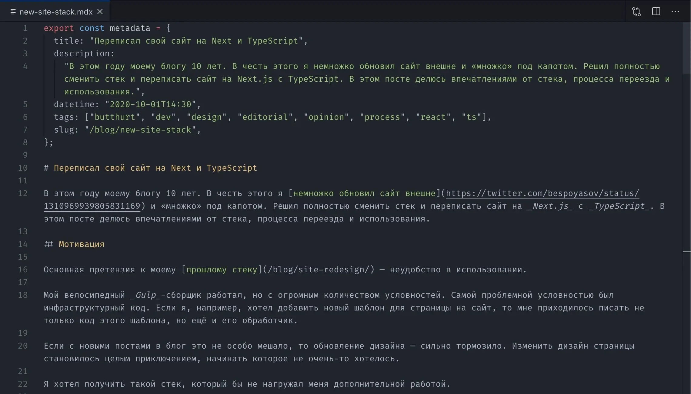

# Переписал свой сайт на Next и TypeScript

В этом году моему блогу 10 лет. В честь этого я [немножко обновил сайт внешне](https://twitter.com/bespoyasov/status/1310969939805831169) и «множко» [под капотом](https://github.com/bespoyasov/www). Решил полностью сменить стек и переписать сайт на _Next.js_ с _TypeScript_. В этом посте делюсь впечатлениями от стека, процесса переезда и использования.

## Мотивация

Основная претензия к моему [прошлому стеку](/blog/site-redesign/) — неудобство в использовании.

Мой велосипедный _Gulp_-сборщик работал, но с огромным количеством условностей. Самой проблемной условностью был инфраструктурный код. Если я, например, хотел добавить новый шаблон для страницы на сайт, то мне приходилось писать не только код этого шаблона, но ещё и его обработчик.

Если с новыми постами в блог это не особо мешало, то обновление дизайна — сильно тормозило. Изменить дизайн страницы становилось целым приключением, начинать которое не очень-то хотелось.

Я хотел получить такой стек, который бы не нагружал меня дополнительной работой.

## Ограничения

Помимо конкретной боли, от которой я хотел избавиться, у меня ещё было несколько принципиальных ограничений. Я не хотел идти на компромиссы и решил, что дам себе столько времени, сколько потребуется для поиска и реализации. Среди ограничений было...

### Всё ещё в топку CMS

Я всё ещё хотел простенький сайт безо всяких _CMS_, бекендов и баз данных. Мне всё ещё хотелось хранить заметки в независимом формате, например, в текстовых файлах.

### Серверный рендеринг

Хотелось, чтобы результат сборки можно было просто посмотреть в браузере, не поднимая сервер. А ещё хотелось чтобы контент оставался доступен, если отключён _JavaScript_.

### DX ≤ UX

Удобство разработки _(Developer Experience, DX)_ — насколько удобно писать код и насколько комфортны инструменты разработки — это важно, однако удобство конечных пользователей _(User Experience, UX)_ важнее. Соответственно и вкладывать больше ресурсов по умолчанию следует в _UX_.

Но так как проект в первую очередь для меня, я не хотел жертвовать и своим комфортом тоже. Хотелось найти такой инструмент, чтобы количество ресурсов на разработку было минимально, а удобно было бы и пользователям, и мне. В идеале неравенство _«DX ≤ UX»_ должно было превратиться в равенство _«DX = UX»_.

## Хотелки

Кроме принципиальных ограничений были ещё и хотелки, которые сделать «было бы неплохо, но необязательно».

### Доменные типы

Я чё-то привык отделять бизнес-логику в коде ото всего остального. Обычно всю дополнительную информацию о сущности такого плана я храню в типах, поэтому в требования попал _TypeScript_.

### Компоненты

Прошлый сборщик был плох тем, что компоненты в нём были компонентами курильщика.

Я использовал [_pug_](https://pugjs.org/api/getting-started.html) и «компоненты» были кусками разметки, которые подключались в шаблон. Стили были размазаны по файловой системе, компоненты было трудно подключать, я постоянно забывал синтаксис шаблонизатора. Короче, хотелось _React_ — у него концепция компонентов реализована прекрасно, да и я привык к нему.

### Инфраструктура из коробки

Под инфраструктурой я имею в виду всякие оптимизации графики, настройки _service-worker_, работу в офлайне и прочее. Хотелось, чтобы какие-нибудь умные люди подумали, придумали и сделали всё за меня.

## Новый стек

Так как я хотел статический сайт, я выбирал между генераторами статики: _Eleventy_, _Gatsby_ и _Next.js_. Пройдусь по всем и расскажу, почему в итоге выбрал _Next_.

### Eleventy

[_Eleventy_](https://www.11ty.dev) — явно не тот инструмент, который бы мне подошёл. От компонентов в нём одно слово: всё очень похоже на мой предыдущий самописный сборщик, который меня не устраивал. Да и чтобы _TypeScript_ нормально настроить, нужно много думать.

Я также не понял, как удобно и без костылей сделать навигацию со ссылками на предыдущий и следующий пост.

Кроме этого, _Eleventy_ мне не понравился его многословным конфигом, который бы появился, когда я настроил всё, что мне нужно. Ну вот не люблю я, когда код не помещается в экран. И если на работе я могу с этим мириться (привет, _Webpack_), то в проекте для души хотелось этого избежать.

(Внимание! Я не говорю, что _Eleventy_ плохой; я говорю, что он не подходит для моей задачи.)

### Gatsby

В [_Gatsby_](https://www.gatsbyjs.com) есть компоненты и _TypeScript_. Почти ура, но я невзлюбил его из-за проприетарных команд в консоли.

Ну то есть как, к самим командам я никаких претензий не имею. Но когда первое, что я вижу в документации — это настройка _Vendor CLI_, меня почему-то коробит.

В документации, темах и плагинах я утонул. Много, на мой вкус беспорядочно, примеры кода без контекста, из-за чего неясно как их использовать, если не думать.

(Внимание! Я не говорю, что _Gatsby_ плохой; я говорю, что он не подходит для моей задачи.)

### Next.js

[_Next_](https://nextjs.org) не без проблем, но это фреймворк, с которым у меня получилось сдвинуться с мёртвой точки и хоть как-то начать работу. Об отрицательных сторонах _Next_ мы ещё поговорим, а пока скажу, что мне он относительно подошёл.

(Внимание! Я не говорю, что _Next_ идеальный; я говорю, что он подошёл для моей задачи.)

### TypeScript

На вопрос «Зачем [_TypeScript_](https://www.typescriptlang.org)?» у меня есть два ответа. Первый — я привык к его удобству. Я чувствую гораздо меньше уверенности в своём коде, если пишу на _JS_, а не на _TS_. Рефакторить код на _TS_ тоже гораздо удобнее из-за встроенных инструментов в _IDE_.

Второй ответ — мне хочется читать свой код, как предложение. Я хочу, чтобы в нём были все необходимые данные, чтобы понять написанное. [_TypeScript_ даёт инструменты](/blog/tzlvt-architecture-upgrade/), чтобы выражать свои мысли точнее, полнее и адекватнее.

Я использую типы для передачи контекста и бизнес-логики сущностей. Мне нравится, использовать тип-алиасы над примитивами, объясняя, почему я возвращаю именно такое значение. Так как этот проект для души, хочется, чтобы было красиво.

Кроме этого, я буду открывать этот проект время от времени, а не каждый день. Типы и интерфейсы помогут мне быстрее въехать в контекст и вспомнить, что я имел в виду.

### React

На вопрос «Зачем [_React_](https://reactjs.org)?» у меня тоже есть ответ. Я хочу **нормальных** компонентов.

Прежде, чем в меня полетят помидоры с веб-компонентами, веб-платформой и шаблонизаторами, я скажу, что я пробовал всё это использовать в прошлом стеке. У меня был _pug_, который импортировал кусочки шаблонов, простенькие _CSS_-трансформации, ванильные технологии и вот это всё.

Оно конечно хорошо, но это не компоненты. Вот я добавил новое меню: мне надо обновить шаблон и отдельно стили. Если я убрал какой-то блок, мне надо найти его стили и убедиться, что они больше нигде не используются, перед тем, как убить их. Я хочу удаляя компонент сразу быть уверенным, что я удалил всё, что с этим компонентом связано, отовсюду, не проверяя.

Но если со стилями я ещё как-то мирился, то вот кусочки _pug_-шаблонов, для которых данные надо прокидывать абсолютно костыльнейшим образом, меня бесили. Я не хочу писать коряво, если знаю, что можно удобнее.

Ну а [снова ударяться в пуризм](/blog/site-redesign/) и писать совсем голые _HTML_-страницы и _CSS_-стили я не хочу. (Как бы я ни убеждал себя 5 лет назад в обратном, это неудобно.)

## Ожидания

Идеальный стек для меня представляется таким, на поддержание которого сил не уходит в принципе, а использование максимально прозрачно и просто. Спойлер: стек с _Next_ не такой 😁

Наверное, корневая проблема — в моём перфекционизме и стиле написания, но я ожидал, что у меня как минимум не будет проблем с графикой и экспортом в статический _HTML_, так как _Next_ позиционирует себя как статический генератор. Так же я ожидал, что не будет проблем с импортом текста постов. Но оказалось, что это ожидания…

## …Которых Next не оправдал

Заранее: если вы знаете, как правильно, мой [репозиторий открыт для пул-реквестов](https://github.com/bespoyasov/www) 🙃 
Буду рад услышать идеи. Теперь поехали.

### Frontmatter?..

Я храню тексты постов в [_mdx_-файлах](https://mdxjs.com/getting-started/next). Меня удивило, что по умолчанию _Next_ не поддерживает [_frontmatter_](https://github.com/remarkjs/remark-frontmatter) для метаданных.

Мне нравится идея хранить метаданные о посте в том же файле, что и сам пост — типа всё сразу в одном месте. Но для поддержки _Frontmatter_ мне бы пришлось ставить [ещё один пакет](https://github.com/hashicorp/next-mdx-enhanced). А это ещё одна зависимость, которую потом надо менеджить и обновлять.

Ну а так как эта зависимость мне бы потом никак не помогла собирать метаданные для списков постов на странице блога, я решил использовать обычные экспорты внутри _mdx_.

### Статические свойства и соседние посты

Вторая проблема, с которой я столкнулся, — это статические свойства у страниц.

_Next_ [использует](https://nextjs.org/docs/basic-features/data-fetching) функции _getStaticProps_ и _getStaticPaths_, чтобы определить, какие страницы и данные нужны, чтоб нагенерировать _HTML_. Я использую эти функции чтобы получить списки всех постов и проектов, которые есть. Эти списки мне помогают определить, ссылки на какие посты будут соседними.

Первая претензия — по правилам _Next_ эти функции и компонент страницы надо экспортировать _из модуля страницы_ и только.

Мне это не нравится, потому что я люблю распиливать модули на как можно более компактные, а экспорт всего подряд из одного файла шумный и грязный. Но это вкусовщина.

Реальная же проблема возникла, когда я захотел создать компонент со ссылками на предыдущий и следующий посты для страницы поста. Использовать _getStaticProps_ можно только внутри файла-страницы, но при этом использовать _getStaticProps_ внутри _mdx_-страниц оказалось [нельзя](https://github.com/vercel/next.js/issues/12053).

В [обсуждении](https://github.com/vercel/next.js/issues/12053) разработчики предлагают много решений, но ни одно мне не показалось «не костылём». Я решил, что использовать хрупкие решения, которые опираются на недоработки фреймворка, — себе дороже. Поэтому решил не использовать _mdx_-файлы как страницы, а сделать компонент страницы, который бы импортировал в себя содержимое _mdx_-файла.

### Переезжать с mdx-страниц на компонент затратно

Чтобы переехать, надо не только создать [страницу для, например, поста](https://github.com/bespoyasov/www/commit/dc71cc1e3da11bef75dbfdee13ea9ae49ea28493), но ещё и [обновить](https://github.com/bespoyasov/www/commit/14c500aba82a187cb4238fbd280e6f1ecc389035) все бывшие _mdx_-страницы и создать [лейаут](https://github.com/bespoyasov/www/commit/f593865460c8688c2f809eafcf6a74b1ad06d733).

Мне повезло, что я делал это в начале работы, когда я перенёс ещё мало постов. На большем количестве это стало бы проблемой.

### Не удалось избавиться от дублирования данных

Следующий и предыдущий посты определяются по дате создания каждого поста. Однако, чтобы дать ссылку на конкретный пост, надо знать название файла, в котором он находится, либо указать ссылку в метаданных.

Я так и не нашёл красивого решения для этой проблемы: получалось либо слишком много кода, либо появлялись циклические зависимости. Пока что я [оставил адреса постов в их метаданных](https://github.com/bespoyasov/www/commit/81de7fdb417519e71fece39524a5ee791dde6a49). Эти адреса я потом использую, когда ссылаюсь с соседних постов. Если у вас есть идеи, как сделать лучше — напишите, пожалуйста.

### Получение метаданных

Чтобы показать список постов на странице блога или список проектов на странице проектов, мне надо знать не только ссылки на каждый пост, но ещё и порядок, в котором их показывать.

Я использую метаданные страниц, чтобы определять порядок сортировки, узнавать название и адрес страниц. Для получения метаданных я использую модуль [_api_](https://github.com/bespoyasov/www/tree/master/api/fetch/metadata), который обращается к [_persistence_](https://github.com/bespoyasov/www/tree/master/persistence/source) за содержимым _mdx_-файлов. Из содержимого он вычленяет все экспорты и находит объявления _const metadata_, которые потом превращает в список объектов.

И сделать архитектурно красиво, блин, — неоправданно сложно. Я так и не нашёл готовых решений, ни чтобы получать _frontmatter_, ни чтобы получать экспорты. Пришлось самому написать [AST-трансформеры](https://github.com/bespoyasov/www/tree/master/domain/ast), всё ещё сомневаюсь, что нельзя было проще <nobr>:–/</nobr>

### TypeScript не поддерживает MDX

Пока что [поддержки _MDX_ у _TypeScript_ нет](https://github.com/microsoft/TypeScript/issues/36440). Для меня это значит, что я не могу пользоваться автодополнением, когда указываю теги для поста. (Из-за чего, возможно, будут опечатки.)

### Оптимизация графики

Вот уж тут-то я думал, будет всё хорошо, ведь есть [_next-images_](https://www.npmjs.com/package/next-images) и [_next-optimized-images_](https://github.com/cyrilwanner/next-optimized-images).

Однако, чтобы эти пакеты работали, надо заранее знать, какую картинку я хочу импортировать вплоть до названия файла и расширения. То есть я не могу настроить проект так, чтобы сборка забирала картинки из указанного места, оптимизировала их и клала куда нужно.

Но к тому моменту я уже как-то приуныл, подразочаровался в _Next_ и написал [свою _ops_-обвязку](https://github.com/bespoyasov/www/blob/master/ops/graphics.js) для этого.

На днях правда появилось [обсуждение о нормальной оптимизации картинок](https://github.com/vercel/next.js/discussions/17141), но кажется _SSG_ хотят обойти стороной. Хотя казалось бы.

### Генерация RSS

С генерацией _RSS_-фида не было бы проблем, если бы проект крутился на сервере с _node.js_. Я бы мог [сделать отдельную страницу и указать ей _canonical_](https://dev.to/fredrikbergqvist/how-to-add-an-rss-feed-to-your-next-js-site-1h02).

Но мой сайт статический, а значит мне надо было [сделать _RSS_ руками и встроить его генерацию в процесс сборки](https://github.com/bespoyasov/www/blob/master/ops/rss.js).

### Телеметрия по умолчанию

Что меня конкретно выбесило — это включённая по умолчанию телеметрия. Как правильно [заметили в обсуждении](https://github.com/vercel/next.js/issues/8851#issuecomment-591710955), _Next_ должны были спросить меня, согласен ли я не неё, ещё до запуска первого _npm run dev_.

Но они мало того, что не сделали этого, так ещё и запрятали страницу, рассказывающую, как это отключить [куда-то в жопу мира](https://nextjs.org/telemetry).

А узнал я об этой «фиче» случайно — когда собирал проект. Они перед началом сборки выводят маленькую приписочку в консоли, что «мы там собираем данные, вот уведомление, а то что оно пропадёт, как только появится лог сборки, ну так это так, ничего особенного».

Отключить один раз и навсегда — тоже нельзя. Это делается для каждой машины отдельно, ъуъ! Написал себе [скрипт, который отключает это говно сразу после установки проекта](https://github.com/bespoyasov/www/commit/bb758beae52a5d59d7eb113c9c21f1bd61ffc9b0).

## Короче, Next как статический генератор — сыроват

Ну либо я его не до конца понял.

Я ещё готов мириться с какими-то штуками типа «страницы должны обязательно быть в папке _pages_» или там «экспортировать всё нужно из одного модуля» — пофиг. Но графика и телеметрия оставили неприятный осадок.

## Что хорошего

Вы только не думайте, что _Next_ совсем уж плох 😁 
У него есть и плюсы.

### Хотелки закрыты

Требования и хотелки, которые я предъявлял стеку, закрыты — это радует. Разве что инфраструктура слегка подкачала в плане графики, но всё же.

### Удобнее чем велосипед

Самый очевидный плюс — фреймворк гораздо удобнее, чем велосипед. Мне нравится писать столько кода, сколько нужно, чтобы изменить дизайн или добавить новый шаблон или пост.

Если раньше каждый новый шаблон нужно было превратить в страницу, то сейчас этим занимается _Next_.

Удобство разработки выросло в разы. Я смог резко сократить дублирование кода, точно знаю, что при удалении модуля, удалятся и его стили отовсюду, рефакторить код стало приятнее.

### Удобный офлайн

Для _Next_ есть отличный пакет, который сам отлично настроил мне service-worker — [_next-offline_](https://github.com/hanford/next-offline).

Предлагает стратегии кеширования, удобное управление лимитами памяти, которую занимает кеш, обновление происходит без проблем. Короче, рекомендую.

### Генерация статики

Я хотел _HTML_ на выходе, я получил _HTML_ на выходе. 
Я хотел, чтобы оно работало в браузере без _JS_, оно работает в браузере без _JS_. 
Замечательно.

### Оптимизация кода

За меня уже настроены лоадеры, минификаторы, три-шейкеры, трансформеры стилей, бандлеры, и вот это вот всё. Очень не хотелось со всем этим иметь дело напрямую. _Next_ меня освобождает от этой необходимости.

### Нет сервера и БД

Мои посты всё ещё хранятся в простых текстовых файлах, и я могу съехать на другую технологию в любой момент. Мне не надо поднимать серверов и бекендов для продакшена, достаточно положить файлы в нужное место.

### Иерархия страниц

В папке _pages_ можно не только хранить файлы-страницы, но и создавать подпапки, из которых потом будет строиться структура путей.

Так, _/pages/tag/travel.tsx_ превратится в страницу _/tag/travel/index.html_. При этом можно рядом иметь _/pages/tag/[id].tsx_ который будет обрабатывать все остальные пути в _/tag/travel/\*_, и не будет никаких конфликтов.

С прошлым стеком это было головной болью, сейчас же — радость, пони и радуга.

## По итогу

Большая часть моих придирок к _Next_ — это всё же пуризм и старческое кряхтение. В целом-то фреймворк годный, писать средней сложности приложения и сайтики на нём можно.

Что-то более сложное порождает велосипеды, о которых я писал выше. Буду рад, если у вас есть идеи, как можно улучшить мои решения проблемных проблем. [Ишьи и пул-реквесты всегда открыты](https://github.com/bespoyasov/www/) <nobr>:–)</nobr>

## Почитать по теме

- [Как я переписывал сайт в прошлый раз](/blog/site-redesign/)
- [Как и зачем мы переписали Тяжеловато на TypeScript](/blog/tzlvt-architecture-upgrade/)

### Технологии

- [_Next_](https://nextjs.org)
- [_Eleventy_](https://www.11ty.dev)
- [_Gatsby_](https://www.gatsbyjs.com)
- [_TypeScript_](https://www.typescriptlang.org)
- [_React_](https://reactjs.org)
- [_Pug_](https://pugjs.org/api/getting-started.html)

### Инструменты

- [_MDX_](https://mdxjs.com/getting-started/next)
- [_Frontmatter_](https://github.com/remarkjs/remark-frontmatter)
- [_next-offline_](https://github.com/hanford/next-offline)
- [_next-images_](https://www.npmjs.com/package/next-images)
- [_next-optimized-images_](https://github.com/cyrilwanner/next-optimized-images)
- [Data Fetching in Next](https://nextjs.org/docs/basic-features/data-fetching)
- [How to add an RSS-feed to your Next.js site](https://dev.to/fredrikbergqvist/how-to-add-an-rss-feed-to-your-next-js-site-1h02)

### Остальное

- [Репозиторий с исходниками](https://github.com/bespoyasov/www)
