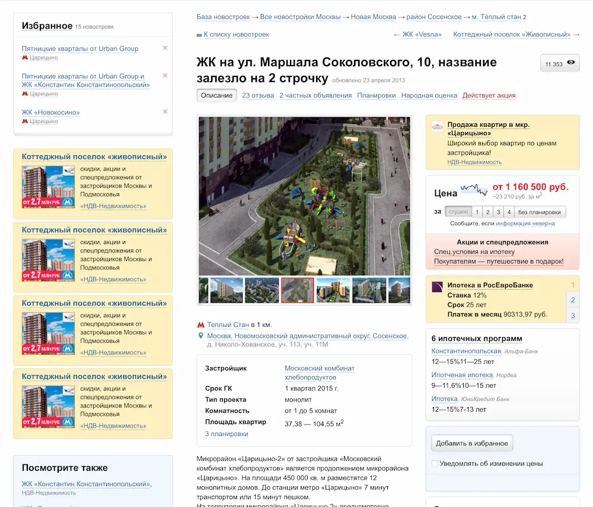
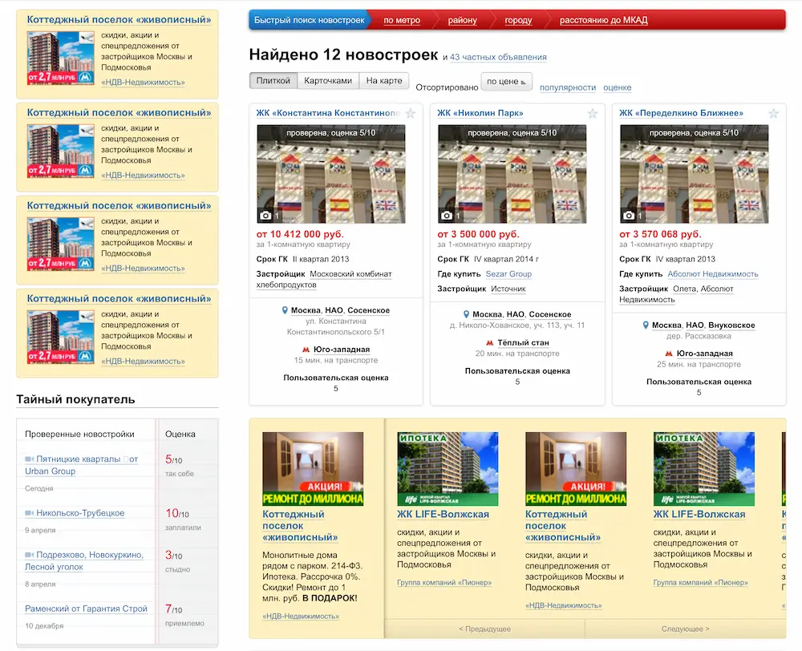
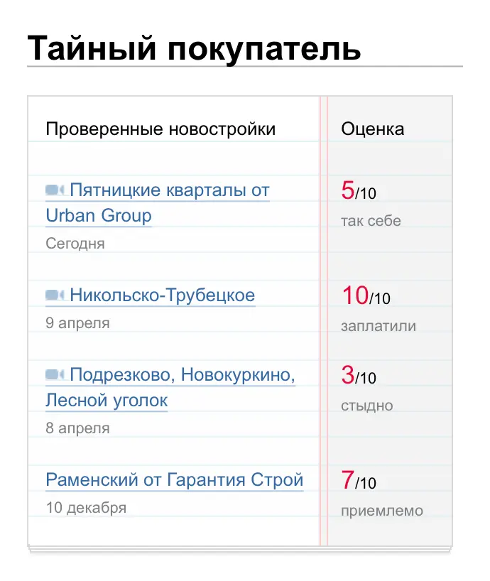
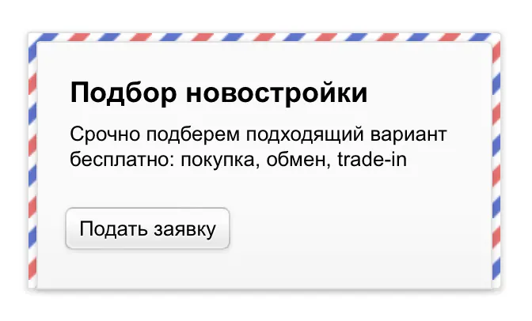

# Novostroy-M Release

A new project where I took part has been released—Novostroy-M. In this project I built the HTML layouts and programmed the UI logic.

One of the most complex elements was a search form with different filters, the values of which could affect each other and the ability to select other filters:

The second difficult task was the page layouts and grids. The pages stretched width-wise, and we needed to adapt the already complex grids to different widths.

Overall, the page layouts were quite complex and rich. For example, on the object page, the grid changed from 2 columns to 3 and back again:

Often the grid was “broken” by info boxes that contained their own grids within them. Then we had to think how to synchronize the number of elements shown in these boxes with the overall page grid, but in such a way that it was clear that the info box is a slider, the content of which can be scrolled:

What I enjoyed most, however, was making skeuomorphic mini-widgets. For example, to make a “stack of notebook sheets,” I had to think about the line spacing of different text elements and their indents, so that the text lay “in line”:

There were elements with rich UI logic that required a lot of JS interaction with the server. For example, a widget with events that showed data depending on the selected time period:

Finally, there were a lot of just nice-looking elements. For example, like this “envelope”:

...Or “stacks of documents”:

