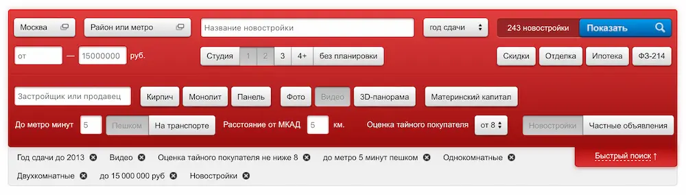
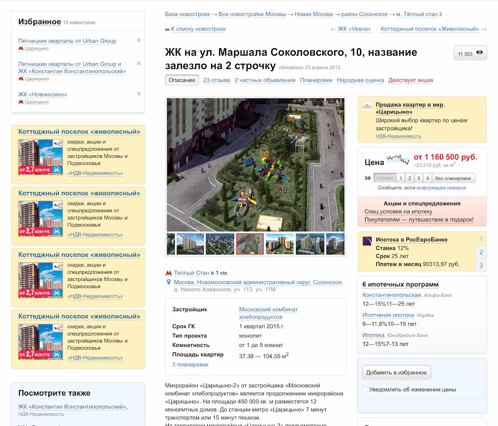
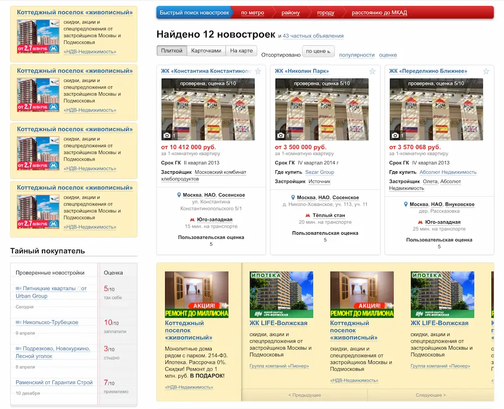
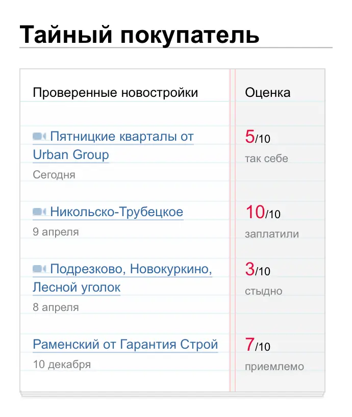
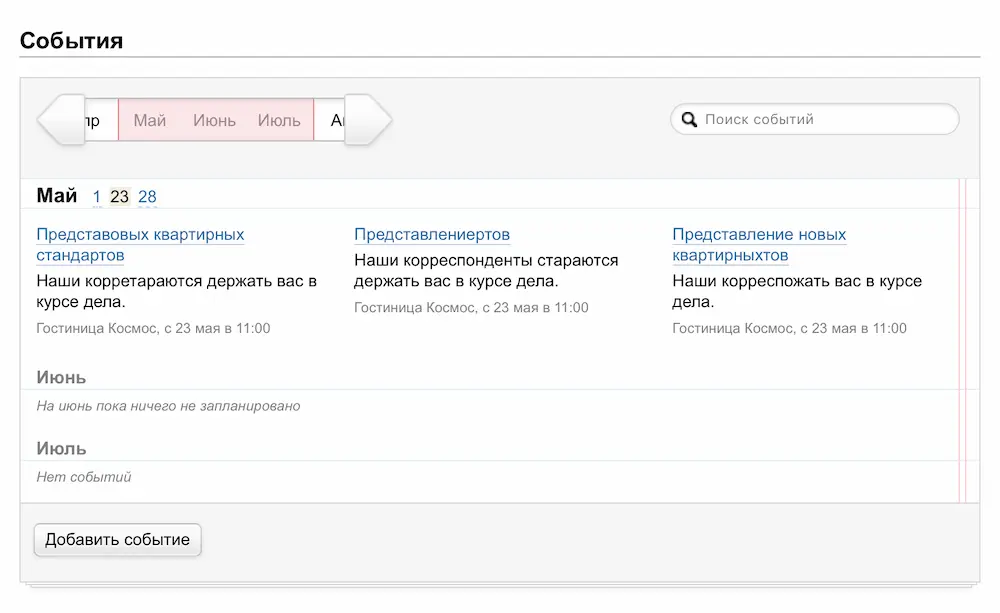
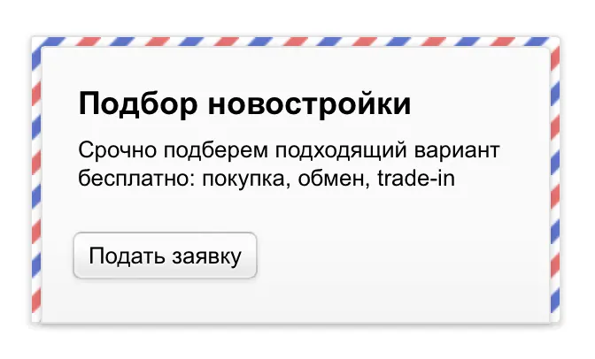
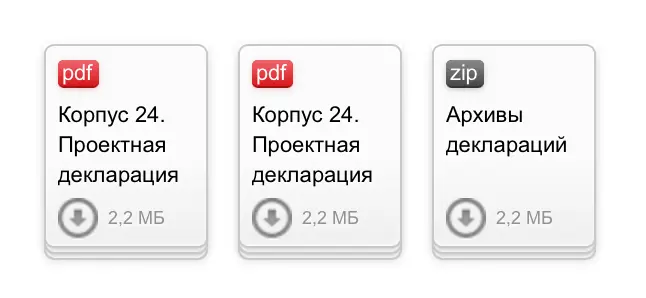

# Запустился обновлённый Новострой-М

Вышел в свет новый проект, где я принял участие — Новострой-М. В этом проекте я сверстал макеты и запрограммировал UI логику.

Одной из самых сложных элементов была форма поиска с различными фильтрами, значения которых могли влиять друг на друга и на возможность выбирать другие фильтры:

Второй сложностью были сетки. Страницы тянулись по ширине, и нам нужно было адаптировать и без того сложные сетки к различным ширинам.

В целом устройство и скелеты страниц были довольно сложными и насыщенными. Например, на странице объекта сетка менялась с 2 колонок на 3 и обратно:

Часто сетку «ломали» врезки с объявлениями, которые содержали собственные сетки внутри себя. Тогда нам приходилось думать, как синхронизировать количество показываемых объявлений в этих врезках с общей сеткой страницы, но так, чтобы было понятно, что врезка с объявлениями — это слайдер, контент которого можно проматывать:

Больше же всего мне понравилось верстать скевоморфичные мини-виджеты. Например, чтобы сверстать «стопку тетрадных листов», пришлось подумать над межстрочным расстоянием разных текстовых элементов и их отступами, чтобы текст лежал «по линейке»:

Были элементы с богатой UI-логикой, которые требовали взаимодействия с сервером с много JS. Например, виджет с событиями, которые показывал данные в зависимости от выбранного временного периода:

Наконец, было много просто красивых элементов, которые было приятно верстать. Например, как этот «конверт»:

...Или «стопки документов»:

