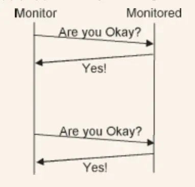
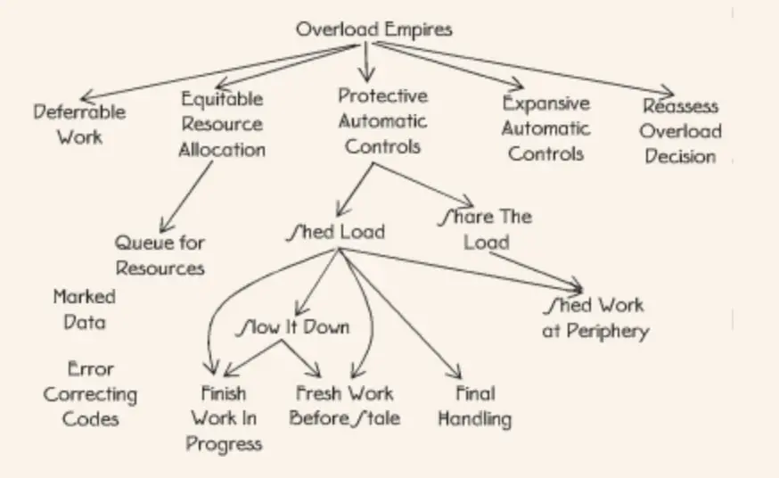
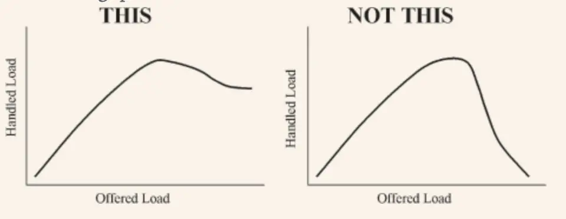

# Patterns for Fault Tolerant Software. Part 2

[In the previous post](/blog/patterns-for-fault-tolerant-software/), we discussed chapter 1–4 and considered the concepts of fault tolerance, principles of fault tolerant design, and architectural patterns.

In this part, we'll look at patterns of error detection, error recovery, and error reduction.

## Chapter 5: Patterns for Error Detection

Errors and malfunctions must be detected. There are two common mechanisms to detect errors. The first is to check what the function returns to see if there are error codes. The second is to use exceptions and `try-catch` constructs built into the language. When errors are detected, they must be isolated so they don't spread through the system.

### 5.12. Fault Correlation

_What is failure manifesting itself?_

Identify the unique attributes of an error to understand the category of failure. Once an error is defined, a _Error containment barrier_ must be built around it to prevent propagation.

### 5.13. Error Containment Barrier

_What should the system do first when an error is detected?_

The consequences of an error cannot always be predicted in advance. Nor can all potential errors be predicted. Errors propagate from component to component of the system if there are no constraints for doing so. In programs, the barrier to propagation is the _Unit of mitigation_.

### 5.14. Complete Parameter Checking

_How can you reduce the time from failure to error detection?_

Create checks for data, function arguments and calculation results. Any check increases system reliability and reduces the time between the occurrence of a failure and the detection of an error. At the same time, checks reduce performance.

(This, by the way, reminds the [contract programming](https://en.wikipedia.org/wiki/Design_by_contract).)

### 5.15. System Monitor

_How can one part of the system know that another part is alive and functioning?_

If a part of the system can notify the other parts of its state when a failure occurs, recovery can begin more quickly. You can rely on _Acknowledgement messages_, which are messages that system components send to each other in response to some event. Another way is to create a part of the system which watches the state of the components itself.

When a monitored component stops functioning, this should be reported to the Failure Observer. When implementing _System monitoring_, you must determine the delay after which a failure message will be sent to the _Fault Observer_.

### 5.16. Heartbeat

_How can System Monitor be sure that the particular task being monitored is still running?_

Sometimes the component being monitored has no idea that it is being monitored. In such cases, _System monitor_ should request a status report, _Heartbeat_. Check that the _Heartbeat_ has no unwanted side effects.

### 5.17. Acknowledgement

_When two components are communicating, what is the easiest way for one of them to determine that the other is alive and functioning?_

One way is to add confirmation information to the response that will be sent to the other component. The disadvantage is that if there are no requests to the component, there are no responses from it, and therefore no confirmation information.

### 5.18. Watchdog

_How can you tell if a component is alive and functioning if you can't add Acknowledgement?_

One way is to observe actions that occur regularly. The second way is to put a timestamp on the start of the operation and check that the operation ended in a satisfactory amount of time.

### 5.19. Realistic Threshold

_How long does it take before System Monitor sends a failure message?_

Here we are interested in two sections: _detection latency_ and _messaging latency_. The first is how long _System Monitor_ has to wait for a response from a component. The second is the time between requests, which determines the status of the component. Inadequately chosen values will reduce performance.

Set _messaging latency_ based on the worst possible communication time + time to process _Heartbeat_. Set _detection latency_ based on the criticality of the component.

### 5.20. Existing Metrics

_How can the system measure the overload intensity without increasing the overload?_

Use the system's built-in overload indication mechanisms.

### 5.21. Voting

_There are several variants of the results. Which one to use?_

Develop a voting strategy to choose an answer. Write out the weights for each of the answers. You can make the assumption that the active item is the one whose result is more likely to be trusted. If the answers are too big to check completely, you can use _Checksum_.

Be careful with the results, which may be different, but at the same time correct. For such answers, you should check all of them for correctness.

### 5.22. Routine Maintenance

_How do you make sure that preventable errors don't happen?_

Conduct routine, proactive system maintenance. _Correcting audits_ will keep your data clean and error-free. Repeated periodically, they become _Routine audits_.

### 5.23. Routine Exercises

_How do I make sure that redundant elements will start working when an error occurs?_

From time to time, run the system in a mode where redundant elements should start working. This will help identify elements with latent failures.

### 5.24. Routine Audits

_Data with errors can remain in memory for a very long time before it fails._

Check stored data from time to time for hidden errors. Checks should be done while the system is not under load.

### 5.25. Checksum

_How can I tell if a value is incorrect?_

Add a _Checksum_ for a value or group of values, use it as a confirmation that the data is correct.

### 5.27. Leaky Bucket Counter

_How can the system tell if an error is permanent or temporary?_

Within each _Unit of Mitigation_, use a counter that increases when an error occurs. Periodically, the counter decreases, but does not become smaller than its original value. If the counter reaches a certain limit, then the error is permanent and appears often.

## Chapter 6: Error Recovery Patterns

Recovery mostly consists of two parts: undoing the unwanted effects of an error, recreating an error-free environment for the system so that it can continue to function.

### 6.28. Quarantine

_How can the system keep an error from spreading?_

Create a barrier that will keep the system from negatively affecting the useful work of the error and from spreading the error to other parts of the system.

### 6.29. Concentrate Recovery

_How can the system reduce the time it is unavailable when recovering from an error?_

Concentrate all available and necessary resources on the recovery task to reduce the recovery time.

### 6.30. Error Handler

_Error handling adds to the complexity and cost of program development and support._

Error handling is not the work for which the system was created. It is accepted that the time spent on error handling is the time in which the system is unavailable.

Separate error handling code into special blocks. This is easier to support and add new handlers.

### 6.31. Restart

_How do you resume work when you cannot recover from an error?_

Restart the application ¯\\\_(ツ)\_/¯

_Cold restart_ is in which all systems start functioning “from scratch” as if the system had just been turned on. In a _warm restart_ we can skip some steps.

### 6.32. Rollback

_Where exactly to resume work after recovering from an error?_

Return to the point before the error, where work can be synchronized between components. Limit the number of attempts through _Limit retries_.

### 6.33. Roll-Forward

_Where exactly to resume work after recovering from an error?_

If the system is event-driven, it means that it responds to external stimuli while working. In this case, you can recover at the point after the error where the next stimulus is expected to appear. Consider all operations prior to the error as unexecuted.

### 6.34. Return to Reference Point

_Where to resume work if there are no corresponding backwards and forwards rollback points for the error that occurred?_

_Reference Points_ are not the same as _Rollback Points_. Rollback points are dynamic. Reference points are static, and are always available as restore points. It is known for a fact that it is safe to restore to them.

### 6.35. Limit Retries

_Failures are deterministic. The same error can lead to the same result. Attempting to recover from an error can lead to scrambling._

Apply strategies to count messages and signals that lead to the same results. Limit the number of attempts to process the same signal.

### 6.36. Failover

_Active element contains an error. How can the system continue to function properly?_

Ideally, the redundant element should immediately replace the active element where the error occurred. This should be handled by _Someone in Charge_. The strategy cannot be used if the redundant elements already share the total workload.

### 6.37. Checkpoint

_Uncompleted work may be lost during recovery._

Save the system state from time to time. Provide a way to recover from a saved state without having to repeat all the actions that led to that state.

### 6.38. What to Save

_What should be contained in Checkpoint?_

Keep information that is important to all processes, as well as information that needs to be kept for a long time.

### 6.39. Remote Storage

_Where do I store Checkpoints to reduce the recovery time from a saved state?_

Store them in a centrally accessible storage.

### 6.41. Data Reset

_What to do if there is an unrecoverable and uncorrectable error in the data?_

Reset the data to its initial values. The initial value is the one that was valid in the past.

## Chapter 7: Error Reduction Patterns

These patterns tell you how to reduce the negative effects of bugs without changing the application or system state.

### 7.43. Deferred work

_What work can the system put off for later?_

Make routine tasks deferrable.

### 7.44. Reassess Overload Decision

_What to do if the chosen overload reduction strategy doesn't work?_

Create a feedback channel that allows you to redefine your decisions about _Fault Correlation_.

### 7.46. Resource Queue

_What to do with resource requests that cannot be processed right now?_

Keep the requests in a queue. Determine its final length.

### 7.47. Expansive Automatic Controls

_How to avoid overloading from processing all requests that cannot be processed at once, and at the same time increasing the response time?_

Define some resources as those that will be allocated only in case of overload. Create additional ways for the system to do basic work that will either use redundant resources or consume fewer resources.

### 7.48. Protective Automatic Controls

_What can the system do to avoid getting buried forever in responses to an ever-increasing number of requests?_

Define in advance the limits on the number of requests to be processed, in order to protect the system's ability to do its main job.

### 7.53. Slow Down

_What to do if there are so many requests that the system cannot even potentially handle efficiently?_

Use _Escalation_ to use predefined limits on resource consumption. Each subsequent step is harsher and more economical than the previous ones. The goal is to slow things down enough so that the system can handle any load.

### 7.56. Marked Data

_What can I do to prevent the error from spreading when the system finds data in error?_

Label the data in error so that it cannot be used anywhere else in the system. Define rules for all components that tell you what to do with such data.

## Chapter 8: Error Prevention Patterns

After an error has been handled, it is necessary to prevent it from reappearing.

### 8.60. Reproducible Error

_It is necessary to correct the real error, not to waste time._

Replay the error in a controlled environment to verify that the failure was indeed due to the error.

### 8.61. Small patches

_Which Software update pattern is least likely to bring in new bugs?_

Use small part updates. Update and replace only what is needed.

### 8.62. Root Cause Analysis

_What exactly is to be fixed? How exactly do you fix it?_

Ask yourself “Why did this happen” until you get to the real reason for the failure.

## Fault-Tolerant System Design Process

In the appendix of the book, there is a step-by-step algorithm for designing a fault-tolerant system.

### Step 1. Determine What Can Go Wrong

Clearly defined specifications will help identify and determine which situations are considered failures.

### Step 2. Determine How to Mitigate Risks

Identify patterns that will help reduce the risk of failure from step 1.

### Step 3. Determine Required Redundancy

Redundancy is a basic property of a fault-tolerant system. Compare the technical data of the system to be designed with availability, reliability and coverage requirements. Introduce the necessary redundancy into the system.

### Step 4. Determine Key Architectural Solutions

Consider what patterns can and will be used in a particular implementation.

### Step 5. Determine Risk Mitigation Possibilities

Determine the risk mitigation strategies that the designed system will follow.

### Step 6. System Interaction with People

Think about and design who will have to interact with the system and how: who the main users are, how maintenance and upgrades will be performed, etc.

## Resources

- [Patterns for Fault Tolerant Software by Robert S. Hanmer](https://www.goodreads.com/book/show/3346135-patterns-for-fault-tolerant-software)
- [First part of the summary](/blog/patterns-for-fault-tolerant-software/)
- [Design by contract](https://en.wikipedia.org/wiki/Design_by_contract)
