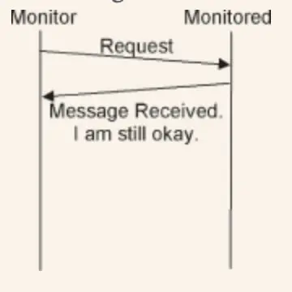
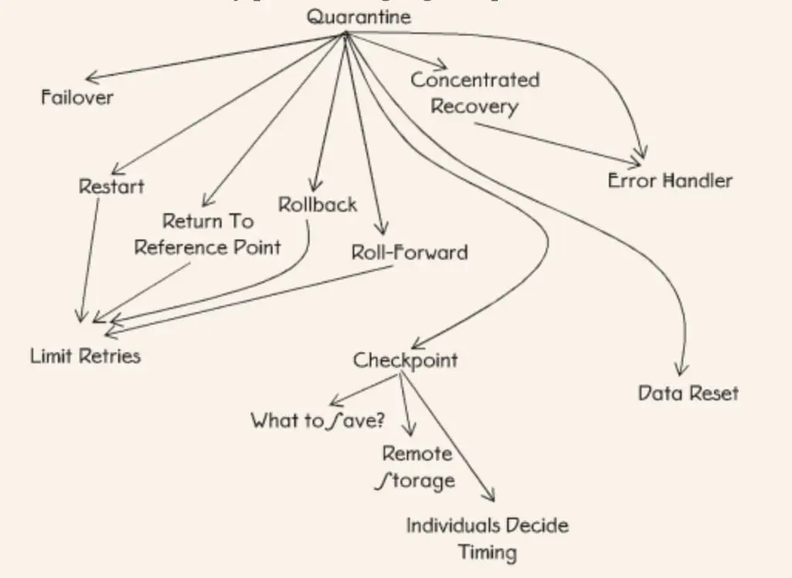
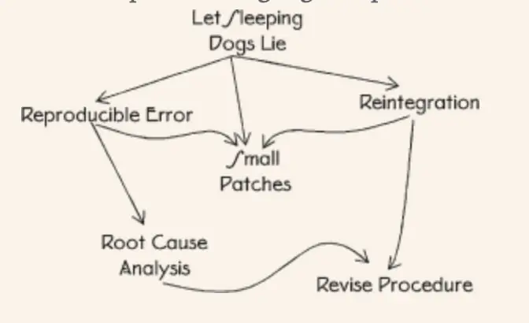
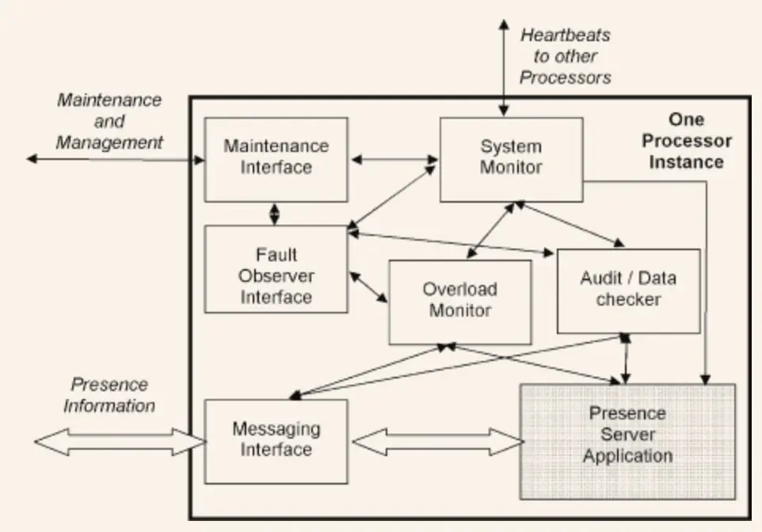

# Паттерны отказоустойчивых приложений. Часть 2

[В прошлый раз](/blog/patterns-for-fault-tolerant-software/) мы прочитали главы 1–4 и рассмотрели понятия отказоустойчивости, принципы отказоустойчивого дизайна и архитектурные паттерны.

В этой части рассмотрим паттерны обнаружения ошибок, восстановления от них, снижения их вероятности и «замазывания брешей».

## Глава 5. Паттерны обнаружения ошибок

Ошибки и неисправности должны быть обнаружены. Есть два распространённых механизма для обнаружения ошибок. Первый — проверить, что возвращает функция, есть ли там коды ошибок. Второй — использовать встроенные в язык исключения и конструкции `try-catch`. Когда ошибки обнаружены, они должны быть изолированы, чтобы не распространиться по системе.

### 5.12. Соотношение отказов (Fault correlation)

_Какой отказ проявляется?_

Определите уникальные признаки ошибки, чтобы понять категорию отказа. Как только ошибка определена, вокруг неё необходимо построить _Барьер содержащий ошибку (Error containment barrier)_, чтобы предотвратить распространение.

### 5.13. Барьер, содержащий ошибку (Error containment barrier)

_Что система должна сделать в первую очередь при обнаружении ошибки?_

Последствия ошибки не всегда могут быть предсказаны заранее. Как и не все потенциальные ошибки могут быть предсказаны. Ошибки перемещаются от компонента к компоненту системы, если для этого нет ограничений. В программах барьер для распространения — это _Блок уменьшения риска (Unit of mitigation)_.

### 5.14. Полное сравнение (Complete parameter checking)

_Как может быть уменьшено время от появления отказа до обнаружения ошибки?_

Создавайте проверки для данных, аргументов функций и результатов вычислений. Любая проверка повышает надёжность системы и уменьшает время между появлением отказа и обнаружением ошибки. В то же время проверки снижают производительность.

(Это, кстати, напоминает [контрактное программирование](https://ru.wikipedia.org/wiki/Контрактное_программирование).)

### 5.15. Мониторинг системы (System Monitor)

_Как одна часть системы может понять, что другая часть жива и функционирует?_

Если при наступлении отказа часть системы может уведомить остальные части о своём состоянии, восстановление может начаться быстрее. Можно положиться на _Сообщения подтверждения (Acknowledgement messages)_ — это сообщения, которые компоненты системы передают друг другу в ответ на какие-то события. Другой способ — создать часть системы, которая будет смотреть за состоянием компонентов сама.

Когда наблюдаемый компонент перестаёт функционировать, об этом следует сообщить Наблюдателю отказов. При внедрении _Мониторинга системы (System monitoring)_ необходимо определить, задержку после которой сообщение об отказе будет отправлено _Наблюдателю отказов_.

### 5.16. Пульс (Heartbeat)

_Как Мониторинг системы может быть уверен, что конкретная наблюдаемая задача всё ещё работает?_

Иногда компонент, за которым наблюдают, понятия не имеет, что за ним наблюдают. В таких случаях _Мониторинг системы (System monitoring)_ должен запросить отчёт о состоянии, _Пульс (Heartbeat)_. Проверьте, чтобы у _Пульса_ не было нежелаемых побочных эффектов.

### 5.17. Подтверждение (Acknowledgement)

_При общении двух компонентов какой самый простой способ для одного из них определить, что другой жив и функционирует?_

Один из способов — добавить подтверждающую информацию в ответ, который будет отправлен другому компоненту. Минус в том, что если к компоненту нет запросов, то от него нет и ответов, а стало быть — и подтверждающей информации.

### 5.18. Сторожевой пёс (Watchdog)

_Как определить, что компонент жив и функционирует, если добавить Подтверждение нельзя?_

Один из способов — наблюдать за действиями, которые происходят регулярно. Второй способ — проставить временную метку о начале операции и проверить, что операция закончилась в удовлетворительный отрезок времени.

### 5.19. Реалистичный порог (Realistic Threshold)

_Как много времени должно пройти, прежде чем Мониторинг системы отправит сообщение об отказе?_

Здесь нам интересны два отрезка: _задержка обнаружения (detection latency)_ и _задержка сообщений (messaging latency)_. Первая — сколько времени _Мониторинг системы_ должен ждать ответа от компонента. Вторая — время между запросами, которое определяет статус компонента. Неадекватно подобранные значения снизят производительность.

Выставляйте _задержку сообщений (messaging latency)_, исходя из худшего возможного времени коммуникации + время на обработку _Пульса_. Выставляйте _задержку обнаружения (detection latency)_, исходя из критичности компонента.

### 5.20. Существующие метрики (Existing Metrics)

_Как система может измерить интенсивность перегрузки, не увеличивая перегрузку?_

Используйте встроенные механизмы индикации перегрузки системы ¯\\\_(ツ)\_/¯

### 5.21. Голосование (Voting)

_Получилось несколько вариантов результатов. Какой использовать?_

Разработайте стратегию голосования, чтобы выбрать ответ. Пропишите веса для каждого из ответов. Можно сделать предположение, что активный элемент — тот, чьему результату можно доверять с большей вероятностью. Если ответы слишком большие, чтобы проверить их полностью, можно использовать _Чексумму (Checksum)_.

Аккуратнее с результатами, которые могут быть разными, но в то же время правильными. Для таких ответов надо проверять не «правильность», а корректность.

### 5.22. Рутинное тех. обслуживание (Routine Maintenance)

_Как сделать, чтобы ошибки, которые можно предотвратить, не случались?_

Проводите рутинное, превентивное обслуживание системы. _Корректировочные аудиты (Correcting audits)_ сохранят данные чистыми и без ошибок. Периодично повторяемые, они становятся _Рутинными аудитами (Routine audits)_.

### 5.23. Рутинные упражнения (Routine Exercises)

_Как удостовериться, что избыточные элементы начнут работать при наступлении ошибки?_

Время от времени запускайте систему в режиме, при котором избыточные элементы должны начинать работать. Это поможет определить элементы со скрытыми отказами.

### 5.24. Рутинные аудиты (Routine audits)

_Данные с ошибками могут находиться в памяти очень долго до того, как приведут к отказу._

Время от времени проверяйте сохранённые данные на скрытые ошибки. Проверки должны проводиться во время, когда система не под нагрузкой.

### 5.25. Чексумма (Checksum)

_Как определить, что полученное значение некорректно?_

Добавьте _Чексумму_ для значения или группы значений, используйте её, как подтверждение, что данные корректны.

### 5.27. Дырявое ведро (Leaky bucket counter)

_Как система может определить, постоянная это ошибка или временная?_

Внутри каждого _Блока уменьшения риска_ используйте счётчик, который увеличивается при появлении ошибки. Периодически счётчик уменьшается, но не становится меньше, чем его исходное значение. Если счётчик достигает определённого предела, значит ошибка постоянная и появляется часто.

## Глава 6. Паттерны восстановления от ошибок

Восстановление по большей части состоит из двух частей: отменить нежелаемые эффекты ошибки, воссоздать безошибочное окружение для системы, чтобы она смогла продолжить функционировать.

### 6.28. Карантин (Quarantine)

_Как система может оградить ошибку от распространения?_

Создайте барьер, который оградит систему от негативного влияния ошибки на полезную работу и от распространения ошибки в другие части системы.

### 6.29. Интенсивное восстановление (Concentrate recovery)

_Как системе уменьшить время, в которое она недоступна, при восстановлении от ошибки?_

Сконцентрируйте все доступные и необходимые ресурсы на задаче восстановления, чтобы уменьшить время восстановления.

### 6.30. Обработчик ошибок (Error handler)

_Обработка ошибок увеличивает сложность и дороговизну разработки и поддержки программы._

Обработка ошибок — это не та работа, ради которой система создавалась. Принято считать, что время, затраченное на обработку ошибок, — время, в которое система недоступна.

Выделяйте код обработки ошибок в специальные блоки. Это проще в поддержке и добавлении новых обработчиков.

### 6.31. Перезагрузка (Restart)

_Как возобновить работу, когда восстановиться от ошибки невозможно?_

Перезагрузите приложение ¯\\\_(ツ)\_/¯

_Холодная перезагрузка (cold restart)_ — при которой все системы начинают функционировать «с нуля», как будто бы систему только что включили. _Подогретая перезагрузка (warm restart)_ — может пропустить некоторые шаги.

### 6.32. Откат назад (Rollback)

_Откуда именно возобновлять работу после восстановления от ошибки?_

Возвращайтесь к точке до появления ошибки, где работа может быть синхронизирована между компонентами. Ограничивайте количество попыток через _Ограничение повторов (Limit retries)_.

### 6.33. Откат вперёд (Roll-forward)

_Откуда именно возобновлять работу после восстановления от ошибки?_

Если система событийно-ориентирована, значит, она реагирует на внешние стимулы при работе. В этом случае можно восстановиться в точке после ошибки, где ожидается появление следующего стимула. Считайте все операции до ошибки не выполненными.

### 6.34. Возврат к опорной точке (Return to Reference Point)

_Откуда возобновить работу, если для возникшей ошибки нет соответствующих точек Отката назад и вперёд?_

_Опорные точки_ — не то же самое, что _точки отката_. Точки отката — динамические. Опорные точки — статичные, и всегда доступны в качестве точек восстановления. Точно известно, что в них восстановление безопасно.

### 6.35. Ограничение повторов (Limit retries)

_Отказы детерминированы. Одна и та же ошибка может приводить к одному и тому же результату. Попытка восстановления от ошибки может приводить к зацикленности._

Применяйте стратегии для подсчёта сообщений и сигналов, которые приводят к одинаковым результатам. Ограничивайте количество попыток обработать один и тот же сигнал.

### 6.36. Фейловер (Failover)

_Активный элемент содержит ошибку. Как система может продолжить исправно функционировать?_

В идеале избыточный элемент должен мгновенно заменить активный, в котором появилась ошибка. Этим должен заниматься _Ответственный (Someone in charge)_. Стратегию нельзя использовать, если избыточные элементы уже делят общую рабочую нагрузку.

### 6.37. Чекпоинт (Checkpoint)

_Незавершённая работа может быть потеряна при восстановлении._

Сохраняйте состояние системы время от времени. Предусмотрите возможность восстанавливаться из сохранённого состояния без необходимости повторять все действия, приведшие к этому состоянию.

### 6.38. Что сохранять (What to save)

_Что должно содержаться в Чекпоинте?_

Сохраняйте информацию, которая важна всем процессам, а также информацию, которую надо хранить долго.

### 6.39. Удалённое хранилище (Remote storage)

_Где хранить Чекпоинты, чтобы уменьшить время восстановления из сохранённого состояния?_

Храните их в центрально-доступном хранилище.

### 6.41. Сброс данных (Data reset)

_Что делать, если в данных невоспроизводимая и некорректируемая ошибка?_

Сбросьте данные до их начальных значений. Начальное — то, которое было валидным в прошлом.

## Глава 7. Паттерны снижения ошибок

Эти паттерны рассказывают, как уменьшить негативные эффекты ошибок без изменения приложения или состояния системы.

### 7.43. Отложенная работа (Deferred work)

_Какую работу система может отложить на потом?_

Делайте рутинные задачи откладываемыми.

### 7.44. Переоценка решений о перегрузке (Reassess Overload Decision)

_Что делать, если выбранная стратегия уменьшения перегрузки не срабатывает?_

Создайте канал обратной связи, который позволит заново определиться с решениями относительно _Соотношения отказов (Fault correlation)_.

### 7.46. Очередь за ресурсами (Resource queue)

_Что делать с запросами к ресурсам, которые не могут быть обработаны прямо сейчас?_

Сохраните запросы в очереди. Определите её конечную длину.

### 7.47. Расширяемый автоматический контроль (Expansive Automatic Controls)

_Как избежать перегрузки от обработки всех запросов, которые нельзя обработать сразу, и одновременно возросшего времени ответа?_

Определите некоторые ресурсы как те, что будут распределяться только в случае перегрузки. Создайте для системы дополнительные способы выполнения основной работы, которые будут либо использовать резервные ресурсы, либо потребляя меньше ресурсов.

### 7.48. Защитный автоматический контроль (Protective Automatic Controls)

_Что система может сделать, чтобы не закопаться навсегда в ответах на всё возрастающее количество запросов?_

Заранее определите лимиты на обрабатываемые запросы, чтобы защитить способность системы выполнять её основную работу.

### 7.53. Замедление (Slow down)

_Что делать, если появляется такое количество запросов, которое система не может даже потенциально обработать эффективно?_

Используйте _Эскалацию (Escalation)_, чтобы использовать заранее определённые лимиты на потребление ресурсов. Каждый следующий шаг более суров и экономичен, чем предыдущие. Цель — замедлить всё настолько, чтобы система была в состоянии справиться с хоть какой-либо нагрузкой.

### 7.56. Меченые данные (Marked data)

_Что сделать, чтобы предотвратить распространение ошибки, когда система находит данные с ошибкой?_

Пометьте данные с ошибкой так, чтобы их невозможно было использовать нигде в системе. Определите правила для всех компонентов, которые будут рассказывать, что делать с такими данными.

## Глава 8. Паттерны «замазывания брешей»

После того, как ошибка обработана, необходимо предотвратить её повторное появление.

### 8.60. Воспроизводимая ошибка

_Необходимо скорректировать настоящую ошибку, а не потратить время впустую._

Воспроизведите ошибку в контролируемой среде, чтобы убедиться, что отказ действительно был связан с этой ошибкой.

### 8.61. Заплатки (Small patches)

_Какой шаблон Обновления программы (Software update) наименее вероятно принесёт с собой новые ошибки?_

Используйте маленькие обновления частей. Обновляйте и заменяйте только то, что необходимо.

### 8.62. Анализ причин (Root cause Analysis)

_Что именно чинить? Как именно чинить?_

Спрашивайте себя «Почему это произошло» до тех пор, пока не докопаетесь до настоящей причины отказа.

## Процесс проектирования отказоустойчивой системы

В приложении к книге есть алгоритм разработки отказоустойчивой системы, расписанный по шагам.

### Шаг 1. Определите, что может пойти не так

Чётко-определённые спецификации помогут выявить и определить, какие ситуации считать отказами.

### Шаг 2. Определите, как уменьшить риски

Определите паттерны, которые помогут уменьшить риск возникновения отказов из шага 1.

### Шаг 3. Определите необходимую избыточность

Избыточность — базовое свойство отказоустойчивой системы. Сравните технические данные проектируемой системы с требованиями доступности, надёжности и покрытия. Введите необходимые избыточные элементы в систему.

### Шаг 4. Определите ключевые архитектурные решения

Продумайте, какие именно паттерны могут быть и будут использованы в конкретной реализации.

### Шаг 5. Определите возможности уменьшения рисков

Определите стратегии уменьшения рисков, которым проектируемая система будет следовать.

### Шаг 6. Взаимодействие системы с людьми

Продумайте и спроектируйте, кто и как должен будет взаимодействовать с системой: кто основные пользователи, как будет проводиться обслуживание, обновление и т. д.

## Ссылки по теме

- [Паттерны отказоустойчивых приложений. Роберт Ганмер](https://www.amazon.com/Patterns-Tolerant-Software-Robert-Hanmer/dp/0470319798)
- [Первая часть](/blog/patterns-for-fault-tolerant-software/)
- [Контрактное программирование](https://ru.wikipedia.org/wiki/Контрактное_программирование)
