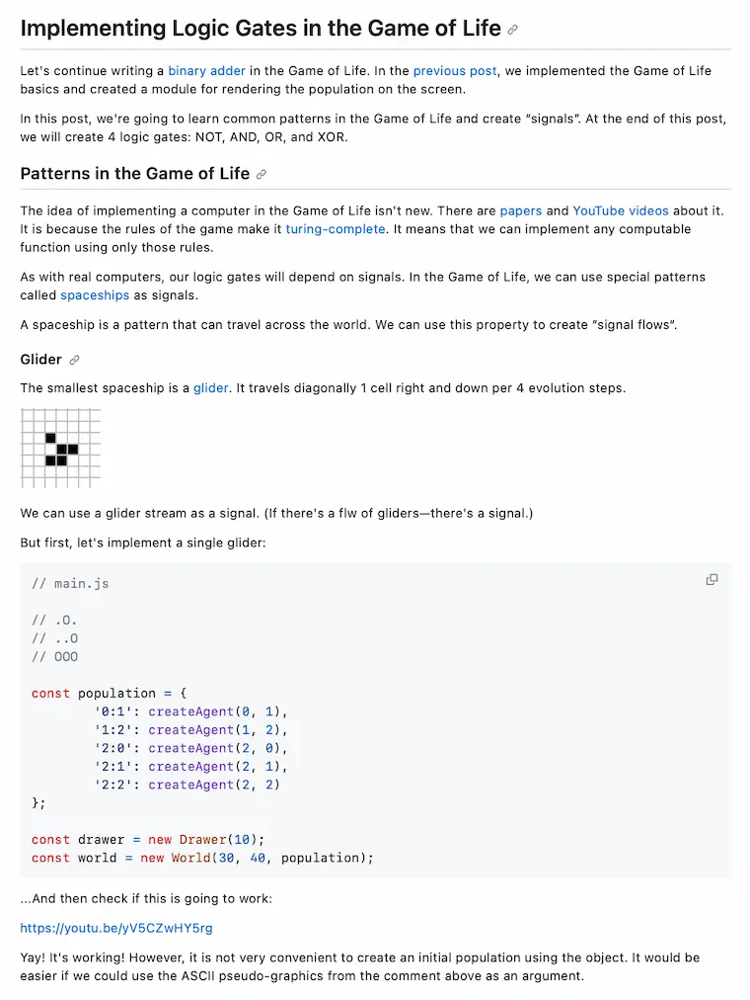

# Переписал сайт на SvelteKit

В сентябре я [мигрировал](https://github.com/bespoyasov/www/pull/90) свой сайт на новый стек. В этом посте рассказываю о причинах и результате переезда, а также делюсь впечатлениями от нового стека.

## Причины переезда

Главных причин переписать сайт у меня было две: желание всё радикально упростить и ощущение, что Next для генерации статических сайтов не годится.

### Желание всё упростить

Для простенького блога предыдущий стек был чрезмерно требовательным в плане ресурсов на поддержку. Обновление зависимостей занимало много времени, производительность дев-сервера была невысокой, React и TypeScript требовали разных «церемоний», прежде чем я мог добавить новую страницу или фичу. Хотелось быстрее, дешевле и проще.

### Next не подходит для SSG

В Next мне нравился [старый постраничный роутинг](https://nextjs.org/docs/pages) и встроенный во фреймворк [SSG](https://nextjs.org/docs/pages/building-your-application/rendering/static-site-generation), но меня никак не оставляло ощущение, что его делали «по остаточному принципу». Многие вещи приходилось велосипедить самостоятельно, что отъедало время, а страницы, которые получались в результате генерации, казались неоправданно тяжёлыми. Хотелось инструмент поудобнее.

<aside>

С [новым роутингом](https://nextjs.org/docs/app) Next стал казаться ещё менее подходящим инструментом, потому что он заточен под приложения&trade;, а мне вот этого всего не надо.

</aside>

## Новый стек

Среди кандидатов на новый стек я рассматривал [SvelteKit](https://kit.svelte.dev) и [Astro](https://astro.build). Судя по документации и отзывам, оба должны были решить имеющиеся проблемы.

Astro показался интересным, но со SvelteKit я был уже немного знаком — я написал на нём [веб-версию книжки о рефакторинге](https://refactoring-book.vercel.app/) в прошлом году — потому выбрал его.

От TypeScript я решил в этот раз уйти. Большая часть кода в блоге — инфраструктура, которую я вряд ли буду часто менять, поэтому большой пользы от TypeScript я бы не получил, а нагрузка на поддержку снова бы выросла.

Для тестов я выбрал [Playwright](https://playwright.dev). Посчитал, что для блога важно лишь, как в результате выглядят страницы, поэтому из всех видов тестов решил использовать только скриншотные, и у Playwright было субъективно самое приятное API для них.

## Чейнджлог

Изменений оказалось много. Кроме изменений «инфраструктуры» я заодно обновил дизайн, обновил структуру контента в репозитории и перевёл некоторые старые посты на английский.

### Передизайнил страницы

Давно хотел и вот наконец освежил дизайн главной и других страниц. Редизайн списка статей вдохновлён сайтом [Андрея Романова](https://andreyromanov.com), а редизайн страницы проектов — сайтом [Салавата Абдуллина](https://slvt.ru). Если читаете — спасибо вам!

Кроме этого я избавился от отдельных страниц для каждого из проектов. Теперь ссылки ведут напрямую в сами приложения, книги или проект на Гитхабе. Все кулстори о процессе работы над проектами и их релизах (например, [«Как мы запускали MRKT»](/blog/mrkt-release/)) я переместил в блог.

Заодно немножко подправил семантику и структуру заголовков на текстовых страницах.

### Переосмыслил теги

Теги стали чуть более полезными. Каждый тег теперь — это «тематическая подборка» всего, что я написал, накодил и наговорил по теме. Такие подборки удобно, например, скидывать в ответ на запросы «Что почитать о X?», которые я иногда получаю в почте или ишьях на Гитхабе.

Также я использую теги для поиска и перелинковки схожего контента — то, что я давно хотел сделать, но всё руки не доходили. Пока что я добавил раздел «Связанные темы» только на страницу тега, но я планирую добавить похожий раздел и на страницу отдельной статьи.

### Воскресил старые посты

Опубликовал некоторые посты, которые потерялись при самом первом переезде сайта с [MODX](https://modx.com) на JAM-стек. Какие-то из них лежали в черновиках, какие-то был распубликованы (уже не помню, почему). Среди таких постов, например:

- [Рассуждения о ночном кодинге](/blog/night-coding/)
- [Впечатления от первого использования флексбокса](/blog/flexbox-is-awesome/)
- [Самое первое упоминание Прокрутчика](/blog/scroller/)

В общем, раскопал, воскресил, перевёл на английский, опубликовал.

### Улучшил структуру контента в репозитории

В новой версии я использую Гитхаб, как альтернативный способ читать статьи. Каждый пост — это папка внутри `storage`, которая содержит всё, что связано с конкретным постом. Картинки, ссылки на YouTube, метаданные, а также текст на всех языках, на которые я успел перевести пост.

Новая структура контента помогает читать статьи прямо на Гитхабе — [выглядит довольно сносно](https://github.com/bespoyasov/www/blob/master/storage/notes/binary-adder-in-the-game-of-life-2/en.md):

Гитхаб правда не рендерит `alt`-текст изображений как подпись к `figure`, из-за чего иногда картинки показываются без дополнительного контекста, но я посчитал, что это не очень критично.

<aside>

Кстати, этот же подход я использовал в [книжке о рефакторинге](https://github.com/bespoyasov/refactor-like-a-superhero) — её можно полностью прочесть на Гитхабе, не переходя на отдельный сайт, если так удобнее.

</aside>

### Почистил изображения

Удалил из постов картинки в устаревших&trade; растровых форматах (jpg, png) и оставил только webp, поддержка которого уже [около 96%](https://caniuse.com/webp).

Заодно удалил всё, что было связано с автоматизированной минификацией и ресайзом изображений. Пишу посты я не очень часто, изображений там не очень много, поэтому наворачивать инфраструктуру для автоминификации, ресайза и конвертации в разные форматы мне показалось дорого и бесполезно. Решил просто готовить изображения руками.

## Результаты

Из примечательного могу выделить качество генерируемых страниц и скорость работы стека.

### Легковесные страницы

Я использую [Static Adapter](https://github.com/sveltejs/kit/tree/master/packages/adapter-static) для генерации страниц, и мне нравится, что у него есть опция «не использовать CSR». Страницы на выходе получаются простые, лёгкие, а главное — никакого клиентского JS там, где он не нужен.

### Быстрый старт и дев-сервер

Vite, который работает под капотом у SvelteKit, действительно стартует и собирает сайт значительно быстрее, чем мой предыдущий стек с Next. Даже на моём стареньком домашнем ноутбуке проект стартует почти мгновенно.

### Быстрая сборка и деплой

Билдер быстрый, поэтому сборка [занимает не больше полуминуты](https://github.com/bespoyasov/www/actions/runs/6362252595/job/17277171206), а небольшой вес страниц делает быстрым деплой.

### Упрощённая структура

В этот раз я решил особо не упарываться по «чистоте кода». Причины здесь примерно те же, что и для отказа от TypeScript: я вряд ли буду часто менять этот код.

Отсутствие ограничений уменьшает трение перед стартом новой фичи, страницы, или проверки какой-то идеи. Так как я работаю над проектом один, «энфорсить лучшие практики на команду» смысла особого нет, зато количество времени на разработку уменьшается ощутимо.

### Инфраструктурные хаки

Не всё, однако, идеально гладко. Пришлось, например, немного повозиться с интеграцией «кастомных компонентов» типа `YouTube` и `Switch` в статьях. Не нашёл какого-то удобного инструмента, поэтому [накостылил автоимпорт](https://github.com/bespoyasov/www/blob/master/ops/auto-import.js). Надеюсь, не придётся его часто трогать из-за мажорных изменений в SvelteKit.

## Впечатления

В целом, новым стеком я доволен. Нравится, что роутинг постраничный, что серверный код не смешивается с клиентским и что используются стандартные штуки из платформы.

Отдельно понравились «серверные страницы», и как они ренденрятся при статической генерации. В прошлом стеке приходилось костылить, чтобы сгенерировать RSS-ленту, SvelteKit же [даёт возможность](https://kit.svelte.dev/docs/page-options#prerender) написать [`+server.js` файл](https://github.com/bespoyasov/www/blob/master/src/routes/rss.xml/%2Bserver.js) и указать, как его отрендерить при сборке — чтобы на выходе получился `rss.xml`.

Сам Svelte тоже нравится больше, чем React. Как минимум не нужно придумывать 100500-й способ прикручивать стили — всё уже продумано за меня. Есть, конечно, ограничение, что в Svelte компонент — это один всегда файл, но зато внутри него лежит _всё_ что ему нужно: разметка, стили, логика.

Есть небольшое ощущение, что для генерации статических блогов SvelteKit сыроват, потому что есть проблемы с рендерингом Markdown-файлов и компонентов внутри него [1](https://github.com/pngwn/MDsveX/issues/21), [2](https://github.com/pngwn/MDsveX/issues/525), [3](https://github.com/pngwn/MDsveX/issues/499), [4](https://github.com/pngwn/MDsveX/issues/116), но возможно, это исключительно моя проблема из-за динамических компонентов внутри статей.

В любом случае, все эти проблемы фиксятся костылями, а количество костылей в этот раз получилось сильно меньше, чем в прошлый.

## Ссылки и ресурсы

- [Репозиторий сайта](https://github.com/bespoyasov/www)
- [Предыдущая версия на Next](https://github.com/bespoyasov/www/tree/www-v7)
- [Пул-реквест со всеми изменениями](https://github.com/bespoyasov/www/pull/90)

### Всякие там технологии

- [SvelteKit](https://kit.svelte.dev)
- [Page Options, `prerender`](https://kit.svelte.dev/docs/page-options#prerender)
- [Static Adapter](https://github.com/sveltejs/kit/tree/master/packages/adapter-static)
- [Astro](https://astro.build)
- [Playwright](https://playwright.dev)
- [Page Router in Next](https://nextjs.org/docs/pages)
- [App Router in Next](https://nextjs.org/docs/app)
- [MODX](https://modx.com)

### Редизайн вдохновлён

- [Сайт Андрея Романова](https://andreyromanov.com)
- [Сайт Салавата Абдуллина](https://slvt.ru)
