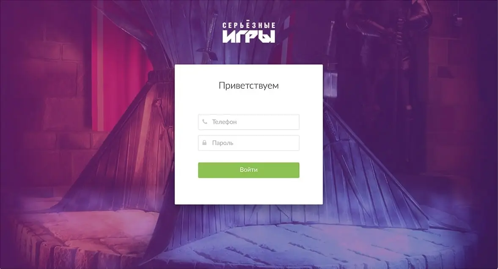
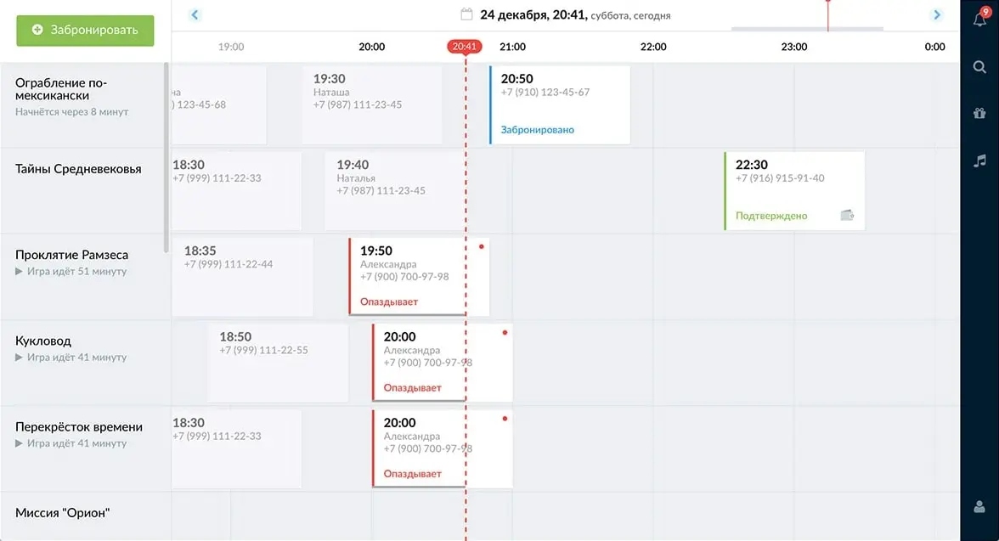
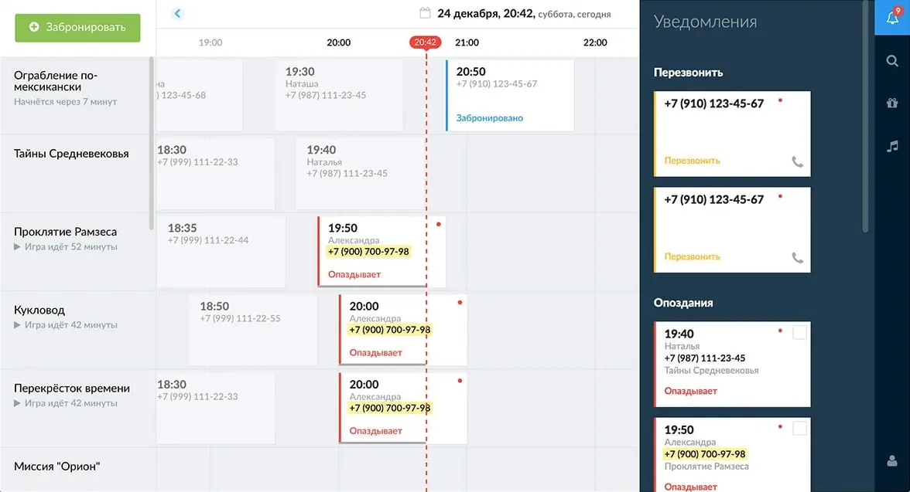
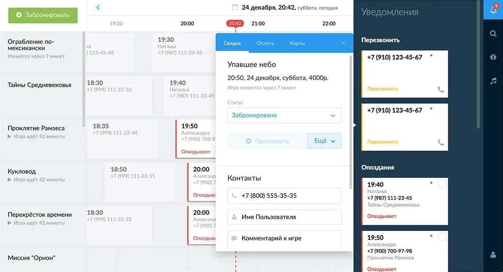
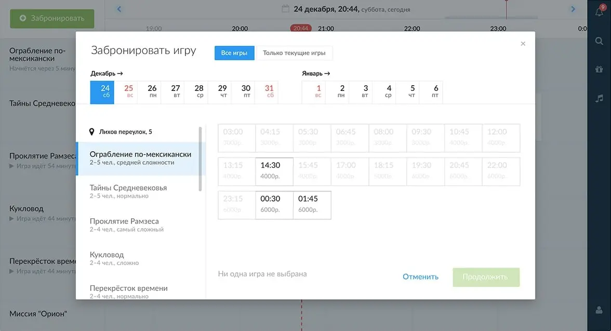
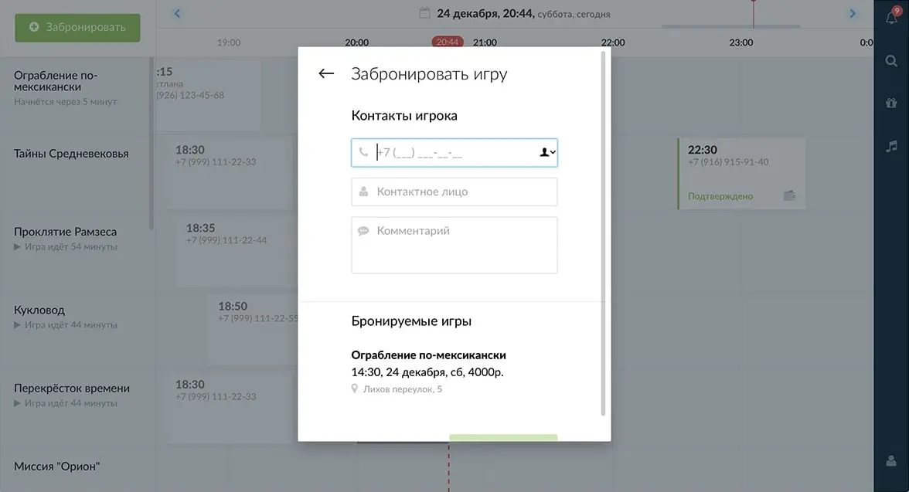

# Release of CRM for Request.ru

In September and October 2016, I worked on the admin UI and CRM system for Request.ru. It was required to build a flexible and consistent interface for the club employees, and in the future—to finalize it for the company's internal services.

I designed the architecture, built the UI, documented the code, managed the development and reviewed the code of other developers.

<aside>

You can see how the CRM works in [interactive copy of the app](https://bespoyasov.ru/projects-fish/crm/). On the page, enter any phone and password to authenticate.

The copy is not the real app, so don't be afraid to break anything. All data in the copy is not real, the copy does not send any requests to the server.

</aside>

The main screen is a strip with booked games. Operators call customers and confirm reservations. Confirmed games are marked in green, if the game has already been paid for, a wallet icon appears at the bottom right.

The timeline can be dragged or scrolled. The quest list scrolls the screen vertically.
Clicking on a game slot opens the game card. It contains information about the game and the person who booked the quest.

To accept payment for a game, the worker pulls down the “Payment” tab and selects the payment method that is convenient for the club's customer.

If the customer has a club card, he gives its number to receive points for the game. The operator checks if there is such a card and binds it to the game in the “Cards” tab.

Notifications remind the operator of unprocessed applications. Applications are collected by category:

- “Call Back”—applications for which the operator called back, but the customer did not answer the call;
- “Late”—games for which customers are late;
- “Confirm Reservation”—unprocessed requests.

If the phone number listed on the card occurs more than once on the timeline, it is highlighted when you hover over it.

Notification opens the game card.

Search helps you find a game, club card or player. Games found are ranked first in the result.

Under the information about the club card and its holder, the games that the player has attended are displayed.

The Music tab controls the music in the lobby.

To book a new game, the operator clicks on the “Book” button in the upper left corner. Selects the quest, date and time.

And then fills in the player data.

You can also select multiple games and pay for them all at once.

Over the course of the project I've worked with fetch, npm scripts, optimizing the build for production, learned a bit about Docker and continuous integration.

The app works in Chrome and the latest Firefox. It is more convenient to watch from a computer.

P.S. Working on this project helped a lot with [Request.ru site update](/blog/about-new-request-site/). Here we had 2 months to try out new technologies and get used to them. That's why we started working on the site with experience in developing scalable interfaces.
