# Релиз CRM-системы для «Серьёзных Игр»

В сентябре и октябре 2016 я работал над админкой и CRM-системой для Серьёзных игр. Требовалось собрать гибкий и последовательный интерфейс для работников клуба, а в дальнейшем — доработать под внутренние сервисы компании.

Я спроектировал архитектуру, собрал интерфейс, задокументировал код, проследил за разработкой и проверял код других технологов.

<aside>

Посмотреть, как CRM работает, можно в [интерактивной копии приложения](https://bespoyasov.ru/projects-fish/crm/). На странице введите любой телефон и пароль, чтобы пройти авторизацию.

Копия — это не настоящее приложение, поэтому не бойтесь ничего сломать. Все данные в копии не настоящие, запросов к серверу копия не отсылает.

</aside>

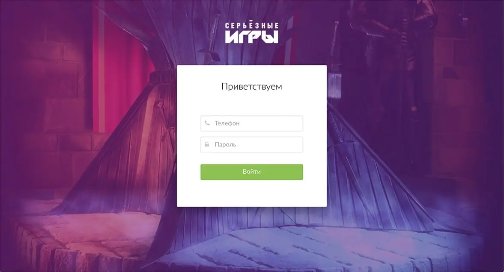

Главный экран — полоса с забронированными играми. Операторы звонят клиентам и подтверждают брони. Подтверждённые игры отмечаются зелёным цветом, если игра уже оплачена, появляется иконка кошелька снизу справа.

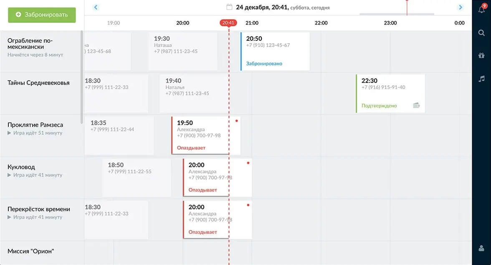

Таймлайн можно таскать или скроллить. Список квестов скроллит экран по вертикали.
Клик по слоту игры открывает карточку игры. В ней собрана информация об игре и человеке, забронировавшем квест.

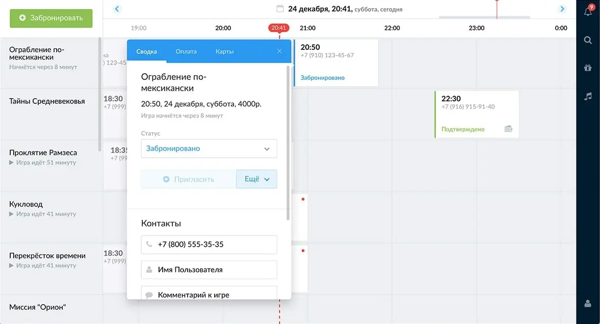

Чтобы принять оплату игры, работник отрывает таб «Оплата» и выбирает способ оплаты, который удобен клиенту клуба.

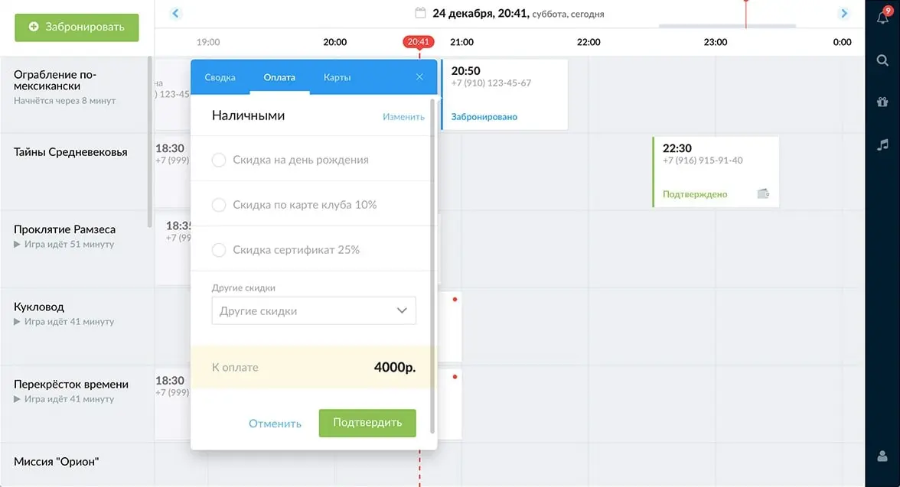

Если у клиента есть клубная карта, он называет её номер, чтобы получить баллы за игру. Оператор проверяет, есть ли такая карта и привязывает её к игре в табе «Карты».

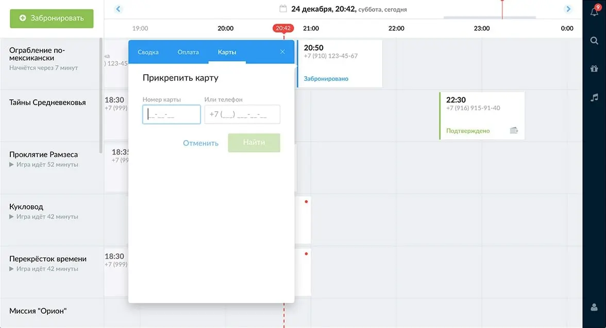

Уведомления напоминают оператору о необработанных заявках. Заявки собираются по категориям:

- «Перезвонить» — заявки, по которым оператор перезванивал, но клиент не ответил на звонок;
- «Опоздания» — игры, на которые клиенты опаздывают;
- «Подтвердить бронь» — необработанные заявки.

Если телефон, указанный в карточке, встречается на таймлайне больше одного раза, то он подсвечивается при наведении.

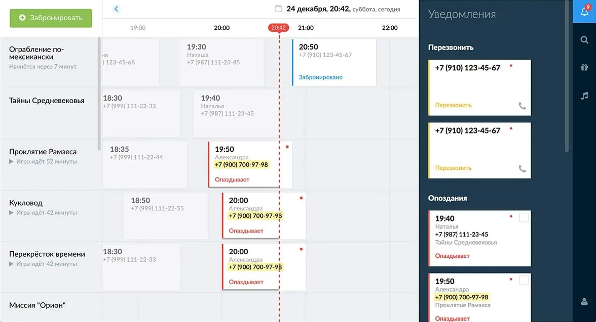

Уведомление открывает карточку игры.

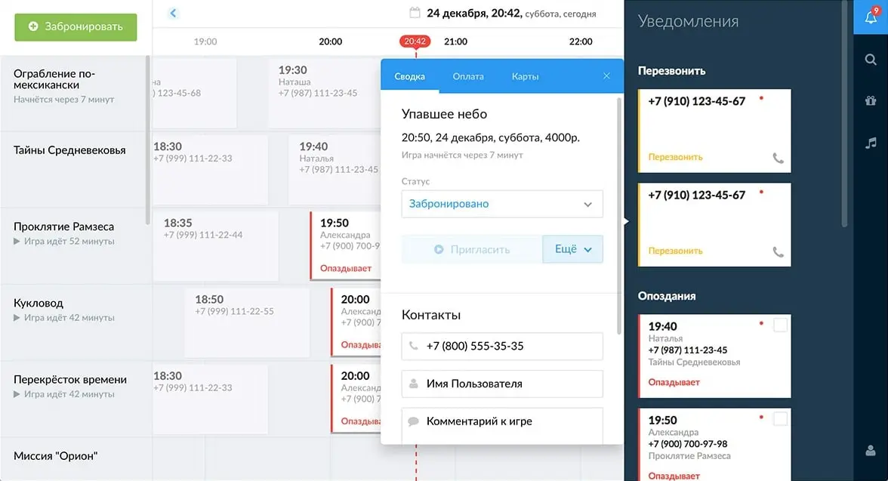

Поиск помогает найти игру, клубную карту или игрока. Найденные игры стоят в результате на первом месте.

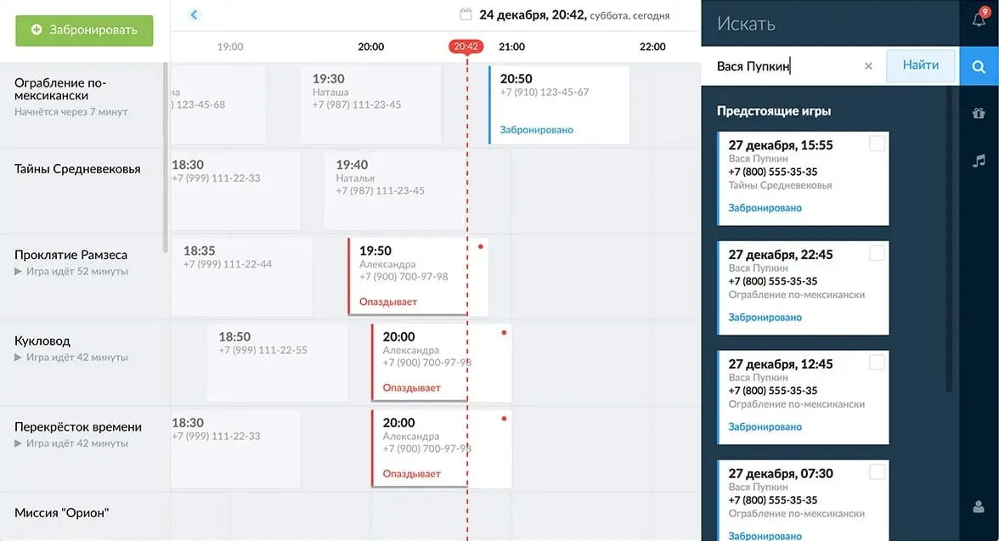

Под информацией о клубной карте и её владельце выводятся игры, которые игрок посетил.

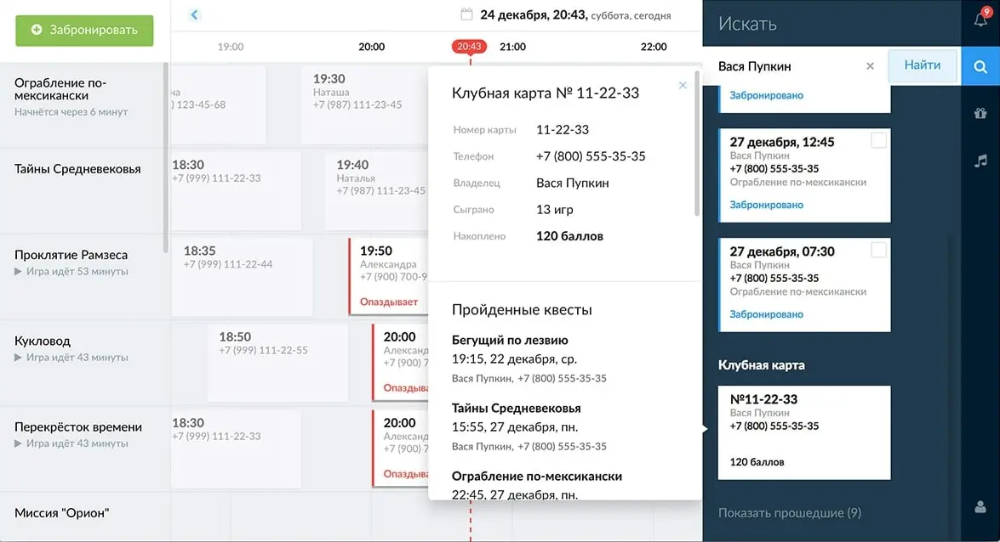

Вкладка «Музыка» управляет музыкой в холле <nobr>:–)</nobr>

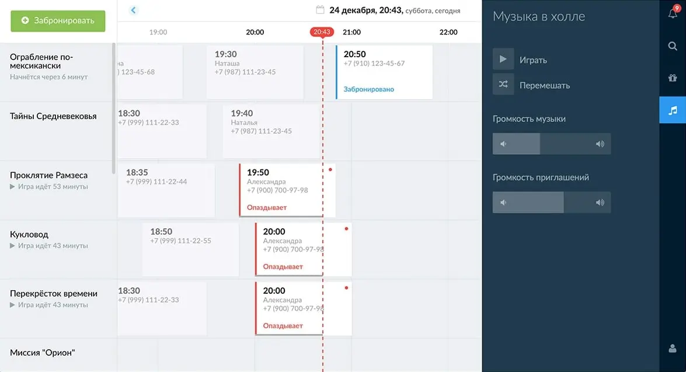

Чтобы забронировать новую игру, оператор нажимает на кнопку «Забронировать» в левом верхнем углу. Выбирает квест, дату и время.

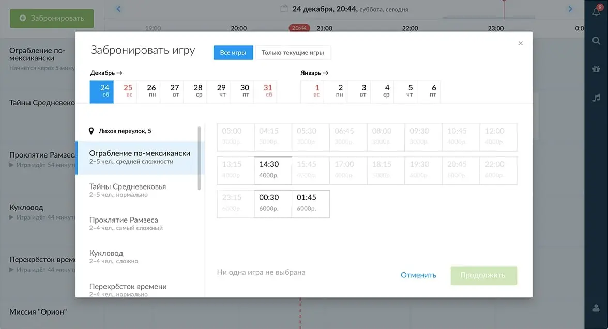

А затем заполняет данные об игроках.

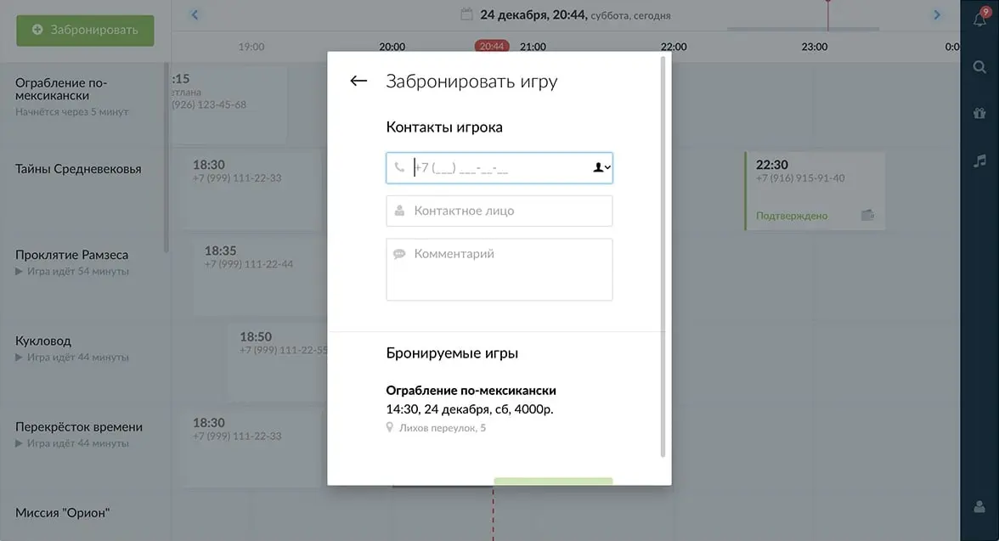

Также можно выбрать несколько игр и оплатить их разом.

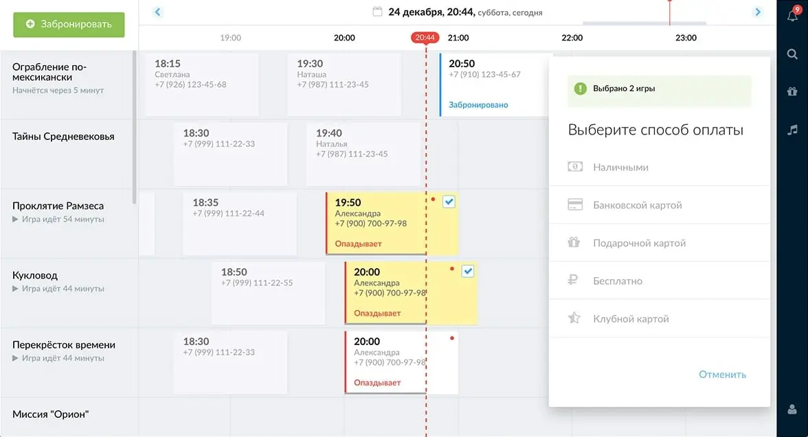

За время проекта я разобрался с фетчем, npm-скриптами, оптимизацией сборки для продакшена, немного узнал о Докере и непрерывной интеграции. Точно работает в Хроме и последних Фаерфоксах. Смотреть удобнее с компьютера.

P.S. Работа над этим проектом сильно помогла с [сайтом Серьёзных игр](/blog/about-new-request-site/). Здесь у нас было 2 месяца, чтобы опробовать новые технологии и привыкнуть к ним. Поэтому к работе над сайтом мы приступили уже с опытом разработки масштабируемых интерфейсов.
