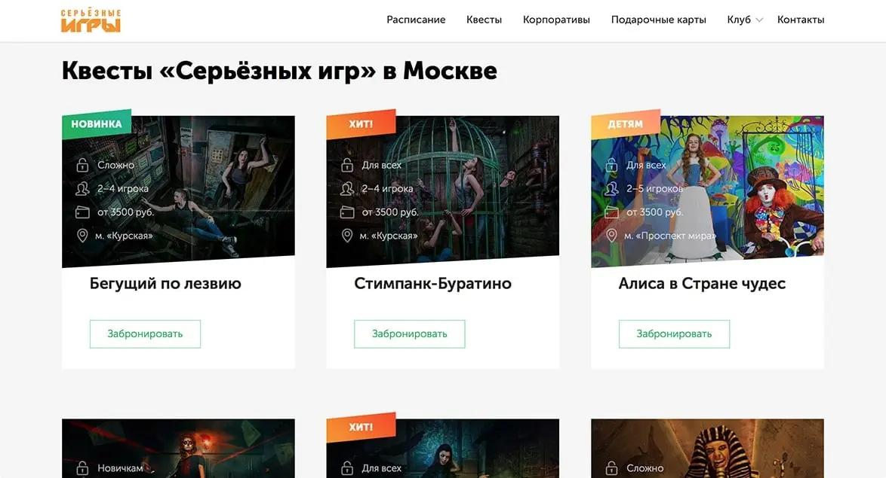
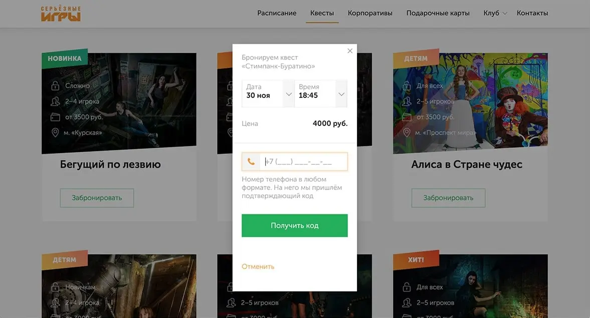
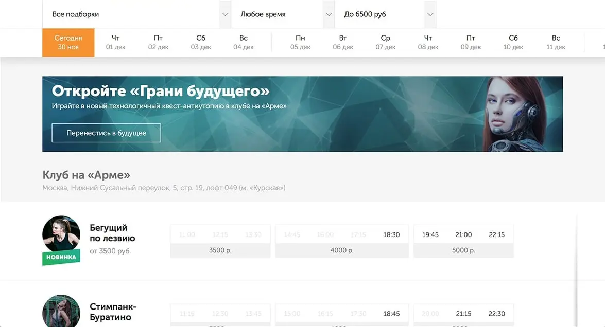
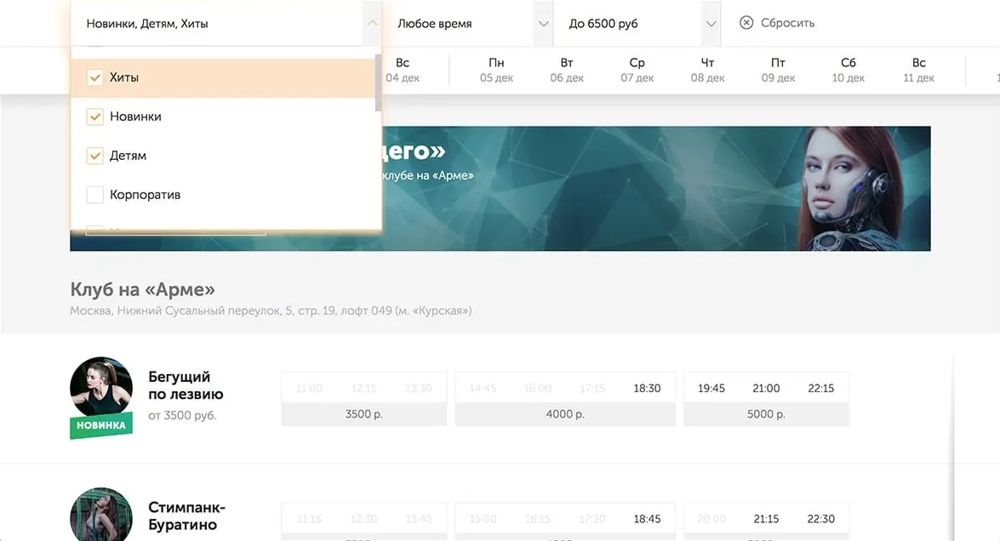
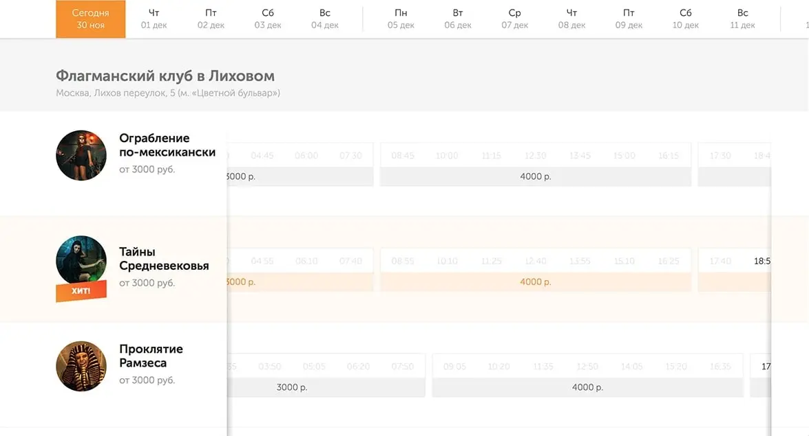
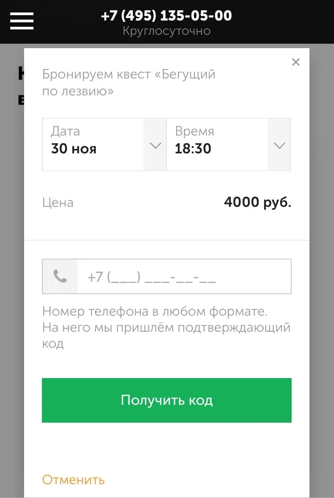

# Release of New Request.ru

The new [Request.ru website](https://request.ru) is a big Redux application. I designed its architecture, set up server-side rendering, built a set of UI elements, and compiled the layout and pages. In this post I'll show you what we made.

## Escape Room Catalogue and Bookings

On the catalog page, we show cards with games. In each card, we describe how difficult the escape room is, how many people can play the game, its price, and near which metro station it is located.

The card itself leads to a separate page of the game, but you can book the game right here through the “Book” button. The button opens a popup where we offer the nearest free time:

.

Time and date can be changed. In the list, we show only available time slots as well as the price for a certain time:

## Time Table and Schedule

On the schedule page we have made filters by room sets, time, and price. You can select the date in the calendar below the filters. The game descriptions occupy the rows below. Games are collected by price into groups, price is in the basement of the group.

Multiple filters and time slots help to choose the escape room more precisely. The “Reset” button erases all filter settings.

The time table is mouse draggable and scrolls horizontally. On mobile devices, it can be dragged with a swipe.

When you tap on a free time, a booking popup opens. The arrow in it points at which game the user is booking. And the date and time are focused on that game.

## Mobile Design

For phones and narrow screens, we simplify the layout a bit. For example, we expand the booking popup to the full screen and display it in the center:

Also we make quest filters large to make it easier to tap with a finger, and add a swiping functionality to the calendar:

The time tables on the quest page is grouped by day, and the “Book” button sticks to the bottom of the screen. When you tap on a particular day, the time table unfolds:

## Conclusions

The project turned out to be extensive, I learned a lot during my time with it—not only in terms of hard skills, but also in managing and mentoring other developers.

I wrote more about my experience in [separate post](/blog/about-new-request-site) 🙃
