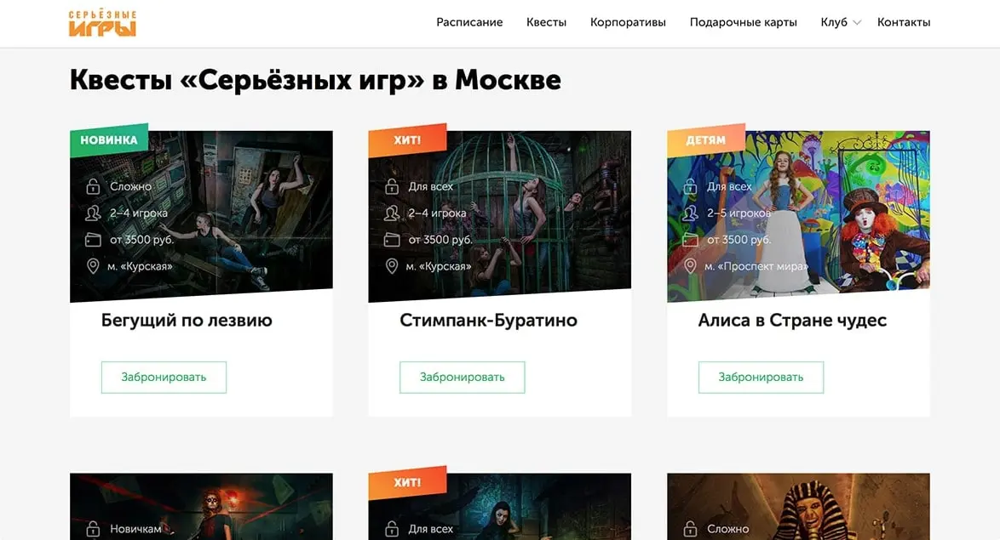
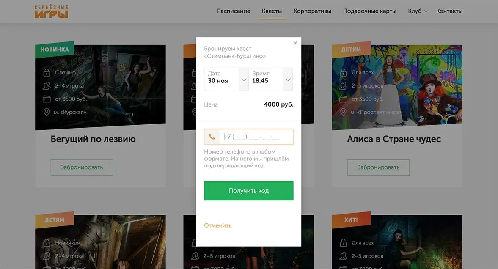
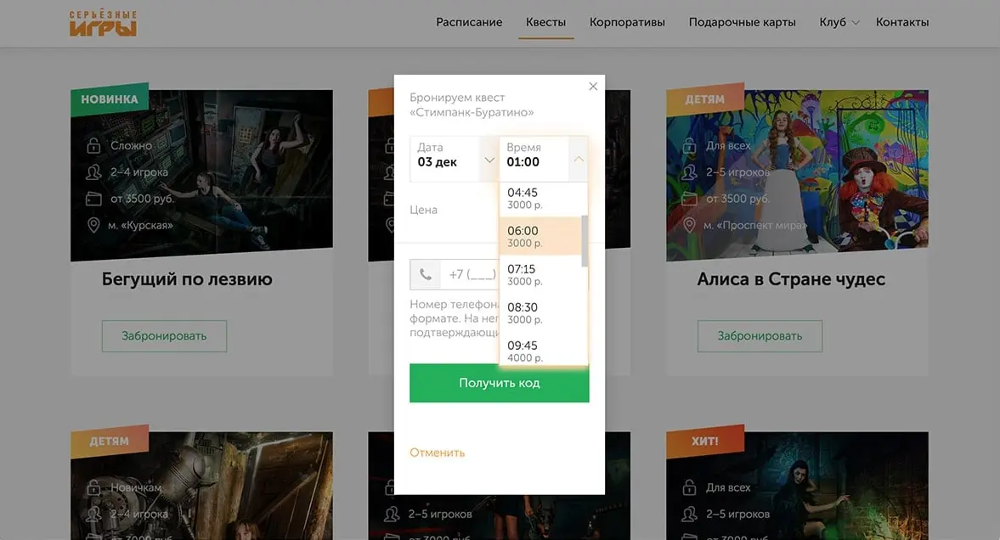
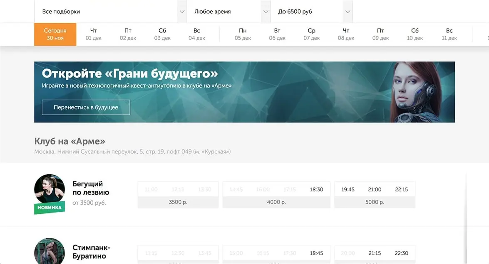
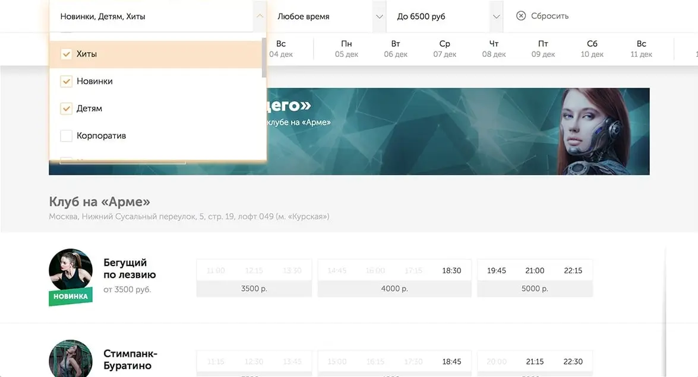
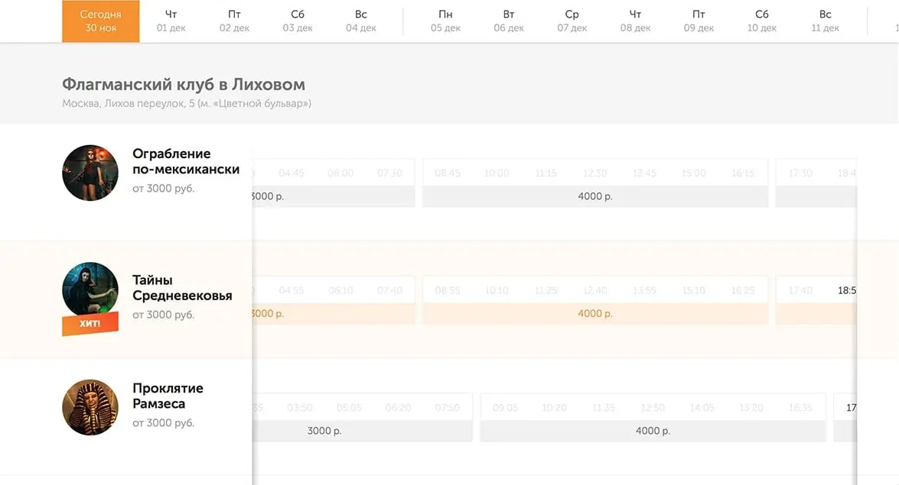
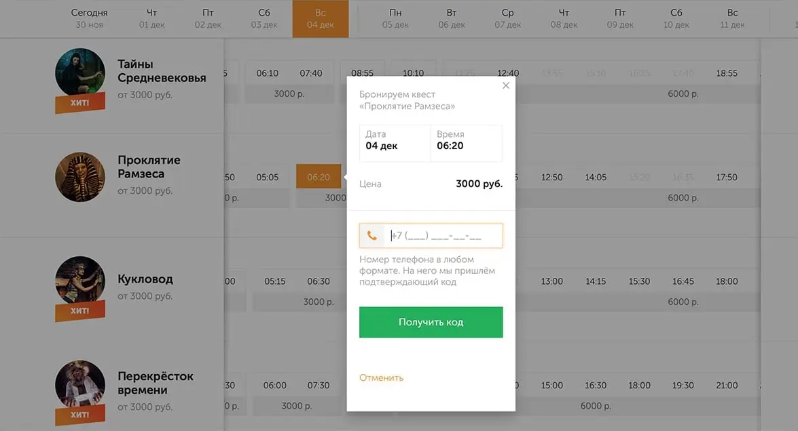
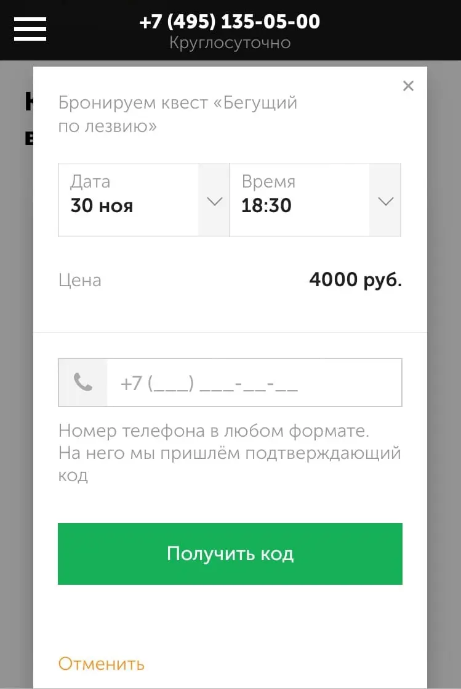
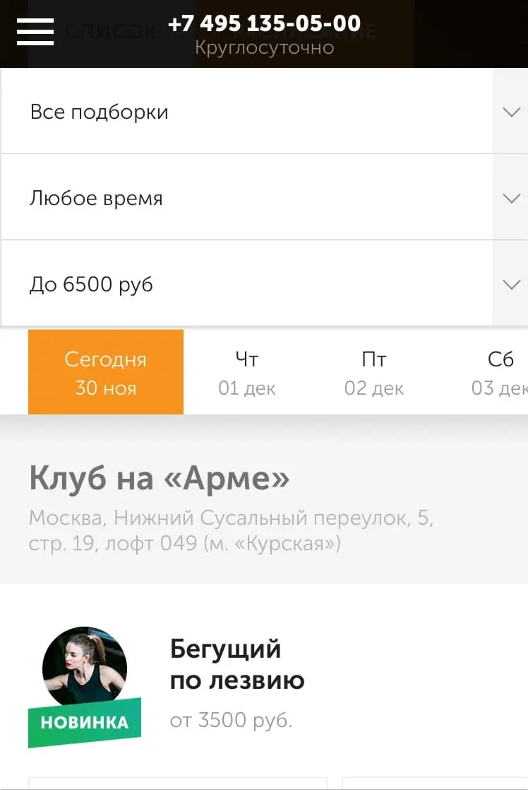
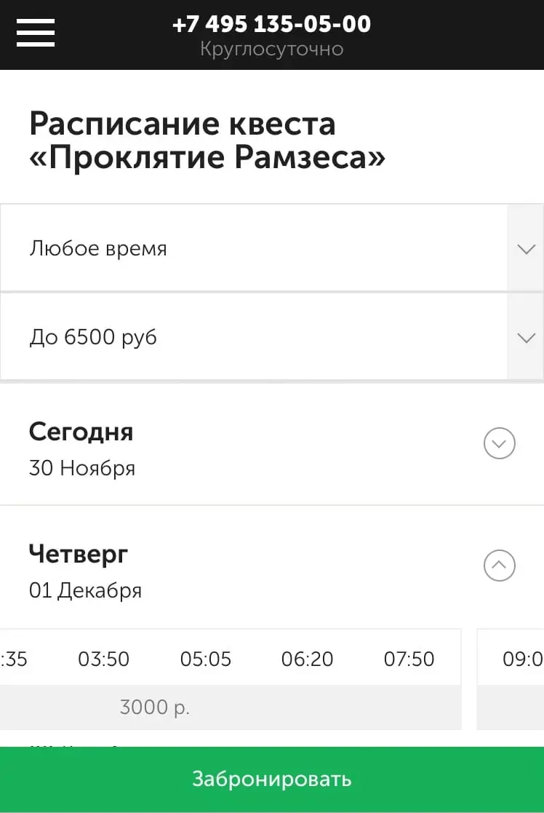

# Релиз обновлённого сайта Серьёзных Игр

Новый [сайт «Серьёзных игр»](https://request.ru) — это большое Redux-приложение. Я спроектировал его архитектуру, настроил серверный рендеринг, собрал набор интерфейсных элементов и основные страницы. В этом посте покажу, что у нас в итоге получилось.

## Списки квестов и бронь

На странице каталога квестов, мы показываем карточки с играми. В каждой карточке описываем, насколько квест трудный, сколько человек в него может играть, его цену, и рядом с какой станцией метро находится локация.

Сама карточка ведёт на отдельную страницу квеста, но забронировать игру можно прямо здесь через кнпоку «Забронировать». Кнопка открывает попап, где мы предлагаем ближайшее свободное время:

Время и дату можно изменить. В списке мы показываем только свободные игры, а также цену в определённое время:

## Расписание игр

На странице расписания мы сделали фильтры по подборкам, времени и цене. Дату можно выбрать в календаре под фильтрами. Квесты занимают строчки ниже. Игры собраны по ценам в группы, цена — в подвале группы.

Множественный фильтр подборок и времени помогает точнее выбрать квест. Кнопка «Сбросить» стирает все настройки фильтра.

Расписание квестов таскается мышью и скроллится по горизонтали. На мобильных устройствах его можно таскать свайпом.

При нажатии на свободное время открывается попап бронирования. Язычок в нём указывает, какую игру бронирует пользователь. А дата и время фиксируются на этой игре.

## Дизайн для мобильных

Для телефонов и узких экранов мы упрощаем вёрстку и немного перекраиваем лейаут. Например, попап бронирования разворачиваем на весь экран и выводим по центру:

Фильтры квестов делаем большими, чтобы легче было попасть пальцем, а календарю добавляем свайп:

Расписание на странице квеста группируем по дням, а кнопку «Забронировать» выводим и «залипаем» внизу экрана. При тапе на конкретный день расписание разворачивается:

## Итого

Проект получился объёмным, за время работы с ним я много чему научился — не только в плане хардскилов, но и в управлении и менторинге других разработчиков.

Подробнее о своём опыте, я написал в [отдельном посте](/blog/about-new-request-site) 🙃
