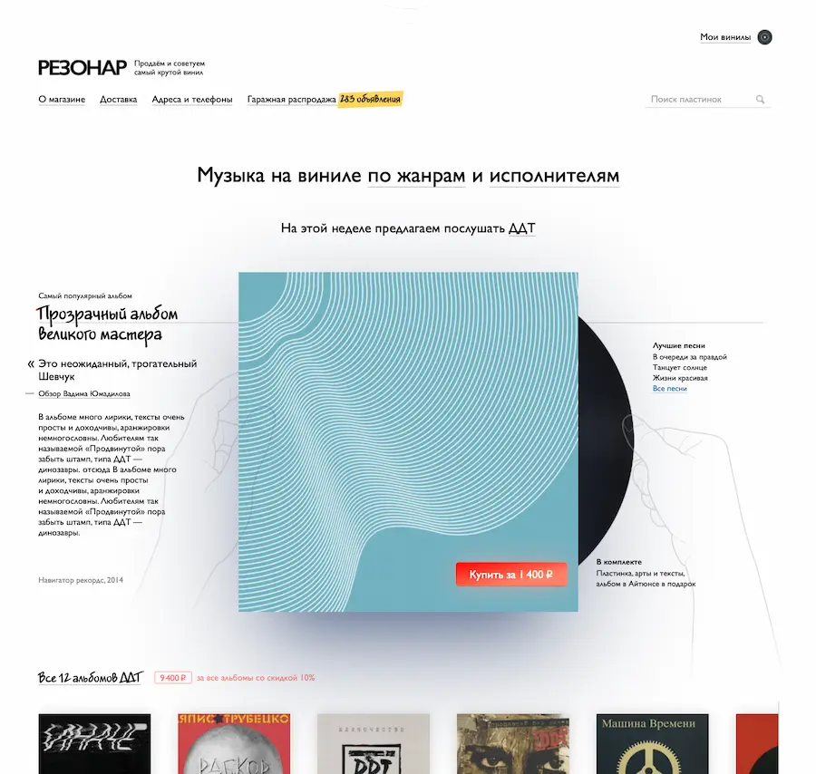
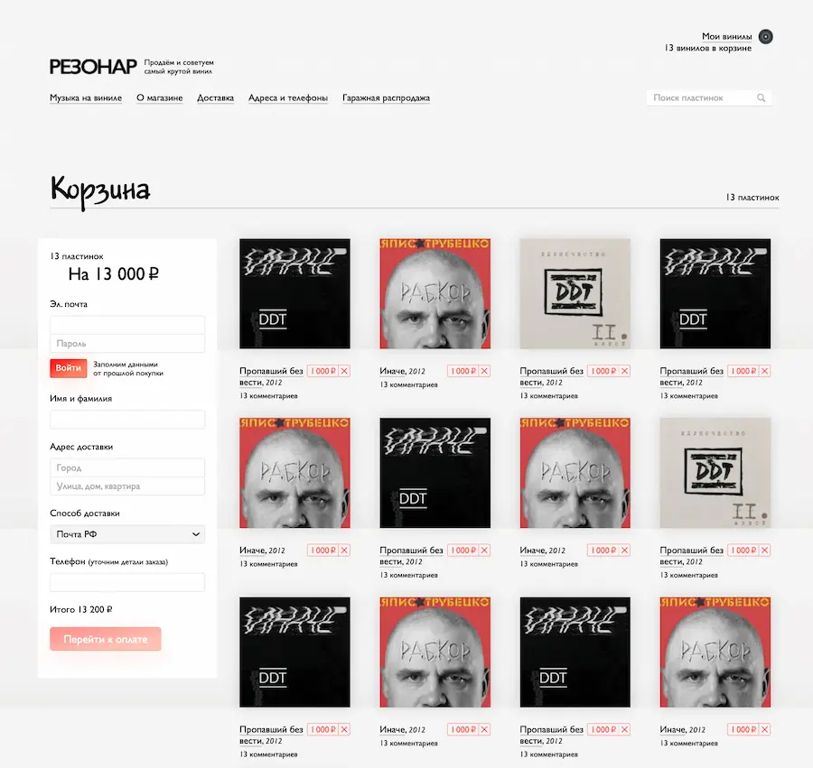

# Resonar Release

Resonar is an online vinyl record store. In this project, I worked with its frontend.

The main design trick was “neoskeuomorphism”: we had various “marker highlights,” different fonts on the “bulletin board” for buying and selling records, UI elements resembling objects from the real world.

For example, the main page shows a featured album as a case, from which translucent hands take out the record itself. As the screen expands, the hands extend, as if “pulling” the record out more.

The same happens on the album page:

On the cart page, we made “shelves” for disks using a gradient on the page background. Nothing special, but it looks intuitive and nice:

In addition, in Resonar we used [Prokrutchik](/projects/prokrutchik/) to show album recommendations to users. The Prokrutchik widget appears on almost every page, and we haven't had any problems integrating it.

So we can say that we tried out Resonar on this project in production, and it's finally out of beta ^\_^
