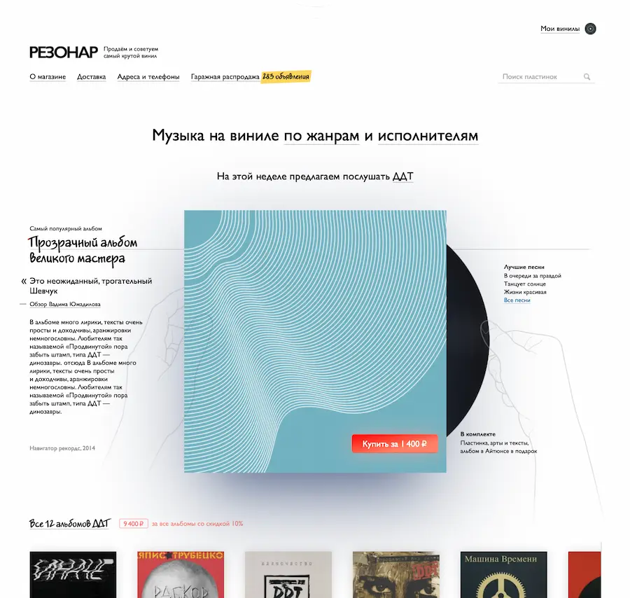
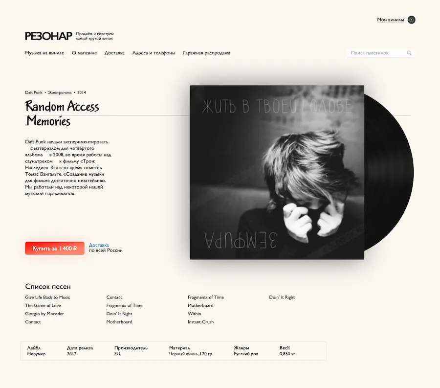
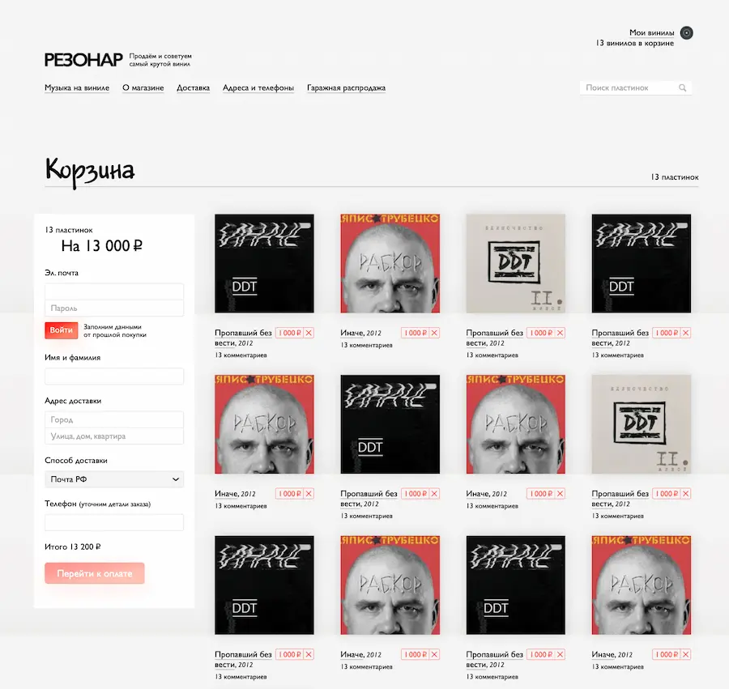

# Запуск «Резонара»

Резонар — это интернет-магазин виниловых пластинок. В этом проекте я занимался вёрсткой и программированием фронтенда.

Основной фишкой дизайна был «неоскевоморфизм»: различные «выделения маркером», разнобой шрифтов на «доске объявлений» о покупке и продаже пластинок, элементы UI, напоминающие предметы из реального мира.

Например, на главной странице фичерд-альбом показан, как кейс, из которого полупрозрачные руки достают саму пластинку. При расширении экрана руки раздвигаются, как бы «вытаскивая» пластинку сильнее.

То же происходит и на странице альбома:

На странице корзины мы сделали «полочки» с пластинками с помощью градиента на фоне страницы. Вроде, ничего особенного, но выглядит интуитивно и красиво:

Кроме этого, в Резонаре мы используем [Прокрутчик](/projects/prokrutchik/), чтобы показывать рекомендации альбомов пользователям. Виджет с Прокрутчиком появляется почти на каждой странице, и у нас не было никаких проблем с его внедрением.

Так что можно сказать, что мы опробовали Прокрутчик на этом проекте в бою, и он вышел из беты ^\_^
