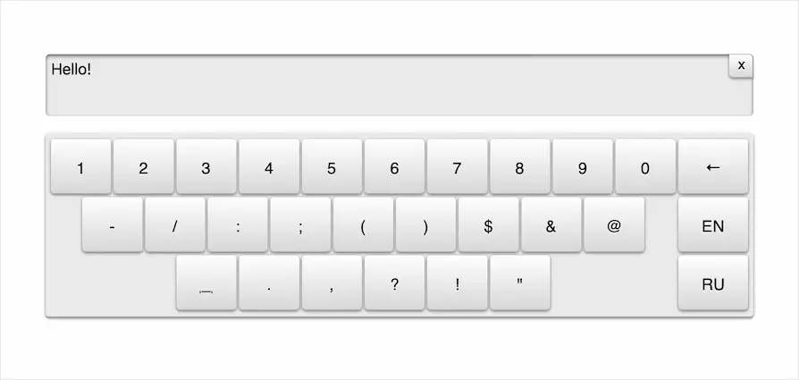

# Made Screen Keyboard with JS

For one of the projects I'm working on at Dodo Pizza, I needed an on-screen keyboard. A simple one, with three sets of characters: Cyrillic, Latin, and a number pad.

I couldn't find anything suitable so I decided to try and code it up myself. While writing the code, I decided to design it as a reusable widget and decorate it with some styles, it turned out like this:

The widget itself will calculate the height for the wrapper block it will be in, as well as font sizes and indents. And it will recalculate all this when the window is resized.

Typed text is displayed in the screen above the keyboard by default. On iPhones and iPads, the screen won't focus until the user taps on it themselves. When typing text, the screen allows you to delete everything you've written with a single button:

After the full stop is placed, the keyboard itself will turn on uppercase to start a new sentence in uppercase. And it also supports “quick full stop”—when two spaces after a word become a dot with a space 🙃

By the way, everything is made without a single image—in pure CSS. The widget needs jQuery to work.
