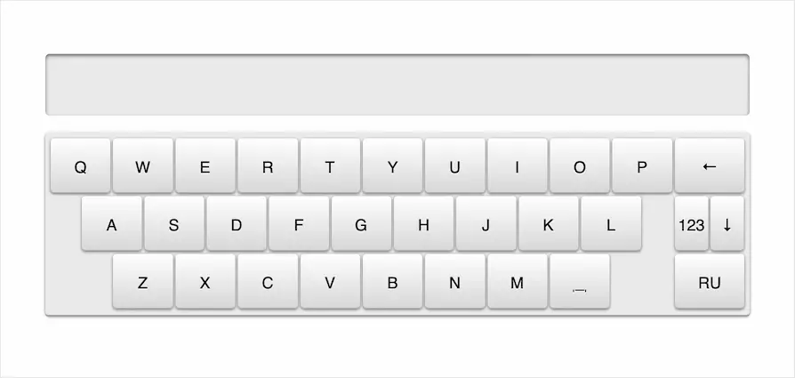
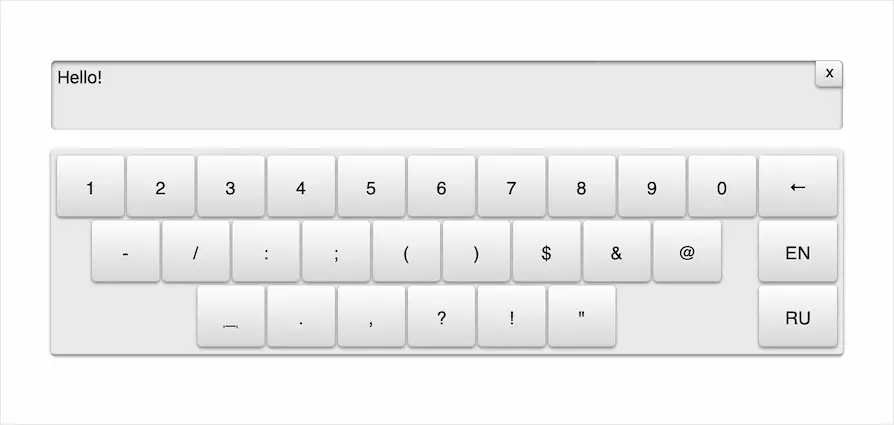

# Написал экранную клавиатуру на JS

Для одного из проектов, над которыми я работаю в Додо, нам нужна была экранная клавиатура. Простенькая такая, из трёх наборов символов: кириллица, латиница и цифры.

Среди готовых клавиатур в интернете я не смог найти ничего подходящего, поэтому решил попробовать написать самостоятельно. Пока писал код, решил оформить её в виде переиспользуемого виджета и немного украсить стилями, получилось вот так:

Виджет сам посчитает высоту для блока-обёртки, в котором он будет находиться, а также размеры шрифтов и отступы. И всё это пересчитает при изменении размера окна.

Набранный текст по умолчанию выводится в экран над клавиатурой. На айфонах и айпадах экран не будет фокусироваться, пока пользователь сам не тапнет на него. При вводе текста, экран позволяет удалить всё написанное одной кнопкой:

После поставленной точки клавиатура сама включит верхний регистр, чтобы начать новое предложение в заглавной буквы. А ещё она поддерживает «быструю точку» — когда два пробела после слова становятся точкой с пробелом 🙃

Сделано всё, кстати, без единой картинки — на чистом CSS. Для работы виджету нужен jQuery.
