# Taskman Release

From February to March, I worked on Taskman, a task management and time tracking system. During this time, our team built a prototype of the application, we tested it on ourselves and launched it in a limited release.

<aside>

To see how Taskman works, you can check out [interactive copy of the app](https://taskman.bespoyasov.ru/). The copy is not a real app, so don't be afraid to break anything. All data in it is not real, the copy does not send any requests to the server.

</aside>

On the main page, the employee sees the tasks that have been assigned to him. Among all the tasks we highlight the employee's favorites, important tasks, overdue tasks and those that are about to expire.

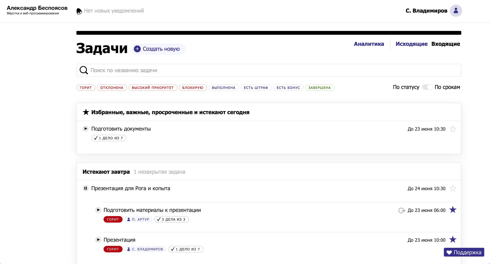

Search and filters are always in a prominent place. This makes it easier to search for tasks if there are a lot of them.

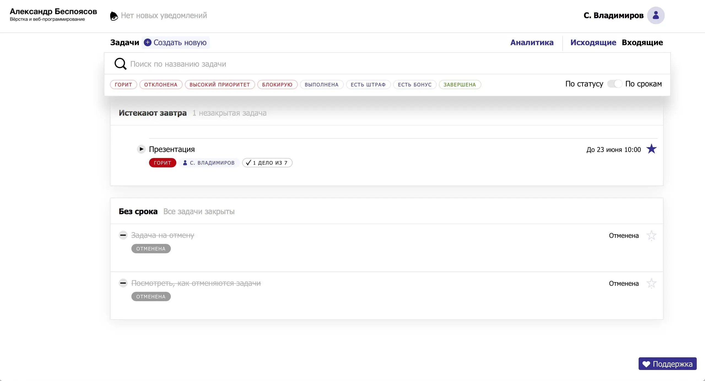

The page of a particular task consists of two semantic sections. On the left we show information about the deadline, the executor and the checkers. It also shows who changed the task and when. If there are files attached to it, a tab with all files of this task will appear.

On the right side we display the name of the task, its description and status.

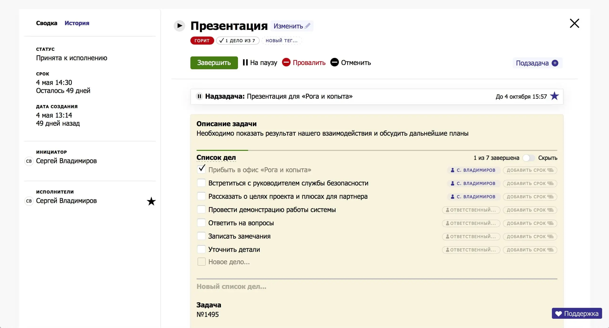

The initiator of the task can edit it. Besides the name, description and status, he can assign a penalty for overdue and a bonus for completion.

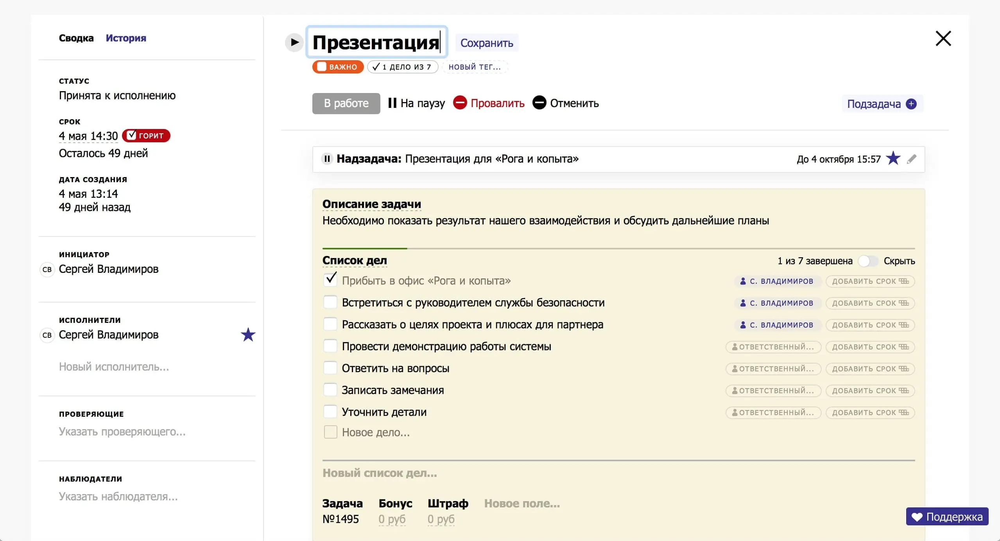

Tasks can be regular or can consist of multiple subtasks. Setting up task repetition is complex and takes into account many scenarios. This was one of the most complex elements in the project.

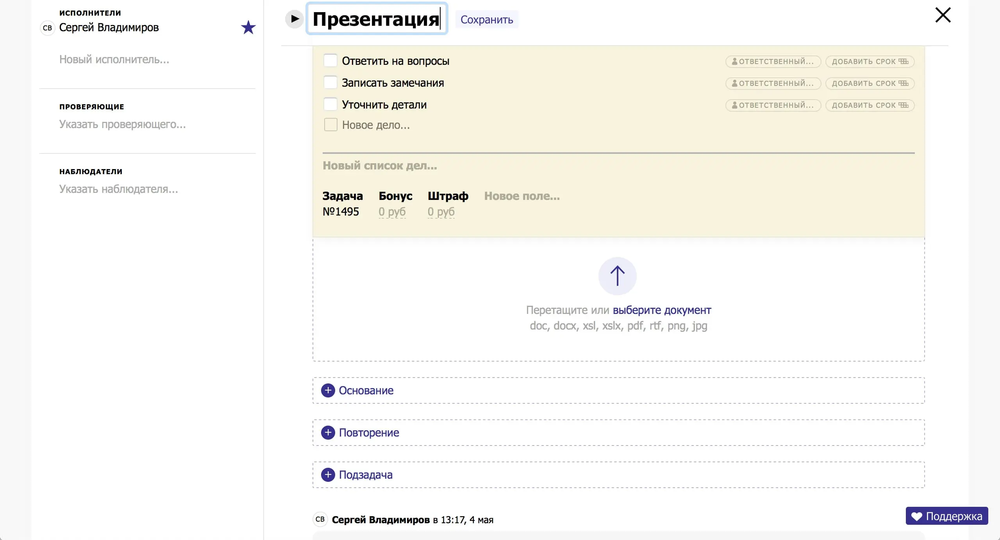

In to-do lists, each to-do can be assigned to a specific executor and assigned a deadline.

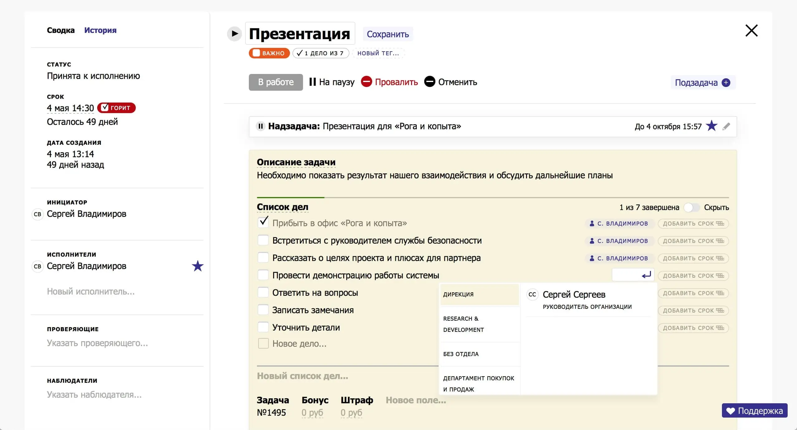

We synchronize the to-do lists over sockets. If someone changes a list in a task, the change will be reflected immediately on other computers. We synchronize comments in the same way. If users leave a comment on a task or edit it, other users will see it immediately.

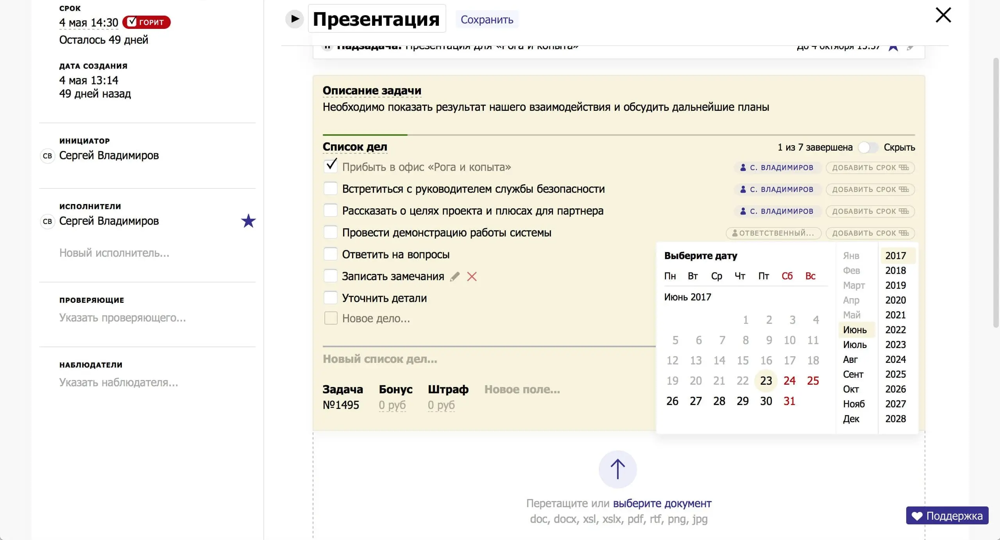

To make the lists easy to work with from the keyboard, we create a new item automatically when the user hits enter.

<YouTube src="https://www.youtube.com/embed/gYpXcOeJp0I" caption="To-do list component">https://youtu.be/gYpXcOeJp0I</YouTube>

To customize deadlines, select dates and times, I wrote a custom calendar component. Nothing from the open-sourced solutions was suitable, so I had to reinvent the wheel.

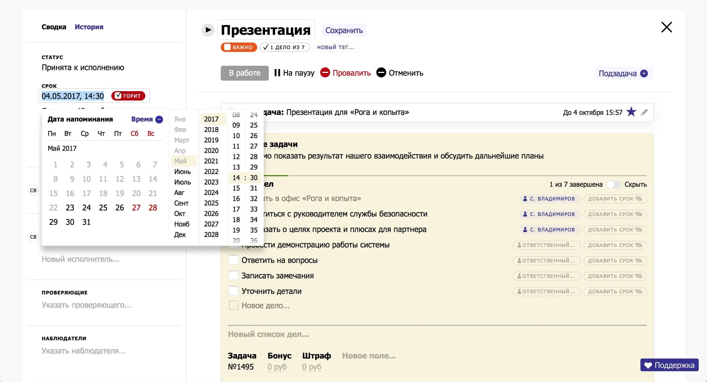

The time selector works like the selector drum in iOS. The number that is in the beige cover is the highlighted number. The drum itself is spun with the mouse wheel, and when you release the drum, the nearest digit is “sticks” to the backing.

<YouTube src="https://www.youtube.com/embed/x02VWuBProE" caption="Reinvented calendar component">https://youtu.be/x02VWuBProE</YouTube>

In the analytics section, managers monitor employee performance. Employees are divided by departments, and each employee has statistics on his/her tasks. How many tasks he was assigned, how many completed on time, how many overdue and so on.

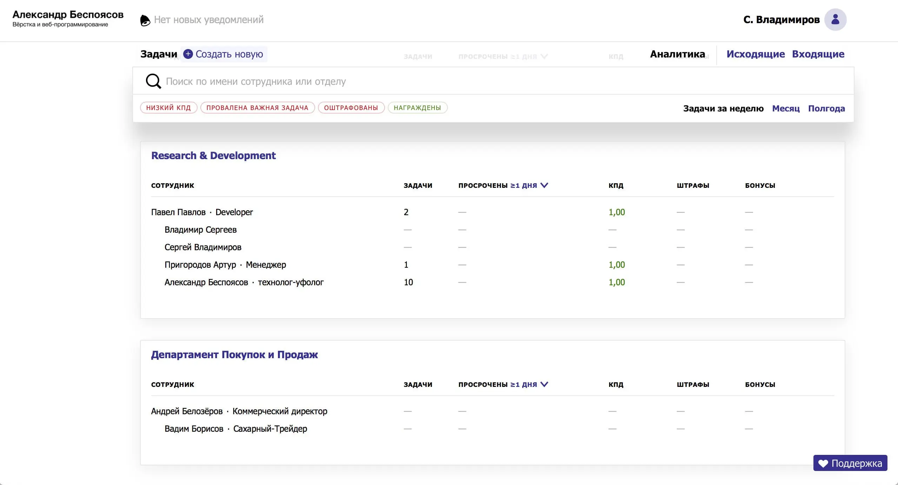

The user profile is linked to another application, so there are few customizations. You can change your name, date of birth, attach a photo, and change your phone and mail.

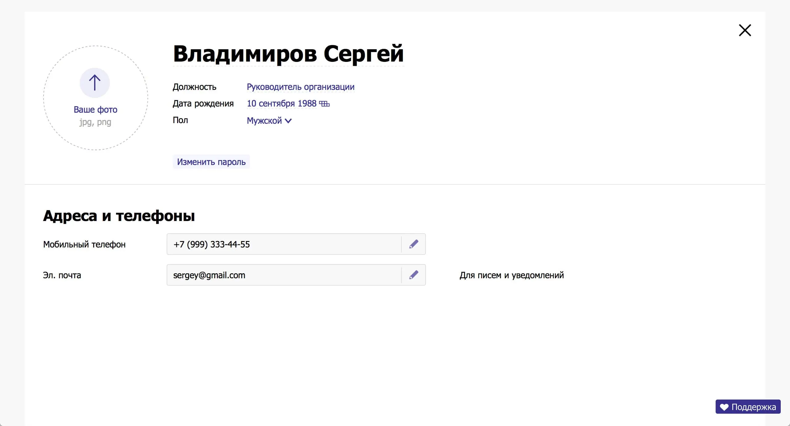

Company administrators have access to the section with organization structure. You can change the company name, attach a logo or change department names.

Logos uploaded by users are optimized on the server and displayed in the header. All logos are scaled so that they are fully visible. The scary logo in the left corner of the header is an imitation of someone else's company logo and an example of how it works.

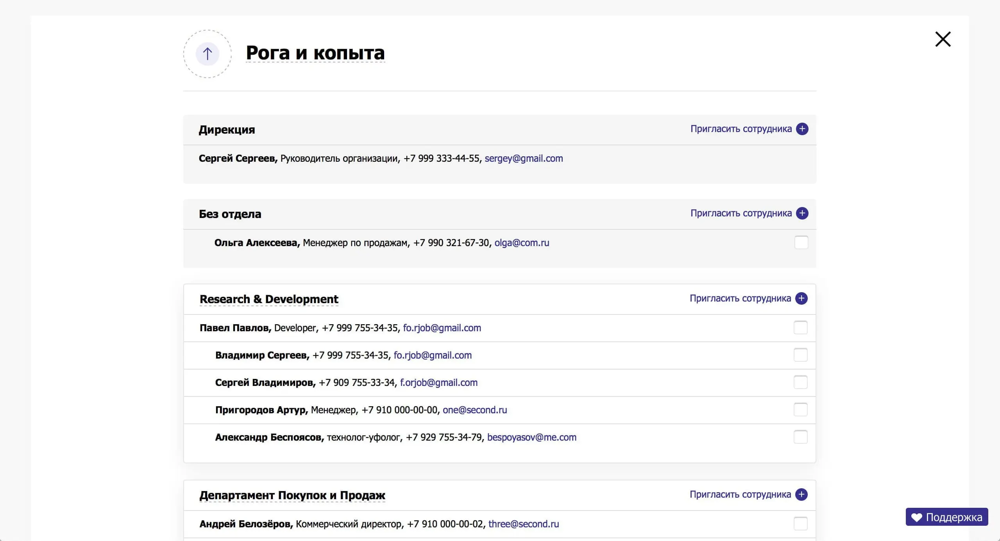

Administrators can move employees between departments, assign supervisors, fire and invite employees to the company.

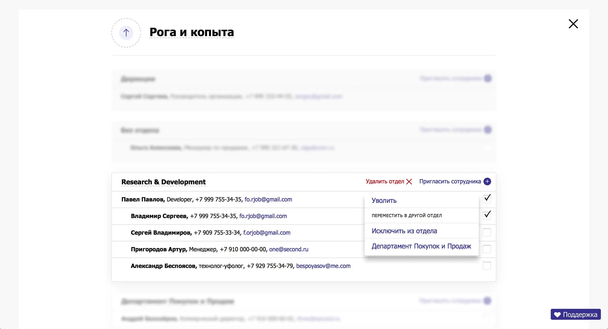

Administrators can also view a detailed summary of an employee's tasks. The page shows the employee's contact information, their current tasks, and the number of overdue tasks.

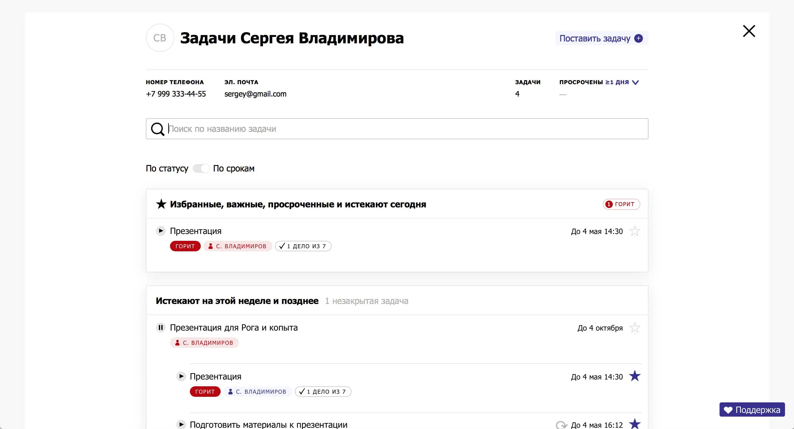

It was intended to be bigger, but in the first launch we decided to not include:

- Task archive;
- Task templates;
- Mobile version;
- Complex structure within the department;
- Section with accepted tasks.

We simplified the notification system. We divided notifications into two types: browser and email.

The first ones appear immediately after an event: if you left a comment to a task, the user will receive a notification. All unread ones are stored in the notifications section.

The second ones are divided by importance into three categories. The most important ones are sent to the mail at once. The least important ones are waiting for the user's activity on the site.

If there is no activity 20 minutes after the last action, we will send an email. This way we don't spam you with unnecessary emails about comments.

Notifications are synchronized. If the user has read the browser notification about a comment, we won't send him an email.
