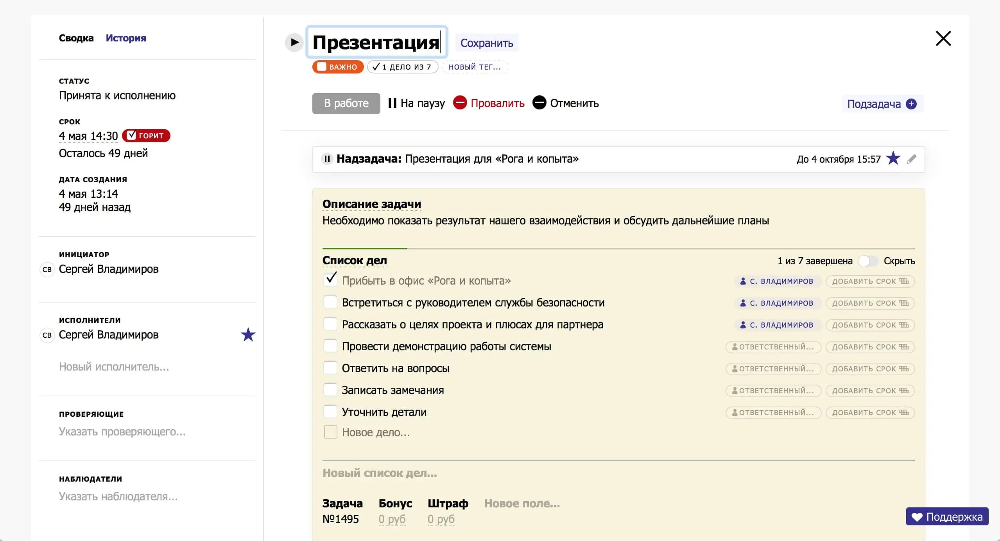
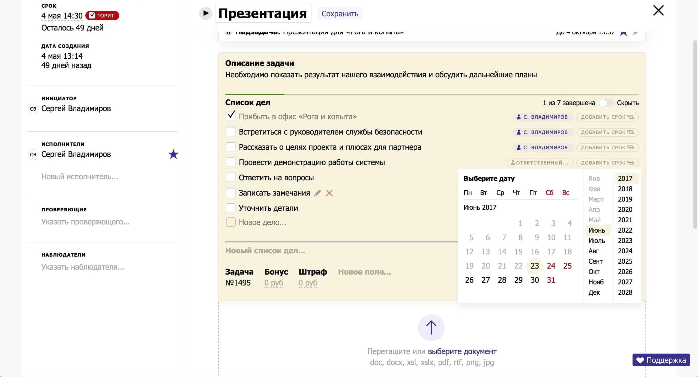
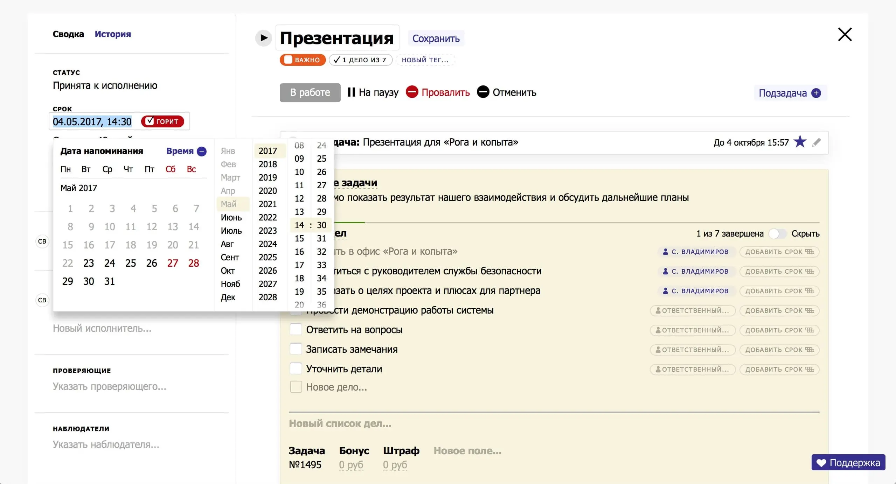
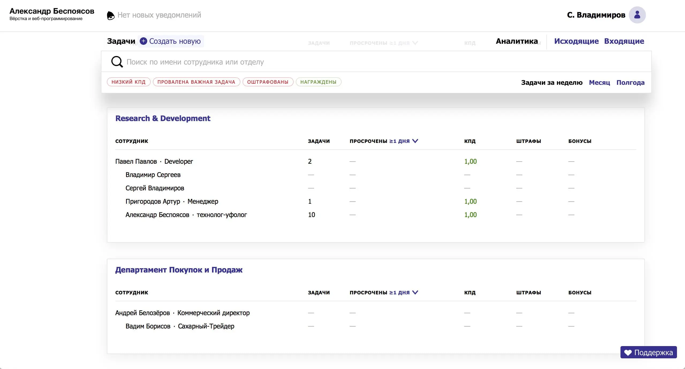
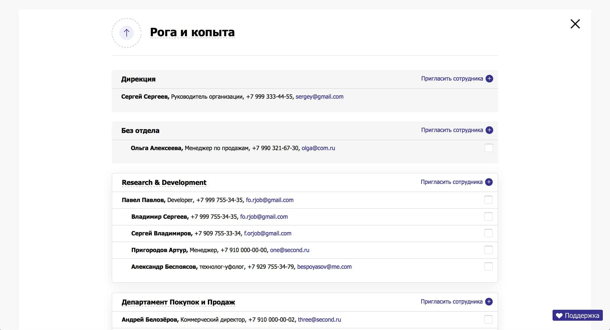
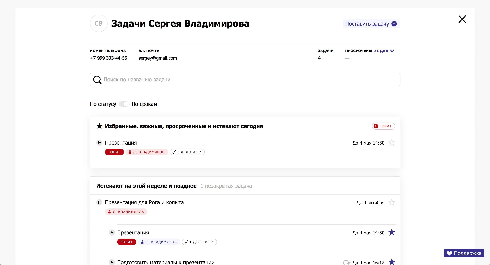

# Задачник

С февраля по март я работал над «Задачником» — системой управления задачами и учёта времени сотрудников. За это время наша команда собрала прототип приложения, мы опробовали его на себе и запустили в ограниченный релиз.

<aside>

Посмотреть, как Задачник работает, можно в [интерактивной копии приложения](https://taskman.bespoyasov.ru/). Копия — это не настоящее приложение, поэтому не бойтесь ничего сломать. Все данные в ней не настоящие, запросов к серверу копия не отсылает.

</aside>

На главной странице сотрудник видит задачи, которые ему поставили. Среди всех задач мы выделяем избранные сотрудником, важные, просроченные и те, у которых скоро истекает срок.

Поиск и фильтры всегда находятся на видном месте. Так проще искать задачи, если их много.

Страница конкретной задачи состоит из двух смысловых разделов. Слева мы показываем информацию о сроке, исполнителе и проверяющих. Там же отображается, кто и когда изменил задачу. Если к ней прикреплены файлы, то появится вкладка со всеми файлами этой задачи.

Справа мы выводим название задачи, её описание, статус.

Инициатор задачи может редактировать её. Кроме названия, описания и статуса он может назначить штраф за просрочку и бонус за выполнение.

Задачи бывают регулярными или могут состоять из нескольких подзадач. Настройка повторения задачи сложная и учитывает много сценариев. Это был один из самых сложных элементов в проекте.

В списках дел каждое дело можно поручить конкретному исполнителю и назначить срок.

Списки дел мы синхронизируем по сокетам. Если кто-то изменит список в задаче, то изменение отобразится сразу на других компьютерах. Таким же образом мы синхронизируем комментарии. Если пользователи оставят комментарий к задаче или отредактируют его, то это сразу увидят другие пользователи.

Чтобы со списками было удобно работать с клавиатуры, при нажатии на энтер мы создаём новый пункт автоматически.

<YouTube src="https://www.youtube.com/embed/gYpXcOeJp0I" caption="Компонент списка дел">https://youtu.be/gYpXcOeJp0I</YouTube>

Для настройки сроков, выбора дат и времени, я написал компонент календаря. Из опенсорсных решений ничего не подошло, поэтому пришлось писать велосипед.

Выбиралка времени работает как барабанчик селекта в Айосе. Цифра, которая находится в бежевой обложке — выделенная. Сам барабанчик крутится колесом мыши, а при отпускании барабана ближайшая цифра «примагничивается» к подложке.

<YouTube src="https://www.youtube.com/embed/x02VWuBProE" caption="Компонент календаря для настройки срока">https://youtu.be/x02VWuBProE</YouTube>

В разделе с аналитикой менеджеры наблюдают за производительностью сотрудников. Сотрудники разделены по отделам, у каждого описана статистика по его задачам. Сколько задач ему поставили, сколько выполнено в срок, сколько просрочено и так далее.

Профиль пользователя связывается с другим приложением, поэтому настроек мало. Можно изменить имя, дату рождения, прикрепить фотографию и поменять телефон с почтой.

Администраторам компании доступен раздел со структурой организации. Можно изменить название компании, прикрепить логотип или изменить названия отделов.

Логотипы, которые загружают пользователи, мы оптимизируем на сервере и выводим в шапку. Все логотипы масштабируются так, чтобы их было видно полностью. Страшный логотип в левом углу шапки — имитация логотипа чьей-то компании и пример, как это работает.

Администраторы могут перемещать сотрудников между отделами, назначать руководителей, увольнять и приглашать сотрудников в компанию.

Также администраторы могут просматривать подробную сводку по задачам сотрудника. На странице показаны контактные данные сотрудника, его текущие задачи, и количество просроченных.

Задумывали больше, но для первого запуска пофлексили:

- архив задач;
- шаблоны задач;
- мобильную версию;
- сложную структуру внутри отдела;
- раздел с принятыми задачами.

Упростили систему уведомлений. Разделили уведомления на два вида: браузерные и почтовые.
Первые появляются сразу после события: оставили комментарий к задаче — пользователь получит уведомление. Все непрочитанные складируются в разделе с уведомлениями.

Вторые делятся по важности на три категории. Наиболее важные отправляются на почту сразу. Наименее важные ждут активности пользователя на сайте.

Если активности нет 20 минут после последнего действия, то мы отправим письмо. Так мы не спамим лишними письмами о комментариях.

Уведомления синхронизируются. Если пользователь прочёл браузерное уведомление о комментарии, то мы не будем присылать ему письмо.
