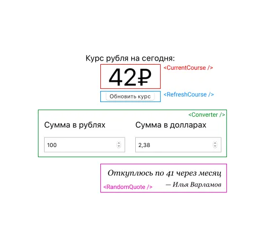

# My Workshop on Testing React Apps is Out

A month ago, I was invited to give a [talk at local junior-developer meetup](https://www.youtube.com/watch?v=oaktsy6YKMk). The audience wanted to listen about React application testing, so this was the topic.

I thought I should talk about how I usually test applications (with some examples of [Tzlvt](/projects/tzlvt)) and TDD. The latter saves me tons of time, that's why I decided to include it in the talk.

I figured that it'd be most useful to show the example of developing an application “live” using the principles I see as most valuable. There are several reasons behind my reasoning:

- In “live” talk, it's better seen how TDD helps to design APIs and refactor the code;
- It's clearer how we should switch between testing, implementation, and refactoring;
- It's better seen how to draw boundaries between modules and how to make code more testable.

I decided that a good format would be a live-coding session and started preparing the [app](https://github.com/bespoyasov/testing-workshop/) we would write at the workshop. I chose a currency converter:

I picked this combination of components to cover as many different kinds of tests as possible that one might encounter when developing a React application. It could show, how to test:

- Business logic and pure functions
- Simple components that depend only on props
- Custom React hooks
- Functions that work with random values
- API requests and asynchronous functions
- Redux reducers and asynchronous actions
- Custom events like click or keyboard input

A couple of days ago a recording of the workshop was released, you are welcome to watch it! (It's in Russian but has English subtitles.)

## Resources

- [Workshop recording](https://www.youtube.com/watch?v=oaktsy6YKMk)
- [Repo with application source code](https://github.com/bespoyasov/testing-workshop/)
- [Slides with a lot of additional literature](https://bespoyasov.ru/testing-workshop/)
