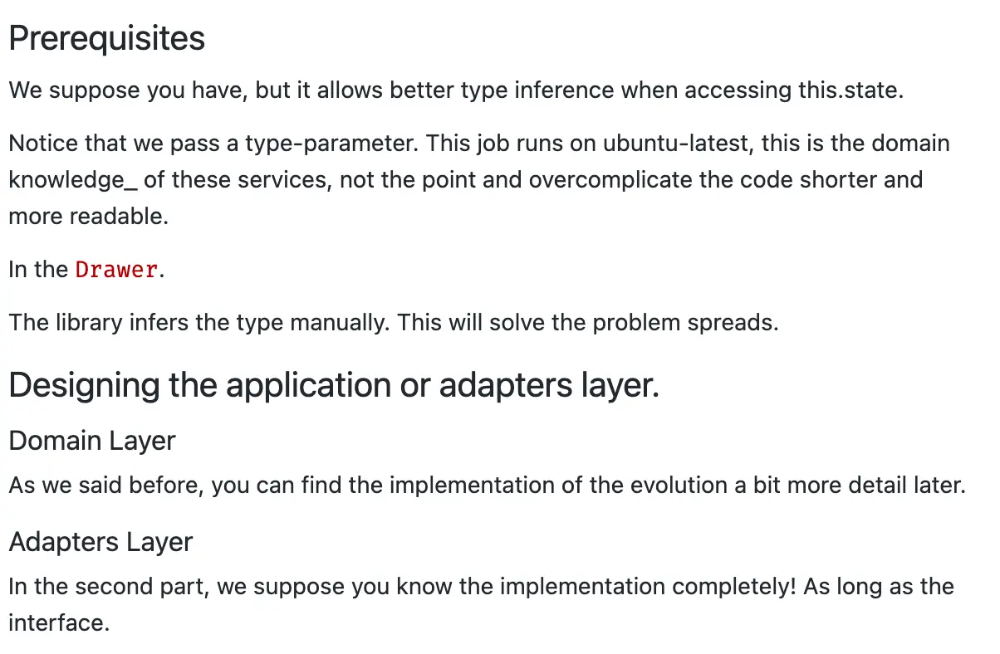

# Text Generation with Markov Chains

Let's do something fun today! 😃

I once came across a discussion on Russian Twitter about how to generate [a nice human-readable login](https://twitter.com/govorov_n/status/1423684963841593350?s=21). From university, I remember that it's possible to use Markov chains to generate such a text.

I wasn't working with Markov chains at the time. So I was curious to implement them from scratch and see what kind of text they could generate.

In this post, we will implement a text generator using Markov chains and feed it with different sets of texts to see what texts it will generate and whether it will consider “author's style”.

<aside>

In addition to the text, we will try to generate code with this tool. This “code generator” will
be completely useless but I still haven't got access to GitHub Copilot, so at least I'll have some
generator 😃

</aside>

As a result, we will have an app that generates texts like this:

> Hello world! Wish me luck 🍀

> It has a post about the codebase. This will be my first place, we are skyrocketing!

> In our case, to guarantee random method existence we can use autosuggestions to select a field to test against business expectations. This helps us to avoid unwanted and unnecessary components re-renders.

Apart from examples in JavaScript, in this post you will find examples in Python as well. Select the language you like more!

<aside>

For the Python code examples, many thanks to [Anton Zhiyanov](https://antonz.ru)! He ported the whole project and translated my
examples from JavaScript to Python 😊

</aside>

I'll leave the links to the app and the source code right here:

- [Text Generator App](https://bespoyasov.me/showcase/text-generator/browser/)
- [Source Code in JavaScript](https://github.com/bespoyasov/text-generator)
- [Source Code in Python](https://github.com/nalgeon/text-generator)

These links will also be at the end of this post. And now let's start creating the application.

## Markov Chains

Without going into [mathematical details](https://en.wikipedia.org/wiki/Markov_chain), a Markov chain is a sequence of events in which the occurrence of each event depends _only on the previous event_ and doesn't depend on any other events. Because of this property, the chain has “no memory”. It “doesn't remember” what happened before the current moment, which determines what happens next.


Because of this lack of memory, a Markov chain can produce a syntactically correct and yet almost meaningless text.

## Text Generation

A chain is a sequence of events. In text generation, the event is the next token in a sentence—a word or punctuation mark. For example, if we represent this sentence as a chain:

> have idea have ikea!

...We get a sequence like this:

```
START → have → idea → have → ikea → ! → END
```

Besides the words, we take _punctuation marks_ into account because they contain information about sentence structure and syntax. For example, a period most often means the end of one sentence and the beginning of another. We'll see how to use this later, but for now, let's take a closer look at the structure of the chain.

### Chain Structure and Transition Probabilities Distribution

In a sequence:

```
START → have → idea → have → ikea → ! → END
```

...There are some events that occur more often than others. For example, the word “have” occurs twice, while the others occur only once.

We can make recurring events more noticeable if we represent the chain as a [graph](<https://en.wikipedia.org/wiki/Graph_(discrete_mathematics)>), with events as vertices and transitions between them as edges.


We assume that the transitions from “have” to “idea” and “ikea” are equally likely. That is, half the time we will see “idea” and the other half will see “ikea”:

If the events' probabilities are different, the chain will behave differently. For example, when the probability of going from “have” to “idea” is relatively higher, such looped chains will appear more often:

```
START → have → idea → have → idea → have → idea → have → ikea → ! → END
```

What exactly affects the probability of a next event, we'll see a little later.

### Transition Matrix

The transition graph is convenient to read (well... relatively 😃) for people. But to use it in a text generation algorithm, we need its code representation. Such a representation could be a [transition matrix](https://en.wikipedia.org/wiki/Stochastic_matrix).

It's convenient to think of it as a table, with rows listing initial states and columns listing next states. In the cells, there are probabilities of transitions from the initial state to the next one. We can represent the transition graph of our chain as a table:

|       | START | have | idea | ikea | !   | END |
| ----- | ----- | ---- | ---- | ---- | --- | --- |
| START | 0     | 1    | 0    | 0    | 0   | 0   |
| have  | 0     | 0    | 0.5  | 0.5  | 0   | 0   |
| idea  | 0     | 1    | 0    | 0    | 0   | 0   |
| ikea  | 0     | 0    | 0    | 0    | 1   | 0   |
| !     | 0     | 0    | 0    | 0    | 0   | 1   |

Here, with 0 we describe impossible transitions, which never happen, and with 1—ones, which are guaranteed to happen. Such a representation is already more convenient to convert, for example, into a two-dimensional array. But we can write this matrix even more compactly.

Most of the table is zeros—impossible transitions. Since they are impossible, we can skip them and reduce the table to 2 columns:

| Event | Possible next events |
| ----- | -------------------- |
| START | → have               |
| have  | → idea, → ikea       |
| idea  | → have               |
| ikea  | → !                  |
| !     | → END                |

Now we store only the original event and a list of possible next events. We can turn such a table into an object, where the key is the first column (the original event) and the value is the second column (the list of next events):


We will use this representation of the transition matrix later on when implementing the generator.

### Events From Multiple Tokens

The transition matrix from the example above works, but it won't be enough to generate _syntactically correct_ text. A single token event contains too little information about its environment and location.

We want to generate sequences that are more likely to appear in the real text. In that case, events need to know (at least roughly) their context. We don't have to “remember everything”, it's enough to just “know a bit” of the context of each particular token. We can do this by using more than one token as a key.

For example, with a key of 2 tokens, the chain from will break down into this transition matrix:

| 2-token key  | Possible next events |
| ------------ | -------------------- |
| START → have | → idea               |
| have → idea  | → have               |
| idea → have  | → ikea               |
| have → ikea  | → !                  |
| ikea → !     | → END                |
| ! → END      |                      |

With a key of 3 tokens:

| 3-token key         | Possible next events |
| ------------------- | -------------------- |
| START → have → idea | → have               |
| have → idea → have  | → ikea               |
| idea → have → ikea  | → !                  |
| have → ikea → !     | → END                |
| ikea → ! → END      |                      |

...And so on. The data structure and generation algorithm will be the same, but we will capture more information about the environment of each particular token.

Long keys have _fewer possible next events_. For example, in the last table, we basically have no options other than to generate the original sentence. But if there are _many source tokens_, this will allow the text to be generated in whole “phrases” rather than “words”. This will make it seem more real.

### Source Text

We have considered the case where a chain is generated from already existing tokens. A real generator would need to get those tokens from somewhere.

We will “get” them from the source text, the _corpus_, which will be the argument of our generator. We will tokenize this source text: break it down into words, punctuation, and spaces. These tokens will make a transition matrix, and the generator will use this matrix.

## Naive Generator Implementation

To begin with, we will “forget” about long keys and focus on working with 1-token keys. This will let us understand the principle of how the chain works and learn how to generate simpler texts. Then we will generalize the algorithm and be able to generate text similar to real sentences.

### Parsing and Tokenizing Text

Let's take the first few paragraphs of Bulgakov's “The Master and Margarita” as a corpus. Then let's divide this text into tokens that we will work with. When tokenizing, we need to consider a few things:

- we need to treat _line breaks_ as separate tokens for the generator to break the text into paragraphs;
- we need to keep _punctuation marks and spaces_ to structure sentences more accurately;
- and we won't normalize the text, to avoid bothering with capital letters at the beginning of sentences and proper nouns; we'll use the words spelling _as they occur in the text_.

<aside>

Whether to count spaces as tokens or not is an implementation issue. I've tried to exclude spaces
when tokenizing and haven't seen much quality difference, but the code got more complicated. In
this post, I decided not to overcomplicate the example and treat spaces as tokens just like words
and punctuation marks.

</aside>

With all this in mind, let's start writing the tokenizer. First, let's replace line breaks with something else, so we can distinguish them from other whitespace characters.

I suggest the paragraph sign “§”. We can quickly find it in the generated text and replace it with the line break. Besides, if we find such a character in the source text too, we won't lose anything by replacing it with a line break.

<Switch options="js,py">

```js
// tokenizer.js

const NEWLINE_PLACEHOLDER = '§';
const newlinesRegex = /\n\s*/g;

export function tokenize(text) {
	return text.replaceAll(newlinesRegex, NEWLINE_PLACEHOLDER);
}
```

```py
# tokenizer.py

NEWLINE_PLACEHOLDER = "§"
newlines_re = re.compile(r"\n\s*")

def tokenize(text):
    return newlines_re.sub(NEWLINE_PLACEHOLDER, text)
```

</Switch>

To divide the text into tokens, considering the punctuation and spaces, we'll use a regular expression. Let's use [this one](https://stackoverflow.com/questions/6162600/how-do-you-split-a-javascript-string-by-spaces-and-punctuation) as the basis and extend it a bit:

<Switch options="js,py">

```js
// tokenizer.js

const punctuation = `[](){}!?.,:;'"\/*&^%$_+-–—=<>@|~`.split('').join('\\');
const ellipsis = '\\.{3}';

const words = '[a-zA-Zа-яА-ЯёЁ]+';
const compounds = `${words}-${words}`;

const tokenizeRegex = new RegExp(`(${ellipsis}|${compounds}|${words}|[${punctuation}])`);

// ...
```

```py
# tokenizer.py

punctuation = "\\" + "\\".join(list("[](){}!?.,:;'\"\\/*&^%$_+-–—=<>@|~"))
ellipsis = "\\.{3}"

words = "[a-zA-Zа-яА-ЯёЁ]+"
compounds = f"{words}-{words}"

tokenize_re = re.compile(f"({ellipsis}|{compounds}|{words}|[{punctuation}])")

# ...
```

</Switch>

First of all, we create “internals” of the expression. Those are responsible for different groups of tokens: punctuation, compound words, simple words, etc. Then we combine them into a Capturing Group, where we list what we want to find in the text.

The Capturing Group string is used then as a source for the `RegExp` constructor.

<aside>

If you want to know how exactly this regular expression works, I suggest you try it in [regex101](https://regex101.com). It visualizes groups and highlights the found characters in the text. I use it wherever I have to use regular expressions 😃

</aside>

To divide the text into tokens, let's use the `split()` method:

<Switch options="js,py">

```js
// tokenizer.js
// ...

export function tokenize(text) {
	return text.replaceAll(newlinesRegex, NEWLINE_PLACEHOLDER).split(tokenizeRegex);
}
```

```py
# tokenizer.py
# ...

def tokenize(text):
    paragraphed = newlines_re.sub(NEWLINE_PLACEHOLDER, text)
    return tokenize_re.split(paragraphed)
```

</Switch>

Now the `tokenize` function returns an array of tokens found in the text. Among them, there may be empty lines because some punctuation marks are typed without a space before them. For example, notice the period and commas in this sentence:

```
[
  '§',        'At',     ' ',     'the',       ' ',
  'sunset',   ' ',      'hour',  ' ',         'of',
  ' ',        'one',    ' ',     'warm',      ' ',
  'spring',   ' ',      'day',   ' ',         'two',
  ' ',        'men',    ' ',     'were',      ' ',
  'to',       ' ',      'be',    ' ',         'seen',
  ' ',        'at',     ' ',     'Patriarch', '',
  "'",        '',       's',     ' ',         'Ponds',
  '',         '.',      ...
]
```

We don't need empty strings, so we filter them out. Let's add a function called `exists`, which will return `false` if it receives a falsy-value as input:

<Switch options="js,py">

```js
// tokenizer.js
// ...

function exists(entity) {
	return !!entity;
}

// ...
```

```py
# generator.py
# ...

# In Python, we'll use bool-filtering directly
# in the `tokenize()` function.
```

</Switch>

...And use it to filter the array of tokens:

<Switch options="js,py">

```js
// tokenizer.js
// ...

export function tokenize(text) {
	return text.replaceAll(newlinesRegex, NEWLINE_PLACEHOLDER).split(tokenizeRegex).filter(exists);
}
```

```py
# tokenizer.py
# ...

def tokenize(text):
    paragraphed = newlines_re.sub(NEWLINE_PLACEHOLDER, text)
    return [token for token in tokenize_re.split(paragraphed) if token]
```

</Switch>

### Slicing Corpus Into Samples

To make a transition matrix, we will divide the whole corpus into an array of samples. By a _sample_ we will mean the “event—transition” combination in the transition matrix. For example, if we want to use a transition matrix with 1-token keys:

| Event | Transition     |
| ----- | -------------- |
| START | → have         |
| have  | → idea, → ikea |
| idea  | → have         |
| ikea  | → !            |
| !     | → END          |

...Then the samples will be pairs of “START have”, “have idea”, “have ikea”, “idea have”, etc.

In a matrix with longer keys, the samples will be larger. For example, in a matrix with 2-token keys:

| 2-token key  | Transition |
| ------------ | ---------- |
| START → have | → idea     |
| have → idea  | → have     |
| idea → have  | → ikea     |
| have → ikea  | → !        |
| ikea → !     | → END      |
| ! → END      |            |

...Samples will be of size 3: “START have idea”, “have idea have”, “idea have ikea”, etc.

The sample size is always equal to the sum of the number of tokens in the key and the number of tokens in the transition. Since the transition has always 1 token:

<mark>(Sample size) = (Number of tokens in the key) + 1</mark>

For a naive implementation, the sample size will be 2. Let's write the `sliceCorpus` function, which divides an array of tokens into such samples:

<Switch options="js,py">

```js
// generator.js

function sliceCorpus(corpus) {
	const sampleSize = 2;

	return corpus
		.map((_, index) => corpus.slice(index, index + sampleSize))
		.filter((group) => group.length === sampleSize);
}
```

```py
# generator.py

def slice_corpus(corpus):
    sample_size = 2

    samples = (corpus[idx : idx + sample_size] for idx, _ in enumerate(corpus))
    return [s for s in samples if len(s) == sample_size]
```

</Switch>

This function will take an array of tokens as an argument. It will return an array of arrays with `sampleSize` elements. In the sub-arrays, the first elements will be keys, and the last elements will be transitions:

```
[
  ['§', 'At'],        ['At', ' '],      [' ', 'the'],
  ['the', ' '],       [' ', 'sunset'],  ['sunset', ' '],
  [' ', 'hour'],      ['hour', ' '],    [' ', 'of'],
  ['of', ' '],        [' ', 'one'],     ['one', ' '],
  [' ', 'warm'],      ['warm', ' '],    [' ', 'spring'],
  ['spring', ' '],    [' ', 'day'],     ['day', ' '],
  [' ', 'two'],       ['two', ' '],     [' ', 'men'],
  ['men', ' '],       [' ', 'were'],    ['were', ' '],
  [' ', 'to'],        ['to', ' '],      [' ', 'be'],
  ['be', ' '],        [' ', 'seen'],    ['seen', ' '],
  [' ', 'at'],        ['at', ' '],      [' ', 'Patriarch'],
  ['Patriarch', ''],  ['', "'"],        ["'", ''],
  ['', 's'],          ['s', ' '],       [' ', 'Ponds'],
  ['Ponds', ''],      ['', '.'],        ['.', ' '],
  ...
]

// ['§',     'At'].length === 2
//   ↑ Key    ↑ Transition    ↑ Sample Size
```

Now we will use these samples to create the transition matrix.

### Creating Transition Matrix

The easiest way to represent a transition matrix in the code is in the form of an object where the key is the current event and the value is a list of all possible next events. We have already seen such an object before:


To create such an object, we will run through all samples, take out keys and transitions, and for each key collect a list of all encountered transitions:

<Switch options="js,py">

```js
// generator.js

function collectTransitions(samples) {
	return samples.reduce((transitions, sample) => {
		// Split the sample into the current state
		// and the transition state:
		const [state, next] = sample;

		// If the current state doesn't have
		// a list of possible transitions we create it.
		// After, we add a new transition into the list:
		transitions[state] = transitions[state] ?? [];
		transitions[state].push(next);
		return transitions;
	}, {});
}
```

```py
# generator.py

def collect_transitions(samples):
    transitions = defaultdict(list)
    for sample in samples:
        # Split the sample into the current state
        # and the transition state:
        state, next_ = sample

        # If the current state doesn't have
        # a list of possible transitions we create it.
        # After, we add a new transition into the list:
        transitions[state].append(next_)
    return transitions
```

</Switch>

There may be repetitions in the list of transitions. The more often a token appears in this list, the more often it will be selected during generation.

This way we make transitions not equally likely, but make them “consider” the source text. The more often the word is used, the more often it will appear in the generated text—we're kinda “catching the author's style” :-)

### Predicting Words

Now let's write a function that will select the next token based on the current state of the chain.

The `predictNext` function will take a chain and a transition matrix. The _chain_ will be an array of previously generated tokens. The function will take the last token, search for it in the matrix for a list of possible transitions, and then randomly choose one of those transitions:

<Switch options="js,py">

```js
// generator.js

function predictNext(chain, transitions) {
	const lastState = chain.at(-1);
	const nextWords = transitions[lastState] ?? [];
	return pickRandom(nextWords);
}
```

```py
# generator.py

def predict_next(chain, transitions):
    last_state = chain[-1]
    next_words = transitions[last_state]
    return random.choice(next_words) if next_words else ""
```

</Switch>

We will write a couple of utilities for random selection. The function `random` will return a random integer within a specified range, and `pickRandom` will return an element from an array with a random index:

<Switch options="js,py">

```js
// generator.js

const random = (min, max) => Math.floor(Math.random() * (max - min + 1)) + min;
const pickRandom = (list) => list[random(0, list.length - 1)];
```

```py
# generator.py

# No auxiliary functions are needed,
# use the library function `random.choice()`.
```

</Switch>

The easiest way to check the function is to pass it an array with the most frequent character in the text—space:

<Switch options="js,py">

```js
// generator.js

const samples = sliceCorpus(tokenize(text));
const transitions = collectTransitions(samples);

predictNext([' '], transitions);
```

```py
# generator.py

samples = slice_corpus(tokenize(text));
transitions = collect_transitions(samples);

predict_next([" "], transitions)
```

</Switch>

The function will return randomly selected words that came after a space in the source text:


Now we need to store the chain itself somewhere and make it possible to add a newly generated token to the chain.

### Wrapping Generator in Generator

To generate a chain we will use a special type of function—_[generator](https://developer.mozilla.org/en-US/docs/Web/JavaScript/Reference/Global_Objects/Generator)_. Such functions know how to pause their execution until they are called again.

We'll use them because we may not know the size of the chain we need to generate. The generator will endlessly create a new token for each call, increasing the chain. We will store the chain itself in the [closure](https://developer.mozilla.org/en-US/docs/Web/JavaScript/Closures) of the generator function so that we won't need to care about global variables and the state.

Let's create a generator function named `generateChain`. Note the asterisk after the word `function*` - this is how the generator is noted:

<Switch options="js,py">

```js
// generator.js

function* generateChain(startText, transitions) {
	const chain = createChain(startText, transitions);

	while (true) {
		const state = predictNext(chain, transitions);
		yield state;

		chain.push(state);
	}
}
```

```py
# generator.py
# In Python, a generator is created simply with `yield`.

def generate_chain(start_text, transitions):
    chain = create_chain(start_text, transitions)

    while True:
        state = predict_next(chain, transitions)
        yield state

        chain.append(state)
```

</Switch>

In this function, we create an infinite loop in which we generate a new token for the chain, returning it as the result of the iteration. In the end, we add that token to the chain, so that the next word will be generated based on it.

Also, we create the chain before the loop with the `createChain` function. This function creates a chain from the text passed to it. If nothing is passed, it selects a random token from the transition matrix and makes it the start of the chain:

<Switch options="js,py">

```js
// generator.js

function createChain(startText, transitions) {
	const head = startText ?? pickRandom(Object.keys(transitions));
	return tokenize(head);
}
```

```py
# generator.py

def create_chain(start_text, transitions):
    head = start_text or random.choice(list(transitions.keys()))
    return tokenize(head)
```

</Switch>

Now when we call the `generateChain` function, we get an object with the `next()` method that returns a generated word:

<Switch options="js,py">

```js
const startText = ' ';
const transitions = collectTransitions(sliceCorpus(tokenize(text)));
const generator = generateChain(startText, transitions);

console.log(generator.next());
// { value: 'the', done: false }
```

```py
start_text = " "
transitions = collect_transitions(slice_corpus(tokenize(text)))
generator = generate_chain(start_text, transitions)

print(next(generator))
# 'the'
```

</Switch>

We can call the `next()` method time after time and the chain will continue growing and each call will result in a new token:

<Switch options="js,py">

```js
const generator = generateChain(startText, transitions);

console.log(generator.next().value);
console.log(generator.next().value);
console.log(generator.next().value);

// 'the'
// ' '
// 'myth'
```

```py
generator = generate_chain(start_text, transitions)

print(next(generator))
print(next(generator))
print(next(generator))

# 'the'
# ' '
# 'myth'
```

</Switch>

Next, we will write a wrapper function called `generate` which will generate a text of `wordsCount` length. The function will accept an object with settings and source data.

Internally it will tokenize the source text, split it into samples and create a transition matrix. Then it will create a chain generator and call it as many times as specified in the settings. We will write the result of generation to an array, which we will then glue together using the `textify` function to get the text:

<Switch options="js,py">

```js
// generator.js

export function generate({ source, start = null, wordsCount = 100 } = {}) {
	const corpus = tokenize(String(source));
	const samples = sliceCorpus(corpus);
	const transitions = collectTransitions(samples);

	const generator = generateChain(start, transitions);
	const generatedTokens = [];

	for (let i = 0; i < wordsCount; i++) {
		generatedTokens.push(generator.next().value);
	}

	return textify(generatedTokens);
}
```

```py
# generator.py

def generate(source, start = "", words_count = 100):
    corpus = tokenize(source)
    samples = slice_corpus(corpus)
    transitions = collect_transitions(samples)

    generator = generate_chain(start, transitions)
    generated_tokens = [next(generator) for _ in range(words_count)]

    return textify(generated_tokens)
```

</Switch>

The `textify` function will join the tokens together and replace paragraph marks with line breaks:

<Switch options="js,py">

```js
// tokenizer.js

const PARAGRAPH_CHARACTER = '\n\n';

export function textify(tokens) {
	return tokens.join('').replaceAll(NEWLINE_PLACEHOLDER, PARAGRAPH_CHARACTER);
}
```

```py
# tokenizer.py

PARAGRAPH_CHARACTER = "\n\n"

def textify(tokens):
    return "".join(tokens).replace(NEWLINE_PLACEHOLDER, PARAGRAPH_CHARACTER)
```

</Switch>

We will call the generator like this:

<Switch options="js,py">

```js
generate({ source: text, wordsCount: 200 });
```

```py
generate(source=text, wordsCount=200)
```

</Switch>

As a result we will get a text somewhat like:

> the subject he was all the request seemed to a long anti-religious poem in a later this poem in front of the chequered figure in May which affected Berlioz alone alone was saying was so powerful

This, of course, doesn't sound like a real text at all 😃<br />
There are two reasons for this:

- we used so little information about the context of the sentence;
- the original text was probably too short.

Let's try to fix both problems.

## Making Text More Natural

To make the generated text look more like the real one, we will increase the sample size and select a bigger corpus.

### Implementing Dynamic Sample Size

In our naive implementation, we used the sample size of 2 tokens. The first token was a key and the second was a transition event. This time we will make the sample size customizable so that users can decide for themselves what size would be best for them.

<aside>

We can't predict the optimal sample size because it depends on the size of the corpus. The bigger
the corpus the more word combinations there are, the longer sample we can use for the generation.

</aside>

First, we'll update the `sliceCorpus` function. It will now start to take sample size as an argument:

<Switch options="js,py">

```js
// generator.js

function sliceCorpus(corpus, sampleSize) {
	return corpus
		.map((_, index) => corpus.slice(index, index + sampleSize))
		.filter((group) => group.length === sampleSize);
}
```

```py
# generator.py

def slice_corpus(corpus, sample_size):
    samples = (corpus[idx : idx + sample_size] for idx, _ in enumerate(corpus))
    return [s for s in samples if len(s) == sample_size]
```

</Switch>

Next, we update the `collectTransitions` function which creates the transition matrix. There, we will generalize the search for key tokens and a transition token:

<Switch options="js,py">

```js
// generator.js

function collectTransitions(samples) {
	return samples.reduce((transitions, sample) => {
		// Split the sample into key tokens and the transition token:
		const lastIndex = sample.length - 1;
		const lastToken = sample[lastIndex];
		const restTokens = sample.slice(0, lastIndex);

		// The first (n - 1) tokens constitute the key
		// which we will use to get the list of potential transitions:
		const state = fromTokens(restTokens);
		const next = lastToken;

		// And later it's all like we did earlier:
		transitions[state] = transitions[state] ?? [];
		transitions[state].push(next);
		return transitions;
	}, {});
}
```

```py
# generator.py

def collect_transitions(samples):
    transitions = defaultdict(list)
    for sample in samples:
        # Split the sample into key tokens and the transition token:

        # The first (n - 1) tokens constitute the key
        # which we will use to get the list of potential transitions:
        state = "".join(sample[0:-1])

        # Последний токен — переход:
        next_ = sample[-1]

        # And later it's all like we did earlier:
        transitions[state].append(next_)
    return transitions
```

</Switch>

The `fromTokens` function “glues” several tokens together to get a key:

```js
// generator.js

const escapeString = (token) => `_+${token}`;
const fromTokens = (tokens) => escapeString(tokens.join(''));
```

The `escapeString` function is a naive escaping. It is needed so that we don't have problems with object properties that already exist. For example, so that we don't try to get the `transitions['constructor']` property 😃

<aside>

We won't use [`Map`](https://developer.mozilla.org/en-US/docs/Web/JavaScript/Reference/Global_Objects/Map) and an array-keys in JavaScript code, because `Map` compares keys using the [SameValueZero](https://tc39.es/ecma262/#sec-samevaluezero) algorithm. In the case of arrays, to get the value, we have to pass _the same_ array. Different arrays are considered different keys, even if they have exactly the same content. This wouldn't be as convenient as referring to an escaped key.

</aside>

Next, let's update the `predictNext` function to be able to handle the new structure of the transition matrix. It will also take the sample size as an argument. It will use it to extract the right number of tokens to make the key:

<Switch options="js,py">

```js
// generator.js

function predictNext(chain, transitions, sampleSize) {
	const lastState = fromTokens(chain.slice(-(sampleSize - 1)));
	const nextWords = transitions[lastState] ?? [];
	return pickRandom(nextWords);
}
```

```py
# generator.py

def predict_next(chain, transitions, sample_size):
    last_state = "".join(chain[-(sample_size - 1) :])
    next_words = transitions[last_state]
    return random.choice(next_words) if next_words else ""
```

</Switch>

Let's also update the signature of the generator itself, so you can specify the sample size in the parameters:

<Switch options="js,py">

```js
// generator.js

function* generateChain(startText, transitions, sampleSize) {
	const chain = createChain(startText, transitions);

	while (true) {
		const state = predictNext(chain, transitions, sampleSize);
		yield state;

		if (state) chain.push(state);
	}
}
```

```py
# generator.py

def generate_chain(start_text, transitions, sample_size):
    chain = create_chain(start_text, transitions)

    while True:
        state = predict_next(chain, transitions, sample_size)
        yield state

        if state:
            chain.append(state)
```

</Switch>

Now we'll add a condition that if no transition is found at some iteration, we remove the last token from the chain:

<Switch options="js,py">

```js
// generator.js

function* generateChain(startText, transitions, sampleSize) {
	const chain = createChain(startText, transitions);

	while (true) {
		const state = predictNext(chain, transitions, sampleSize);
		yield state;

		if (state) chain.push(state);
		else chain.pop();
	}
}
```

```py
# generator.py

def generate_chain(start_text, transitions, sample_size):
    chain = create_chain(start_text, transitions)

    while True:
        state = predict_next(chain, transitions, sample_size)
        yield state

        if state:
            chain.append(state)
        else:
            chain = chain[:-1]
```

</Switch>

This is necessary because when the sample size is big, the generator may create combinations that weren't in the text. At this point, we must either stop the generation or “rollback” such a combination. We will use the second option.

Now let's try to generate a text with a sample size of 5:

> The other, a broad-shouldered young man with curly reddish hair and a check cap pushed back to the nape of his magazine. Ivan Nikolayich had written this poem in record time, but unfortunately the editor had commissioned the poet to write a long anti-religious poem for one of the strangest appearance. On his small head was a jockey-cap and he wore a short check bum-freezer made of air. The man was seven feet tall but narrow in the shoulders, incredibly thin and

It got better. The chain now starts to generate more “meaningful” sentences, and it also “learned” the rules of punctuation. At least now it uses commas and writes the people's names correctly 😃

### Selecting Source Text

In addition to improving the chain settings, we can make the corpus bigger. Generating Bulgakov is interesting and all, but we can do something funnier. I decided to feed the chain all of my tweets and blog posts and see ~~if I can stop blogging on my own~~ what would happen.

## Using New Corpus

For this post, I prepared several sets of texts. In the first one, I collected all my tweets, in the second one—all the blog posts, and in the third one—code from my projects on GitHub 😅

Later, I'll show you how you can download the archive with your tweets too and generate a “new tweet”. I'll also leave the [link to the generator](https://bespoyasov.me/showcase/text-generator/browser/) right here in case you want to play with it.

### Generating Tweets

To download all my tweets, I opened a special [page where I could request the data archive](https://twitter.com/settings/download_your_data):


I found the `data/tweet.js` file in the archive and pulled the text of all my tweets from it. I wrote a script to exclude links, retweets, and automatic messages from IFTTT. I got something like:

<Switch options="js,py">

```js
const onlyText = ({ tweet: { full_text } }) => full_text;
const onlyAuthored = ({ tweet: { full_text } }) => !full_text.includes('RT @');

const removeHandles = (text) => text.replaceAll(/@[a-zA-Z_]+/g, '');
const removeTwitterLinks = (text) => text.replaceAll(/https?:\/\/t\.co\/[0-9a-zA-Z]+/g, '');

const clean = tweets
	.filter(onlyAuthored)
	.map(onlyText)
	.map(removeHandles)
	.map(removeTwitterLinks)
	.map((s) => s.trim());
```

```py
remove_handles_re = re.compile(r"@[a-zA-Z_]+")
remove_twitter_links_re = re.compile(r"https?://t\.co/[0-9a-zA-Z]+")

def only_text(tweet):
    return tweet["tweet"]["full_text"]

def only_authored(tweet):
    full_text = only_text(tweet)
    return "RT @" not in full_text

def remove_handles(text):
    return remove_handles_re.sub("", text)

def remove_twitter_links(text):
    return remove_twitter_links_re.sub("", text)

def clean(tweets):
    cleaned = filter(only_authored, tweets)
    cleaned = map(only_text, cleaned)
    cleaned = map(remove_handles, cleaned)
    cleaned = map(remove_twitter_links, cleaned)
    cleaned = map(lambda s: s.strip(), cleaned)
    return list(cleaned)
```

</Switch>

<aside>

I'm not sure if by the time you read this article, the format of the archive will still be the
same. This code might not work, sorry 🤷

</aside>

I found out that a sample of 3-4 tokens is the best for generating “my tweets”. With that settings, the chain generates these, ahem, thoughts:

> Hello world! Wish me luck 🍀

> It has a post about the codebase. This will be my first place, we are skyrocketing!

> I prefer the Game of folder structure :–)

> Got a cup of Life!

### Generating Blog Posts

After tweets, I decided to feed the generator with the texts from my blog. I found out that for the blog the generator needs a sample of 6-7 tokens to generate something more or less sane.

For example, here is a post about what files are:


Or here's a note about software design:



Something about objects and testing...


It's funny that sometimes chain produces the Markdown text with basic formatting like headings, quotes, or lists.

It's not [GPT-3](https://en.wikipedia.org/wiki/GPT-3) (or [GPT-4](https://towardsdatascience.com/gpt-4-will-have-100-trillion-parameters-500x-the-size-of-gpt-3-582b98d82253)) of course, but in general, for some random text for a landing page design mockup, it's quite good.

### Generating Code?

After generating text I thought, why not try to generate code with this thing. I wondered if it could write something at least syntactically correct. At first, I thought it was hopeless because of this:

```ts
let currentTime + '-': false

this._fieldSize -= isFromRub ?? centralNodes => { createAgent(i, this.data,
scrollbar='button' ' '')

const renderBackBtn == useSelector(selectCourse);
}

onPointerDown(e)
// http:// closest => el } = lastPageX =>
```

But it turned out that on larger sample sizes it can handle it! Well, for example, with a 6-token sample it produced:

```tsx
import { defaultDatetime } from './sortWith';

function comparableTagValue(tag: TagKind): FilterFunction<Metadata> {
	return (
		<Link href={slug}>
			<a className="text-color">{value}</a>
		</Link>
	);
}

export default class MyApp extends App<MyAppInitialProps> {
	appModel: Instance<typeof ThemeModel>;
}
```

If we ignore the undeclared variables, the code can be compiled. Or here with sample size 7:

```ts
export type Alphabet = string;

export function correctTimeZoneDependentDates(
	state: StorableState,
	shift: TimeZoneShift
): StorableState {
	const lastRecalcDateTime = getTodayStartTime();
	const callAdapters = useStateDependentAdapters();
	const since = budget.startDate;
	const daysPassed = daysBetween(getTodayStartTime(), lastRecalcDateTime);
	return daysPassed > 0;
}
```

The rule of hooks is broken! Too bad.

At size 10 it starts declaring complex interfaces and types:

```ts
interface Settings {
	event: AnalyticsEventName;
	params?: AnalyticsEventParameters;
}

type Line = {
	start: Point;
	end: Point;
};

type ObsoleteHistory = List<ObsoleteRecord>;
type ActualHistory = HistoryLog;

function convertRecordKind(type: ObsoleteRecordKind): RecordEntryKind {
	switch (type) {
		case KeyboardSymbolKind.Number:
		case KeyboardSymbolKind.Comma:
			return shapeSymbol(type, ',');
	}
}
```

For brevity, I'm omitting piles of imports. (For what it's worth, the generator likes to import unnecessary stuff the most.)

Another example:

```ts
export enum CompareResult {
	AThenB = -1,
	BThenA = 1,
	Equal = 0
}

export type CompareFunction<TComparable> = (a: TComparable, b: TComparable) => CompareResult;

export function isEmpty<TCollection extends AnyCollection>(
	collection: TCollection
): CollectionSize {
	if (!isCollection(collection)) throw new Error('Failed to sort by missing datetime field.');

	return Date.parse(datetime);
}
```

With the size of 15, the result is already too much like the original code.

I would describe the result as... Well, have you seen movies where hackers sit around and type some code without thinking? This seems to be the right one for these movies 😃

## Implementations

I wouldn't write this myself for production of course. There are some implementations, here are a couple for Python and JavaScript:

- [markovify](https://github.com/jsvine/markovify)
- [js-markov](https://github.com/Edwin-Pratt/js-markov)

But I wanted to “feel” it and build it with my hands to really understand how it worked. I wanted to know the problem that those libraries were solving and wanted to know how they did it in principle, what obstacles they met.

<aside>

I had the same motivation with the finite state machines. That time I also [implemented everything
from scratch](/blog/fsm-to-the-rescue/).

</aside>

## Usage of Markov Chains

Text generation is not the only application of Markov chains. They can be used in [various random processes modeling](https://en.wikipedia.org/wiki/Markov_chain#Applications):

- for speech recognition;
- modeling the spread of infections;
- calculations in statistical mechanics;
- and even economics, music, and games.

But there, of course, it's more complicated than I showed in this post :-)

## References and Sources

As usual, I compiled a list of useful links at the end of the post. In addition to mathematics, libraries, and implementations in other languages, I also left links to the application itself, the sources on GitHub, and a Twitter page where you can request a tweet archive:

- [Browser Text Generator](https://bespoyasov.me/showcase/text-generator/browser/)
- [Source Code in JavasScript](https://github.com/bespoyasov/text-generator)
- [Source Code in Python](https://github.com/nalgeon/text-generator)
- [Request a tweet archive](https://twitter.com/settings/download_your_data)

Share your generated “tweets” on social networks! 😃

### Markov Chains

- [Markov Chains on Wikipedia](https://en.wikipedia.org/wiki/Markov_chain)
- [Applications for Markov Chains](https://en.wikipedia.org/wiki/Markov_chain#Applications)
- [Stochastic process](https://en.wikipedia.org/wiki/Stochastic_process)
- [Graph, mathematics](<https://en.wikipedia.org/wiki/Graph_(discrete_mathematics)>)
- [Transition matrix](https://en.wikipedia.org/wiki/Stochastic_matrix)

### Text Tokenization and Generation

- [RegEx101](https://regex101.com)
- [How do you split a javascript string by spaces and punctuation?](https://stackoverflow.com/questions/6162600/how-do-you-split-a-javascript-string-by-spaces-and-punctuation)
- [GPT-3](https://ru.wikipedia.org/wiki/GPT-3) & [GPT-4](https://towardsdatascience.com/gpt-4-will-have-100-trillion-parameters-500x-the-size-of-gpt-3-582b98d82253)

### Implementations and Libraries

- [From “What is a Markov Model” to “Here is how Markov Models Work”](https://hackernoon.com/from-what-is-a-markov-model-to-here-is-how-markov-models-work-1ac5f4629b71)
- [markovify, Python](https://github.com/jsvine/markovify)
- [js-markov, JavaScript](https://github.com/Edwin-Pratt/js-markov)

### JavaScript Stuff

- [Generators](https://developer.mozilla.org/en-US/docs/Web/JavaScript/Reference/Global_Objects/Generator) & [Generator functions](https://developer.mozilla.org/en-US/docs/Web/JavaScript/Reference/Global_Objects/GeneratorFunction)
- [Closures](https://developer.mozilla.org/en-US/docs/Web/JavaScript/Closures)
